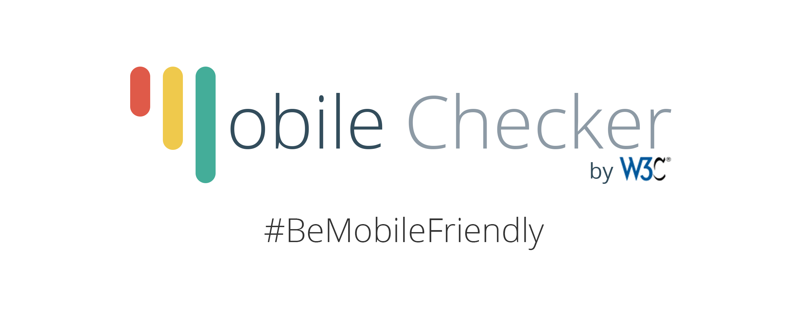

> Here's a glimpse of the next @w3c Mobile Checker\. Stay tuned\! 
> 
> 

 [Jun 02 2015, 18:21:48 UTC](https://twitter.com/w3cdevs/status/605801502955864064)

----

> @w3c legacy Markup validator is now on Github https://github\.com/w3c/markup\-validator although emphasis is more on html5 Validator\.nu https://github\.com/validator/validator

 [Jun 23 2015, 15:57:53 UTC](https://twitter.com/w3cdevs/status/613375431199342592)

----

> We are excited to announce the alpha release of the new @w3c Mobile Checker\. https://www\.w3\.org/blog/2015/the\-new\-w3c\-mobile\-checkers\-alpha\-release\-be\-mobile\-friendly/ \#BeMobileFriendly 
> 
> 

 [Jun 23 2015, 18:48:49 UTC](https://twitter.com/w3cdevs/status/613418447922315264)

----

> The new @w3c Mobile Checker is on @github\. Check it out\! https://github\.com/w3c/Mobile\-Checker \#BeMobileFriendly

 [Jun 23 2015, 21:42:12 UTC](https://twitter.com/w3cdevs/status/613462080579063808)