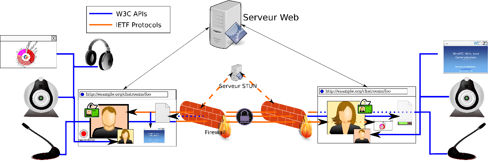
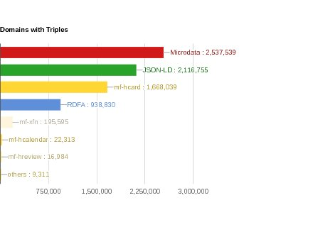

> New edition as of Jan\. 2018\! Check the status of W3C Web technologies that  increase the capabilities of Web applications in the mobile context: device adaptation, forms, data storage, graphics, media, user input, etc\. https://twitter\.com/w3c/status/948481414869213184

 [Jan 03 2018, 09:31:14 UTC](https://twitter.com/w3cdevs/status/948486902184849408)

----

> The web's greatest minds explain how we can fix the \[internet\] \#web\!: http://www\.wired\.co\.uk/article/the\-webs\-greatest\-minds\-on\-how\-to\-fix\-it @timberners\_lee

 [Jan 23 2018, 13:06:44 UTC](https://twitter.com/w3cdevs/status/955788891868549120)

----

> Congrats to @dustyweb @Tsyesika @erincandescent @rhiaro @evanpro and @SocialWebWG for the newly published @w3c \#WebStandard "ActivityPub": https://www\.w3\.org/TR/activitypub/ \#timetoadopt https://twitter\.com/sandhawke/status/955803104859041792
> "It's taken many years of work by \[@Tsyesika \], Chris Webber and many people in the @SocialWebWG \. I'm thankful to all of those who helped bring this forward\. I hope this standard will help shape social applications allowing them to be more open" https://twitter\.com/i/web/status/956866645036642304

 [Jan 23 2018, 14:27:33 UTC](https://twitter.com/w3cdevs/status/955809230027673602)

----

> Congrats to @julien51   
> @aaronpk and @SocialWebWG for the newly published @w3c \#WebStandard "WebSub": https://www\.w3\.org/TR/websub/ \#timetoadopt https://twitter\.com/sandhawke/status/955802084825337856

 [Jan 23 2018, 14:28:55 UTC](https://twitter.com/w3cdevs/status/955809575931908096)

----

> The Generic Sensor API is a framework API to bring sensors to Web browsers  https://www\.w3\.org/TR/generic\-sensor/ \- it tries to improve the disparate efforts and lessons learnt from them for previous sensors \(geolocation, orientation and movement\) https://twitter\.com/briankardell/status/956179493143633921
> The Device and Sensors Working Group is close to bringing it to Candidate Recommendation \- the API is available as an origin trial in Chrome https://twitter\.com/anssik/status/938519797603753985 and there is a polyfill for turning the existing into the new model  APIs https://twitter\.com/anssik/status/943473241607299072

 [Jan 24 2018, 15:08:44 UTC](https://twitter.com/w3cdevs/status/956181984681840642)

----

> So, tune in to the live stream tonight 7pm EST to learn more about this work https://www\.meetup\.com/Pittsburgh\-Code\-Supply/events/246610327/

 [Jan 24 2018, 15:08:46 UTC](https://twitter.com/w3cdevs/status/956181992596484096)

----

> The group is actively looking for feedback on this new approach, which is meant to help managing multiple sensors simulatenously, bring a stronger privacy and security story for them and enable high\-performance use cases and sensor fusion

 [Jan 24 2018, 15:08:46 UTC](https://twitter.com/w3cdevs/status/956181990138634241)

----

> Its most well\-known and deployed API is the Payment Request API, which streamlines the Web checkout process: browsers take charge of collecting and managing users' payment information, bringing less typing and more consistency in that experience https://www\.w3\.org/TR/payment\-request/
> The @w3payments Working Group released yesterday its roadmap of work for 2018 https://lists\.w3\.org/Archives/Public/public\-payments\-wg/2018Jan/0030\.html \. This is the group developing new features to facilitate and improve payments in Web browsers\.

 [Jan 25 2018, 12:55:37 UTC](https://twitter.com/w3cdevs/status/956510872108707840)

----

> Part of the 2018 roadmap is to get further adoption from merchants as highlighted by the group's staff contact @ibjacobs https://www\.w3\.org/blog/wpwg/2017/12/14/merchant\-adoption\-the\-next\-goal/

 [Jan 25 2018, 12:55:38 UTC](https://twitter.com/w3cdevs/status/956510876575633408)

----

> On the browser side, the picture is already pretty good for such a young API: it's available in @googlechrome, @MSEdgeDev , @samsunginternet , @opera and in preview in @webkit safari and @firefox 
> 
> 

 [Jan 25 2018, 12:55:38 UTC](https://twitter.com/w3cdevs/status/956510874130411526)

----

> Combined with the no\-install / just\-in\-time quality of the Web, it creates brand new opportunities\. You could imagine e\.g\. to get tourists to pay for a bus ticket by flashing a QR code\. Or even better, YOU could imagine new usages 😋

 [Jan 25 2018, 12:55:39 UTC](https://twitter.com/w3cdevs/status/956510881151705088)

----

> This API should actually expand your view of what a merchant is: because it significantly reduces friction in payment flows, it enables to ask for on\-line payment in situations you would not even have considered before\.

 [Jan 25 2018, 12:55:39 UTC](https://twitter.com/w3cdevs/status/956510879159332864)

----

> Beyond this, the 2018 roadmap includes pushing further experimentation with another major work item of the group: Payment Handler https://www\.w3\.org/TR/payment\-handler/\. That API enables innovation in online payments by facilitating integration of Web sites as payment providers\.

 [Jan 25 2018, 12:55:40 UTC](https://twitter.com/w3cdevs/status/956510884855205888)

----

> If you're interested in adopting it in your projects, https://developer\.mozilla\.org/en\-US/docs/Web/API/Payment\_Request\_API and https://github\.com/w3c/payment\-request\-info/ are good starting points \- and as always, your feedback on the API is most welcomed at https://github\.com/w3c/payment\-request/

 [Jan 25 2018, 12:55:40 UTC](https://twitter.com/w3cdevs/status/956510883110408192)

----

> The group also wants to increase built\-in security for on\-line payments: once the browser manages payment data, merchants can opt not to receive sensitive data \(e\.g\. card numbers\) directly, and instead get a proof of a payment order from the user \- known as tokenization\.

 [Jan 25 2018, 12:55:41 UTC](https://twitter.com/w3cdevs/status/956510890081374209)

----

> Even if you're not in the business of creating payment systems, by  enabling greater competition among payment providers, it should help merchants and buyers by reducing costs and improving flows\.

 [Jan 25 2018, 12:55:41 UTC](https://twitter.com/w3cdevs/status/956510888495865858)

----

> The idea is that if you want to develop a new e\.g\. paypal, it will make it easier for merchants to include your service among their payment options, and make the over payment flow a lot more user\-friendly\.

 [Jan 25 2018, 12:55:41 UTC](https://twitter.com/w3cdevs/status/956510886864277505)

----

> Finally, the group will be on the look for new method of payments: the current work enables credit cards, native apps and Web apps to act as payment system\. A lot of innovation is happening in that sphere \(cryptocurrencies, interledger\) that may have specific integration needs\.

 [Jan 25 2018, 12:55:42 UTC](https://twitter.com/w3cdevs/status/956510893600276480)

----

> Likewise, this can facilitate the adoption of stronger authentication mechanisms, such as 3D secure or the 2\-factor authentication mechanisms being developed by another W3C Working Group, Web Authentication https://www\.w3\.org/webauthn

 [Jan 25 2018, 12:55:42 UTC](https://twitter.com/w3cdevs/status/956510891880730625)

----

> Two main components of that series enable access to mic and cameras https://www\.w3\.org/TR/mediacapture\-streams/ and then provide the building blocks to establish a real\-time connection between a browser and another peer \(possibly another browser\) https://www\.w3\.org/TR/webrtc/ 
> 
> 
> Another Working Group is looking at its work plan for the upcoming year: the WebRTC Working Group\. That group is responsible for a series of specification that enables p2p real\-time audio/video/data exchange on the Web\. \.\./2018/2018\-01\-tweets\.html\#x956510869567000576

 [Jan 25 2018, 16:10:08 UTC](https://twitter.com/w3cdevs/status/956559823293878272)

----

> A lot of the group's efforts will be to push for convergence of browser implementations via increased attention to its test suite https://github\.com/w3c/web\-platform\-tests/tree/master/webrtc

 [Jan 25 2018, 16:10:09 UTC](https://twitter.com/w3cdevs/status/956559829245530112)

----

> These 2 APIs are already adopted across all modern browsers, although there are still quite a few incompatibilities among them\. https://caniuse\.com/\#search\=webrtc

 [Jan 25 2018, 16:10:09 UTC](https://twitter.com/w3cdevs/status/956559827139952640)

----

> The group has also a few additional APIs to enable screen sharing, recording, quality monitoring \- these too will need attention for greater adoption and interoperability\. https://www\.w3\.org/2011/04/webrtc/

 [Jan 25 2018, 16:10:10 UTC](https://twitter.com/w3cdevs/status/956559833511223296)

----

> Given the peer\-to\-peer nature of the tech, there is even a separate dedicated system to identify specific bugs when a given browser tries to connect with another specific one https://github\.com/webrtc/KITE

 [Jan 25 2018, 16:10:10 UTC](https://twitter.com/w3cdevs/status/956559831665725440)

----

> The focus of the most recent discussion though is on the evolution of the real\-time connection API https://lists\.w3\.org/Archives/Public/public\-webrtc/2018Jan/0196\.html

 [Jan 25 2018, 16:10:11 UTC](https://twitter.com/w3cdevs/status/956559835893567490)

----

> The group is looking for input from developers who are using \(or have wanted to use\) the \#WebRTC API and have informed opinions about its potential shortcomings, and the improvements it could benefit from\. So if you're a \#WebRTC developer, now would be a good time to chime in\!

 [Jan 25 2018, 16:10:12 UTC](https://twitter.com/w3cdevs/status/956559837839679493)

----

> Not to be missed\! @w3ctag \#meetup in London to 1\) meet &amp; greet newly elected   
> @lukOlejnik 2\) learn what the TAG is up to and 3\) give feedback about TAG's current priorities: https://ti\.to/w3c\-tag/meet\-the\-tag\-london

 [Jan 26 2018, 11:03:24 UTC](https://twitter.com/w3cdevs/status/956845017729028096)

----

> and some of the derivative APIs of generic sensors: e\.g\. ambient light https://github\.com/w3c/ambient\-light/issues?q\=is%3Aissue\+author%3Alknik \- incorporating the results of research in particular in the field of security and privacy is critical in improving the safety of users

 [Jan 26 2018, 13:33:56 UTC](https://twitter.com/w3cdevs/status/956882902352003072)

----

> They've been brought up for discussions to the relevant groups \- e\.g\. for the work on Generic Sensors https://github\.com/w3c/sensors/issues?utf8\=%E2%9C%93&q\=\+is%3Aissue\+author%3Alknik\+

 [Jan 26 2018, 13:33:56 UTC](https://twitter.com/w3cdevs/status/956882900485656576)

----

> JSON\-LD 1\.0 provides a set of conventions for describing data in JSON that makes it compatible with Linked Data, aiming at making data easily reusable across data sets \- it was published as a W3C Recommendation in 2014 https://www\.w3\.org/TR/json\-ld/  \#jsonld
> It is one of the format recognized to express data with @schemaorg\_dev and is in wide use \- in 2\.1M\+ distinct domains in 2016 according to http://webdatacommons\.org/structureddata/\#results\-2016\-1 
> 
> 

 [Jan 26 2018, 13:57:02 UTC](https://twitter.com/w3cdevs/status/956888716076822533)

----

> After 4 years, the JSON\-LD community is now interested in bringing an update to the existing Recommendation, based on lessons learned and features that didn't make the first release https://json\-ld\.org/presentations/JSON\-LD\-Update\-TPAC\-2017/assets/player/KeynoteDHTMLPlayer\.html\#8

 [Jan 26 2018, 13:57:03 UTC](https://twitter.com/w3cdevs/status/956888720262746112)

----

> To do so, W3C would need to charter a new Working Group to take up the work \- that process has now started\. If you're interested in the future of \#JSONLD, please bring your input on the new charter https://github\.com/json\-ld/charter/issues http://lists\.w3\.org/Archives/Public/public\-new\-work/2018Jan/0012\.html

 [Jan 26 2018, 13:57:04 UTC](https://twitter.com/w3cdevs/status/956888721835593729)

----

> Some of our standards have enough of an active community that they maintain themselves, with a new working group created to formalize these updates\.  
>   
> But not all of our standards do \- yet all of our standards need to be maintained as bugs emerge over time\. \.\./2018/2018\-01\-tweets\.html\#x956888720262746112
> We are now trying to improve how that maintenance happens, and facilitate the publication of correction to the standards\. With many of our specs developed in @github repos, we want to use these repos to track and discuss bugs discovered after Recommendation\.

 [Jan 26 2018, 15:26:57 UTC](https://twitter.com/w3cdevs/status/956911344057544710)

----

> But with 200\+ recommendations without an active Working Group, even tracking all these repos is a bit of a logistical challenge\. We've recently set up an automatic periodic summary of the activity on repos of these orphan specifications https://twitter\.com/plhw3org/status/956562032899260416

 [Jan 26 2018, 15:26:58 UTC](https://twitter.com/w3cdevs/status/956911347882774528)

----

> Now the hard work of reviewing all these potential bugs and change requests is still to be done \- but hey, you've got to start somewhere 😅

 [Jan 26 2018, 15:26:59 UTC](https://twitter.com/w3cdevs/status/956911349870813184)

----

> What is the TAG? Created by @w3c in 2001, the Technical Architecture Group serves \#developers interests by driving consistent Web \#design principles\. Learn more: https://www\.w3\.org/2001/tag/ @w3ctag
> Fact: the @w3ctag helps make the Web a better place for \#developers by improving the consistency of Web technologies developed inside and outside W3C\. Read their stories: https://www\.w3\.org/blog/TAG/

 [Jan 29 2018, 13:53:09 UTC](https://twitter.com/w3cdevs/status/957974903122219008)

----

> Fact: the @w3ctag reviews technical specifications for the Web\. See what they're up to these days: https://github\.com/w3ctag/design\-reviews/

 [Jan 29 2018, 13:55:37 UTC](https://twitter.com/w3cdevs/status/957975523409453056)

----

> @w3ctag's latest focus has been on pushing consistency in \#JavaScript \#APIs, documenting its principles along the way https://w3ctag\.github\.io/design\-principles/

 [Jan 29 2018, 13:56:19 UTC](https://twitter.com/w3cdevs/status/957975699335319552)

----

> The @w3ctag is also looking at how Web technologies fit with the principles of the \#ExtensibleWebManifesto, i\.e\., can low level capabilities explain or provide the equivalent of high level features? https://github\.com/extensibleweb/manifesto

 [Jan 29 2018, 14:01:00 UTC](https://twitter.com/w3cdevs/status/957976876877795328)

----

> Fact: the @w3ctag publishes findings\. These are short documents that cover a specific issue in the Web architecture: https://tag\.w3\.org/findings/

 [Jan 29 2018, 14:02:55 UTC](https://twitter.com/w3cdevs/status/957977360921518080)

----

> Example of a recent @w3ctag finding: how to help users decide about the trustworthiness and provenance of \#syndicatedcontent https://www\.w3\.org/2001/tag/doc/distributed\-content/ @triblondon

 [Jan 29 2018, 14:03:45 UTC](https://twitter.com/w3cdevs/status/957977570716286976)

----

> This finding has been quoted in the recent exploration of avoiding URL\-hijacking in \#AMP pages: https://amphtml\.wordpress\.com/2018/01/09/improving\-urls\-for\-amp\-pages/amp/ https://twitter\.com/cramforce/status/950549603975233536

 [Jan 29 2018, 14:05:06 UTC](https://twitter.com/w3cdevs/status/957977907103584256)

----

> For all these facts and stories, meet the TAG this coming Thursday in London\! https://ti\.to/w3c\-tag/meet\-the\-tag\-london

 [Jan 29 2018, 14:07:33 UTC](https://twitter.com/w3cdevs/status/957978523926482944)

----

> This \#W3Cworkshop comes in the context of the new European directive on privacy rights,  \#GDPR, and will look at how to manage \#LinkedData to preserve privacy properties through their lifecycle

 [Jan 30 2018, 09:31:19 UTC](https://twitter.com/w3cdevs/status/958271398992072704)

----

> If you want to get involved in the work around \#WebXR, the relevant Github repos are at https://github\.com/immersive\-web , the mailing list is https://lists\.w3\.org/Archives/Public/public\-webvr/ and they are now organizing regular teleconferences open to all the CG participants \- join at https://www\.w3\.org/community/webvr/ https://twitter\.com/w3c/status/958272598823133184
> The main API , \#WebXR Device API is developed at https://github\.com/immersive\-web/webxr/ \- it enables browsers to interact with VR/AR/MR headsets and their many capabilities\.  
>   
> Compared to the existing WebVR 1\.1 API, it provides a much smoother integration with the browser render loop\.

 [Jan 30 2018, 09:49:46 UTC](https://twitter.com/w3cdevs/status/958276039721013248)

----

> But since that API is not implemented yet, the best way to get started with VR on the Web is the existing WebVR 1\.1 API https://webvr\.info/

 [Jan 30 2018, 09:55:11 UTC](https://twitter.com/w3cdevs/status/958277403855540224)

----

> To get a grasp of what the API looks like, the explainer is the best place to start https://github\.com/immersive\-web/webxr/blob/master/explainer\.md

 [Jan 30 2018, 09:55:11 UTC](https://twitter.com/w3cdevs/status/958277402286854144)

----

> And being based on Web technologies doesn't imply lower quality or performance \- see https://twitter\.com/utopiah/status/956840285719363585

 [Jan 30 2018, 09:55:12 UTC](https://twitter.com/w3cdevs/status/958277406120439809)

----

> IndexedDB 2 provides an upgrade to everyone's favorite client\-side  database \#IndexedDB https://www\.w3\.org/TR/2018/REC\-IndexedDB\-2\-20180130/\#revision\-history  
>   
> @bevistseng  provided a very nice overview of the new features in a @mozhacks  article some months ago  https://hacks\.mozilla\.org/2016/10/whats\-new\-in\-indexeddb\-2\-0/ https://twitter\.com/w3c/status/958322683128709121
> Browser support is already quite good  https://caniuse\.com/\#feat\=indexeddb2 \- main exception is @MicrosoftEdge  https://wpdev\.uservoice\.com/forums/257854\-microsoft\-edge\-developer/suggestions/31149550\-indexeddb\-2\-0

 [Jan 30 2018, 13:28:56 UTC](https://twitter.com/w3cdevs/status/958331196697661441)

----

> There are already a number of new features that have been requested for that API https://github\.com/w3c/IndexedDB/issues?q\=is%3Aissue\+is%3Aopen\+label%3A%22feature\+request%22 \- is yours already there?

 [Jan 30 2018, 13:28:57 UTC](https://twitter.com/w3cdevs/status/958331200615124993)

----

> WCAG 2\.1 primary focus is \#accessibility requirements for people with low vision and cognitive and learning disabilities, and \#mobile  accessibility https://www\.w3\.org/WAI/WCAG20/wcag2faq\#v21
> \#WCAG 2\.1 proposes an update to the Web Content Accessibility Guidelines https://www\.w3\.org/TR/WCAG21/ \- having reached Candidate Recommendation status, the Accessibility Guidelines Working Group is seeking implementation feedback from \#webdeveloper  \#timetoimplement @w3c\_wai https://twitter\.com/w3c/status/958322681597841409

 [Jan 30 2018, 14:23:35 UTC](https://twitter.com/w3cdevs/status/958344948411191296)

----

> If you have feedback, find bugs or issues with the current document, please file them at https://github\.com/w3c/wcag21/issues

 [Jan 30 2018, 14:23:36 UTC](https://twitter.com/w3cdevs/status/958344954094505984)

----

> And the details about the expectations around implementation feedback and schedule are given by @awkawk in his blog post published today https://www\.w3\.org/blog/2018/01/wcag21\-cr/

 [Jan 30 2018, 14:23:36 UTC](https://twitter.com/w3cdevs/status/958344952295108608)

----

> There is more background and context on this document in @joshueoconnor blog post from a year ago https://www\.w3\.org/blog/2017/02/wcag21\-fpwd/

 [Jan 30 2018, 14:23:36 UTC](https://twitter.com/w3cdevs/status/958344950596415488)

----

> To learn the basics about why \#accessibility matters and how \#WebStandard can help, see the video released last month featuring our very own @sabouzah https://twitter\.com/w3c/status/937678607245299712

 [Jan 30 2018, 14:26:24 UTC](https://twitter.com/w3cdevs/status/958345656124321792)

----

> “But Selectors Level 3 was published as a Recommendation a bazillion years ago? 😲” I hear you ask https://www\.w3\.org/TR/2011/REC\-css3\-selectors\-20110929/ https://twitter\.com/w3c/status/958322679790129152
> “What's happening? Is all my extended knowledge about \#CSS selectors good for the bin? How will I chit\-chat at my next meetup? 😱" I hear you worry

 [Jan 30 2018, 15:17:13 UTC](https://twitter.com/w3cdevs/status/958358446298066944)

----

> Fear not \- this is a minor update to the existing Recommendation:  
> “Allow the Structural pseudo\-classes to match the root element ”  
> https://www\.w3\.org/TR/2018/CR\-selectors\-3\-20180130/\#changes \- look, you've just gained a new topic of conversation for your next meetup\!

 [Jan 30 2018, 15:17:14 UTC](https://twitter.com/w3cdevs/status/958358449678667777)

----

> It all started from @larsenwork 's article a few months ago, and graduated to be on the @CSSWG agenda thanks to @meyerweb\. This is how YOU too can help build the Web forward
> The @CSSWG proposal in on github at https://github\.com/w3c/csswg\-drafts/issues/1332 \- The CSS Timing spec is to be renamed into CSS Easing https://github\.com/w3c/csswg\-drafts/issues/1577\#issuecomment\-319592447 https://drafts\.csswg\.org/css\-timing/ so that its easing functions can be used e\.g\. for gradients too https://twitter\.com/Lady\_Ada\_King/status/958363148662263808

 [Jan 30 2018, 15:48:09 UTC](https://twitter.com/w3cdevs/status/958366231534415872)

----

> Speech Synthesis is pretty widely supported in current browsers: https://caniuse\.com/\#feat\=speech\-synthesis
> Web Speech is a \#JavaScript API that brings two main capabilities to Web browsers: speech synthesis and speech recognition\.  
>   
> It was developed by the Web Speech \#CommunityGroup \(i\.e\. not a formal standard at this point\) https://w3c\.github\.io/speech\-api/webspeechapi\.html https://github\.com/w3c/speech\-api/ https://twitter\.com/hadleybeeman/status/958647360824987648

 [Jan 31 2018, 12:52:37 UTC](https://twitter.com/w3cdevs/status/958684445514465280)

----

> \.@briankardell ran a dedicated \(and recorded\) deep\-dive on the API and its limitations during a http://chapters\.io meetup https://www\.youtube\.com/watch?v\=gJ0gYki6F9k

 [Jan 31 2018, 12:52:38 UTC](https://twitter.com/w3cdevs/status/958684449243389952)

----

> Speech Recognition on the other hand has currently a pretty limited level of cross\-browser support https://caniuse\.com/\#feat\=speech\-recognition

 [Jan 31 2018, 12:52:38 UTC](https://twitter.com/w3cdevs/status/958684447469162497)

----

> With the rise of voice\-based assistants, and with new fields of application of Web technologies \(VR headsets, IOT\) where hand\-based text input isn't ideal, there has been a simmering interest to bring this to the formal standardization track https://github\.com/w3c/strategy/issues/71

 [Jan 31 2018, 12:52:39 UTC](https://twitter.com/w3cdevs/status/958684451331911680)

----

> Live from the @w3ctag face\-to\-face meeting\! https://twitter\.com/hadleybeeman/status/958722356943507457

 [Jan 31 2018, 15:42:12 UTC](https://twitter.com/w3cdevs/status/958727121144287232)

----

> A lot of variation among what each \#browser offers in \#privacymode \- is it a bug or a feature? where would more interoperability help? where do we need to leave room for differentiation? @w3ctag is investigating the question https://github\.com/w3ctag/design\-reviews/issues/101 https://twitter\.com/hadleybeeman/status/958736664242933760

 [Jan 31 2018, 16:31:16 UTC](https://twitter.com/w3cdevs/status/958739466931359745)