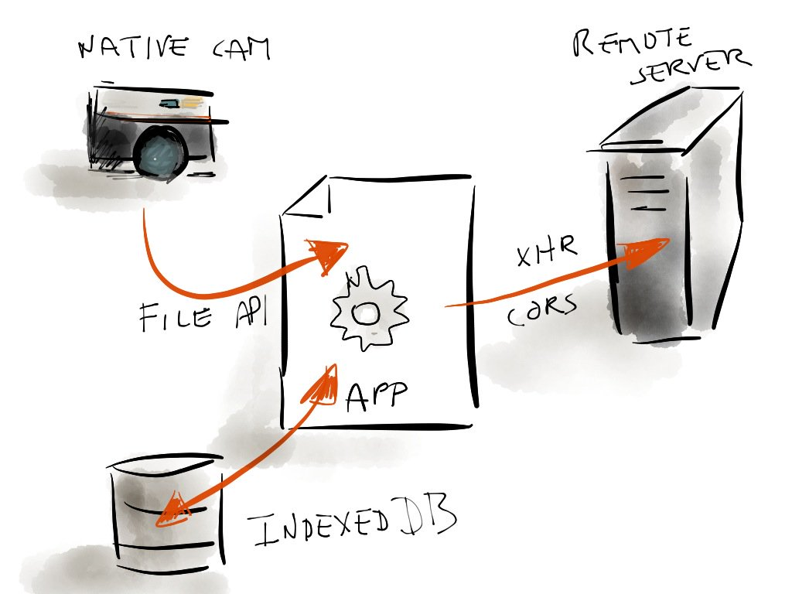
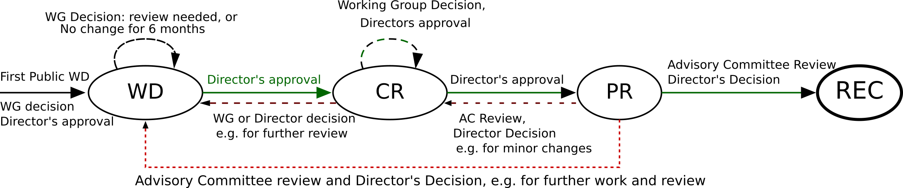
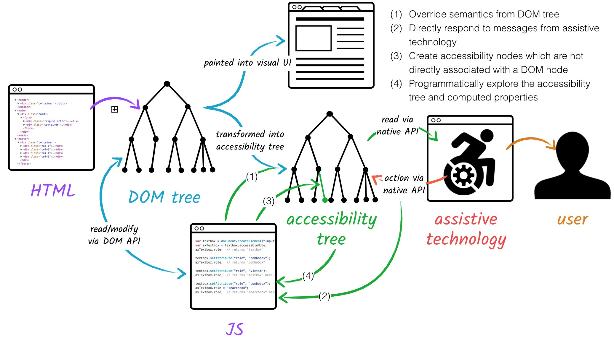
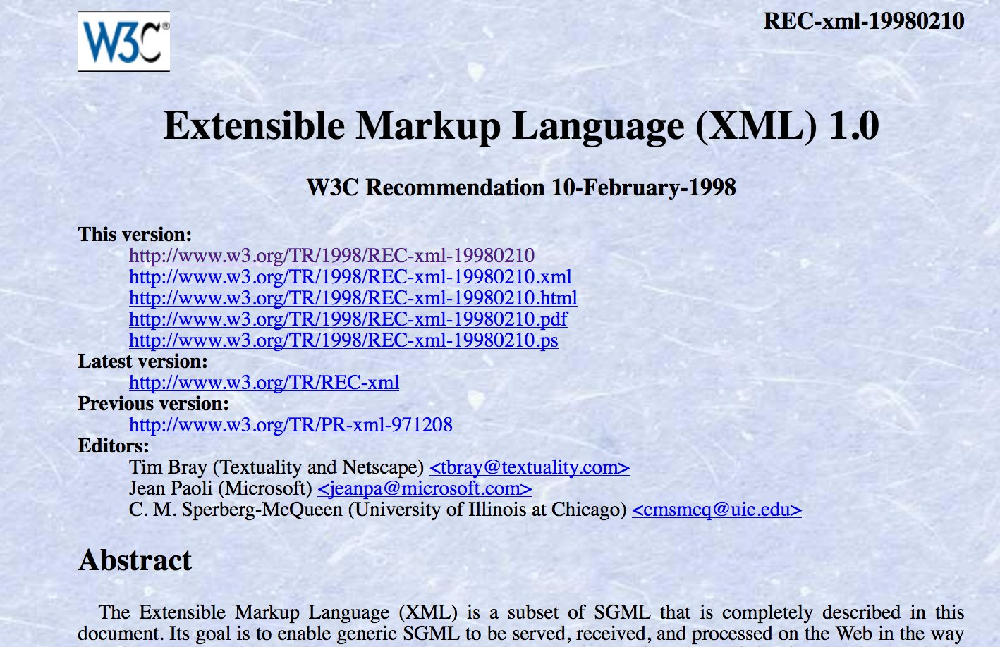
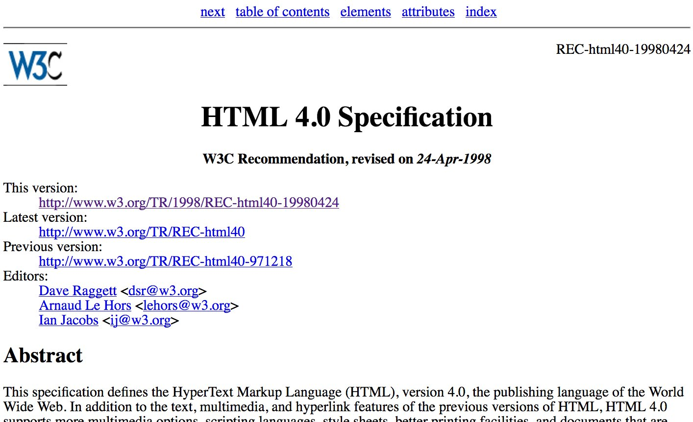
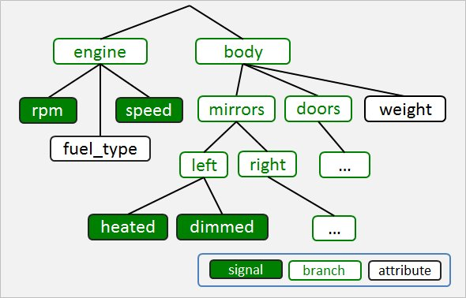

> Where to meet and interact with @w3c in February?   
> \.\.\. tonight 1st Feb\., \#Accessibility \#meetup in Hamburg, Germany http://www\.roledrinks\.de/ @yatil @lassediercks \#a11y
> \.\.\. also tonight, @w3ctag \#meetup in London https://ti\.to/w3c\-tag/meet\-the\-tag\-london \.\./2018/2018\-01\-tweets\.html\#x956845017729028096

 [Feb 01 2018, 08:06:24 UTC](https://twitter.com/w3cdevs/status/958974801355399168)

----

> \.\.\. on 16 Feb\., http://chapters\.io \#meetup on \#webassembly with @linclark https://www\.meetup\.com/Pittsburgh\-Code\-Supply/events/247167663/, cooked by @briankardell in Pittsburgh

 [Feb 01 2018, 08:09:31 UTC](https://twitter.com/w3cdevs/status/958975585283395584)

----

> \.\.\. on 22 Feb\. in Paris, @dontcallmeDOM speaks @ICIN\_conference on standardizing service infrastructure for \#5G https://www\.w3\.org/events/talks/2018/5g\-are\-we\-on\-the\-right\-track\-standardizing\-service\-infrastructure\-for\-5g/

 [Feb 01 2018, 08:10:20 UTC](https://twitter.com/w3cdevs/status/958975794595983360)

----

> \.\.\. 26 Feb\. is the deadline to submit a position statement for the \#dataprivacy18 \#W3Cworkshop   
> \.\./2018/2018\-01\-tweets\.html\#x958262777583407104

 [Feb 01 2018, 08:11:16 UTC](https://twitter.com/w3cdevs/status/958976026641616897)

----

> \.\.\. and on 27\-28 Feb\., @dontcallmeDOM and @JAlanBird will be at \#MWC18, Barcelona\! Contact them to discuss \#WebRTC, \#WebAR, \#WebVR, \#PWA and \#WebPayments\.

 [Feb 01 2018, 08:12:21 UTC](https://twitter.com/w3cdevs/status/958976301016211456)

----

> Or in the words of his deservedly proud editor: https://twitter\.com/anssik/status/958988914961866752
> Congrats to @anssik for bringing this specification to the last stage https://www\.w3\.org/TR/2018/REC\-html\-media\-capture\-20180201/ \!  
>   
> HTML Media Capture provides a markup hint \(the capture attribute on an <input type\=file>\) to make a file input gets its content from a camera rather than a filesystem \#timetoadopt https://twitter\.com/w3c/status/958987094554304518

 [Feb 01 2018, 09:49:43 UTC](https://twitter.com/w3cdevs/status/959000804966486016)

----

> The work started almost 8 years ago \(\!\) https://www\.w3\.org/standards/history/html\-media\-capture \- some good chunk of it waiting for implementation\.

 [Feb 01 2018, 09:49:44 UTC](https://twitter.com/w3cdevs/status/959000809097891840)

----

> It is available mostly on mobile browsers at the moment \- Safari iOS and Chrome Android https://caniuse\.com/\#feat\=html\-media\-capture but can be used as a purely progressive enhancement\.  
>   
> https://twitter\.com/anssik/status/935541786835144710

 [Feb 01 2018, 09:49:44 UTC](https://twitter.com/w3cdevs/status/959000806925258752)

----

> This particular approach delegates all the camera settings and controls  \(e\.g zoom, white balance\) to an existing camera application\.

 [Feb 01 2018, 09:49:45 UTC](https://twitter.com/w3cdevs/status/959000813090852864)

----

> HTML Media Capture aims at making it super easy to build Web\-based camera apps\. See @tobie 's  nicely illustrated description of how it fit in that view  https://github\.com/tobie/camera 
> 
> 

 [Feb 01 2018, 09:49:45 UTC](https://twitter.com/w3cdevs/status/959000810729467904)

----

> A complementary API is under development to bring that control to the Web app directly https://w3c\.github\.io/mediacapture\-image/ developed at https://github\.com/w3c/mediacapture\-image  
>   
> That one is available in @googlechrome and in development in @firefox https://bugzilla\.mozilla\.org/show\_bug\.cgi?id\=888177

 [Feb 01 2018, 09:49:46 UTC](https://twitter.com/w3cdevs/status/959000814663688192)

----

> The @w3ctag awakens \(for the second day of their meeting\) \- RT if they should keep fighting the Proprietary Empire, ♥ if they should go back to sleep\. https://twitter\.com/triblondon/status/958980086652313600

 [Feb 01 2018, 09:56:04 UTC](https://twitter.com/w3cdevs/status/959002402803380224)

----

> @kennethrohde achievement unlocked 🏆: use of “non\-relativistic scalar" in a pull request comment https://github\.com/w3c/sensors/pull/340\#discussion\_r165300456

 [Feb 01 2018, 10:28:41 UTC](https://twitter.com/w3cdevs/status/959010607663075328)

----

> Right now, the draft new charter is setting the group to finish its ongoing work, look at bringing low\-level APIs to get rid of the dependency on SDP \(if you don't know what that is, DO NOT ASK, DO NOT LOOK IT UP 🙈🙉🙊\), and explore new foundations for P2P data channels\.
> Part of why now is a good time to chime in on the future of \#WebRTC is because the Working Group is looking at rechartering soon \- a group charter defines its goal and scope for the upcoming couple of years\. \.\./2018/2018\-01\-tweets\.html\#x956559837839679493

 [Feb 01 2018, 11:13:13 UTC](https://twitter.com/w3cdevs/status/959021817355816960)

----

> Every charter that comes up for discussion \(either anew or for renewal\) gets announced on one of our many mailing lists http://lists\.w3\.org/Archives/Public/public\-new\-work/ \- subscribe to it if you want to stay up to date \(who doesn't want more 📧?\)

 [Feb 01 2018, 11:13:14 UTC](https://twitter.com/w3cdevs/status/959021820530823169)

----

> The chartering and \#WebRTC future discussions are happening on the mailing list https://lists\.w3\.org/Archives/Public/public\-webrtc/ and in a dedicated github repo https://github\.com/w3c/webrtc\-charter/issues

 [Feb 01 2018, 11:13:14 UTC](https://twitter.com/w3cdevs/status/959021818987376641)

----

> If you don't know a script well enough to use the native keyboard, try out these new \#unicode character pickers\. It works in any \#browser\! See other avail\. pickers: https://r12a\.github\.io/pickers https://twitter\.com/r12a/status/958942260720173057

 [Feb 01 2018, 13:25:48 UTC](https://twitter.com/w3cdevs/status/959055183576817664)

----

> Chrome and Firefox now have public client\-side implementations of the Web Authentication API \(Working Draft version 7\) \#webauthn https://www\.w3\.org/blog/webauthn/2018/01/29/public\-implementations\-in\-firefox\-and\-chrome/

 [Feb 01 2018, 13:38:21 UTC](https://twitter.com/w3cdevs/status/959058339161403397)

----

> The @w3ctag has been pushing for all specs it reviews to go through a self\-assessment of their impact on security and privacy for Web users\. The security & privacy questionnaire documents which questions spec authors need to consider https://www\.w3\.org/TR/security\-privacy\-questionnaire/ https://twitter\.com/hadleybeeman/status/959054803182735360
> e\.g\. Does the spec create new “fingerprinting” surface \(i\.e\. ways to identify users across Web sites or across devices\)?  
>   
> Does the spec open ways to bypass the same\-origin policy \(which isolates user data from one site to another\)?

 [Feb 01 2018, 14:07:35 UTC](https://twitter.com/w3cdevs/status/959065699082698757)

----

> For instance, the \#WebRTC Working Group went through that exercise before going to Candidate Recommendation: https://github\.com/w3c/webrtc\-pc/issues/265 \- this led to substantial additions to the WebRTC spec https://github\.com/w3c/webrtc\-pc/pull/439 with a detailed set of considerations https://www\.w3\.org/TR/webrtc/\#privacy\-and\-security\-considerations

 [Feb 01 2018, 14:07:36 UTC](https://twitter.com/w3cdevs/status/959065702572478464)

----

> That approach is now also being explored by @webi18n with https://www\.w3\.org/International/techniques/developing\-specs and by @w3c\_wai with http://w3c\.github\.io/apa/fast/checklist\.html

 [Feb 01 2018, 14:07:37 UTC](https://twitter.com/w3cdevs/status/959065705659367424)

----

> Self\-assessment is rarely sufficient, but at least starting from the analysis of the people who know the technology the best hopefully helps others doing their own assessment\.

 [Feb 01 2018, 14:07:37 UTC](https://twitter.com/w3cdevs/status/959065704136921089)

----

> Today is the day where a new @w3c process comes into action \- the well\-titled “Feb 1 2018 Process Document” https://www\.w3\.org/2018/Process\-20180201/  
>   
> This document sets the rules and expectations around how W3C develops its standards and interacts with its stakeholders\.
> This is for instance where the stages through which a spec needs to go through before becoming a \#WebStandard are defined\. 
> 
> 

 [Feb 01 2018, 14:51:30 UTC](https://twitter.com/w3cdevs/status/959076749291196416)

----

> The process is maintained by our Advisory Board @w3CAB \(yes, they too  are on Twitter\!\) with input from the public via the W3C Process  Community Group https://www\.w3\.org/community/w3process/   
>   
> Congrats to @chaals for shepherding that latest set of updates\!

 [Feb 01 2018, 14:58:17 UTC](https://twitter.com/w3cdevs/status/959078458537185281)

----

> Among the notables changes this new process brings:  
> \* a new elected seat on the @w3ctag \(with an upcoming election\)  
> \* the enforcement of our code of conduct https://www\.w3\.org/Consortium/cepc/  
> \* a non\-WG process for maintaining Recommendations  
>   
> https://www\.w3\.org/2018/Process\-20180201/\#changes

 [Feb 01 2018, 14:58:17 UTC](https://twitter.com/w3cdevs/status/959078455672492032)

----

> The Second Screen Working Group develops the Presentation API and the Remote Playback API, both \#JS APIs used to render content from one device to a second screen\.  
>   
> Both these APIs have reached Candidate Recommendation status, i\.e\. \#timetoimplement https://twitter\.com/w3c/status/959389238528761856
> The Presentation API allows rendering any Web content on a second screen: https://www\.w3\.org/TR/presentation\-api/   
>   
> It is available in @googlechrome and in development in @firefox and @webkit https://www\.chromestatus\.com/features/6676265876586496  
> The spec is developed in https://github\.com/w3c/presentation\-api/

 [Feb 02 2018, 13:26:54 UTC](https://twitter.com/w3cdevs/status/959417848849367041)

----

> The Remote Playback API focuses specifically on rendering media content on a remote screen https://www\.w3\.org/TR/remote\-playback/  
>   
> It is available in @googlechrome and in development in @webkit https://www\.chromestatus\.com/feature/5778318691401728  
>   
> The spec is developed in https://github\.com/w3c/remote\-playback/

 [Feb 02 2018, 13:26:55 UTC](https://twitter.com/w3cdevs/status/959417852448165888)

----

> The new charter mostly sets the group to finish its work https://www\.w3\.org/2014/secondscreen/charter\-2018\.html\.   
>   
> It also points to the work of the Second Screen \*Community\* Group which is incubating work on an interoperable protocol as support for the Presentation API  https://github\.com/webscreens/openscreenprotocol

 [Feb 02 2018, 13:26:56 UTC](https://twitter.com/w3cdevs/status/959417854134243328)

----

> \.@tink gave a nice introduction to the topic at one of our previous \#w3cTPAC meetups, and you can watch and listen a similar talk of her from a couple of years ago https://www\.youtube\.com/watch?v\=qi0tY60Hd6M
> The \#Accessibility Tree is the model of information that assistive  technologies \(such as screen readers\) use to expose the components of an  interface \(incl a Web page\) to their users\. https://twitter\.com/ChromeDevTools/status/958754581227319296

 [Feb 02 2018, 16:32:03 UTC](https://twitter.com/w3cdevs/status/959464443053780992)

----

> Right now, that accessibility tree is not exposed directly to developers \(although it is directly influenced by the DOM\); there is an ongoing exploration to exposing it in an Accessibility Object Model proposal https://wicg\.github\.io/aom/explainer\.html \- developed on github https://github\.com/wicg/aom 
> 
> 

 [Feb 02 2018, 16:32:04 UTC](https://twitter.com/w3cdevs/status/959464445423517697)

----

> The GPU on the Web \#CommunityGroup is exploring ways of exposing new GPU capabilities in Web Browsers\. https://www\.w3\.org/community/gpu/ https://twitter\.com/rektide/status/959471654136156160
> Compared to \#WebGL, it aims at being more “web\-by”, lower level for greater performance, mappable to more platforms, and applicable both to graphic and computational use cases \(e\.g\. maching learning\)\. https://gpuweb\.github\.io/admin/cg\-charter\.html

 [Feb 02 2018, 17:23:38 UTC](https://twitter.com/w3cdevs/status/959477422528913411)

----

> Their work is ongoing on github https://github\.com/gpuweb/gpuweb with records of their day\-to\-day work in the wiki https://github\.com/gpuweb/gpuweb/wiki  
>   
> The technical work there is not for the faint of heart, though \- beware\!

 [Feb 02 2018, 17:23:39 UTC](https://twitter.com/w3cdevs/status/959477427872370688)

----

> 最近公開されたWeb標準の @w3c HTML5 Media Captureの日本語翻訳が利用可能になりました：http://www\.asahi\-net\.or\.jp/\~ax2s\-kmtn/internet/media/REC\-html\-media\-capture\-20180201\.html どうもありがとう @omnidirect\!

 [Feb 06 2018, 13:41:09 UTC](https://twitter.com/w3cdevs/status/960870984193593344)

----

> CSS Grid Layout has taken the world of CSS design by fire over the past  year, thanks in part to the great outreach around it \(notably by  @jensimmons and @rachelandrew \)\.  
>   
> The @csswg has now published the first draft of the new level of CSS Grid https://www\.w3\.org/TR/2018/WD\-css\-grid\-2\-20180206/ https://twitter\.com/w3c/status/960788754192584704
> The main addition to the current CSS Grid Layout Level 1 is subgrids \- @meyerweb described the concept excitedly a couple of years ago https://meyerweb\.com/eric/thoughts/2016/01/15/subgrids\-considered\-essential/  
>   
> There were initially part of the Level 1 spec, but had to be postponed to find the right approach for implementability\.

 [Feb 06 2018, 14:42:35 UTC](https://twitter.com/w3cdevs/status/960886446730174469)

----

> The spec is developed \(along with most other @csswg specs\) in the repo at https://github\.com/w3c/csswg\-drafts/ and is edited by the oh\-so\-ever\-productive @fantasai @cssrossen @tabatkins

 [Feb 06 2018, 14:42:36 UTC](https://twitter.com/w3cdevs/status/960886450496704518)

----

> Great recap of past, ongoing and emerging work on the Web media stack, including a link to Web Media Roadmap which has all the details you might need in that space http://w3c\.github\.io/web\-roadmaps/media/  
>   
> \(that roadmap as you've guessed is itself maintained on github https://github\.com/w3c/web\-roadmaps/ \) https://twitter\.com/w3c/status/960885375521775616

 [Feb 06 2018, 15:54:06 UTC](https://twitter.com/w3cdevs/status/960904441418350594)

----

> As reported in this very good overview of Web Bluetooth, this API is right now in pre\-standardization in the Web Bluetooth Community Group under the lead of @jyasskin https://www\.w3\.org/community/web\-bluetooth/ https://twitter\.com/BluetoothSIG/status/960944944759365633
> The API enables connecting to and interacting with Bluetooth LE devices in Web browsers, providing low friction way to deploy apps for many BLE\-based connected objects\. https://webbluetoothcg\.github\.io/web\-bluetooth/

 [Feb 07 2018, 13:21:21 UTC](https://twitter.com/w3cdevs/status/961228390056583170)

----

> There was discussions in bringing this work to the formal standardization track as part of the Device and Sensors Working Group a few months ago https://github\.com/w3c/dap\-charter/issues/28

 [Feb 07 2018, 13:21:22 UTC](https://twitter.com/w3cdevs/status/961228395832074241)

----

> It is developed in the Github repo at https://github\.com/WebBluetoothCG/web\-bluetooth and discussed in the mailing list archived at http://lists\.w3\.org/Archives/Public/public\-web\-bluetooth/

 [Feb 07 2018, 13:21:22 UTC](https://twitter.com/w3cdevs/status/961228394057949185)

----

> So if you have great use cases that justify more implementations of the API, follow the links to the various browser bug reports/feature request:  
> @firefox https://bugzilla\.mozilla\.org/show\_bug\.cgi?id\=674737  
> @MSEdgeDev https://wpdev\.uservoice\.com/forums/257854\-microsoft\-edge\-developer/suggestions/9775308\-implement\-the\-web\-bluetooth\-gatt\-client\-api  
> @webkit https://bugs\.webkit\.org/show\_bug\.cgi?id\=101034

 [Feb 07 2018, 13:21:23 UTC](https://twitter.com/w3cdevs/status/961228399711866880)

----

> But we need more confirmed interests from browser vendors before going there… So far, it is only available in Chromium\-based browsers https://caniuse\.com/\#feat\=web\-bluetooth

 [Feb 07 2018, 13:21:23 UTC](https://twitter.com/w3cdevs/status/961228397635612672)

----

> The \#ARIA Graphics module adds a few additional recognized roles to help annotate complex graphical content, e\.g\. labeled diagrams or interactive graphics\.  https://www\.w3\.org/TR/graphics\-aria\-1\.0/  
>   
> The ARIA Working Group is seeking feedback in its repo https://github\.com/w3c/graphics\-aria/issues/new on these new roles\.
> \#ARIA is an \#accessibility technology that allows to annotate the DOM of a document to map elements into recognized components for assistive technologies\. The current set of roles is pretty widely supported across a number of browsers and assistive tools\. https://www\.w3\.org/WAI/ARIA/1\.0/CR/implementation\-report\#imprep\_aria https://twitter\.com/paciellogroup/status/960912383974739968

 [Feb 07 2018, 14:57:01 UTC](https://twitter.com/w3cdevs/status/961252466426892292)

----

> The Graphics Accessibility API Mapping translates these new roles into the various platform\-specific \#accessibility APIs https://www\.w3\.org/TR/graphics\-aam\-1\.0/  
>   
> Feedback in the repo https://github\.com/w3c/graphics\-aam/issues/new is sought, including on the correctness of the proposed mappings\.

 [Feb 07 2018, 14:57:02 UTC](https://twitter.com/w3cdevs/status/961252468796612609)

----

> If you're a user of w3c specifications, your feedback and input is needed\! https://twitter\.com/w3c/status/961577323987431425
> W3C spec design has evolved a number of times over the years, since its very first Recommendation, PNG in 1996 
> 
> 
> 
> 
> 
> 
> 
> 

 [Feb 08 2018, 13:16:24 UTC](https://twitter.com/w3cdevs/status/961589533740584961)

----

> The last major design evolution was led by @fantasai and started to be deployed in 2016\.  
>   
> With your input and a bit of luck, maybe this redesign project will bring us further improvements for next year? Good luck to the @JeffersonUniv students who are taking up that challenge\! 
> 
> 

 [Feb 08 2018, 13:16:26 UTC](https://twitter.com/w3cdevs/status/961589539356708864)

----

> The known issues that a new design would need to address are maintained in the github repo https://github\.com/w3c/tr\-design/issues
> \(wishing them good luck 🤞because if you're familiar with discussions on the color of the 🎨 for the 🚲shed, wait until you see discussions on the color of the pen for the written description of the bikeshed\)

 [Feb 08 2018, 13:26:06 UTC](https://twitter.com/w3cdevs/status/961591973713981441)

----

> This allows a merchant using the Payment Request API to offer Web apps among the accepted payment instruments\. \(along eg\. credit cards & native apps\)\.   
>   
> If the user picks that instrument, a Service Worker from the said Web app gets spawned and is used to process the payment\. 
> 
> 
> Payment Handler is the @w3payments spec that enables a Web site to become a payment provider for third parties https://w3c\.github\.io/payment\-handler/ https://twitter\.com/kennethrohde/status/961198113032691712

 [Feb 08 2018, 15:59:09 UTC](https://twitter.com/w3cdevs/status/961630489646903296)

----

> As reported previously, adoption of payment handler is one of the focus of the @w3payments group in 2018 \.\./2018/2018\-01\-tweets\.html\#x956510884855205888

 [Feb 08 2018, 15:59:10 UTC](https://twitter.com/w3cdevs/status/961630493736357888)

----

> The spec is developed in https://github\.com/w3c/payment\-handler   
>   
> BobPay is a sample Web app ready to act as a payment handler, so that you can play with the expected workflow without actually spending money https://bobpay\.xyz/   
>   
> Its source code is at https://github\.com/madmath/payment\-request\-show/tree/master/bobpay/public/pay

 [Feb 08 2018, 15:59:10 UTC](https://twitter.com/w3cdevs/status/961630492088029184)

----

> Yesterday, an intent to ship the Payment Handler API in Blink was posted https://lists\.w3\.org/Archives/Public/public\-payments\-wg/2018Feb/0014\.html \- so hopefully you'll get to test that API in @ChromiumDev soon\!

 [Feb 08 2018, 16:36:17 UTC](https://twitter.com/w3cdevs/status/961639835441213441)

----

> Meanwhile, if you want a refresher on what's possible today and what will be possible in the future on the Web on mobile, the Mobile Roadmap is here to help https://www\.w3\.org/Mobile/mobile\-web\-app\-state/
> We're a little more than 2 weeks away from \#MWC18 \- if you're there and interested in chatting about Web technologies, get in touch with @dontcallmeDOM \! \#WebRTC \#WebXR \#PWA \.\./2018/2018\-02\-tweets\.html\#x958976301016211456

 [Feb 09 2018, 15:17:08 UTC](https://twitter.com/w3cdevs/status/961982303680548866)

----

> Worklets are a lower\-cost way of running code very efficiently as part of the various rendering pipelines of the browser \(e\.g\. while painting, laying out, animating or playing audio\) https://developer\.mozilla\.org/en\-US/docs/Web/API/Worklet https://twitter\.com/robwormald/status/962077553539260416
> The concept is defined in the Worklets spec, jointly developed by the @csswg and the @w3ctag https://drafts\.css\-houdini\.org/worklets/ \- repo at https://github\.com/w3c/css\-houdini\-drafts/

 [Feb 12 2018, 15:34:36 UTC](https://twitter.com/w3cdevs/status/963073863759384576)

----

> They were developed as part of an effort making various CSS concepts easier to experiment with and polyfill for, known as the Houdini Task Force https://drafts\.css\-houdini\.org/\.  
>   
> Part of the idea is that it enables anyone to create their own CSS property and values\.

 [Feb 12 2018, 15:34:37 UTC](https://twitter.com/w3cdevs/status/963073867127324674)

----

> The current known implementations and implementation plans are tracked at https://ishoudinireadyyet\.com/  
>   
> This is still early days, but it does feel like a pretty big game changer in opening up the browser black boxes\!

 [Feb 12 2018, 15:34:38 UTC](https://twitter.com/w3cdevs/status/963073872831700992)

----

> The currently defined Worklet scopes are:  
> \* for CSS painting,  https://drafts\.css\-houdini\.org/css\-paint\-api/   
> \* for CSS layout, https://drafts\.css\-houdini\.org/css\-layout\-api/  
> \* for Animations, https://wicg\.github\.io/animation\-worklet/  
> \* for Audio https://webaudio\.github\.io/web\-audio\-api/\#dom\-audioworkletglobalscope

 [Feb 12 2018, 15:34:38 UTC](https://twitter.com/w3cdevs/status/963073871250382850)

----

> Worklets are designed to run code with a very limited scope, and so are made available with a by\-design very restricted API surface\.  
>   
> Each type of rendering gets its own dedicated API surface, encompassed in a given WorkletScope\.

 [Feb 12 2018, 15:34:38 UTC](https://twitter.com/w3cdevs/status/963073868771614720)

----

> A Korean translation of the recently published \#WebStandard @w3c HTML5 Media Capture is now available: https://techhtml\.github\.io/html\-media\-capture/ Thank you @apes01234\!
> 최근에 발행된 웹표준인 W3C HTML5 Media Captur에 대한 한국어 번역이 현재 제공됩니다\. https://techhtml\.github\.io/html\-media\-capture/ @apes01234님의 번역에 감사합니다\.

 [Feb 13 2018, 06:58:05 UTC](https://twitter.com/w3cdevs/status/963306263798009857)

----

> This is a 1st public draft of one of a set of module from @w3c\_wai to enable Personalization Semantics in Web content\. https://www\.w3\.org/TR/2018/WD\-personalization\-semantics\-1\.0\-20180213/  
>   
> They provide vocabularies to describe well\-known semantics of aspects of Web content\. These vocabularies can be used to annotate markup\. https://twitter\.com/w3c/status/963338243658977280
> For instance, <button aui\-action\="undo" >Revert</button> would indicate that the said button is used to \*undo\* the last action, and could be rendered in a way personalized to the user \- one goal is to make Web content more approachable to users with cognitive disabilities\.

 [Feb 13 2018, 09:49:02 UTC](https://twitter.com/w3cdevs/status/963349285776523264)

----

> You can find demos and implementation plans at https://github\.com/w3c/personalization\-semantics/wiki/Implementations\-of\-Semantics  
>   
> The spec work is happening in https://github\.com/w3c/personalization\-semantics

 [Feb 13 2018, 09:49:03 UTC](https://twitter.com/w3cdevs/status/963349290235154434)

----

> It is developed by the W3C Automotive Working Group https://www\.w3\.org/auto/wg/ as part of the general Automotive & Web effort in W3C to make Web technologies useful in the context of connected cars https://www\.w3\.org/auto/ 🚗🏎️🚘
> The Vehicle Information Service Specification \(VISS for those in the know\) is a Web\-socket based protocol to get data from in\-vehicle sensors and interact with its actuators\.   
>   
> It has just reached Candidate Recommendation status \#timetoimplement https://www\.w3\.org/TR/2018/CR\-vehicle\-information\-service\-20180213/ https://twitter\.com/w3c/status/963426378535358465

 [Feb 13 2018, 15:13:34 UTC](https://twitter.com/w3cdevs/status/963430958304198656)

----

> Another proposal to address similar use cases was submitted a few months ago https://www\.w3\.org/Submission/2016/SUBM\-viwi\-protocol\-20161213/ \- the group is discussing adopting it as well in its under\-discussion next charter https://lists\.w3\.org/Archives/Public/public\-automotive/2018Feb/0002\.html

 [Feb 13 2018, 15:13:35 UTC](https://twitter.com/w3cdevs/status/963430962414739456)

----

> The spec is developed in github https://github\.com/w3c/automotive/tree/gh\-pages/vehicle\_data and relies on a data model defined by @GENIVIAlliance https://github\.com/GENIVI/vehicle\_signal\_specification 
> 
> 

 [Feb 13 2018, 15:13:35 UTC](https://twitter.com/w3cdevs/status/963430959902285826)

----

> If you are doing manual evaluation of Web accessibility, there should be plenty to learn and to bring to this on\-line symposium on March 14 \- register by March 8\! https://twitter\.com/w3c\_wai/status/963849082900008960

 [Feb 15 2018, 08:50:39 UTC](https://twitter.com/w3cdevs/status/964059370014302210)

----

> Two Recommendations are joining the family\! Congrats to   
> @vroddon @riannella @mws4b @smyles @serena\_villata for this achievement\! 🏆\#timetoadopt ODRL https://twitter\.com/w3c/status/964053482251739136

 [Feb 15 2018, 09:50:00 UTC](https://twitter.com/w3cdevs/status/964074304437710848)

----

> To understand the basic value proposition of \#WebAssembly, @linclark provided a great series of article, notably https://hacks\.mozilla\.org/2017/02/what\-makes\-webassembly\-fast/ 
> 
> 
> \#webassembly is a pretty big deal for the Web \- it provides a compact, fast\-to\-parse, fast\-to\-run binary byte code for the Web, in the right conditions\.  
>   
> It complements \#JavaScript for tasks that are CPU intensive, and facilitates porting of non\-JS code bases \(e\.g\. game engines\) https://twitter\.com/w3c/status/964118412401283072

 [Feb 15 2018, 13:38:49 UTC](https://twitter.com/w3cdevs/status/964131889077522433)

----

> Web Assembly JavaScript Interface provides the API exposed in browsers to load, run and interact with Web Assembly modules https://www\.w3\.org/TR/2018/WD\-wasm\-js\-api\-1\-20180215/

 [Feb 15 2018, 13:38:50 UTC](https://twitter.com/w3cdevs/status/964131893888409600)

----

> 3 specs are beginning their way on the formal standardization track today\.  
>   
> Web Assembly Core describes the low level code format https://www\.w3\.org/TR/2018/WD\-wasm\-core\-1\-20180215/ \- unless you're a compiler/transpiler guru, this is probably not things you'll be dealing with on a daily basis\.

 [Feb 15 2018, 13:38:50 UTC](https://twitter.com/w3cdevs/status/964131892311347205)

----

> The last document, Web Assembly Web API, is a start of a series of further integration points into the Web Platform: https://www\.w3\.org/TR/2018/WD\-wasm\-web\-api\-1\-20180215/  
>   
> It provides at the moment e\.g\. a way to compile a \#WebAssembly module from a streamed response\.

 [Feb 15 2018, 13:38:51 UTC](https://twitter.com/w3cdevs/status/964131897231233029)

----

> For instance,   
>   WebAssembly\.instantiate\(buffer, importObj\);  
> will instantiate a Web Assembly module from the buffer, and pass it importObj where it can get data or functions from the calling JavaScript\.

 [Feb 15 2018, 13:38:51 UTC](https://twitter.com/w3cdevs/status/964131895578677249)

----

> To create Web Assembly modules, @arasentin published the other day helpful notes to createa truly compact module \- early experimentation with \#WebAssembly led sometimes to overly large payload… https://aransentin\.github\.io/cwasm/

 [Feb 15 2018, 13:38:52 UTC](https://twitter.com/w3cdevs/status/964131901987532801)

----

> There are still plenty of further optimizations that these implementations are looking at to make Web Assembly run even better and faster

 [Feb 15 2018, 13:38:52 UTC](https://twitter.com/w3cdevs/status/964131900649504774)

----

> All that work is happening in a single Github repo https://github\.com/WebAssembly/spec/  
>   
> Because that work started its incubation some time ago in \#w3cCommunity Group, despite its early stage on the standardization track, it is already widely available in browsers https://www\.caniuse\.com/\#feat\=wasm

 [Feb 15 2018, 13:38:52 UTC](https://twitter.com/w3cdevs/status/964131899001237507)

----

> If you want to learn more about this, don't miss @linclark http://chapters\.io presentation on Feb 26 https://www\.meetup\.com/Pittsburgh\-Code\-Supply/events/247167663/

 [Feb 15 2018, 13:38:53 UTC](https://twitter.com/w3cdevs/status/964131904479027200)

----

> I've just gotten interviewed by the student designers for this project \- if you want to help improve our specs, go and give your input https://medium\.com/jefferson\-w3c\-collaboration/announcing\-the\-jefferson\-w3c\-specification\-collaboration\-fd6080b6de89 https://twitter\.com/w3c/status/963459550157443072

 [Feb 15 2018, 15:23:48 UTC](https://twitter.com/w3cdevs/status/964158308536999936)

----

> The @w3c Spatial Data on the Web \#InterestGroup \#f2fmeeting begins now @geonovum's offices: https://w3c\.github\.io/sdw/meetings/f2f\-1\.html
> Today's main topic is to invite more usage and gather \#developers' experience feedback of the Spatial Data on the Web \#BestPractices https://www\.w3\.org/TR/sdw\-bp/

 [Feb 19 2018, 09:39:21 UTC](https://twitter.com/w3cdevs/status/965521174804467712)

----

> There are 14 \#BestPractices total, but let's highlight the first 3 ones:

 [Feb 19 2018, 09:44:57 UTC](https://twitter.com/w3cdevs/status/965522586577833984)

----

> \#BestPractice 1: use globally unique IDs to represent spatial things, as \#HTTP links need to be durable, contributing to the Web of  data\! https://www\.w3\.org/TR/sdw\-bp/\#globally\-unique\-ids

 [Feb 19 2018, 09:45:53 UTC](https://twitter.com/w3cdevs/status/965522820720717825)

----

> \#BestPractice 2: make your spatial data indexable by search engines, so to enable direct discovery by users https://www\.w3\.org/TR/sdw\-bp/\#indexable\-by\-search\-engines

 [Feb 19 2018, 09:46:50 UTC](https://twitter.com/w3cdevs/status/965523057703116800)

----

> \#BestPractice 3: link resources together to create the Web of  data https://www\.w3\.org/TR/sdw\-bp/\#linking thus aligning to the 5★ rating for \#LinkedOpenData http://5stardata\.info/en/

 [Feb 19 2018, 09:49:28 UTC](https://twitter.com/w3cdevs/status/965523719996297216)

----

> Review the other 11 SDW \#BestPractices and let the group know if these are useful and/or if there need to be more\! https://www\.w3\.org/TR/sdw\-bp/

 [Feb 19 2018, 09:52:44 UTC](https://twitter.com/w3cdevs/status/965524542163705856)

----

> The Spatial Data on the Web \#InterestGroup reviews proposals for @w3c and/or @opengeospatial to make the Web more spatial\-friendly\. Got ideas? Get in touch\!

 [Feb 19 2018, 14:19:20 UTC](https://twitter.com/w3cdevs/status/965591637505212417)

----

> For \#webdev \#beginners, check this free intro to modern Web technologies\. Clear, concise, informative, animated and colorful slides\. In one word: beautiful\! https://leaverou\.github\.io/talks/intro/\#intro https://twitter\.com/LeaVerou/status/965807821269995521

 [Feb 20 2018, 07:19:53 UTC](https://twitter.com/w3cdevs/status/965848464562229248)

----

> The @w3c Spatial Data on the Web \#InterestGroup now reviews CityJSON  http://www\.cityjson\.org/en/0\.5/,  a format for encoding a subset of the CityGML data  model using \#json
> CityJSON makes it easier for \#developers to manipulate city displays \(roads,buildings, etc\.\) at any kind of detail level\.

 [Feb 20 2018, 14:17:01 UTC](https://twitter.com/w3cdevs/status/965953442505207808)

----

> Another topic currently discussed at this SDW \#f2fmeeting is MapML, a proposed text format for encoding map information with the goal of  displaying modern interactive Web \#maps\.

 [Feb 20 2018, 14:24:12 UTC](https://twitter.com/w3cdevs/status/965955247419084800)

----

> Could MapML help add semantics and improve \#accessibility for \#maps on the Web?

 [Feb 20 2018, 14:24:47 UTC](https://twitter.com/w3cdevs/status/965955395872272384)

----

> MapML is being developed by the @w3c Maps For HTML \#CommunityGroup http://www\.w3\.org/community/maps4html/

 [Feb 20 2018, 14:26:20 UTC](https://twitter.com/w3cdevs/status/965955786211028992)

----

> \#developers should join this group to discuss, for example, how they'd like to use \#maps: within browsers or using external libraries? etc\.

 [Feb 20 2018, 14:27:47 UTC](https://twitter.com/w3cdevs/status/965956152281485312)

----

> The recently published @w3c ODRL Information Model 2\.2 \#WebStandard has been translated into Japanese: http://www\.asahi\-net\.or\.jp/\~ax2s\-kmtn/internet/rights/REC\-odrl\-model\-20180215\.html Thank you @omnidirect\! \#html5j \#w3c\_keio
> 最近公開された @w3c ODRL情報モデル2\.2 \#WebStandard は日本語に翻訳されています：http://www\.asahi\-net\.or\.jp/\~ax2s\-kmtn/internet/rights/REC\-odrl\-model\-20180215\.html どうもありがとう @omnidirect \! \#html5j \#w3c\_keio

 [Feb 20 2018, 14:43:04 UTC](https://twitter.com/w3cdevs/status/965959998131068929)

----

> \.\.\. If \#5G is to provide a fully programmable networking layer, @dontcallmeDOM argues it needs better integration with the most widespread development platform \- the Web\. 
> 
> 
> Today at \#icin2018 @dontcallmeDOM highlights the need for more active collaboration in the standardization space between \#5G and \#Web technologies https://www\.w3\.org/2018/Talks/dhm\-web5g\-icin\.pdf

 [Feb 22 2018, 09:13:51 UTC](https://twitter.com/w3cdevs/status/966601922345099264)

----

> To tap in \#5G promises, it needs to use existing and future technologies, incl\. \#WebRTC, Web of Things, \#ServiceWorker, \#AR,  \#VR, etc\., at the app and/or network level\.

 [Feb 22 2018, 09:13:52 UTC](https://twitter.com/w3cdevs/status/966601927957057536)

----

> Goal is to better use \#WebStandards to roll out innovative services to the benefit of end users and vertical markets such as \#automotive, \#IoT, \#VR, \#AR\.

 [Feb 22 2018, 09:13:52 UTC](https://twitter.com/w3cdevs/status/966601925373431808)

----

> The new network capabilities and performances enabled by \#5G can be exploited to their full extent at the application Web layer\. Read @dontcalmeDOM paper on \#Web5G that explores the opportunities and challenges in that space https://5g\.ieee\.org/tech\-focus/september\-2017/web\-5g

 [Feb 22 2018, 09:13:53 UTC](https://twitter.com/w3cdevs/status/966601930272333824)

----

> And join the discussion of how to better align evolutions of network and Web technologies at the upcoming \#W3CWorkshop on Web5G https://www\.w3\.org/web5g on 10\-11 May 2018, in \#London 
> 
> 

 [Feb 22 2018, 09:13:54 UTC](https://twitter.com/w3cdevs/status/966601933040640000)

----

> This document describes the basic requirements for Arabic script layout and text support on the Web and in eBooks, using \#WebStandards and technologies such as \#HTML, \#CSS, Mobile Web, Digital Publications, and \#Unicode\. https://twitter\.com/webi18n/status/966654589574549504
> \#developers: learn more about Arabic script encoding, characters, direction, joining, writing styles, etc\.: https://www\.w3\.org/TR/2018/WD\-alreq\-20180222/\#h\_arabic\_script\_overview And do not hesitate to contribute\!

 [Feb 22 2018, 12:59:49 UTC](https://twitter.com/w3cdevs/status/966658790220353536)

----

> Our very own @svgeesus gives next Wednesday \(Feb 28\) the concluding keynote to @Fogra\_org on the “latest newsfrom Colour on the Web Community: CSS Colour 4, SDR, HDR, Wide gamut display” https://www\.fogra\.org/en/fogra\-events/colour\-management\-en/cms\-2018\-speakers/26f9301cd17ae20f567f3da3fc786f74\-2\-481\-2\-481\.html https://twitter\.com/Fogra\_org/status/967085467354238977

 [Feb 23 2018, 18:21:15 UTC](https://twitter.com/w3cdevs/status/967102069860691968)

----

> Are you going? https://www\.meetup\.com/Pittsburgh\-Code\-Supply/events/247167663/ Watch the live streaming otherwise\! From 7pm EST\. With @linclark on why \#webassembly is fast\. https://twitter\.com/briankardell/status/968139424562368513
> Play it again\! https://youtu\.be/smcN0Dvctac 
> 
> 

 [Feb 26 2018, 20:34:19 UTC](https://twitter.com/w3cdevs/status/968222720436719616)

----

> The recently published @w3c ODRL Vocabulary&Expression 2\.2 \#WebStandard has been translated into Japanese: http://www\.asahi\-net\.or\.jp/\~ax2s\-kmtn/internet/rights/REC\-odrl\-vocab\-20180215\.html Thank you again @omnidirect\! \#html5j \#w3c\_keio
> 最近公開された @w3c ODRL Vocabulary＆Expression 2\.2 \#WebStandardは、日本語に翻訳されました：http://www\.asahi\-net\.or\.jp/\~ax2s\-kmtn/internet/rights/REC\-odrl\-vocab\-20180215\.html @omnidirectにもう一度ありがとう！ \#html5j \#w3c\_keio

 [Feb 27 2018, 16:12:01 UTC](https://twitter.com/w3cdevs/status/968519098073264130)