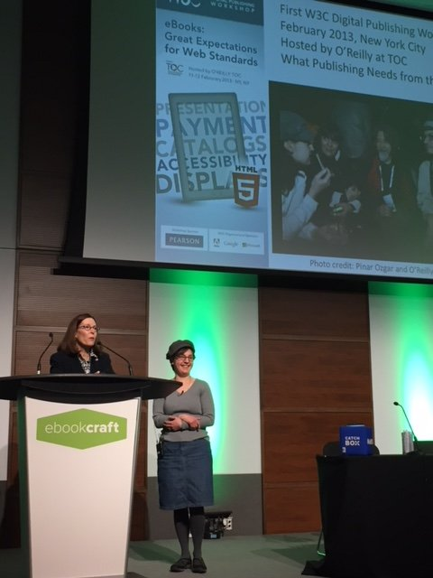

> March @w3c \- Meetings, talks, workshop deadline, etc\. https://www\.w3\.org/participate/eventscal\.html \.\.\.
> 5\-6: \#webcomponents \#f2fmeeting https://github\.com/w3c/WebPlatformWG/blob/gh\-pages/meetings/18\-03\-Web\-components\.md by the @w3c Web Platform \#WorkingGroup https://www\.w3\.org/WebPlatform/WG/ in \#Tokyo

 [Mar 01 2018, 08:37:44 UTC](https://twitter.com/w3cdevs/status/969129548766998530)

----

> 22: @ConnectorKaren and @TzviyaSiegman present an update of \#WebStandards in ebooks http://techforum\.booknetcanada\.ca/sessions/updates\-from\-the\-digital\-standards\-frontlines/ \#ebookcraft in \#Toronto @w3cpublishing

 [Mar 01 2018, 08:40:14 UTC](https://twitter.com/w3cdevs/status/969130177799294976)

----

> 19\-23: Web accessibility talks by @w3c\_wai team: Judy Brewer, @sabouzah and @shawn\_slh http://www\.csun\.edu/cod/conference/2018/sessions/index\.php/public/presentations/view/322 \#CSUNATC18 in \#SanDiego \#a11y

 [Mar 01 2018, 08:40:14 UTC](https://twitter.com/w3cdevs/status/969130175635042304)

----

> 23\-29: joint Web of Things \#IoT \#InterestGroup \#WorkingGroup \#f2fmeeting https://www\.w3\.org/WoT/IG/wiki/F2F\_meeting,\_24\-29\_March\_2018,\_Prague,\_Czech\_Republic in \#Prague, incl\. \#plugfest and \#openday
> Now speaking\! \#ebookcraft 
> 
> 

 [Mar 01 2018, 08:42:09 UTC](https://twitter.com/w3cdevs/status/969130658709803008)

----

> 30 is the deadline to participate in the \#Web5G \#W3CWorkshop hosted by @GSMA https://www\.w3\.org/2017/11/web5g\-workshop/\#position\-statements 
> 
> 

 [Mar 01 2018, 08:42:09 UTC](https://twitter.com/w3cdevs/status/969130661050245121)

----

> Congrats to editors Vladimir Levantovsky @raphlinus for releasing WOFF2\.0 as the 401st \#WebStandard \#timetoadopt\! https://twitter\.com/svgeesus/status/969146408489095169
> \.\.\. Introduced in 2009, the Web Open Font Format \(WOFF\) was a milestone that marked the beginning of the \#webfonts era\. The idea was to specify a simple compressed file format for fonts, designed primarily for use on the \#Web\.

 [Mar 01 2018, 10:19:19 UTC](https://twitter.com/w3cdevs/status/969155110730379264)

----

> Indeed, the \#Spectre and \#Meltdown attacks revealed early January can be exploited in browsers \- since these attacks rely on precise timing, reducing the precision of http://performance\.now\(\) was quickly identified as a way to reduce the risks of exploitation
> High Resolution Time is the spec that defines http://performance\.now\(\), a precise and monotonic clock for Web apps\.  
>   
> It is republished as Candidate Recommendation by the Web Perf WG as it has needed a substantive update: the clock was too precise \(\!\) https://www\.w3\.org/TR/2018/CR\-hr\-time\-2\-20180301/ https://twitter\.com/w3c/status/969177837411426304

 [Mar 01 2018, 12:55:24 UTC](https://twitter.com/w3cdevs/status/969194392945819648)

----

> In particular, @mdrejhon has been expressing detailed concerns about the impact of reduced accuracy for some use cases \(e\.g\. gaming\)\. If you have ideas or concerns, head to the github repo https://github\.com/w3c/hr\-time/

 [Mar 01 2018, 12:55:25 UTC](https://twitter.com/w3cdevs/status/969194397597405185)

----

> The updated specification thus no longer suggests a minimum level of accuracy\. There is still ongoing discussion on what the new recommendation should be https://github\.com/w3c/hr\-time/issues/56

 [Mar 01 2018, 12:55:25 UTC](https://twitter.com/w3cdevs/status/969194395642810368)

----

> See  @firefox approach to reducing the risks associated with \#Spectre and \#Meltdown https://blog\.mozilla\.org/security/2018/01/03/mitigations\-landing\-new\-class\-timing\-attack/
> And find out more about \#Spectre and x\-origin leaks in this recently published analysis from @arturjanc and @mikewest https://twitter\.com/arturjanc/status/996535217023344640

 [Mar 01 2018, 12:55:26 UTC](https://twitter.com/w3cdevs/status/969194401984663554)

----

> There are more to addressing \#Spectre and \#Meltdown than just reducing timers accuracy\. The various browser vendors have started reporting on the work they see ahead of them

 [Mar 01 2018, 12:55:26 UTC](https://twitter.com/w3cdevs/status/969194399841292288)

----

> \.@MSEdgeDev 's approach on \#Spectre and \#Meltdown https://blogs\.windows\.com/msedgedev/2018/01/03/speculative\-execution\-mitigations\-microsoft\-edge\-internet\-explorer/\#hlgJckks2qu9Vxhm\.97

 [Mar 01 2018, 12:55:27 UTC](https://twitter.com/w3cdevs/status/969194406652891136)

----

> \.@webkit 's approach on \#Spectre and \#Meltdown https://webkit\.org/blog/8048/what\-spectre\-and\-meltdown\-mean\-for\-webkit/

 [Mar 01 2018, 12:55:27 UTC](https://twitter.com/w3cdevs/status/969194404253749248)

----

> \.@googlechrome 's approach on \#Spectre and \#Meltdown https://developers\.google\.com/web/updates/2018/02/meltdown\-spectre

 [Mar 01 2018, 12:55:28 UTC](https://twitter.com/w3cdevs/status/969194409265975296)

----

> \.\.\. WOFF 2\.0 significantly improves font compression\. It offers 30% average gain over WOFF 1\.0, with peaks above 50% in some cases\!\! 
> 
> 

 [Mar 02 2018, 15:55:35 UTC](https://twitter.com/w3cdevs/status/969602125499166721)

----

> \.\.\. WOFF1\.0 was released in Dec\. 2012 and has been widely deployed since\. To better lower the use of network bandwidth, while still allowing fast decompression \(even on mobile devices\!\), the @w3c WebFonts \#WorkingGroup  worked on WOFF2\.0

 [Mar 02 2018, 15:55:35 UTC](https://twitter.com/w3cdevs/status/969602123750170624)

----

> \.\.\. All modern Web browsers now support the WOFF 2\.0 format for downloadable fonts https://caniuse\.com/\#feat\=woff2 
> 
> 

 [Mar 02 2018, 15:55:36 UTC](https://twitter.com/w3cdevs/status/969602130146414592)

----

> \.\.\. WOFF 2\.0 is widely used on production \#websites\. It supports the entirety of the \#TrueType and \#OpenType specifications, including Variable fonts, Chromatic fonts, and font Collections\. Read the doc\. for more details: https://www\.w3\.org/TR/2018/REC\-WOFF2\-20180301/

 [Mar 02 2018, 15:55:36 UTC](https://twitter.com/w3cdevs/status/969602128527396865)

----

> For this special election, the @w3c membership will fill 1 seat\. Learn about the 3 great nominees and their respective statements: Andrew Betts @triblondon, Kenneth Rohde Christiansen @kennethrohde, and Theresa O'Connor @hober https://www\.w3\.org/2018/03/05\-tag\-nominations \- Best of luck\!
> As highlighted last month, the new @w3c process document is granting an additional seat to @w3ctag \(6 elected members instead of 5\) https://www\.w3\.org/2018/Process\-20180201/ https://twitter\.com/w3c/status/970620747227041803

 [Mar 05 2018, 19:58:20 UTC](https://twitter.com/w3cdevs/status/970750379108585472)

----

> \.\./2018/2018\-01\-tweets\.html\#x957974903122219008

 [Mar 05 2018, 19:58:21 UTC](https://twitter.com/w3cdevs/status/970750381792878593)

----

> The \#Web turns 29 today and only half of the world’s population is online\. To connect the other half, we \#developers have to help close the digital divide and make the Web work for all\! @timberners\_lee @w3c \#HappyBirthdayWWW https://twitter\.com/w3c/status/973189990283915264

 [Mar 12 2018, 13:39:51 UTC](https://twitter.com/w3cdevs/status/973191845823033344)

----

> The @w3c @csswg publishes today \#CSS Text Decoration Module   Level 4 https://www\.w3\.org/TR/css\-text\-decor\-4/       @fantasai @kojiishi \#FirstPublicWorkingDraft https://twitter\.com/w3c/status/973466477947949056
> It builds upon CSS Text Decoration Module Level 3 https://drafts\.csswg\.org/css\-text\-decor\-3/ from which it imports text\-decoration\-skip \- which won't make it in Level 3 since it needs redefinition for extensibility, and brings more control on underlines and text shadows

 [Mar 13 2018, 14:48:33 UTC](https://twitter.com/w3cdevs/status/973571521754140672)

----

> An example of what text\-decoration\-skip looks like can be found in @mmosley CSS Trick article https://css\-tricks\.com/almanac/properties/t/text\-decoration\-skip/ 
> 
> 

 [Mar 13 2018, 14:48:34 UTC](https://twitter.com/w3cdevs/status/973571525487005696)

----

> As all other @csswg documents, it is developed on github at https://github\.com/w3c/csswg\-drafts and issues are tracked specifically at https://github\.com/w3c/csswg\-drafts/labels/css\-text\-decor\-4

 [Mar 13 2018, 14:48:35 UTC](https://twitter.com/w3cdevs/status/973571528276267008)

----

> \.@w3c invites Implementations of the Timed Text Markup       Language 2 \(TTML2\) https://www\.w3\.org/TR/ttml2/ \#timetoimplemeni https://twitter\.com/w3c/status/973466481571827712
> TTML is notably used in the TV industry for delivering       captions, subtitles, and other metadata for television material repurposed for the Web\. For that work, TTML1\.0 received an Emmy award @iemmys in 2016 https://www\.w3\.org/2016/01/emmyawardttml\.html 
> 
> 

 [Mar 13 2018, 17:54:25 UTC](https://twitter.com/w3cdevs/status/973618296510730240)

----

> TTML2 adds representation of textual information with which stylistic, layout, and timing semantics are associated for interchange and processing\.

 [Mar 13 2018, 17:54:27 UTC](https://twitter.com/w3cdevs/status/973618302823141376)

----

> The new charter of the @w3payments Working Group that encompasses this roadmap has been approved https://www\.w3\.org/Payments/WG/charter\-201803\.html http://lists\.w3\.org/Archives/Public/public\-new\-work/2018Mar/0003\.html \- find out more on the group on its home page https://www\.w3\.org/Payments/WG/ \.\./2018/2018\-01\-tweets\.html\#x956510869567000576

 [Mar 14 2018, 17:04:26 UTC](https://twitter.com/w3cdevs/status/973968105927036928)

----

> if you're not already watching  \#CSS expert @jensimmons \(member of the @csswg too\), please check out her videos including https://www\.youtube\.com/watch?v\=EashgVqboWo&feature\=youtu\.be https://twitter\.com/jensimmons/status/973907498360033280

 [Mar 14 2018, 17:30:02 UTC](https://twitter.com/w3cdevs/status/973974549053231104)

----

> The Async Clipboard API is part of the Clipboard API WD https://www\.w3\.org/TR/clipboard\-apis/\#async\-clipboard\-api with its accompanying explainer at https://github\.com/w3c/clipboard\-apis/blob/master/explainer\.adoc \- from the very repo where that spec is developed by the Web Platform Working Group https://twitter\.com/ebidel/status/974035369795584001

 [Mar 15 2018, 12:49:09 UTC](https://twitter.com/w3cdevs/status/974266247402618881)

----

> The charter has now been finalized https://www\.w3\.org/2018/03/jsonld\-wg\-charter\.html and is open for comments before final approval \- the path to \#JSONLD 1\.1 is opening up\! https://twitter\.com/w3c/status/974277570958000128 \.\./2018/2018\-01\-tweets\.html\#x956888721835593729

 [Mar 15 2018, 13:59:05 UTC](https://twitter.com/w3cdevs/status/974283848468090880)

----

> This is an update to the Candidate Recommendation of \#CSS Fonts Module level 3 published 5 years ago \(\!\) https://www\.w3\.org/TR/css\-fonts\-3/ which moves a few items to the next level \(4 https://www\.w3\.org/TR/css\-fonts\-4/\) https://twitter\.com/w3c/status/974221445202137088
> Its test suite contains 475 test cases  http://test\.csswg\.org/harness/suite/css\-fonts\-3\_dev \- you can contribute test cases on our shared test suite repository at https://github\.com/w3c/web\-platform\-tests/tree/master/css/css\-fonts https://www\.w3\.org/Style/CSS/Test/

 [Mar 15 2018, 16:27:13 UTC](https://twitter.com/w3cdevs/status/974321129107214337)

----

> The tests are then run automatically across 4 browsers on a daily basis and the results published on our public test dashboard https://wpt\.fyi/css/css\-fonts

 [Mar 15 2018, 16:27:14 UTC](https://twitter.com/w3cdevs/status/974321133741838338)

----

> If you have a bug or an idea, please submit it  https://github\.com/w3c/csswg\-drafts/labels/css\-fonts\-3 and learn how to participate in CSS work:  https://www\.w3\.org/Style/CSS/current\-work

 [Mar 15 2018, 16:27:15 UTC](https://twitter.com/w3cdevs/status/974321135453196288)

----

> Our friends @samsunginternet are organizing a cross\-browser conference for Web developers next month in San Jose, CA https://samsungcreate\.com/, with speakers from the @w3c community \(disclaimer: @w3cdevs may or may not get a chance to be there\)  
> https://twitter\.com/samsunginternet/status/973261698844028929

 [Mar 15 2018, 17:30:31 UTC](https://twitter.com/w3cdevs/status/974337057874100224)

----

> Flying out to \#Paris for @mozdenet Hack on MDN over the next 3 days, focusing on browser compatibility data https://github\.com/mdn/browser\-compat\-data ^ @dontcallmeDOM 
> 
> 

 [Mar 16 2018, 07:26:26 UTC](https://twitter.com/w3cdevs/status/974547421953900545)

----

> As we mentioned a couple of months ago, these APIs come with a stronger privacy\-by\-design approach \(compared to e\.g\. DeviceOrientation\) and bring a cleaner model for managing sensors \(e\.g\. multiple ones, high performance\) \.\./2018/2018\-01\-tweets\.html\#x956181984681840642
> The Generic Sensor and its 5 associated concrete sensor \(accerometer, magnetometer, gyroscope, orientation, ambient light\) APIs have reached Candidate Recommendation status \#timetoimplement  
>   
> The APIs enable Web apps to integrate more closely with the surrounding environment\. https://twitter\.com/w3c/status/976062088534773761
> The Generic Sensor\-based APIs were already available in Chrome, they're now “Under Consideration” in @MSEdgeDev https://twitter\.com/anssik/status/1035525173477302272

 [Mar 20 2018, 13:52:16 UTC](https://twitter.com/w3cdevs/status/976094073483390977)

----

> It is also under consideration in @servoDev for its possible usage in the context of \#WebVR/\#WebXR https://twitter\.com/anssik/status/972496244731011072

 [Mar 20 2018, 13:52:17 UTC](https://twitter.com/w3cdevs/status/976094078214471680)

----

> You can find the API implemented as an origin trial in @GoogleChromeDev https://www\.chromestatus\.com/features/5698781827825664

 [Mar 20 2018, 13:52:17 UTC](https://twitter.com/w3cdevs/status/976094076159385601)

----

> and if you would like to help with the spec, the Generic Sensor spec is developed in https://github\.com/w3c/sensors and you can find the repos for the concrete sensors from https://www\.w3\.org/2009/dap/\#roadmap  
>   
> You can also help with the test suites at e\.g\. https://github\.com/w3c/web\-platform\-tests/tree/master/sensors

 [Mar 20 2018, 13:52:18 UTC](https://twitter.com/w3cdevs/status/976094082433994753)

----

> If you would like to see the API more widely implemented, bring your use cases to the relevant places:  
> \- @firefoxdev https://bugzilla\.mozilla\.org/show\_bug\.cgi?id\=1432631  
> \- @MSEdgeDev https://wpdev\.uservoice\.com/forums/257854\-microsoft\-edge\-developer \(entry to be created\)  
> \- @webkit https://bugs\.webkit\.org/ \(bug to be filed\)

 [Mar 20 2018, 13:52:18 UTC](https://twitter.com/w3cdevs/status/976094080412332032)

----

> \#WebAuthn enables strong authentication using securely\-held public keys with user content, rather than \#passwords \- given how fragile passwords are, this is a pretty big deal\.
> A major step forward for better security, privacy and usability on the \#Web with the publication of the Web Authentication specification as \#CandidateRecommendation https://www\.w3\.org/TR/2018/CR\-webauthn\-20180320/ \#timetoimplement https://twitter\.com/w3c/status/976062090552270850

 [Mar 20 2018, 14:59:59 UTC](https://twitter.com/w3cdevs/status/976111114739175426)

----

> This is not "just" about 2\-factor auth \- in the future, it should also help replace passwords as 1st auth mechanism\.  
>   
> @mozhacks gives a good intro to the spec https://hacks\.mozilla\.org/2018/01/using\-hardware\-token\-based\-2fa\-with\-the\-webauthn\-api/
> It even has its own sticker now \(credits to @apowers313\), so…  
> https://twitter\.com/jamespugjones/status/981012488991907840 
> 
> 

 [Mar 20 2018, 15:00:00 UTC](https://twitter.com/w3cdevs/status/976111116471455750)

----

> The spec use case scenarios illustrate how it all works:  https://www\.w3\.org/TR/webauthn/\#use\-cases \- it can be used both during the registration and the authentication phases\.  
>   
> @MozDevNet already has a good overview of how to use the API https://developer\.mozilla\.org/en\-US/docs/Web/API/Web\_Authentication\_API 
> 
> 
> 
> 

 [Mar 20 2018, 15:00:00 UTC](https://twitter.com/w3cdevs/status/976111118371491840)

----

> The API is available in @firefox v60\+ and in @googlechromedev v65\+ behind a flag, with support limited to USB U2F tokens at the moment\.  
>   
> The spec is developed at https://github\.com/w3c/webauthn/

 [Mar 20 2018, 15:00:01 UTC](https://twitter.com/w3cdevs/status/976111124373475328)

----

> This work has been made possible thanks to the coordination with the @FIDOAlliance that ensured a set of \#FIDO2 Client To Authenticator Protocol \(\#CTAP\) implementations

 [Mar 20 2018, 15:00:01 UTC](https://twitter.com/w3cdevs/status/976111122918072323)

----

> It builds upon the Credential Management API which enable Web apps to rely on the browser credential management store https://w3c\.github\.io/webappsec\-credential\-management/

 [Mar 20 2018, 15:00:01 UTC](https://twitter.com/w3cdevs/status/976111121189961728)

----

> The mission of the @W3C Credible Web Community Group is to help shift the Web toward more trustworthy content, primarily through data sharing, in the style of @schemaorg\_dev, using existing data standards like \#JSONLD https://www\.w3\.org/community/credibility/2018/03/20/getting\-started/ https://twitter\.com/sandhawke/status/976122373572386817

 [Mar 20 2018, 16:08:43 UTC](https://twitter.com/w3cdevs/status/976128411654537217)

----

> @ConnectorKaren https://twitter\.com/LauraB7/status/976829079902150657

 [Mar 22 2018, 16:48:08 UTC](https://twitter.com/w3cdevs/status/976863104603770885)

----

> Zbývá nám několik míst na @w3c \#WoT \#OpenDay v Praze v pondělí 26\. března\. Pokud máte zájem o účast, napište nám DM\. Podívejte se na program https://www\.w3\.org/WoT/IG/wiki/F2F\_meeting,\_24\-29\_March\_2018,\_Prague,\_Czech\_Republic\#Mon\.2C\_26\_Mar\_2018:\_OpenDay \#IoT
> A few seats left to attend the @w3c \#WoT \#OpenDay event in \#Prague, on Monday 26 March\. Please DM us if you're interested\! Check topics of the day https://www\.w3\.org/WoT/IG/wiki/F2F\_meeting,\_24\-29\_March\_2018,\_Prague,\_Czech\_Republic\#Mon\.2C\_26\_Mar\_2018:\_OpenDay \#IoT

 [Mar 23 2018, 14:17:05 UTC](https://twitter.com/w3cdevs/status/977187483288068096)

----

> This month's http://chapters\.io \#meetup is about \#WebNFC by @justinribeiro https://www\.meetup\.com/Pittsburgh\-Code\-Supply/events/248733776/ cc @briankardell \- 28 March, Pittsburgh

 [Mar 24 2018, 16:03:45 UTC](https://twitter.com/w3cdevs/status/977576714091089921)

----

> Marking specs as superseded is one of the additions that the latest W3C process enabled \.\./2018/2018\-02\-tweets\.html\#x959076749291196416
> HTML5 is superseded, long live HTML5\.2\! https://twitter\.com/chaals/status/978562662551433216

 [Mar 27 2018, 09:31:26 UTC](https://twitter.com/w3cdevs/status/978565148616085504)

----

> It is in pre\-standardization, developed by the Web NFC \#CommunityGroup https://www\.w3\.org/community/web\-nfc/ on their github repository https://github\.com/w3c/web\-nfc
> \#WebNFC is an experimental browser \#JavaScript API to interact with NFC devices https://w3c\.github\.io/web\-nfc/ \- it allows e\.g\. both to read and write to \#NFC tags from within a Web app as described in its associated use cases https://w3c\.github\.io/web\-nfc/use\-cases\.html \.\./2018/2018\-03\-tweets\.html\#x977576714091089921

 [Mar 27 2018, 13:02:54 UTC](https://twitter.com/w3cdevs/status/978618365584592896)

----

> Its usage as an integration point between the Web and the physical world is discussed in this introductory article https://01\.org/blogs/2015/web\-nfc\-physical\-web

 [Mar 27 2018, 13:02:55 UTC](https://twitter.com/w3cdevs/status/978618368965140480)

----

> It is available in @googlechromedev on android behind a flag \(\#enable\-webnfc\)

 [Mar 27 2018, 13:02:55 UTC](https://twitter.com/w3cdevs/status/978618367333482497)

----

> Hear from @zolkis \(one of the spec editors\) how to use it for \#IoT provisioning https://www\.youtube\.com/watch?v\=pQwh\-rRKDg0

 [Mar 27 2018, 13:02:56 UTC](https://twitter.com/w3cdevs/status/978618371372613632)

----

> Don't miss the \(both physical and online\) meetup tomorrow if you want to learn more https://www\.meetup\.com/fr\-FR/Pittsburgh\-Code\-Supply/events/248733776/?eventId\=248733776

 [Mar 27 2018, 13:07:17 UTC](https://twitter.com/w3cdevs/status/978619468149649408)

----

> Friends let their friends know that w3schools is in NO WAY related to @w3c whereas @w3c is collaborating with @MozDevNet on https://developer\.mozilla\.org/en\-US/docs/ https://twitter\.com/revoltpuppy/status/978783474046795782
> Learn \#webdevelopment from @thew3cx instead\! https://w3cx\.org

 [Mar 28 2018, 11:55:25 UTC](https://twitter.com/w3cdevs/status/978963767378825218)

----

> If you're using or developing \#JavaScript libraries that are used to display charts and diagrams, this new \#WAI\-ARIA module brings new roles \(i\.e\. markup annotations\) that can help make their content more accessible \- make sure to check them out\!
> \#WAI\-ARIA Graphics and its associated \#accessibility API Mappings have now been published as Candidate Recommendation \#timetoimplement \#A11Y  
>   
> https://www\.w3\.org/TR/2018/CR\-graphics\-aria\-1\.0\-20180329/  
> https://www\.w3\.org/TR/2018/CR\-graphics\-aam\-1\.0\-20180329/ \.\./2018/2018\-02\-tweets\.html\#x961252466426892292

 [Mar 29 2018, 13:38:07 UTC](https://twitter.com/w3cdevs/status/979352003381022720)

----

> These roles have already found implementation on a number of browser/platform/assistive tooling combination https://w3c\.github\.io/test\-results/graphics\-aam/

 [Mar 29 2018, 13:38:08 UTC](https://twitter.com/w3cdevs/status/979352005088038913)

----

> You can now read the detailed report from @TzviyaSiegman of the event https://www\.w3\.org/blog/2018/03/publishing\-w3c\-goes\-to\-ebookcraft/  where you'll learn from @rallyfora11y that “the rules for dating and ebooks are pretty similar” \(who knew?\) https://twitter\.com/w3c/status/979064682043625473

 [Mar 29 2018, 14:38:08 UTC](https://twitter.com/w3cdevs/status/979367107770056704)