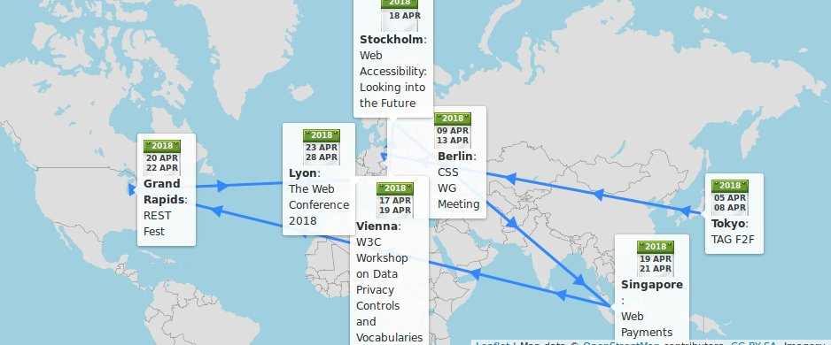
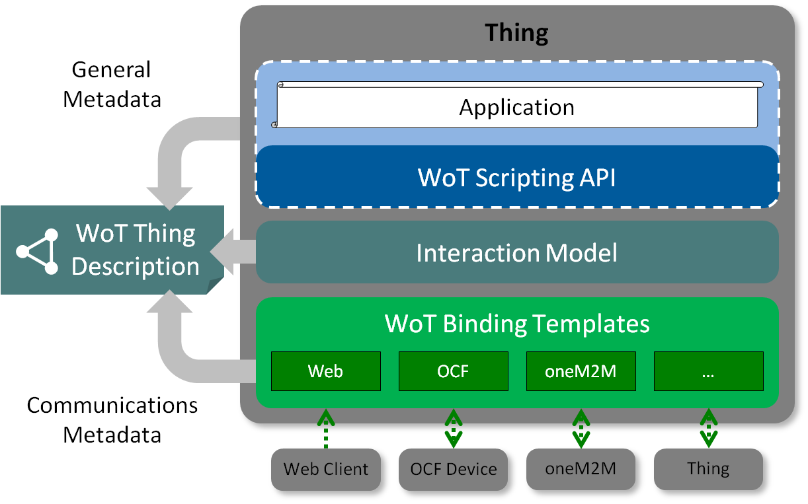
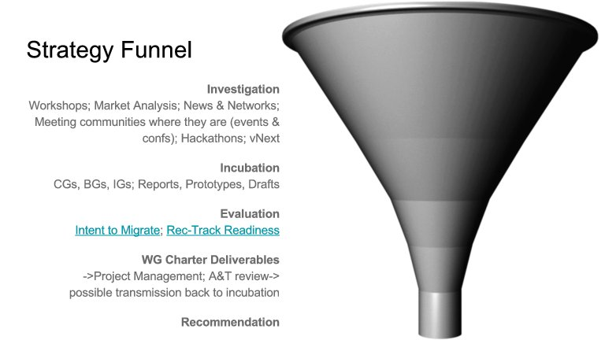
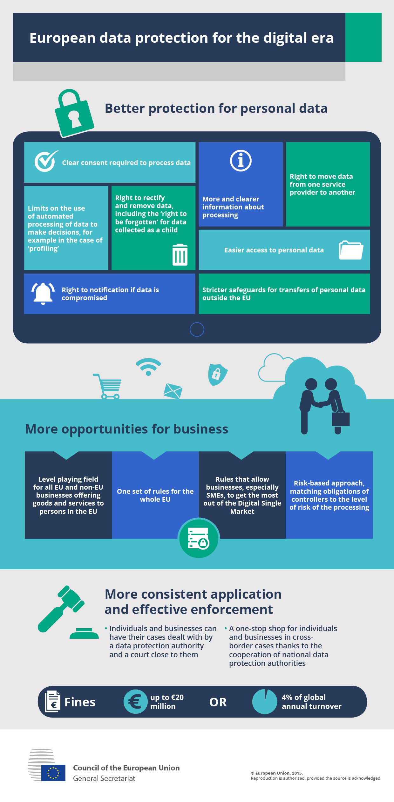
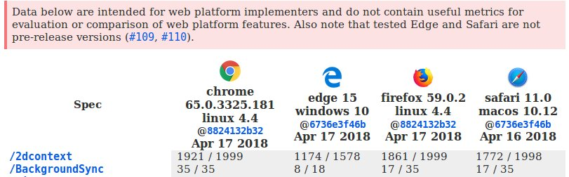
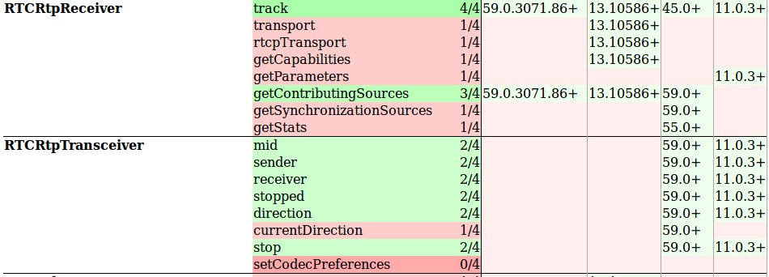

> 5\-7: @w3ctag \#f2fmeeting https://github\.com/w3ctag/meetings/tree/gh\-pages/2018/04\-tokyo hosted by @Keio\_univ\_PR in \#Tokyo
> April @w3c \-\- meetings, talks, workshop deadline, etc\.:   
> https://www\.w3\.org/participate/eventscal\.html 
> 
> 

 [Apr 03 2018, 11:45:27 UTC](https://twitter.com/w3cdevs/status/981135589322915841)

----

> 17\-18: in \#Vienna, @specialprivacy holds its \#W3Cworkshop on data \#privacy controls and vocabularies https://www\.w3\.org/2018/vocabws/

 [Apr 03 2018, 11:45:28 UTC](https://twitter.com/w3cdevs/status/981135593806618625)

----

> 13: new deadline to participate in the \#Web5G \#W3CWorkshop https://www\.w3\.org/2017/11/web5g\-workshop/\#position\-statements hosted by @GSMA \#London

 [Apr 03 2018, 11:45:28 UTC](https://twitter.com/w3cdevs/status/981135592292536320)

----

> 9\-12: @csswg \#f2fmeeting https://wiki\.csswg\.org/planning/berlin\-2018 hosted by @Monotype in \#Berlin

 [Apr 03 2018, 11:45:28 UTC](https://twitter.com/w3cdevs/status/981135590866538497)

----

> 19\-20: \#WebPayment work @w3payments \#f2fmeeting https://github\.com/w3c/webpayments/wiki/FTF\-April2018 in \#Singapore

 [Apr 03 2018, 11:45:29 UTC](https://twitter.com/w3cdevs/status/981135597145350144)

----

> 18: @sabouzah presents \#accessibility look into the future @FunkaNu \#Stockholm

 [Apr 03 2018, 11:45:29 UTC](https://twitter.com/w3cdevs/status/981135595186610176)

----

> 23\-27: @TheWebConf 2018 https://www2018\.thewebconf\.org/ \#Lyon

 [Apr 03 2018, 11:45:30 UTC](https://twitter.com/w3cdevs/status/981135600450490368)

----

> 20\-21: @restfest Midwest conference http://2018\.restfest\.org/midwest/ \#GrandRapids

 [Apr 03 2018, 11:45:30 UTC](https://twitter.com/w3cdevs/status/981135598881837056)

----

> Congrats to @kennethrohde, Web Platform architect @IntelSoftware for his election to the @w3ctag 👏 https://twitter\.com/w3c/status/981155636569309184
> This is the result of the election that was started a month ago \.\./2018/2018\-03\-tweets\.html\#x970750379108585472

 [Apr 03 2018, 13:20:55 UTC](https://twitter.com/w3cdevs/status/981159615013498880)

----

> He is also contributing to \#WebAssembly\. See his intro to \#WebAssembly presentation https://docs\.google\.com/presentation/d/12jZRC1mBDkgUtIyHYO0a7HNMmOqtoLstApCZwvN0GN8/edit at our @w3c developer meetup last November in \#SanFrancisco    https://www\.w3\.org/2017/11/Meetup/

 [Apr 03 2018, 13:20:57 UTC](https://twitter.com/w3cdevs/status/981159622454095872)

----

> He was one of the recent speakers at http://Chapters\.io on the topic of Generic Sensor API, exposing \#IoT to \#JavaScript  https://www\.meetup\.com/Pittsburgh\-Code\-Supply/events/246610327/

 [Apr 03 2018, 13:20:57 UTC](https://twitter.com/w3cdevs/status/981159620797456384)

----

> From exploration through incubation to formal standardization on the \#WebPlatform, Kenneth is a true Web lover\. Find out more about his intertwined story with the \#Web: https://medium\.com/@kennethrohde/w3c\-tag\-nomination\-introducing\-myself\-4ee5791757bd

 [Apr 03 2018, 13:20:58 UTC](https://twitter.com/w3cdevs/status/981159624593367040)

----

> A long list of meaty topics to fill the days of the @w3ctag meeting in \#Tokyo: packaging, lots of security and privacy related topics, lots of spec reviews\. Follow @hadleybeeman to hear from it live\! https://twitter\.com/hadleybeeman/status/981689384390053889

 [Apr 05 2018, 08:46:34 UTC](https://twitter.com/w3cdevs/status/981815346268200960)

----

> The Web of Things \(WoT\) Working Group develops models and vocabularies to bring interoperability to the \#IoT https://www\.w3\.org/WoT/WG/ https://twitter\.com/w3c/status/981820019892998144
> The Web of Things Architecture document explains the vision behind the approach: a machine readable description of a connected “Thing” encompasses the information needed to automatically interact with that thing\.  https://www\.w3\.org/TR/wot\-architecture/ https://github\.com/w3c/wot\-architecture 
> 
> 

 [Apr 05 2018, 13:40:08 UTC](https://twitter.com/w3cdevs/status/981889226705920000)

----

> The WoT Thing Description is the spec that defined the \#LinkedData model that anchors the information needed to interact with a Thing https://www\.w3\.org/TR/wot\-thing\-description/ https://github\.com/w3c/wot\-thing\-description

 [Apr 05 2018, 13:54:57 UTC](https://twitter.com/w3cdevs/status/981892955404455937)

----

> The WoT Protocol Binding Templates https://www\.w3\.org/TR/wot\-binding\-templates/ map these abstract interactions into their concrete protocols equivalent \(e\.g\. for MQTT, CoAP, HTTP\) \- head to https://github\.com/w3c/wot\-binding\-templates/ to contribute\!

 [Apr 05 2018, 13:54:58 UTC](https://twitter.com/w3cdevs/status/981892957426061313)

----

> While downloadable fonts are great, for some languages \(e\.g\. Chinese, Japanese, Korean\), downloading a complete font with 20K\+ glyphs is not a good idea, no matter how good \#WOFF compression has become \.\./2018/2018\-03\-tweets\.html\#x969602125499166721
> There is new work under consideration in the good\-looking world of Web \#fonts https://www\.w3\.org/Fonts/WG/webfonts\-2018\.html https://twitter\.com/w3c/status/981888973265162240

 [Apr 05 2018, 14:49:34 UTC](https://twitter.com/w3cdevs/status/981906700469981184)

----

> The proposed work on Progressive Font Enrichment would provide a standardized \#JavaScript API to enable to dynamically request font subsets, based on the several existing proprietary approaches to this problem\. @svgeesus is driving this work\.

 [Apr 05 2018, 14:49:35 UTC](https://twitter.com/w3cdevs/status/981906703783481346)

----

> \#CSS already has some facilities to condition the downloading of a font to the specific characters that are needed https://developer\.mozilla\.org/en\-US/docs/Web/CSS/%40font\-face/unicode\-range

 [Apr 05 2018, 14:49:35 UTC](https://twitter.com/w3cdevs/status/981906702323855360)

----

> \.@kennethrohde how do you feel about joining that gang now? https://twitter\.com/slightlylate/status/981777256719593472

 [Apr 05 2018, 16:10:24 UTC](https://twitter.com/w3cdevs/status/981927042584403968)

----

> The @w3c Strategy Funnel is a github project board where we keep track of potential new work to be considered for standardization, at different stage of advancement\. https://github\.com/w3c/strategy/projects/2 https://twitter\.com/hadleybeeman/status/982058942762283009
> With all the work happening in W3C Working Groups, Community Groups, Interest Groups and our surrounding community, this serves as a way to share what we see emerging, to compare notes on the work traction and to visualize what needs action\. https://www\.w3\.org/blog/2017/06/introducing\-the\-w3c\-strategy\-funnel/ 
> 
> 

 [Apr 06 2018, 12:25:17 UTC](https://twitter.com/w3cdevs/status/982232776920334339)

----

> This had been used mostly by the @w3c staff so far, but we're thrilled to see more people chiming in \(incl the @w3ctag\), and hope to hear from many more of you there\!

 [Apr 06 2018, 12:25:19 UTC](https://twitter.com/w3cdevs/status/982232784667209728)

----

> The name \#CSS Houdini refers to the black\-box magic 🧙‍♀️that CSS brings to the Web: browsers do lots of amazing work, but leave little for devs to intervene\. Houdini aims at “developing features that explain the «magic» of Styling and Layout on the web” https://github\.com/w3c/css\-houdini\-drafts/wiki 
> 
> 
> The @w3c @csswg face\-to\-face meeting in \#Berlin 🇩🇪 starts today with the CSS \#Houdini Task Force https://github\.com/w3c/css\-houdini\-drafts/wiki/Berlin\-F2F\-April\-2018 \.\./2018/2018\-04\-tweets\.html\#x981135590866538497
> This is what a @csswg meeting looks like https://mobile\.twitter\.com/cssrossen/status/984422232607862784

 [Apr 09 2018, 09:35:01 UTC](https://twitter.com/w3cdevs/status/983277092501671937)

----

> The concept of worklet we described a few weeks ago is one of the many exciting outcomes of this work \.\./2018/2018\-02\-tweets\.html\#x963073863759384576
> Want to learn more about \#CSS \#Houdini? Enjoy this interactive introduction to its major concepts https://twitter\.com/Snugug/status/1006358076176326656

 [Apr 09 2018, 09:35:03 UTC](https://twitter.com/w3cdevs/status/983277100638658561)

----

> In a nutshell, \#CSS Houdini will let you build polyfills for CSS and experiment with crafting new CSS properties or values ⚗️ \(which can then be fed into the standardization process, per the Extensible Web Manifesto https://github\.com/extensibleweb/manifesto \)

 [Apr 09 2018, 09:35:03 UTC](https://twitter.com/w3cdevs/status/983277098705063936)

----

> Opening up the CSS black box requires specifying and exposing to \#JavaScript a lot more of the \#CSS machinery\. Among other things, this includes a much improved and more strongly typed object model for CSS property values https://github\.com/w3c/css\-houdini\-drafts/tree/master/css\-typed\-om https://twitter\.com/ebidel/status/978353698299559936

 [Apr 09 2018, 09:35:04 UTC](https://twitter.com/w3cdevs/status/983277102551191552)

----

> While the Western hemisphere 🌎 was asleep 💤, the @csswg has been hard at work on \#CSS \#Houdini in \#Berlin 🇩🇪\. Time to catch up\! \#ICYMI \.\./2018/2018\-04\-tweets\.html\#x983277089892847616
> More \#Houdini goodness coming from \#Berlin @csswg https://twitter\.com/DasSurma/status/983650387755503616

 [Apr 09 2018, 15:47:40 UTC](https://twitter.com/w3cdevs/status/983370869186711553)

----

> Want a chance to give your input to @csswg? Here is a good opportunity \#CSS https://twitter\.com/LeaVerou/status/983991665319870465

 [Apr 11 2018, 08:56:29 UTC](https://twitter.com/w3cdevs/status/983992169097777152)

----

> Reminder about what \#CSS \#Houdini is \.\./2018/2018\-04\-tweets\.html\#x983277098705063936
> This \#CSS \#Houdini API enables developers to build their own layout processing and have it integrated in the browser CSS layout flow\. https://twitter\.com/svgeesus/status/984336421237469184

 [Apr 12 2018, 12:11:34 UTC](https://twitter.com/w3cdevs/status/984403651862126592)

----

> @csswg is that a known feature request? \(couldn't find an obvious match in https://github\.com/w3c/csswg\-drafts/issues?q\=is%3Aissue\+width\+label%3Acss\-flexbox\-1 https://twitter\.com/maddesigns/status/984539362447777792

 [Apr 13 2018, 05:51:31 UTC](https://twitter.com/w3cdevs/status/984670395797327873)

----

> The \#Web5G workshop will look at the challenges and opportunities for the application layers brought by the new network capabilities \.\./2018/2018\-02\-tweets\.html\#x966601930272333824
> Today is the very last day to register for the \#Web5G Workshop https://www\.w3\.org/2017/11/web5g\-workshop/ scheduled May 10\-11 in \#London 🇬🇧 \.\./2018/2018\-04\-tweets\.html\#x981135592292536320

 [Apr 13 2018, 12:14:47 UTC](https://twitter.com/w3cdevs/status/984766849144508416)

----

> As the old saying goes, @w3c \#CandidateRecommendation in March, billions of users in April \(now, can I get a piece of that chocolate cake? 🍰\) \.\./2018/2018\-03\-tweets\.html\#x976094070685798400 https://twitter\.com/anssik/status/984769474023841792

 [Apr 13 2018, 13:32:24 UTC](https://twitter.com/w3cdevs/status/984786381842141186)

----

> A little more than a month from now, on May 25\., The European 🇪🇺General Data Protection Regulation \#GDPR goes into effect https://en\.wikipedia\.org/wiki/General\_Data\_Protection\_Regulation 
> 
> 
> While this is a European regulation, it is meant to impact any service with users among European citizen &amp; residents, even if the provider is not European, and is thus expected to have broad impact on the Web\.  
>   
> 2 recent intersections of this regulation with the @w3c agenda

 [Apr 16 2018, 10:14:24 UTC](https://twitter.com/w3cdevs/status/985823715358400512)

----

> Article 21 of the regulation identifies the right of data subjects to “object by automated means using technical specifications” https://gdpr\-info\.eu/art\-21\-gdpr/ which \#DoNoTrack could help with \- the Tracking Protection Working Group will want to validate that it indeed does
> yesterday, @incloud, Invited Expert in the Tracking Protection group, shared his thoughts on the intersections of \#DoNotTrack and \#GDPR in the @w3c blog https://www\.w3\.org/blog/2018/06/do\-not\-track\-and\-the\-gdpr/ https://twitter\.com/w3c/status/1006204644455075840

 [Apr 16 2018, 10:14:25 UTC](https://twitter.com/w3cdevs/status/985823722606157824)

----

> Last week, the Tracking Protection Working Group charter was extended for 6 more months with the explicit goal of exploring the intersection of the \#DoNoTrack \#HTTP header developed by that group and the \#GDPR  
> https://lists\.w3\.org/Archives/Public/public\-tracking/2018Apr/0002\.html

 [Apr 16 2018, 10:14:25 UTC](https://twitter.com/w3cdevs/status/985823720693477376)

----

> \#Privacy is obviously a key topic for the present and the future of the Web, there are still lot of things to figure out when it comes to keep the Web a trustable platform\. Some of these questions are explored in our Strategy Funnel https://github\.com/w3c/strategy/labels/Privacy \.\./2018/2018\-04\-tweets\.html\#x982232776920334339

 [Apr 16 2018, 10:14:26 UTC](https://twitter.com/w3cdevs/status/985823726666174464)

----

> The second intersection will be investigated starting tomorrow at the @w3c Workshop on data \#privacy controls and vocabularies, via the @specialprivacy project \.\./2018/2018\-04\-tweets\.html\#x981135593806618625

 [Apr 16 2018, 10:14:26 UTC](https://twitter.com/w3cdevs/status/985823724216647680)

----

> \#Vienna 🇦🇹 is hosting today and tomorrow a @w3c workshop on \#Privacy and \#LinkedData \- \#dataprivacy18 is where the action is happening https://twitter\.com/specialprivacy/status/986219041772789760
> See also how \#GDPR and \#privacy in general intersects with recent @w3c work \.\./2018/2018\-04\-tweets\.html\#x985823715358400512

 [Apr 17 2018, 12:57:55 UTC](https://twitter.com/w3cdevs/status/986227256241606656)

----

> If you're in the Silicon Valley this week, don't miss @samsunginternet 's Create conference for Web developers on Thursday and Friday \- we hear there are still a few seats available with an amazing speakers line\-up from allover the @w3c community \.\./2018/2018\-03\-tweets\.html\#x974337057874100224
> Also, all the revenue generated from ticket sales go to @WomenWhoCode and @Code2040

 [Apr 17 2018, 16:30:05 UTC](https://twitter.com/w3cdevs/status/986280650142609408)

----

> All the features that are defined in @w3c specifications to be shipped in browsers are accompanied by a test suite, to help assess how well and how broadly they are implemented by actual browsers\.
> The test cases that compose these test suites are Web pages that trigger the said feature in isolation and which can report whether the browser running or displaying the page supports the features correctly\.

 [Apr 17 2018, 16:41:04 UTC](https://twitter.com/w3cdevs/status/986283413316472837)

----

> The results of running these test suites are updated on a regular basis on the Web Platform Tests Dashboard https://wpt\.fyi/ 
> 
> 

 [Apr 17 2018, 16:41:05 UTC](https://twitter.com/w3cdevs/status/986283418014109702)

----

> All these test suites are managed in a central github repository https://github\.com/w3c/web\-platform\-tests/ \- by far the most active and popular repo for the @w3c organization\.

 [Apr 17 2018, 16:41:06 UTC](https://twitter.com/w3cdevs/status/986283421847695361)

----

> If you have specific requirements with regard to this transition, please join the thread on the mailing list https://lists\.w3\.org/Archives/Public/public\-test\-infra/2018AprJun/thread\.html\#msg0

 [Apr 17 2018, 16:41:07 UTC](https://twitter.com/w3cdevs/status/986283425899393024)

----

> ⚠️PSA: If you use or contribute to these test suites, please note that there is ongoing work toward migrating this repository \(and other associated repositories\) to a new github organization https://lists\.w3\.org/Archives/Public/public\-test\-infra/2018AprJun/0011\.html https://github\.com/web\-platform\-tests

 [Apr 17 2018, 16:41:07 UTC](https://twitter.com/w3cdevs/status/986283423584129024)

----

> More details on this transition by @plhw3org on the @w3c blog https://www\.w3\.org/blog/2018/04/a\-short\-update\-on\-the\-web\-platform\-test\-project\-invitation/ https://twitter\.com/w3c/status/986290341643943937

 [Apr 17 2018, 17:18:30 UTC](https://twitter.com/w3cdevs/status/986292834813796353)

----

> \.@parisweb is one of the main Web technical conference in France 🇫🇷\- one of the fathers of \#CSS, @w3c 's Bert Bos, will animate a workshop there to talk about how @w3c \*uses\* CSS \(and more broadly our ongoing design work\) https://www\.paris\-web\.fr/ https://twitter\.com/coulissespw/status/986592684843421696

 [Apr 18 2018, 13:26:55 UTC](https://twitter.com/w3cdevs/status/986596939054637057)

----

> \#TTML brought @w3c an Emmy award 🏆 from @theEmmys 2 years ago \- can the Timed Text Working Group top its own bar in its next charter? \.\./2018/2018\-03\-tweets\.html\#x973618299199160320
> The Timed Text Working Group develops both \#TTML and \#WebVTT, two formats used to format captions for on\-line media\. The proposed new charter is to enable continuation of that work for 2 more years https://www\.w3\.org/2018/04/proposed\-tt\-charter\-2018\.html https://twitter\.com/w3c/status/986892990206611456

 [Apr 19 2018, 12:17:33 UTC](https://twitter.com/w3cdevs/status/986941872676352000)

----

> If you're interested in both helping the @csswg \(and the Web in general\) and learning from an expert in the process, this is a golden opportunity\! https://twitter\.com/gregwhitworth/status/987009033499435008

 [Apr 19 2018, 17:12:27 UTC](https://twitter.com/w3cdevs/status/987016086909530113)

----

> This is a proposal for a brand new Working Group, to develop work in a brand new area for @w3c\. Distributed Tracing is to help manage systems deployed in distributed environments \(e\.g\. in \#serverless approaches\) https://www\.w3\.org/2018/04/distributed\-tracing\-wg\-charter\.html https://twitter\.com/w3c/status/986988842925350912
> This follows the pre\-standardization work conducted in the Distributed Trace Context Community Group https://www\.w3\.org/community/trace\-context/  
>   
> They're proposing a set of HTTP headers to facilitate tracing across heterogeneous environments https://w3c\.github\.io/distributed\-tracing/report\-trace\-context\.html

 [Apr 19 2018, 17:27:18 UTC](https://twitter.com/w3cdevs/status/987019824051212288)

----

> Yesterday and today, the @w3payments Working Group is meeting in \#Singapore 🇸🇬\.  
> \.\./2018/2018\-04\-tweets\.html\#x981135597145350144
> The @w3payments Working Group is working on a pretty full agenda, with a particular focus on the \#Payment Request API, Payment Handlers and Security\.  https://github\.com/w3c/webpayments/wiki/FTF\-April2018

 [Apr 20 2018, 12:25:12 UTC](https://twitter.com/w3cdevs/status/987306185564086272)

----

> Payment Handler is about enabling Web\-based \#payment instruments based on \#ServiceWorker \.\./2018/2018\-02\-tweets\.html\#x961630489646903296

 [Apr 20 2018, 12:25:13 UTC](https://twitter.com/w3cdevs/status/987306191134117889)

----

> A few reminders: the \#JavaScript \#Payment Request API is about streamlined checkout 🛒\.\./2018/2018\-01\-tweets\.html\#x956510872108707840

 [Apr 20 2018, 12:25:13 UTC](https://twitter.com/w3cdevs/status/987306189192159233)

----

> On the authentication front, one topic the group is exploring is how to incorporate all the recent announcements in this space

 [Apr 20 2018, 12:25:14 UTC](https://twitter.com/w3cdevs/status/987306195307376640)

----

> and security\-related topics include tokenization to avoid sharing credit card numbers, and authentication to reduce fraud risks \(and liability costs\!\) \.\./2018/2018\-01\-tweets\.html\#x956510890081374209 \.\./2018/2018\-01\-tweets\.html\#x956510891880730625

 [Apr 20 2018, 12:25:14 UTC](https://twitter.com/w3cdevs/status/987306193478651909)

----

> 3DS is the credit card industry \(\#EMVCo\) approach to authentication \- its version 2 focused on a streamlined UX, using fingerprinting techniques to restrict 2\-factor auth to ambiguous cases\. Can the Web provide a more robust integration? https://www\.w3\.org/2018/Talks/web\-payment\-and\-3ds2\.pdf

 [Apr 20 2018, 12:25:15 UTC](https://twitter.com/w3cdevs/status/987306198495055872)

----

> \#WebAuthn is set to completely change how we authenticate on the Web \- but will the UX match the needs identified by merchants to reduce cart abandonment? http://lists\.w3\.org/Archives/Public/public\-web\-security/2018Mar/0002\.html \.\./2018/2018\-03\-tweets\.html\#x976111114739175426

 [Apr 20 2018, 12:25:15 UTC](https://twitter.com/w3cdevs/status/987306196708274176)

----

> No wonder they'll need constant infusion of sugar to figure it all out https://twitter\.com/marcosc/status/987017411332194309

 [Apr 20 2018, 12:25:16 UTC](https://twitter.com/w3cdevs/status/987306202110529537)

----

> \#EMVCo has recently announced a new systemic approach to handling credit\-card payments for \#ecommerce, \#SecureRemoteCommerce \(SRC\) https://newsroom\.mastercard\.com/2018/04/18/drive\-to\-a\-better\-online\-checkout\-experience\-starts\-today/ \- how will that impact the @w3payments work?

 [Apr 20 2018, 12:25:16 UTC](https://twitter.com/w3cdevs/status/987306200290283520)

----

> The full program of @ParisWeb has now been released \- in addition to Bert's workshop on @w3c design, @r12a will give a talk on Making the World Wide Web world wide \#I18N, and @dontcallmeDOM on our @w3cdevs efforts https://www\.paris\-web\.fr/2018/recherche/w3c \.\./2018/2018\-04\-tweets\.html\#x986596939054637057
> You'll also get @glazou \(active participant and former chair of @csswg\), @yoavweiss \(active participant of the Web Performance WG\) and @w3c alumni Karl Dubost\. Mark your calendar for Oct 4\-6 2018 in \#Paris\!

 [Apr 23 2018, 12:32:58 UTC](https://twitter.com/w3cdevs/status/988395304872538112)

----

> Wow\! A brilliant illustration of the kind of innovation \#CSS \#houdini is expected to open up \.\./2018/2018\-04\-tweets\.html\#x984403649425215488 https://twitter\.com/SaraSoueidan/status/988430742953873410

 [Apr 23 2018, 14:59:03 UTC](https://twitter.com/w3cdevs/status/988432064570626049)

----

> Congratulations to @palemieux and the TTML Working Group for bringing this update to the existing IMSC Recommendation\! https://www\.w3\.org/TR/2018/REC\-ttml\-imsc1\.0\.1\-20180424/  
>   
> IMSC 1\.0\.1 updates and replaces IMSC 1\.0, published 2 years ago \(almost to the day\!\), providing profiles of \#TTML for online media https://twitter\.com/w3c/status/988740216990175232
> \#TTML 1 itself is going through another revision, updating its latest Recommendation published back in 2013 https://twitter\.com/w3c/status/988740213492023296

 [Apr 24 2018, 11:44:44 UTC](https://twitter.com/w3cdevs/status/988745554200092672)

----

> The \#TTML Working Group has more work on its plate, as described in its proposed next charter \.\./2018/2018\-04\-tweets\.html\#x986941870512144384

 [Apr 24 2018, 11:44:45 UTC](https://twitter.com/w3cdevs/status/988745558079746048)

----

> “It was fascinating to see how those decisions were arrived at, and to be able to make a modest contribution to some of them along the way \(as anyone can do actually – more on that later\)\.”
> Recall the @csswg meeting in Berlin a couple of weeks ago? \.\./2018/2018\-04\-tweets\.html\#x983277089892847616 See it through the eyes of an experienced designer, newcomer to standardization\. https://twitter\.com/clagnut/status/988329265128144896

 [Apr 24 2018, 12:43:19 UTC](https://twitter.com/w3cdevs/status/988760297774120960)

----

> Head to https://github\.com/w3c/csswg\-drafts/issues if you want to follow @clagnut's advices and “quietly and respectfully do join in the conversation”

 [Apr 24 2018, 12:43:20 UTC](https://twitter.com/w3cdevs/status/988760300626292736)

----

> “One of the best ways any of us can do so is to contribute to the discussions on the W3C’s CSS WG Github issues”  
>   
> “It was clear to me that all comments from web designers and developers are welcome and form part of the debate leading to better CSS standards”

 [Apr 24 2018, 12:43:20 UTC](https://twitter.com/w3cdevs/status/988760299225468930)

----

> The group which is defining the \#WebRTC \#JavaScript APIs is proposing a new charter to map its work for the next couple of years\. https://www\.w3\.org/2018/04/webrtc\-charter\.html  
>   
> \#WebRTC enables audio\-video communication and \#P2P data in browsers\. https://twitter\.com/w3c/status/988771353288421376
> “The highest priority of the group in this charter period will be to get  the core recommendations progressed towards Recommendation status”

 [Apr 24 2018, 14:34:04 UTC](https://twitter.com/w3cdevs/status/988788167615623168)

----

> This means in particular finishing the \#WebRTC 1\.0 APIs, incl 99 open  issues https://github\.com/w3c/webrtc\-pc/issues and getting more implementation convergence https://dontcallmedom\.github\.io/webrtc\-impl\-tracker/?webrtc 
> 
> 

 [Apr 24 2018, 14:34:05 UTC](https://twitter.com/w3cdevs/status/988788171977748482)

----

> But this also includes new work on extensions to WebRTC 1\.0, to cover new use cases, possibly new protocols for data transfer \(\#QUIC?\), new modes of operations \(in workers? service workers?\), and less SDP \.\./2018/2018\-02\-tweets\.html\#x959021817355816960

 [Apr 24 2018, 14:34:06 UTC](https://twitter.com/w3cdevs/status/988788174632767489)

----

> The @w3c XQuery  Working Group was first chartered in September 1999 \(then as XML Query\) \- over nearly 19 years, produced 39 technical reports, including 21 \(\!\) W3C Recommendations, i\.e\. 5% of all W3C Recommendations\. https://www\.w3\.org/XML/Query/\#specs  
>   
> Hats 🎩👒off\! 🙏 https://twitter\.com/michaelhkay/status/988809939392061441

 [Apr 25 2018, 13:18:42 UTC](https://twitter.com/w3cdevs/status/989131589840986112)

----

> Yay\! Remember, deploying your services over \#IPv6 is key to an inclusive internet https://www\.icann\.org/news/blog/ipv6\-the\-future\-is\-now\-more\-than\-ever https://twitter\.com/wz43rtx/status/989134443830038529

 [Apr 25 2018, 15:02:19 UTC](https://twitter.com/w3cdevs/status/989157662548951047)