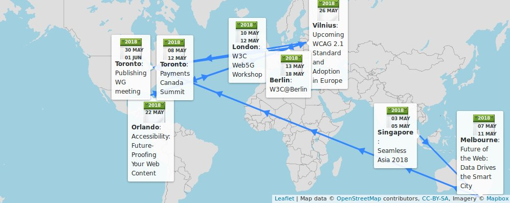
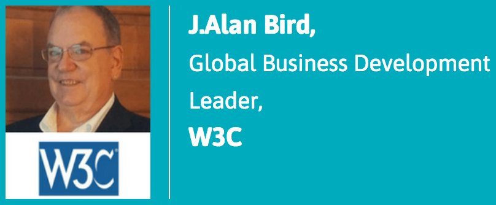
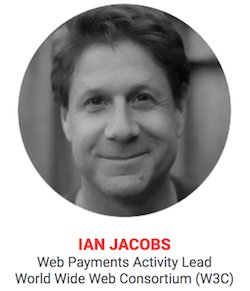
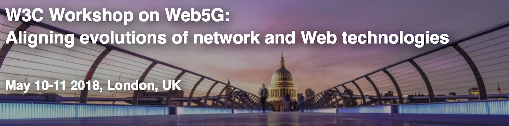
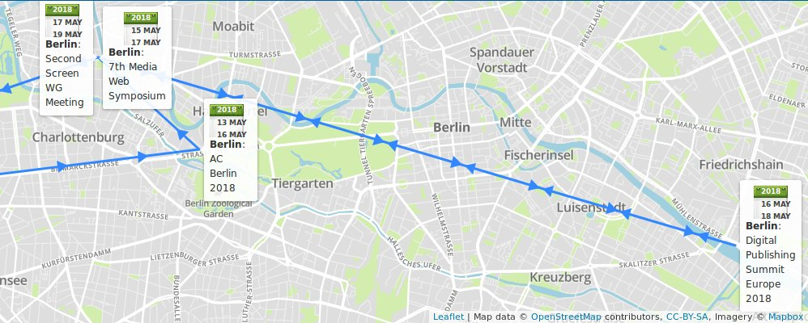
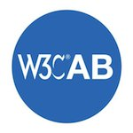
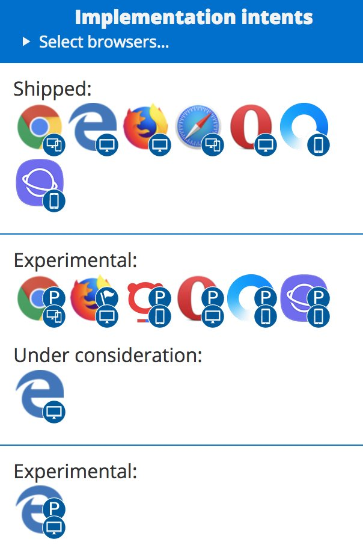
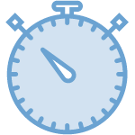
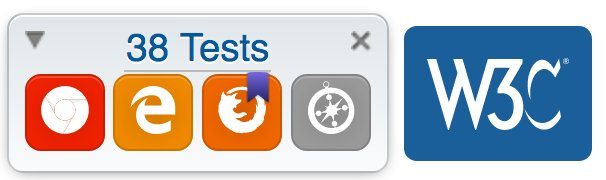
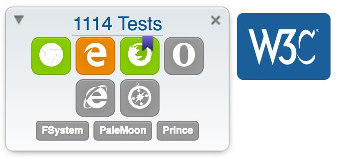

> May@w3c: meetings, talks, workshop, events, etc\. https://www\.w3\.org/participate/eventscal\.html 
> 
> 
> 3\-4: @w3c is present at @seamlessasia 2018 \#Singapore \(w/ keynote panel session, booth, talk, etc\.\) http://www\.terrapinn\.com/exhibition/seamless/ cc @JAlanBird 
> 
> 
> 
> 

 [May 01 2018, 16:31:45 UTC](https://twitter.com/w3cdevs/status/991354499984916480)

----

> 7\-10: Future of the \#Web events series in \#Melbourne \#Canberra and \#Sydney organized by @ourANU @W3CAustralia http://www\.anu\.edu\.au/events/w3c\-anu\-future\-of\-the\-web\-data\-drives\-the\-smart\-city 
> 
> 

 [May 01 2018, 16:31:47 UTC](https://twitter.com/w3cdevs/status/991354506461016065)

----

> 8\-11: The \#Payments Canada Summit https://www\.thesummit\.ca/ in \#Toronto cc @ibjacobs 
> 
> 
> 
> 

 [May 01 2018, 16:31:48 UTC](https://twitter.com/w3cdevs/status/991354509686460417)

----

> 10\-11: \#W3CWorkshop on \#Web5G: Aligning evolutions of network and \#Web technologies https://www\.w3\.org/2017/11/web5g\-workshop/, hosted by @GSMA \#London 
> 
> 

 [May 01 2018, 16:31:49 UTC](https://twitter.com/w3cdevs/status/991354513817833472)

----

> \.\.\. and \#Berlin 🇩🇪 hosts a plethora of @w3c meetings and events this month: 
> 
> 

 [May 01 2018, 16:31:50 UTC](https://twitter.com/w3cdevs/status/991354520008523778)

----

> 30\-31: @w3cpublishing's \#WorkingGroup \#f2fmeeting hosted by @Rakuten\_Kobo in \#Toronto

 [May 01 2018, 16:31:50 UTC](https://twitter.com/w3cdevs/status/991354517479395328)

----

> 15\-16: \#FOKUSMWS 7th Media Web Symposium https://www\.fokus\.fraunhofer\.de/go/mws organized by @fraunhoferfokus https://twitter\.com/stepsteg/status/988785623912894464

 [May 01 2018, 16:31:51 UTC](https://twitter.com/w3cdevs/status/991354525142405122)

----

> 13\-15: @w3c's member meeting, hosted by @ercim\_news with the support of @w3c\_de and sponsored by @Siemens

 [May 01 2018, 16:31:51 UTC](https://twitter.com/w3cdevs/status/991354522567102464)

----

> 16\-17: @w3cpublishing's Digital Publishing Europe 2018 event https://www\.edrlab\.org/dpub\-summit\-2018/ organized by @EDRLab\_EPUB 
> 
> 

 [May 01 2018, 16:31:52 UTC](https://twitter.com/w3cdevs/status/991354527717699584)

----

> 17\-18: Open Screen Protocol discussions https://github\.com/webscreens/openscreenprotocol at the Second Screen \#WorkingGroup \#f2fmeeting hosted by @fraunhoferfokus https://www\.w3\.org/wiki/Second\_Screen/Meetings/May\_2018\_F2F 
> 
> 

 [May 01 2018, 16:31:53 UTC](https://twitter.com/w3cdevs/status/991354530527883264)

----

> Today opens the voting period for five W3C Advisory Board seats\. The @w3c membership elects the @W3CAB members\. The deadline for votes is 30 May 2018 and the results will be announced during the first week of June\.

 [May 02 2018, 17:38:53 UTC](https://twitter.com/w3cdevs/status/991733779755618306)

----

> Seven people have been nominated: @t \(@Mozilla\), Jay \(Junichi\) Kishigami \(@NTTPR\), @frivoal \(\#W3CInvitedExpert\), @TzviyaSiegman \(@WileyGlobal\), @daithesong \(@Apple\), @tink \(@paciellogroup\), @cwilso \(@Google\)\. Check out their nomination statements: https://www\.w3\.org/2018/05/02\-ab\-nominations

 [May 02 2018, 17:39:12 UTC](https://twitter.com/w3cdevs/status/991733860747698177)

----

> Created in 1998 \(four years after \#w3c got started\), @W3CAB provides ongoing guidance to the @W3C team on issues of strategy, management, legal matters, process, and conflict resolution\. It serves its members by tracking and handling issues raised in member meetings\.

 [May 02 2018, 17:39:13 UTC](https://twitter.com/w3cdevs/status/991733865566830594)

----

> So now, you may find yourself wondering what the @W3CAB is\. https://www\.w3\.org/2002/ab/ 
> 
> 

 [May 02 2018, 17:39:13 UTC](https://twitter.com/w3cdevs/status/991733862685437953)

----

> The latest edition of the Process Document was released on 1 February\.  
> \.\./2018/2018\-02\-tweets\.html\#x959076749291196416  
> Contributions to the editor’s draft are always welcome\! Post them in this repo: https://github\.com/w3c/w3process

 [May 02 2018, 17:39:14 UTC](https://twitter.com/w3cdevs/status/991733869819977728)

----

> The Advisory Board also manages the Process Document's evolution where the organizational structure of W3C, its activities, responsibilities and functions are described: https://www\.w3\.org/2018/Process\-20180201/

 [May 02 2018, 17:39:14 UTC](https://twitter.com/w3cdevs/status/991733868461023232)

----

> It is currently composed of @W3C members: @chaals @t @cwilso Judy Zhu @LeonieWatson @daithesong @mc2hampion Jay Kishigami @thisNatasha, and chaired by @w3c's CEO @jeff\_jaffe, and staffed by @wseltzer

 [May 02 2018, 17:39:14 UTC](https://twitter.com/w3cdevs/status/991733866997125121)

----

> The @W3CAB's 2018 priorities are \#Globalization, \#Diversity,  Living \#standards, @WHATWG relationship, Funding, etc\. Check them out\! https://www\.w3\.org/wiki/AB/2018\_Priorities

 [May 02 2018, 17:39:15 UTC](https://twitter.com/w3cdevs/status/991733871560585221)

----

> \#Awesome new feature\!\! the \#MobileWebApps roadmap now displays \#implementation status in mobile browsers\! Is the feature supported in \#Chrome for \#Android? Safari for \#IOS? \#SamsungInternet? Does it need a prefix? Is it behind a flag? See an example of shipped vs experimental: 
> 
> 
> New edition of the \#MobileWebApps roadmap has been published\! Check out how @w3c \#Web technologies increase the capabilities of mobile Web applications: https://www\.w3\.org/2018/04/web\-roadmaps/mobile/ \#April2018 @W3CChina https://twitter\.com/w3c/status/992319461502865408

 [May 07 2018, 13:37:18 UTC](https://twitter.com/w3cdevs/status/993484925256060928)

----

> Did you know that you can listen to touch and wheel events without affecting scrolling performance ? Check out the description of the "passive" event listener option: https://www\.w3\.org/2018/04/web\-roadmaps/mobile/performance\.html \#WebPerf 
> 
> 

 [May 07 2018, 13:37:19 UTC](https://twitter.com/w3cdevs/status/993484929181896704)

----

> \#MediaQueries let \#WebDevs adjust the layout of a component relative to the viewport size\. Feels too restrictive for fully \#ResponsiveLayout? Element Queries proposes a mechanism to adjust the layout relative to the size of a containing element instead: https://www\.w3\.org/2018/04/web\-roadmaps/mobile/adaptation\.html 
> 
> 

 [May 07 2018, 13:37:19 UTC](https://twitter.com/w3cdevs/status/993484927344762880)

----

> Some of the new success criteria in \#WCAG21 have a specific resonance in mobile contexts\. Learn about Pointer Gestures, Target Size and Orientation in the W3C Mobile roadmap: https://www\.w3\.org/2018/04/web\-roadmaps/mobile/userinput\.html\#well\-deployed\-technologies @w3c\_wai \#a11y 
> 
> 

 [May 07 2018, 13:37:20 UTC](https://twitter.com/w3cdevs/status/993484931115442176)

----

> 28: a \[Chapters Web Standards\] meetup on \#CSSDB \- Keeping up with \#CSS by @jon\_neal https://www\.meetup\.com/login/?returnUri\=https%3A%2F%2Fwww\.meetup\.com%2Fpittsburgh\-code\-supply%2Fevents%2F250453055%2F cc @briankardell \#Pittsburgh

 [May 10 2018, 15:52:14 UTC](https://twitter.com/w3cdevs/status/994606045837299713)

----

> For compatibility with existing mouse based content, this specification describes a mapping to fire \#MouseEvents for other pointer device types\.
> An update of the Pointer events \#WebStandard, Pointer Events Level 2 addresses the need of diverse forms of pointing input devices \(stylus/touchscreen/pen/etc\.\), in addition to the mouse\. https://www\.w3\.org/TR/2018/CR\-pointerevents2\-20180510/ \#timetoimplement https://twitter\.com/w3c/status/994794789513170956

 [May 11 2018, 06:34:51 UTC](https://twitter.com/w3cdevs/status/994828163002896385)

----

> The group provides tests that can be run manually from http://w3c\-test\.org/pointerevents/ in an effort to enable wider \#browser adoption, and invites feedback and implementations at https://github\.com/w3c/pointerevents/

 [May 11 2018, 06:34:52 UTC](https://twitter.com/w3cdevs/status/994828165255180288)

----

> \#WebVTT has reached  \#CandidateRecommendation status  https://www\.w3\.org/TR/2018/CR\-webvtt1\-20180510/ and the group invites  feedback: https://github\.com/w3c/webvtt \#timetoimplement
> Easy captioning or subtitling \#HTML5 video content is made possible by  \#WebVTT, using the &lt;track&gt; element, also helpful to deliver chapters and text video descriptions\. https://twitter\.com/w3c/status/994794791073452035

 [May 11 2018, 06:44:34 UTC](https://twitter.com/w3cdevs/status/994830607355084800)

----

> Learn how to code \#WebVTT by following @thew3cx's \#HTML5 Coding Essentials \#MOOC https://www\.edx\.org/course/html5\-coding\-essentials\-w3cx\-html5\-1x\-2

 [May 11 2018, 06:44:35 UTC](https://twitter.com/w3cdevs/status/994830609494298624)

----

> And if you want to get involved in @w3c\_wai work, head over to https://www\.w3\.org/WAI/about/participating/ https://twitter\.com/sabouzah/status/997067244445360128
> \.@w3c\_wai Education &amp; Outreach Working Group at work\! https://twitter\.com/knowbility/status/997143151142948865

 [May 17 2018, 15:12:53 UTC](https://twitter.com/w3cdevs/status/997132858065072128)

----

> With \#WebAuthn API 🔑 getting deployed in shipping browsers, now is a good time to learn about it, and as importantly, to help shape its developer documentation ⬇️ https://twitter\.com/apowers313/status/997340049380278272

 [May 18 2018, 07:03:09 UTC](https://twitter.com/w3cdevs/status/997371997620506624)

----

> A \#VR/\#AR/\#MR/\#XR Meetup in Marseilles 🇫🇷 on June 5, with tasty chunks of \#WebXR inside, courtesy of @dontcallmeDOM https://twitter\.com/dontcallmeDOM/status/998861588735168513

 [May 22 2018, 09:55:38 UTC](https://twitter.com/w3cdevs/status/998864957927313410)

----

> You can provide test data for its test suite: https://test\.csswg\.org/harness/test/css\-contain\-1\_dev/ and/or review the 38 current test cases:  http://test\.csswg\.org/harness/review/css\-contain\-1\_dev 
> 
> 
> The CSS contain property lets \#developers optimize different Web page components' performance, for more efficient rendering/painting \#timetoimplement https://twitter\.com/w3c/status/999556410684911616

 [May 24 2018, 13:46:18 UTC](https://twitter.com/w3cdevs/status/999647782955900930)

----

> Check out the current browser support: https://caniuse\.com/\#feat\=css\-containment

 [May 24 2018, 14:37:31 UTC](https://twitter.com/w3cdevs/status/999660671519379456)

----

> More info on how to send feedback by @frivoal: https://www\.w3\.org/blog/CSS/2018/05/24/updated\-cr\-of\-the\-css\-containment\-module\-level\-1/

 [May 28 2018, 09:53:43 UTC](https://twitter.com/w3cdevs/status/1001038802448736256)

----

> These specifications define \#CSS support for \#i18n writing modes: left\-to\-right \(e\.g\. Latin or Indic\), right\-to\-left \(e\.g\. Hebrew or Arabic\), bidirectional \(e\.g\. mixed Latin and Arabic\) and vertical \(e\.g\. Asian scripts\) \#Unicode \#timetoimplement https://twitter\.com/w3c/status/999797988355649536
> Level 4 is identical to Level 3 modulo 1\) adding postponed features such as  sideways\-lr that helps write alphabetical text vertically, and 2\) changing the \#BoxModel interaction with \#bidi\. See all changes: https://www\.w3\.org/TR/2018/CR\-css\-writing\-modes\-4\-20180524/\#additions

 [May 28 2018, 14:38:28 UTC](https://twitter.com/w3cdevs/status/1001110462879158272)

----

> Check out the relevant @csswg test suite that contains 1114 tests\! https://test\.csswg\.org/harness/test/css\-writing\-modes\-3\_dev/ 
> 
> 

 [May 28 2018, 14:38:29 UTC](https://twitter.com/w3cdevs/status/1001110467157295105)