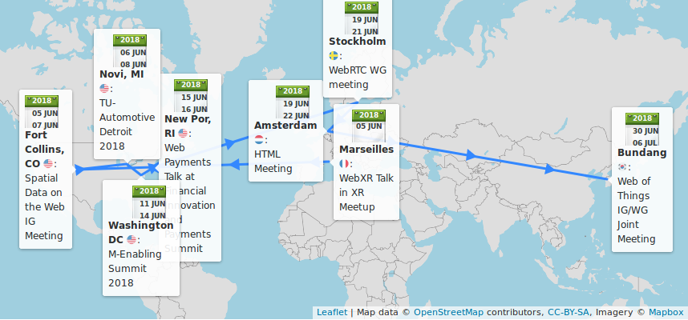
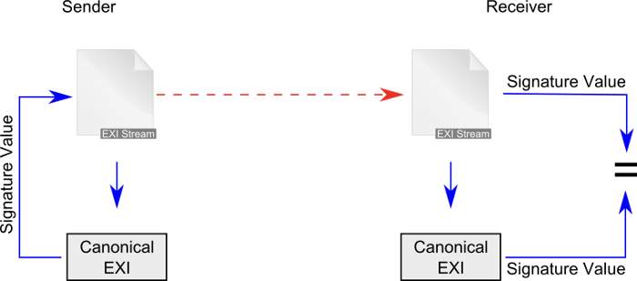
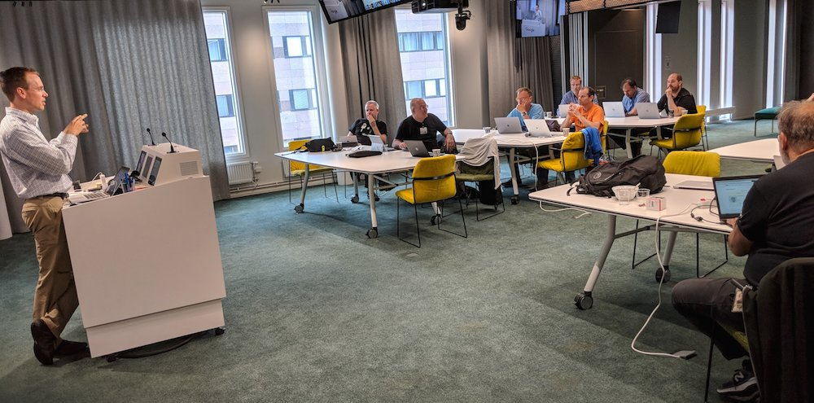
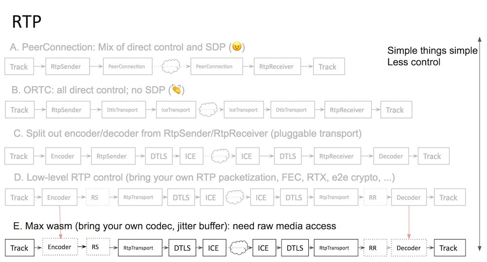

> Results are in\!\! Congrats to @W3CAB elected members: Jay \(Junichi\) Kishigami \(@NTTPR\), @frivoal \(\#W3CInvitedExpert\), @TzviyaSiegman \(@WileyGlobal\), @daithesong \(@Apple\) and @LeonieWatson \(@paciellogroup\) \.\./2018/2018\-05\-tweets\.html\#x991733860747698177

 [Jun 01 2018, 12:06:48 UTC](https://twitter.com/w3cdevs/status/1002521847014010880)

----

> June@W3C: business shows, face\-to\-face meetings, conferences, meetup, etc\. https://www\.w3\.org/participate/eventscal\.html 
> 
> 
> 5: \#WebXR talk by @dontcallmeDOM @WideWebVR's  \#AR &amp; \#VR meetup in \#Marseille 🇫🇷 https://www\.meetup\.com/fr\-FR/Meetup\-Realite\-augmentee\-Marseille/ \#AugmentedReality \#VirtualReality \#MixedReality 
> 
> 

 [Jun 01 2018, 14:37:29 UTC](https://twitter.com/w3cdevs/status/1002559766529495040)

----

> 5\-6: @w3c Spatial Data on the Web \#InterestGroup \#f2fmeeting     https://www\.w3\.org/2017/sdwig/meetings/f2f\-2\.html in \#FortCollins CO 🇺🇸 co\-located with \#OGC18FC @opengeospatial

 [Jun 01 2018, 14:37:30 UTC](https://twitter.com/w3cdevs/status/1002559770954489856)

----

> 14\-15: @cssdayconf 2018 w/ a \#UX special day\. Speakers include @csswg participants' @meyerweb and @gregwhitworth https://cssday\.nl/2018 in \#Amsterdam 🇳🇱 
> 
> 
> 12: @sabouzah of @w3c\_wai is a panelist @MyEDF's workshop related to implementation and coherence of \#a11y \#accessibility standards on a global scale https://www\.edf\-feph\.org/events/12\-june\-side\-event\-cosp\-international\-developments\-toward\-accessibility\-standards\-coherence in \#NYC 🇺🇸 \(@UN\)

 [Jun 01 2018, 14:37:31 UTC](https://twitter.com/w3cdevs/status/1002559775429812224)

----

> 11\-13: @w3c's CEO @jeff\_jaffe and @w3c\_wai's Judy Brewer keynote at Promoting accessible technologies and environments @mEnablingSummit in \#WashingtonDC 🇺🇸 http://www\.m\-enabling\.com/agenda\.html\#tuesday \#WCAG21

 [Jun 01 2018, 14:37:31 UTC](https://twitter.com/w3cdevs/status/1002559774058336258)

----

> 6\-7: Meet @w3c staff @ConnectorKaren and @tguild @TUAutomotive in \#Novi MI 🇺🇸 for the \#ConnectedCar \#WebAuto conference TU\-AUtomotive Detroit https://automotive\.knect365\.com/tu\-auto\-detroit/

 [Jun 01 2018, 14:37:31 UTC](https://twitter.com/w3cdevs/status/1002559772342804481)

----

> 19\-20: \#WebRTC \#WorkingGroup \#f2fMeeting in \#Stockholm 🇸🇪 hosted by @Google https://www\.w3\.org/2011/04/webrtc/wiki/June\_19\-20\_2018 
> 
> 

 [Jun 01 2018, 14:37:32 UTC](https://twitter.com/w3cdevs/status/1002559779884208129)

----

> 18\-20: \#WebPayments talk by @JABird at the Financial Innovation and Payments Summit in \#NewPort RI 🇺🇸 http://opalgroup\.net/conference/financial\-innovation\-payments\-summit\-2018/ 
> 
> 

 [Jun 01 2018, 14:37:32 UTC](https://twitter.com/w3cdevs/status/1002559777296343040)

----

> 30\-5 July: a series of Web of Things \#WoT \#IoT meetings in \#Bundang 🇰🇷  hosted by @withtta: a \#PlugFest open to implementers, an \#OpenDay, and a \#f2fmeeting for members and registered observers only\. All details: https://www\.w3\.org/WoT/IG/wiki/F2F\_meeting,\_30\_June\-5\_July\_2018,\_Bundang,\_Korea

 [Jun 01 2018, 14:37:33 UTC](https://twitter.com/w3cdevs/status/1002559784128786432)

----

> 19\-21: \#HTML \#f2fmeeting in \#Amsterdam 🇳🇱 https://github\.com/w3c/WebPlatformwg/blob/gh\-pages/meetings/18\-06\-html\.md organized by @w3c's \#WebPlatform \#WorkingGroup and hosted @HvA

 [Jun 01 2018, 14:37:33 UTC](https://twitter.com/w3cdevs/status/1002559782690213889)

----

> It notably led to the creation of a new Data Privacy Vocabularies and Controls @w3c \#CommunityGroup https://www\.w3\.org/community/dpvcg/\. Join and contribute\!
> The \#W3CWorkshop's report is now out\! https://www\.w3\.org/2018/vocabws/report\.html with proposals to develop various vocabularies or taxonomies for: regulatory privacy terms \(esp\. all \#GDPR terms\), personal data, purposes, disclosure, etc\. @specialprivacy \.\./2018/2018\-04\-tweets\.html\#x986227256241606656

 [Jun 03 2018, 17:26:41 UTC](https://twitter.com/w3cdevs/status/1003327123506057217)

----

> \#WebDriver is a cross\-browser set of protocol and \#APIs that allows \#Web  authors and \#developers to write and execute tests against different  browsers\.
> Congrats to editors @AutomatedTester and @shs96c for advancing  \#WebDriver to \#WebStandard status\! https://www\.w3\.org/TR/webdriver/  \#timetoadopt https://twitter\.com/w3c/status/1004008763391709187

 [Jun 05 2018, 15:35:25 UTC](https://twitter.com/w3cdevs/status/1004023896558002181)

----

> \#WebDriver is a key enabler of \#Selenium 2 https://www\.seleniumhq\.org/projects/webdriver/ @SeleniumHQ 
> 
> 

 [Jun 05 2018, 15:35:26 UTC](https://twitter.com/w3cdevs/status/1004023901133983744)

----

> It defines the \#WebDriver \#API, a platform and language\-neutral interface that enables the use of different programs or scripts to  introspect into, and control the behaviour of, a \#WebBrowser\. Supported programming languages are: \#Java \#PHP \#Python \#Perl \#Ruby etc\.

 [Jun 05 2018, 15:35:26 UTC](https://twitter.com/w3cdevs/status/1004023899112296450)

----

> "Having a standard way to automate interaction with a browser is a big win for \#WebDevelopers in helping ensure their \#WebApplications work in the best way they should for their users", concludes Michael\[tm\] Smith from @w3c\. Read his full post at https://www\.w3\.org/blog/2018/06/webdriver\-recommendation/

 [Jun 05 2018, 15:35:27 UTC](https://twitter.com/w3cdevs/status/1004023905449848839)

----

> \#WebDriver is widely supported, with implementations shipping for all four major browser engines: https://github\.com/w3c/webdriver/blob/master/implementation\-report\.md

 [Jun 05 2018, 15:35:27 UTC](https://twitter.com/w3cdevs/status/1004023903101046784)

----

> Congrats to editors @awkawk \(@Adobe\), @joshueoconnor \(\#InvitedExpert\), @alastc \(@we\_are\_nomensa\) \(who are also chairs of the @w3c\_wai Accessibility Guidelines \#WorkingGroup \- https://www\.w3\.org/WAI/about/groups/agwg/\), @cooper\_w3c \(@w3c\) and all \#WorkingGroup participants: https://www\.w3\.org/groups/wg/ag/
> Tremendous news indeed\! \#WCAG21 is a @w3c \#WebStandard https://www\.w3\.org/TR/WCAG21/ \#accessibility \#a11y \#timetoadopt https://twitter\.com/w3c/status/1004005752221192194

 [Jun 05 2018, 17:04:10 UTC](https://twitter.com/w3cdevs/status/1004046232816414722)

----

> \#WCAG21 is backward compatible with WCAG 2\.0, and the three levels of success criteria \(A, AA, AAA\) still apply\.

 [Jun 05 2018, 17:04:11 UTC](https://twitter.com/w3cdevs/status/1004046236238974977)

----

> The initial work dates back from 1997 with the release of WCAG1\.0 and its popular WAI quick tips to make accessible \#websites\. WCAG2\.0 was published in December 2008 and later became an \#ISO standard \(\#ISO40500\) in 2012\.

 [Jun 05 2018, 17:04:11 UTC](https://twitter.com/w3cdevs/status/1004046234720620545)

----

> The success criteria were tested in implementations across different types of \#websites and Web content\. Check out the \#WCAG21 implementation report: https://www\.w3\.org/WAI/WCAG21/implementation\-report/

 [Jun 05 2018, 17:04:12 UTC](https://twitter.com/w3cdevs/status/1004046241070796806)

----

> \#WCAG21 provides 17 additional success criteria to address mobile accessibility, people with low vision, people with cognitive and learning disabilities\. Read more: https://www\.w3\.org/WAI/standards\-guidelines/wcag/new\-in\-21/

 [Jun 05 2018, 17:04:12 UTC](https://twitter.com/w3cdevs/status/1004046238751154176)

----

> See more support materials to help you understand and implement \#accessibility \#a11y at the @w3c\_wai redesigned Web site: https://www\.w3\.org/WAI/ 
> 
> 

 [Jun 05 2018, 17:04:13 UTC](https://twitter.com/w3cdevs/status/1004046244950495232)

----

> \#developers and \#authors are invited to use \#WCAG21 to make the \#Web accessible to EVERYONE\! https://www\.w3\.org/WAI/standards\-guidelines/wcag/ \#MaketheWebBetter \#WebForAll

 [Jun 05 2018, 17:04:13 UTC](https://twitter.com/w3cdevs/status/1004046243612561410)

----

> The group will review the @opengeospatial technology trends to identify areas for coordination that would make spatial\-data more Web\-friendly https://github\.com/opengeospatial/OGC\-Technology\-Trends/blob/master/README\.md
> Day 1 of the @w3c Spatial Data on the Web \#InterestGroup \#f2fmeeting https://www\.w3\.org/2017/sdwig/meetings/f2f\-2\.html \.\./2018/2018\-06\-tweets\.html\#x1002559770954489856

 [Jun 05 2018, 19:39:53 UTC](https://twitter.com/w3cdevs/status/1004085420748099586)

----

> Preparing a \#roadmap for \#SpatialData\. Current analysis at https://github\.com/w3c/sdw/blob/gh\-pages/roadmap/analysis\.md\. See anything missing? Have an idea to group features? Input welcome at https://github\.com/w3c/sdw/issues/1030

 [Jun 05 2018, 19:39:54 UTC](https://twitter.com/w3cdevs/status/1004085423310860290)

----

> The Linked Building Data @w3c \#CommunityGroup will tell the group about its work on Building Information Modeling \(\#BIM\) https://www\.w3\.org/community/lbd/

 [Jun 05 2018, 19:39:55 UTC](https://twitter.com/w3cdevs/status/1004085428365025282)

----

> The @w3c Spatial Data on the Web \#InterestGroup will check on the progress of \#MapML \(Maps for \#HTML\) since last February https://github\.com/w3c/strategy/issues/115

 [Jun 05 2018, 19:39:55 UTC](https://twitter.com/w3cdevs/status/1004085425697443842)

----

> Implementation experience with Semantic Sensor Network Ontology \#WebStandard to trigger proposal to extend it with an ObservationCollection class and an hasUltimateFeatureOfInterest property https://github\.com/w3c/sdw/projects/7 https://www\.w3\.org/TR/vocab\-ssn/

 [Jun 05 2018, 19:39:56 UTC](https://twitter.com/w3cdevs/status/1004085429912600577)

----

> There are discussions on the \#WebVMT format proposal to associate geotagging information with a video https://github\.com/w3c/strategy/issues/113
> Day 2 of the @w3c Spatial Data on the Web \#InterestGroup \#f2fmeeting https://www\.w3\.org/2017/sdwig/meetings/f2f\-2\.html https://twitter\.com/opengeospatial/status/1004414403352186880

 [Jun 06 2018, 17:38:37 UTC](https://twitter.com/w3cdevs/status/1004417289503035392)

----

> Trying to apply Data on the Web \#BestPractices to statistics https://github\.com/w3c/sdw/blob/gh\-pages/stats\-bp/dwbp\-for\-stats\.md

 [Jun 06 2018, 17:38:38 UTC](https://twitter.com/w3cdevs/status/1004417294561398784)

----

> Is it time to standardize \#CityJSON, a format for encoding a subset of the CityGML data model in \#JSON? https://github\.com/w3c/strategy/issues/11

 [Jun 06 2018, 17:38:38 UTC](https://twitter.com/w3cdevs/status/1004417292116156417)

----

> Gathering use cases for best practices for the publication of statistics on the \#Web https://github\.com/w3c/sdw/blob/gh\-pages/stats\-bp/draft\-use\-case\-list\.md

 [Jun 06 2018, 17:38:39 UTC](https://twitter.com/w3cdevs/status/1004417297283518464)

----

> Canonical EXI can be used to sign EXI streams without using an \#XML serialization first, which makes signing and checking available to low CPU/low bandwidth/low memory devices\. Read the primer: https://www\.w3\.org/TR/2014/WD\-exi\-primer\-20140424/

 [Jun 07 2018, 09:21:48 UTC](https://twitter.com/w3cdevs/status/1004654650430287873)

----

> Produced by the @w3c EXI \#WorkingGroup, Canonical Efficient \#XML Interchange describes a method for generating a canonical form of an EXI document to enable digital signatures without going through \#XML form\. 
> 
> 
> Congrats to editors Daniel Peintner and Sebastian Käbisch @SiemensAG for advancing Canonical EXI to \#WebStandard status\! https://www\.w3\.org/TR/exi\-c14n/ \#timetoadopt\! https://twitter\.com/w3c/status/1004647943855656960

 [Jun 07 2018, 09:21:48 UTC](https://twitter.com/w3cdevs/status/1004654648437956608)

----

> EXI is used in ISO/IEC 15118\-2 \(Vehicle\-to\-grid \#V2G\) and Canonical EXI will be part of it https://www\.iso\.org/standard/55366\.html @isostandards

 [Jun 07 2018, 09:21:49 UTC](https://twitter.com/w3cdevs/status/1004654654691725313)

----

> Check out EXI in the comparison tables of 1\) data serialization formats and 2\) binary formats in \#Wikipedia https://en\.wikipedia\.org/wiki/Comparison\_of\_data\_serialization\_formats\#Overview

 [Jun 07 2018, 09:21:49 UTC](https://twitter.com/w3cdevs/status/1004654653374713857)

----

> EXI is not only useful for XML documents, but can improve compactness and performance for many languages, such as \#JSON https://www\.w3\.org/TR/exi\-for\-json/ or \#CSS, \#Javascript, etc\. https://www\.w3\.org/blog/2016/11/efficient\-representation\-for\-web\-formats/

 [Jun 07 2018, 09:21:49 UTC](https://twitter.com/w3cdevs/status/1004654651692732416)

----

> The new \#JSONLD Working Group has now been formally approved http://lists\.w3\.org/Archives/Public/public\-new\-work/2018Jun/0000\.html \#JSONLD 1\.1, here we come\! \.\./2018/2018\-03\-tweets\.html\#x974283848468090880

 [Jun 07 2018, 12:57:53 UTC](https://twitter.com/w3cdevs/status/1004709028751138816)

----

> 14: @sabouzah is a guest speaker of @AssoBrailleNet's 20 years celebration event in \#Paris 🇫🇷 \(@microsoftfrance\) http://www\.braillenet\.org/en/braillenet\-celebrates\-20\-years\-of\-digital\-accessibility/ \#a11y \#accessibility \#Web \#ebooks

 [Jun 11 2018, 12:29:34 UTC](https://twitter.com/w3cdevs/status/1006151451742294016)

----

> The \#DoNotTrack specifications are developed in https://github\.com/w3c/dnt

 [Jun 12 2018, 09:43:22 UTC](https://twitter.com/w3cdevs/status/1006472017464479744)

----

> “The API was extended so that a site\-specific signal was available to indicate the required right\-to\-object for permitted «web audience measurement»”

 [Jun 12 2018, 09:43:22 UTC](https://twitter.com/w3cdevs/status/1006472015837122560)

----

> “further changes in the draft were put forward to meet the requirements for the European Parliament’s agreed text for the EU’s ePrivacy Regulation”

 [Jun 12 2018, 09:43:22 UTC](https://twitter.com/w3cdevs/status/1006472014281003008)

----

> @jeff\_jaffe \#WCAG21 https://twitter\.com/samspearsevans/status/1006523207816491014

 [Jun 12 2018, 13:16:35 UTC](https://twitter.com/w3cdevs/status/1006525675019407360)

----

> Applicants must reside/work in \#Europe 🇪🇺, and have experience wrt development of standards\. More at https://www\.standict\.eu/OpenCalls/2nd\-Open\-Call\#who

 [Jun 12 2018, 14:30:29 UTC](https://twitter.com/w3cdevs/status/1006544272605270018)

----

> Financial support is available for standardization linked with a list of well identified topics, many of which intersect with @w3c's agenda\. Check them out: https://www\.standict\.eu/OpenCalls/2nd\-Open\-Call\#Topics
> Are you based in \#Europe and actively involved in @w3c \#WebStandards  development? You can apply for funding this work \(before August 4\):  https://www\.standict\.eu/OpenCalls/2nd\-Open\-Call @Stand\_ICT https://twitter\.com/silvanamuscella/status/1002585507916845056

 [Jun 12 2018, 14:30:29 UTC](https://twitter.com/w3cdevs/status/1006544271200149505)

----

> To our followers who give feedback, contribute to and implement @w3c specifications, how about registering now? 🙋‍♀️🙋‍♂️ https://www\.standict\.eu/applicant/register

 [Jun 12 2018, 14:30:30 UTC](https://twitter.com/w3cdevs/status/1006544275574751233)

----

> Three types of grants: long\-term, short\-term and one\-shot \(event participation\) contributions\. See which related funding applies for chairing a \#WorkingGroup, commenting on standard drafts, paying membership fees, etc\. https://www\.standict\.eu/OpenCalls/2nd\-Open\-Call\#contributions

 [Jun 12 2018, 14:30:30 UTC](https://twitter.com/w3cdevs/status/1006544274031370240)

----

> \.@slightlylate offers his and @ChromiumDev views on how to use the standardization and \(specifically\) the pre\-standardization process to successfully bring new features to the Web https://twitter\.com/slightlylate/status/1006960854170939394
> This includes ensuring lots of input and feedback from \#developers along the way, and letting innovation bloom in the early design cycles of a technology with less politics, IPR commitments and formalisms\.

 [Jun 14 2018, 13:12:54 UTC](https://twitter.com/w3cdevs/status/1007249522827939840)

----

> A lot of these ideas have been behind @w3c's \#CommunityGroup offer https://www\.w3\.org/community/ in general \(started back in 2011\), and the start of the @wicg in particular \(in 2015\)\.

 [Jun 14 2018, 13:12:55 UTC](https://twitter.com/w3cdevs/status/1007249526560821248)

----

> We don't have it all figured out, and we still have a lot to learn\.  
>   
> Some formal standardization Working Groups have been very successful at incubating ideas and bringing developers input to their regular workflows \(e\.g\. @csswg\)

 [Jun 14 2018, 13:12:56 UTC](https://twitter.com/w3cdevs/status/1007249531501797382)

----

> More recently, the @w3CAB has been promoting that approach by documenting best practices on identifying standardization\-ready specifications https://www\.w3\.org/Guide/standards\-track/

 [Jun 14 2018, 13:12:56 UTC](https://twitter.com/w3cdevs/status/1007249529073274880)

----

> If you feel strongly about bringing more exposure of @w3c standards to \#developers, https://infrequently\.org/2018/06/effective\-standards\-work\-part\-1\-the\-lay\-of\-the\-land/ is mandatory reading in any case

 [Jun 14 2018, 13:12:57 UTC](https://twitter.com/w3cdevs/status/1007249536467767297)

----

> \.@w3cdevs is here to help understand, document and promote effective ways for \#developers to get involved in this next generation of Web technologies\.  
>   
> What has been \*your\* experience with @w3c? what are the main obstacles you've hit on the way?

 [Jun 14 2018, 13:12:57 UTC](https://twitter.com/w3cdevs/status/1007249534932701184)

----

> In other cases, \#CommunityGroups have sometimes created confusion\.  
>   
> But there are already quite a few amazing examples of new features or technologies landing in standardization that way \(\#ResponsiveImages, \#WebAssembly, hopefully soon \#WebXR to name a few\)\.

 [Jun 14 2018, 13:12:57 UTC](https://twitter.com/w3cdevs/status/1007249533141741570)

----

> Back in 2016, @w3c convened a workshop to look at how \#VR and Web could play together, starring the great results of the then\-named WebVR Community Group\.  
>   
> Since then, the work has evolved to encompass \#AR primitives towards the Immersive Web  
>  https://www\.w3\.org/blog/2018/01/towards\-the\-immersive\-web/
> Discussions on bringing the \#WebXR Device API to the formal standardization track in this draft Immersive Web Working Group charter https://w3c\.github\.io/immersive\-web\-wg\-charter/immersive\-web\-wg\-charter\.html https://twitter\.com/w3c/status/1007259914211942400

 [Jun 15 2018, 12:25:52 UTC](https://twitter.com/w3cdevs/status/1007600074346647552)

----

> The work of the \#CommunityGroup is happening in https://github\.com/immersive\-web  
>   
> The proposed charter is also developed on github at https://github\.com/w3c/immersive\-web\-wg\-charter

 [Jun 15 2018, 12:25:53 UTC](https://twitter.com/w3cdevs/status/1007600075923697664)

----

> LIVE REPORT\! The \#WebRTC \#WorkingGroup is meeting in \#Stockholm 🇸🇪 today and tomorrow\. A major focus is to look at the future of \#WebRTC: which use cases it should cover, which new \#APIs it should expose, and new ways of interacting with it \(e\.g\. in workers\) 
> 
> 
> 
> 
> This follows a rich discussion on the \#public \#WebRTC mailing list around use cases: https://lists\.w3\.org/Archives/Public/public\-webrtc/2018Jun/thread\.html

 [Jun 19 2018, 11:42:30 UTC](https://twitter.com/w3cdevs/status/1009038711739355136)

----

> Discussions have started in the \#f2fmeeting to identify how low level the new \#API surface needs to be, and what constraints backwards \#compatibility with the existing WebRTC 1\.0 \#API imposes\. 
> 
> 

 [Jun 19 2018, 11:42:31 UTC](https://twitter.com/w3cdevs/status/1009038716835368961)

----

> It has been summarized in https://docs\.google\.com/document/d/1valj1gBZ2eMhAHSKOhFOWIRymnntWi7xKUeESvN4VxI/edit?ts\=5b1ebf6d \(to be turned into a \#WorkingGroup document soon\!\)

 [Jun 19 2018, 11:42:31 UTC](https://twitter.com/w3cdevs/status/1009038715438686209)

----

> Bringing \#WebRTC in Workers, in particular in \#ServiceWorkers, has been a longstanding request from the \#developers community https://github\.com/w3c/webrtc\-pc/issues/230\. The group is now discussing whether and how to make it happen https://www\.w3\.org/2011/04/webrtc/wiki/images/6/6b/Intro\_to\_workers\.pdf\. Stay tuned\!

 [Jun 19 2018, 11:42:32 UTC](https://twitter.com/w3cdevs/status/1009038718806691843)

----

> If you want to get started in contributing to the amazing cross\-browser Web Platform Test project, there is now a list of good first issues\.  
>   
> Contributing to this project helps getting more interoperability across browsers down the line, and is a great way to dive into specs\. https://twitter\.com/zcorpan/status/1009371891411406848

 [Jun 20 2018, 10:40:17 UTC](https://twitter.com/w3cdevs/status/1009385440439422976)

----

> As part of its ongoing action of promoting diversity and inclusion, @w3c is introducing a diversity scholarship to help bring more people from under\-represented groups to participate in its \#WorkingGroups and define the future of the \#Web\! https://twitter\.com/w3c/status/1009437789748977671
> This diversity scholarship is first offered for the upcoming \#w3cTPAC meetings, October 2018, in Lyon 🇫🇷  https://www\.w3\.org/2018/10/TPAC/   
> A fund has been established thanks to sponsors @samsunginternet, @paciellogroup, @ConsenSys and @Microsoft\.

 [Jun 20 2018, 15:17:54 UTC](https://twitter.com/w3cdevs/status/1009455307012083712)

----

> \#Web \#developers and \#designers who qualify should submit an application: https://www\.w3\.org/2002/09/wbs/1/diversity\-scholarship\-application\-2018/ Deadline to submit is 15 July\. Hurry up\!

 [Jun 20 2018, 15:17:55 UTC](https://twitter.com/w3cdevs/status/1009455310258491392)

----

> 本日公開 @w3c \#CSS3 UI \#WebStandard の日本語翻訳が既に完成: https://momdo\.github\.io/css\-ui/ どうもありがとう @momdo\_\! \#w3c\_keio
> Today's published @w3c \#CSS3 UI \#WebStandard has already been translated into Japanese: https://momdo\.github\.io/css\-ui/ Thank you @momdo\_ \! \#w3c\_keio https://twitter\.com/w3c/status/1009738537594388481

 [Jun 21 2018, 13:03:48 UTC](https://twitter.com/w3cdevs/status/1009783947692212226)