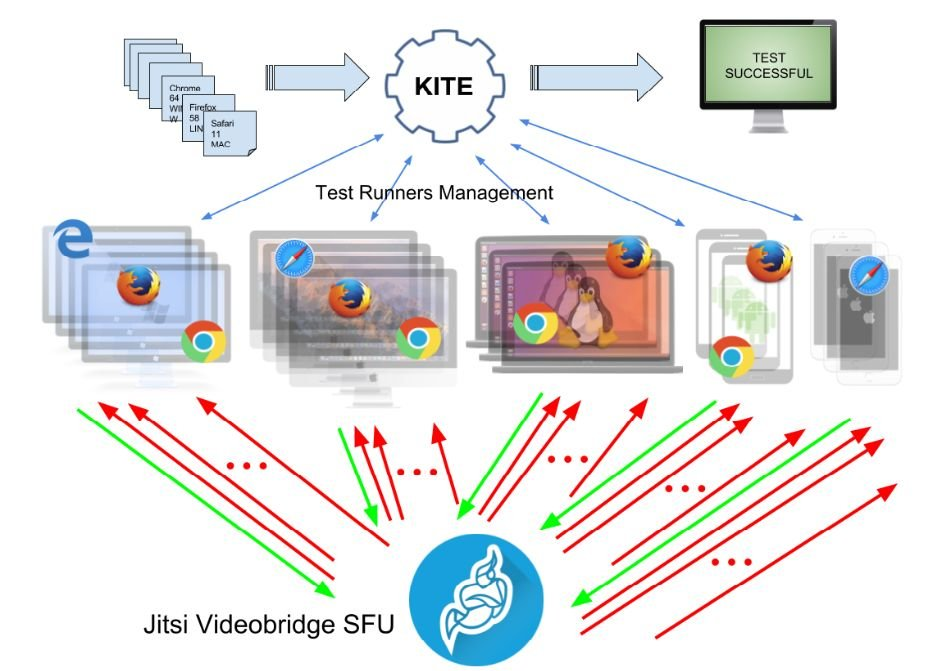

> 2: @csswg \#Houdini meeting https://github\.com/w3c/css\-houdini\-drafts/wiki/Sydney\-F2F\-July\-2018 \- already in full action in🇰🇷, cf https://twitter\.com/philwalton/status/1013650000251793409
> July@W3C: group meetings, training course, devmeetup, conference, etc\. https://www\.w3\.org/participate/eventscal\.html 
> 
> 

 [Jul 02 2018, 12:21:45 UTC](https://twitter.com/w3cdevs/status/1013759633146687489)

----

> 3\-4: continuation of \#WebOfThings \#f2fmeeting in \#Bundang 🇰🇷, hosted by @withtta https://www\.w3\.org/WoT/IG/wiki/F2F\_meeting,\_30\_June\-5\_July\_2018,\_Bundang,\_Korea\#Tue\.2C\_3\_Jul\_2018:\_Technical\_Sessions

 [Jul 02 2018, 12:21:46 UTC](https://twitter.com/w3cdevs/status/1013759636300816384)

----

> 3\-5: @csswg \#f2fmeeting in \#Sydney 🇦🇺 hosted by @Google\. Busy agenda\! https://wiki\.csswg\.org/planning/sydney\-2018\#agenda

 [Jul 02 2018, 12:21:46 UTC](https://twitter.com/w3cdevs/status/1013759634694463488)

----

> 3: opening a new course run of @w3cx's \#HTML5 &amp; \#CSS Fundamentals course: learn the basic building blocks of \#Web design and style\! https://www\.edx\.org/course/html5\-and\-css\-fundamentals with @Microsoft's teachers @edXOnline 
> 
> 
> https://twitter\.com/oneM2M/status/1013765634499457029

 [Jul 02 2018, 12:21:47 UTC](https://twitter.com/w3cdevs/status/1013759637961703424)

----

> 18\-20: @w3c's \#WebPayment work at @Opal\_Group's Financial Innovation and Payments Summit 2018 in \#Newport 🇺🇸 http://opalgroup\.net/conference/financial\-innovation\-payments\-summit\-2018/ cc @w3c's staff @JAlanBird @RachelYager

 [Jul 02 2018, 12:21:47 UTC](https://twitter.com/w3cdevs/status/1013759641388535809)

----

> 26\-27: Help rebuild trust in the \#Web at the Credible Web \#CommunityGroup \#f2fmeeting in \#SanFrancisco 🇺🇸\. Newcomers \(and remotees\) are welcome\!  Find out more: https://www\.w3\.org/community/credibility/2018/06/26/f2f2/ \.\./2018/2018\-03\-tweets\.html\#x976128411654537217
> More details on the meetup…  https://twitter\.com/torgo/status/1014535990323671040

 [Jul 02 2018, 12:21:48 UTC](https://twitter.com/w3cdevs/status/1013759645637402624)

----

> 26: @w3ctag also organizes a \#public \#meetup "MeetTheTAG"\. Come learn about current TAG's work \(design reviews of emerging \#Web technologies https://github\.com/w3ctag/design\-reviews/issues \) and give feedback in real time\! https://ti\.to/w3c\-tag/meet\-the\-tag\-seattle \#Seattle 🇺🇸

 [Jul 02 2018, 12:21:48 UTC](https://twitter.com/w3cdevs/status/1013759644299419648)

----

> 24\-26: @w3ctag \#f2fmeeting in \#Seattle 🇺🇸, hosted by @Microsoft  https://github\.com/w3ctag/meetings/tree/gh\-pages/2018/07\-seattle

 [Jul 02 2018, 12:21:48 UTC](https://twitter.com/w3cdevs/status/1013759642768498688)

----

> Interested in presenting at this \#manga \#publishing @W3CWorkshop? Please submit your interest before 20 July\! https://www\.w3\.org/publishing/events/tokyo18\-workshop/cfp\.html\#position\-statements @w3c\_keio @Keio\_univ\_PR 🇯🇵 https://twitter\.com/w3c/status/1011609291701223425

 [Jul 02 2018, 12:57:05 UTC](https://twitter.com/w3cdevs/status/1013768524307759105)

----

> This is an update to the existing 2013 Candidate Recommendation of \#CSS Text Decoration https://www\.w3\.org/TR/2018/CR\-css\-text\-decor\-3\-20180703/\#recent\-changes  
>   
> Among other changes, this pushes text\-decoration\-skip to the next level of this module \(level 4 https://drafts\.csswg\.org/css\-text\-decor\-4/\#text\-decoration\-skip\-property\) for major rework https://twitter\.com/w3c/status/1014077336776577024
> The issues around text\-decoration\-skip that motivated the @csswg pushing this to level 4 can be explored in their github repo https://github\.com/w3c/csswg\-drafts/issues/727 https://github\.com/w3c/csswg\-drafts/issues/707 https://github\.com/w3c/csswg\-drafts/issues/843  
>   
> Being a good \#CSS designer is hard; but designing CSS itself… wow

 [Jul 03 2018, 12:27:34 UTC](https://twitter.com/w3cdevs/status/1014123483301806080)

----

> \#WebRTC allows real\-time audio/video connections in browsers, either in \#P2P mode or mediated by server components\.  
>   
> This first Candidate Recommendation of WebRTC Stats define a set of metrics to monitor and debug these connections  \#timetoimplement https://twitter\.com/w3c/status/1014079872220782592
> The API is developed in its own github repo under the editorship of @vr000m and @alvestrand   
> https://github\.com/w3c/webrtc\-stats/

 [Jul 03 2018, 13:29:21 UTC](https://twitter.com/w3cdevs/status/1014139031771385860)

----

> \.@w3c Working Groups need to demonstrate during \#CandidateRecommendation that their specifications have interoperable implementations\.  
>   
> Usually, for browser techs, they do this by developing and running tests in Web Platform Tests https://github\.com/web\-platform\-tests/wpt \.\./2018/2018\-04\-tweets\.html\#x986283413316472837

 [Jul 03 2018, 13:29:22 UTC](https://twitter.com/w3cdevs/status/1014139035328110592)

----

> Because of this and other \#WebRTC specificities, an open source \#WebRTC\-specific test framework, KITE, has been developed to complement the usual Web Platform Tests https://github\.com/webrtc/KITE

 [Jul 03 2018, 13:29:23 UTC](https://twitter.com/w3cdevs/status/1014139041112051718)

----

> For WebRTC Stats, evaluating and verifying interoperability for its defined metrics is hard: they reflect ever changing network and system conditions, e\.g\. round\-trip time between 2 remote browsers https://www\.w3\.org/TR/webrtc\-stats/\#dom\-rtcremoteinboundrtpstreamstats\-roundtriptime

 [Jul 03 2018, 13:29:23 UTC](https://twitter.com/w3cdevs/status/1014139038599712768)

----

> KITE can be used to test \#WebRTC implementations, but also \#WebRTC services and applications in controlled conditions, across OS, browsers, devices, etc\. 
> 
> 

 [Jul 03 2018, 13:29:24 UTC](https://twitter.com/w3cdevs/status/1014139043679014918)

----

> WebRTC stats, its current status and its possible future evolutions were discussed at the recent \#WebRTC Working Group meeting \(see slides 75\-87 in https://www\.w3\.org/2011/04/webrtc/wiki/images/e/eb/WebRTCWG\-2018\-06\-20\.pdf\)  
> \.\./2018/2018\-06\-tweets\.html\#x1009038711739355136

 [Jul 03 2018, 13:29:25 UTC](https://twitter.com/w3cdevs/status/1014139049378971648)

----

> And that level of control will also enable to test to a higher degree of confidence the level of interoperability for \#WebRTC Stats metrics\.  
> @callstatsio \(a great consumer of these metrics\) have already started exploring this https://webrtc\-stats\.callstats\.io/verify 
> 
> 

 [Jul 03 2018, 13:29:25 UTC](https://twitter.com/w3cdevs/status/1014139046900232192)

----

> \.@jsajka presents the updated landscape of \#CAPTCHA and their impact on \#accessibility published today https://www\.w3\.org/TR/2018/WD\-turingtest\-20180703/ https://twitter\.com/w3c/status/1014073532765147137
> \#CAPTCHA stands for "Completely Automated Public Turing Test to tell Computers and Humans Apart” \- these challenges often embedded in Web sites to prevent bot\-based abuses\.

 [Jul 03 2018, 14:33:39 UTC](https://twitter.com/w3cdevs/status/1014155214486634503)

----

> The previous version of “Inaccessibility of CAPTCHA” had been published 13 years ago, during which a lot has changed, but \#CAPTCHA are still there, and still an \#accessibility challenge\.

 [Jul 03 2018, 14:33:41 UTC](https://twitter.com/w3cdevs/status/1014155219435913217)

----

> It provides a comprehensive overview of these challenges and possible remediations\.

 [Jul 03 2018, 14:42:07 UTC](https://twitter.com/w3cdevs/status/1014157344371068929)

----

> The @w3c\_wai Accessible Platform Architecture Working Group is looking for input on the following questions\.

 [Jul 03 2018, 14:42:08 UTC](https://twitter.com/w3cdevs/status/1014157348120776704)

----

> “while some \#CAPTCHA solutions are better than others, there is currently no ideal solution\. It is important then to exercise care that any implemented CAPTCHA technology correctly identify people with disabilities as human\.”

 [Jul 03 2018, 14:42:08 UTC](https://twitter.com/w3cdevs/status/1014157346258542594)

----

> If you have relevant input, please bring this to the github repository, preferably before the end of this month https://github\.com/w3c/apa/issues/new

 [Jul 03 2018, 14:42:09 UTC](https://twitter.com/w3cdevs/status/1014157353355276289)

----

> Are there concerns for certain categories of persons with disabilities that remain unaddressed or insufficiently addressed in this  document?  
>   
> Are you aware of relevant research in this area we missed?

 [Jul 03 2018, 14:42:09 UTC](https://twitter.com/w3cdevs/status/1014157351748816897)

----

> Does this document fully capture current problems with \#CAPTCHA and related systems?  
>   
> Are there other potential solutions that should be added?

 [Jul 03 2018, 14:42:09 UTC](https://twitter.com/w3cdevs/status/1014157350146625536)

----

> In addition to the aforementioned Candidate Recommendation of \#WebRTC Stats \.\./2018/2018\-07\-tweets\.html\#x1014139031771385860, the \#WebRTC Working Group released two new Working Drafts today https://twitter\.com/w3c/status/1014074867912728576
> MediaStreamTrack Content Hints allows to annotate media streams \(obtained from e\.g\. a mic, a camera or a screen capture\) with the type of content, to distinguish e\.g\. speech from music for audio, or slides from real\-world videos\.  
> https://www\.w3\.org/TR/2018/WD\-mst\-content\-hint\-20180703/

 [Jul 03 2018, 15:55:24 UTC](https://twitter.com/w3cdevs/status/1014175787224879104)

----

> This distinction of type of media streams enable a number of optimization in how the streams are encoded and pre\-processed \- typically, it's more important to keep text legible on a video streams coming from slide, and noise\-suppression is probably inadequate for music recording\. 
> 
> 

 [Jul 03 2018, 15:55:25 UTC](https://twitter.com/w3cdevs/status/1014175791725318144)

----

> The \#WebRTC DSCP Control API is an extension to the main \#WebRTC spec to provide a more finegrained control on network QoS \(quality of service\) via DSCP \(differentiated service code points\) https://en\.wikipedia\.org/wiki/Differentiated\_services  
> https://www\.w3\.org/TR/2018/WD\-webrtc\-dscp\-20180703/

 [Jul 03 2018, 15:55:26 UTC](https://twitter.com/w3cdevs/status/1014175794229338112)

----

> As \#WebRTC gains more and more adoption, it needs to accommodate a growing number of usages, which the Working Group is expecting to address over time with these relatively small extensions \(and probably bigger ones down the line…\)

 [Jul 03 2018, 15:55:27 UTC](https://twitter.com/w3cdevs/status/1014175796758503424)

----

> The Web Performance Working Group is the one bringing us all the key primitives for measuring \#WebPerf: http://performance\.now\(\), the various performance timelines \(resources, user, paint, server\) and more \(beacon, page visibility, etc\) https://www\.w3\.org/webperf/ https://twitter\.com/w3c/status/1015163254124044294
> The proposed new charter includes new work on network error logging, an HTTP client hint for device memory and a generic reporting framework \(usable for network error logs, CSP, etc\)  
> https://w3c\.github\.io/network\-error\-logging/  
> https://w3c\.github\.io/device\-memory/  
> https://w3c\.github\.io/reporting/  
>   
> https://www\.w3\.org/2018/07/webperf\-charter

 [Jul 06 2018, 09:43:29 UTC](https://twitter.com/w3cdevs/status/1015169355322150913)

----

> Project ideas are often about building a tool, playing with new gadgets, and brainstorming in the spirit of both contributing to the community and bringing technical challenges for individuals/teams\.
> It's \#GeekWeek\! Once a year, @w3c staff is taking a week to experiment, explore and innovate\. It is a time to collaborate with colleagues with different expertise, or just learn about new trends and systems\.

 [Jul 09 2018, 14:16:02 UTC](https://twitter.com/w3cdevs/status/1016325107919319041)

----

> Check out some past projects: https://www\.w3\.org/blog/2015/10/geek\-week\-at\-w3c/ by @ourmaninjapan; https://www\.w3\.org/blog/2016/07/exploring\-web\-platform\-cross\-dependencies/ by @dontcallmeDOM and @tidoust; https://github\.com/w3c/Eunomia by @tripu\. Stay tuned for more\!

 [Jul 09 2018, 14:16:03 UTC](https://twitter.com/w3cdevs/status/1016325109563445248)

----

> Thank you @omnidirect for the Japanese translation of @w3c's \#WebStandard Support for \#RDFa via \#XHTML Modularization http://www\.asahi\-net\.or\.jp/\~ax2s\-kmtn/internet/rdf/REC\-xhtml\-rdfa\-20150317\.html \#html5j \#w3c\_keio
> 日本語訳をありがとう！@omnidirect for XHTML\+RDFa 1\.1 \- 第3版,  XHTMLモジュール化によるRDFaのサポート http://www\.asahi\-net\.or\.jp/\~ax2s\-kmtn/internet/rdf/REC\-xhtml\-rdfa\-20150317\.html \#html5j \#w3c\_keio \#html5j \#w3c\_keio @naomi5500

 [Jul 12 2018, 11:43:21 UTC](https://twitter.com/w3cdevs/status/1017373848151486464)

----

> Yes, hurry up\! The deadline is fast approaching \(in 3 days\)\. Please submit an application for a \#diversity \#scholarship so to participate in all @w3cTPAC meetings next October in \#Lyon 🇫🇷 https://www\.w3\.org/2002/09/wbs/1/diversity\-scholarship\-application\-2018/ \.\./2018/2018\-06\-tweets\.html\#x1009455310258491392

 [Jul 13 2018, 15:04:50 UTC](https://twitter.com/w3cdevs/status/1017786937636278275)

----

> The report of the Web5G workshop is out\! https://www\.w3\.org/2017/11/web5g\-workshop/report\.html  
>   
> This workshop was held back on May 10\-11 hosted by @gsma in London 🇬🇧and has been looking at the intersections between the many innovations happening at the network layer and their impact on the app layer\. https://twitter\.com/w3c/status/1018768300195696641
> The report summarizes some of the main findings out of the presentations done at the workshop and paves the way to more detailed analysis as part of a follow\-up Web5G task force\. 
> 
> 

 [Jul 16 2018, 14:58:06 UTC](https://twitter.com/w3cdevs/status/1018872410068660225)

----

> In addition to the report, the slides, minutes and position papers of the workshop are all linked from the workshop page: https://www\.w3\.org/2017/11/web5g\-workshop/  
>   
> Get in touch with @dontcallmeDOM if you want to be involved in the follow up task force 
> 
> 

 [Jul 16 2018, 14:58:07 UTC](https://twitter.com/w3cdevs/status/1018872414258843649)

----

> Next \#W3CWorkshop will be looking at how to manage access to sensitive features in \#Web \#browsers\! https://www\.w3\.org/Privacy/permissions\-ws\-2018/cfp\.html \- hosted by @Qualcomm, September 18\-19, in \#SanDiego, CA 🇺🇸 https://twitter\.com/w3c/status/1017318418184327169
> Browsers provide access to more and more features that cannot be granted to any random \#Web site\. One way to gate this access is by asking permission from the \#user\. But getting the user consent is not necessarily easy\.\.\.

 [Jul 16 2018, 16:44:17 UTC](https://twitter.com/w3cdevs/status/1018899131820118017)

----

> Second, the well\-known dialogue fatigue means that bombarding \#user with permission requests makes each decision less meaningful\. This leads to situations where a feature gets removed from sight because it creates too much noise, as illustrated by https://twitter\.com/firefox/status/990990184824147974

 [Jul 16 2018, 16:44:19 UTC](https://twitter.com/w3cdevs/status/1018899139243991046)

----

> First, how informed is that consent? Very little if the request gets made when the page has hardly finished loading, or if the underlying risks are hard to grasp\.

 [Jul 16 2018, 16:44:19 UTC](https://twitter.com/w3cdevs/status/1018899136840683521)

----

> On the \#Web, this is made all the more complicated as pages can be embedded in other pages, making the context of the permission request harder to understand for end \#users\.

 [Jul 16 2018, 16:44:20 UTC](https://twitter.com/w3cdevs/status/1018899144210042880)

----

> And there is an art of how and when to ask for permission, in which Web app developers need to play their part \- @mulligan shared his best practices on the matter a while ago: https://techcrunch\.com/2014/04/04/the\-right\-way\-to\-ask\-users\-for\-ios\-permissions/

 [Jul 16 2018, 16:44:20 UTC](https://twitter.com/w3cdevs/status/1018899141773156353)

----

> All these considerations and more will be part of what workshop participants will discuss in September\. If you want to contribute to the conversation, please submit an expression of interest or a position paper before August 17 \- @w3c workshops are open to all, do not hesitate\!

 [Jul 16 2018, 16:44:21 UTC](https://twitter.com/w3cdevs/status/1018899146860789761)

----

> A NEW \#app to help list characters in text found on a \#Web page: https://r12a\.github\.io/app\-analysestring/ Useful to all \#WebDevelopers\!    
> Check out other cool \#Apps developed by @r12a to make the Web truly worldwide: https://r12a\.github\.io/applist https://twitter\.com/r12a/status/1018069770661482498

 [Jul 17 2018, 12:10:01 UTC](https://twitter.com/w3cdevs/status/1019192497237569537)

----

> Not to be missed\! This devmeetup is hosted @MSFTReactor in Seattle 🇺🇸 https://twitter\.com/kennethrohde/status/1019248710537052163

 [Jul 18 2018, 06:45:48 UTC](https://twitter.com/w3cdevs/status/1019473293697568769)

----

> First project coming out of @w3c's \#GeekWeek is Reffy, a specification exploration tool\. Reffy crawls, parses, analyzes, and reports on potential anomalies that @w3c specifications may have\. \.\./2018/2018\-07\-tweets\.html\#x1016325105239150596
> Reffy's reports are published on a daily basis and help detect issues such as invalid \#WebIDL content or missing normative references\. This is another handy tool for all editors of @w3c documents\!

 [Jul 18 2018, 06:59:34 UTC](https://twitter.com/w3cdevs/status/1019476757450289152)

----

> Find out more and read about Reffy's possible development in helping automate @MozDevNet documentation maintenance https://www\.w3\.org/blog/2018/07/exploring\-css\-property\-definitions/

 [Jul 18 2018, 06:59:36 UTC](https://twitter.com/w3cdevs/status/1019476767134842880)

----

> Now, would it be useful to improve the syntax used in \#CSS specs to define properties, so that Reffy can run deeper analyses? https://github\.com/w3c/csswg\-drafts/issues/2921 Comments welcome\!

 [Jul 18 2018, 06:59:36 UTC](https://twitter.com/w3cdevs/status/1019476764693876736)

----

> What progress is being made by the @w3payments \#WorkingGroup? Get an update by @ibjacobs on the Payment Request \#API, the Payment Handler \#API, card payment security, and many more\. https://twitter\.com/w3c/status/1019656438413713415

 [Jul 19 2018, 05:41:28 UTC](https://twitter.com/w3cdevs/status/1019819491876798466)

----

> 30: a new \[Chapters Web Standards\] meetup on \#WebPackaging with @jyasskin, in \#Pittsburgh 🇺🇸 by @codeandsupply https://twitter\.com/briankardell/status/1019674904306671616

 [Jul 19 2018, 05:50:17 UTC](https://twitter.com/w3cdevs/status/1019821709191516160)

----

> Echnida is @w3c's automated publication system for technical reports on /TR: https://www\.w3\.org/TR/ 
> 
> 

 [Jul 24 2018, 14:04:05 UTC](https://twitter.com/w3cdevs/status/1021757916842536963)

----

> Since the beginning of July, it is possible to publish \#CandidateRecommendation with Echidna\. https://twitter\.com/marcosc/status/1016422058635522049

 [Jul 24 2018, 14:04:06 UTC](https://twitter.com/w3cdevs/status/1021757923633115136)

----

> Echidna was built to speed up the process as much as possible by removing tasks that can be automated by a machine\. This way, @w3c's \#WorkingGroups can easily publish and make sure /TR shows an updated view of their work\.

 [Jul 24 2018, 14:04:06 UTC](https://twitter.com/w3cdevs/status/1021757922232229888)

----

> @w3c's publication process follows strict rules enforced by publication rules \(aka, pubrules\) https://www\.w3\.org/pubrules/ and depends on the webmaster's availability\. This often introduces delays in the publication that Echidna can reduce\. 
> 
> 

 [Jul 24 2018, 14:04:06 UTC](https://twitter.com/w3cdevs/status/1021757920344793088)

----

> After submitting a document, Echidna runs a couple checks \(quality, security, etc\.\) before publishing\. @w3c's Echidna makes it easy to publish a new version of specifications after each modification\. This way, readers are getting up\-to\-date documents\.

 [Jul 24 2018, 14:04:07 UTC](https://twitter.com/w3cdevs/status/1021757926472671232)

----

> Transitions requests should be submitted to https://github\.com/w3c/transitions/issues and approved by the Directors and the W3C Communication team beforehand\.

 [Jul 24 2018, 14:04:07 UTC](https://twitter.com/w3cdevs/status/1021757925231128577)

----

> Echidna is also an open source project hosted on \#github: https://github\.com/w3c/echidna\. We welcome any contributions/suggestions\!

 [Jul 24 2018, 14:04:08 UTC](https://twitter.com/w3cdevs/status/1021757930385956866)

----

> In the future, we expect Echnida to support more types of @w3c specifications\. See the full list of documents' transitions at https://www\.w3\.org/pubrules/doc

 [Jul 24 2018, 14:04:08 UTC](https://twitter.com/w3cdevs/status/1021757928796286978)

----

> The @w3ctag \#F2Fmeeting started yesterday, and continues until tomorrow\. \.\./2018/2018\-07\-tweets\.html\#x1013759642768498688
> To catch up with yesterday's discussions, you can read up on their live minutes https://twitter\.com/hadleybeeman/status/1021797604915437568 \- and in general, follow @hadleybeeman for an LT report from the meeting

 [Jul 25 2018, 12:36:55 UTC](https://twitter.com/w3cdevs/status/1022098370704429057)

----

> Today, among the topics to be discussed is the Privacy &amp; Security questionnaire\.  
>   
> This is checklist that @w3c groups used to make sure they've considered aspects of their technologies that may impact privacy &amp; security  
> https://w3ctag\.github\.io/security\-questionnaire/
> 2nd day minutes have started https://twitter\.com/hadleybeeman/status/1022157065349808128

 [Jul 25 2018, 12:36:56 UTC](https://twitter.com/w3cdevs/status/1022098374634491905)

----

> These reviews are themselves managed in github https://github\.com/w3ctag/design\-reviews/issues \- the issue template in this repo includes a request for groups to go through this review

 [Jul 25 2018, 12:36:57 UTC](https://twitter.com/w3cdevs/status/1022098378178609152)

----

> When @w3c specs move forward in the standardization process, they need to get a review from the @w3ctag \- as part of these reviews, the @w3ctag requests groups to fill the questionnaire, both to ensure the exercise has been done, and to help guide their own reviews\.

 [Jul 25 2018, 12:36:57 UTC](https://twitter.com/w3cdevs/status/1022098376266006528)

----

> Naturally, this privacy &amp; security questionnaire itself needs to be maintained, as bugs and gaps get identified https://github\.com/w3ctag/security\-questionnaire/issues/

 [Jul 25 2018, 12:36:58 UTC](https://twitter.com/w3cdevs/status/1022098379793465345)

----

> This is tomorrow\! Don't miss it if you're in \#Seattle 🇺🇸https://twitter\.com/the\_jsf/status/1021882469916794881 \.\./2018/2018\-07\-tweets\.html\#x1013759644299419648

 [Jul 25 2018, 13:36:58 UTC](https://twitter.com/w3cdevs/status/1022113482324561920)

----

> You can get a glimpse at to what the future of \#WebRTC looks like in our recent thread from the previous \#F2Fmeeting of the group \.\./2018/2018\-06\-tweets\.html\#x1009038711739355136
> It took a bit longer than usual, but the new charter for the \#WebRTC Working Group has now been approved https://twitter\.com/w3c/status/1021760465423294465 https://lists\.w3\.org/Archives/Public/public\-webrtc/2018Jul/0077\.html \.\./2018/2018\-04\-tweets\.html\#x988788167615623168

 [Jul 25 2018, 14:50:09 UTC](https://twitter.com/w3cdevs/status/1022131899391791104)

----

> And that charter too has now been approved https://twitter\.com/w3c/status/1022122928366870530 https://www\.w3\.org/2018/distributed\-tracing/ \.\./2018/2018\-04\-tweets\.html\#x987019824051212288

 [Jul 25 2018, 15:33:42 UTC](https://twitter.com/w3cdevs/status/1022142858864877568)

----

> ⚠This workshop has been rescheduled to September 26\-27 \- deadline for expression of interests and position papers is on August 17 \.\./2018/2018\-07\-tweets\.html\#x1018899131820118017

 [Jul 27 2018, 12:05:35 UTC](https://twitter.com/w3cdevs/status/1022815257448927232)

----

> Extension date for the call for participation: 31 July\. The program committee already received 47 submissions, so do not hesitate to join the discussion\! https://www\.w3\.org/publishing/events/tokyo18\-workshop/cfp\.html \.\./2018/2018\-07\-tweets\.html\#x1013768524307759105

 [Jul 27 2018, 12:30:16 UTC](https://twitter.com/w3cdevs/status/1022821470823743488)

----

> Deadline is fast approaching \(4 August \- 5pm CEST\)\! Get funding for your involvement in W3C standards' development\. 🤞Good luck to all applicants\! \.\./2018/2018\-06\-tweets\.html\#x1006544269149077504

 [Jul 27 2018, 12:48:28 UTC](https://twitter.com/w3cdevs/status/1022826051460890629)

----

> ”In cases where DOM manipulations would cause jank, this \[proposed API\] instead allows the user\-agent to split up the work across several frames, yielding for script and user interactions\. When the updates are finished processing, the result is displayed without jank\.” https://twitter\.com/kennethrohde/status/1024044511528472576

 [Jul 30 2018, 21:46:25 UTC](https://twitter.com/w3cdevs/status/1024048594955849728)

----

> Today and tomorrow, @dontcallmeDOM is participating to the @MozDevNet product advisory board meeting hosted by @MSFTResearch in Seattle 🇺🇸 https://developer\.mozilla\.org/en\-US/docs/MDN/MDN\_Product\_Advisory\_Board 
> 
> 
> The meeting is in the same room as the @w3ctag meeting last week\. But THEY did not have a Unicorn 🦄 
> 
> 

 [Jul 31 2018, 16:37:40 UTC](https://twitter.com/w3cdevs/status/1024333283029442560)