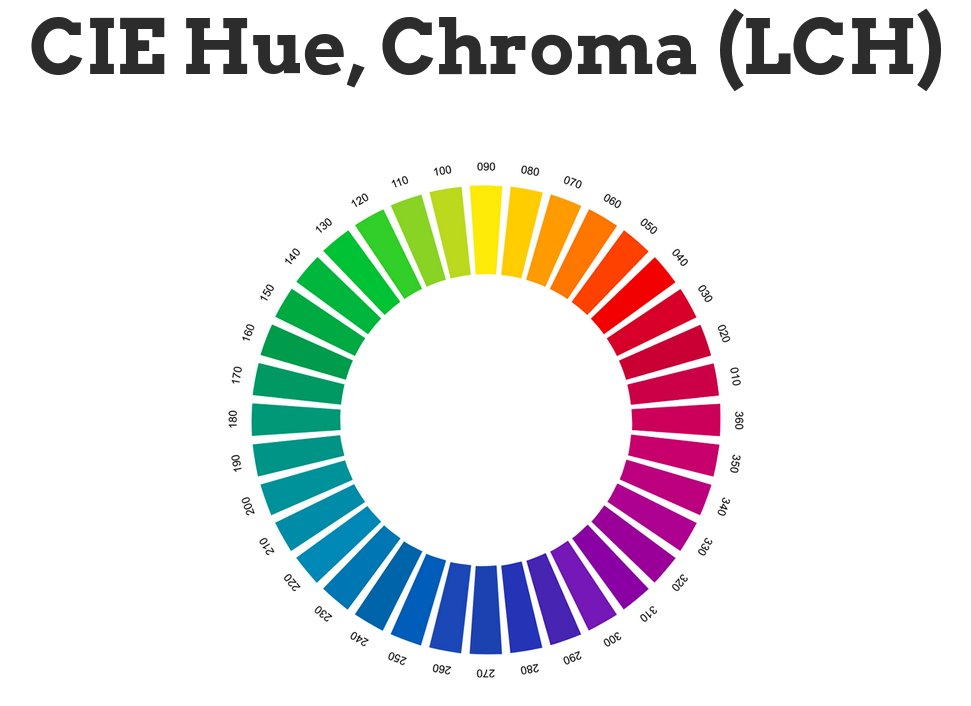

> 1\) Measuring event latency today requires an event listener, which introduces unnecessary performance overhead\. The Event Timing \#WebPerf \#API proposes a simple and efficient mechanism to measure the latency of events triggered by user interaction: https://www\.w3\.org/2018/07/web\-roadmaps/mobile/performance\.html\#event\-timing 
> 
> 
> The summer edition of the \#roadmap of \#WebApps on Mobile is out\! It highlights exploratory work on how @w3c \#Web technologies help optimize performance: https://www\.w3\.org/2018/07/web\-roadmaps/mobile/ \#July2018 @tidoust @XueFuqiao @W3CChina https://twitter\.com/w3c/status/1026759130680356864

 [Aug 07 2018, 09:39:28 UTC](https://twitter.com/w3cdevs/status/1026764755019726848)

----

> 4\) The @csswg is adopting the overscroll\-behavior property proposal, which would help \#MobileDevelopers create efficient pull\-to\-refresh and infinite scrolling paradigms: https://www\.w3\.org/2018/07/web\-roadmaps/mobile/performance\.html\#css\-overscroll\-behavior \#WebPerf

 [Aug 07 2018, 09:39:29 UTC](https://twitter.com/w3cdevs/status/1026764759499198464)

----

> 3\) Did you know that you can use the \#CSS contain property to optimize DOM rendering? Check out: https://www\.w3\.org/2018/07/web\-roadmaps/mobile/performance\.html\#css\-contain \#WebPerf

 [Aug 07 2018, 09:39:29 UTC](https://twitter.com/w3cdevs/status/1026764758169669633)

----

> 2\) Looking for a way to run scripted animations without impacting the main thread? The \#CSS Animation Worklet \#API can help: https://www\.w3\.org/2018/07/web\-roadmaps/mobile/performance\.html\#animation\-worklet \#WebPerf

 [Aug 07 2018, 09:39:29 UTC](https://twitter.com/w3cdevs/status/1026764756764577793)

----

> And finally, a brand new and awesome feature: the \#implementation status displayed in the \#MobileWebApps roadmap uses \#MDN Browser Compatibility Data as a source of information, and alerts when an implementation may be partial: https://www\.npmjs\.com/package/mdn\-browser\-compat\-data @MozDevNet 
> 
> 

 [Aug 07 2018, 09:39:30 UTC](https://twitter.com/w3cdevs/status/1026764762565279744)

----

> 5\) The preload attribute gives limited control over setting priorities for resource downloading\. The Priority Hints specification proposes a more fine\-grained mechanism: https://www\.w3\.org/2018/07/web\-roadmaps/mobile/performance\.html\#priority\-hints \#WebPerf

 [Aug 07 2018, 09:39:30 UTC](https://twitter.com/w3cdevs/status/1026764761160138752)

----

> See anything missing? If you know of use cases that cannot be achieved today with \#Web \#technologies, please start a new topic in the @w3c’s discourse forum https://discourse\.wicg\.io/ or raise an issue on the GitHub repository of this document https://github\.com/w3c/web\-roadmaps/issues/new

 [Aug 07 2018, 09:39:31 UTC](https://twitter.com/w3cdevs/status/1026764765757095937)

----

> Reminder of what \#CSS \#Houdini enables \.\./2018/2018\-04\-tweets\.html\#x983277098705063936
> The first \#CSS \#Houdini specification to reach \#CandidateRecommendation: CSS Painting Level 1 https://www\.w3\.org/TR/2018/CR\-css\-paint\-api\-1\-20180809/ \- this is a major step in the evolution of the extensibility of Web browsers https://twitter\.com/w3c/status/1027725494135996417

 [Aug 10 2018, 10:18:58 UTC](https://twitter.com/w3cdevs/status/1027861860543016960)

----

> \#CSS Painting ”allows developers to write a paint function which allows to draw directly into an elements background, border, or content” https://github\.com/w3c/css\-houdini\-drafts/blob/master/css\-paint\-api/EXPLAINER\.md

 [Aug 10 2018, 10:18:59 UTC](https://twitter.com/w3cdevs/status/1027861863013515264)

----

> Right now, the API is available only in Chromium\-based browsers \- hopefully more to come?  
> https://bugzilla\.mozilla\.org/show\_bug\.cgi?id\=1302328  
> https://wpdev\.uservoice\.com/forums/257854\-microsoft\-edge\-developer/suggestions/18619855\-implement\-houdini\-to\-expose\-low\-level\-css\-hooks 
> 
> 

 [Aug 10 2018, 10:19:00 UTC](https://twitter.com/w3cdevs/status/1027861866842935296)

----

> See for example some cool demo of using this in combination with Three\.js by @Lady\_Ada\_King https://twitter\.com/Lady\_Ada\_King/status/1017067159770599424

 [Aug 10 2018, 10:19:00 UTC](https://twitter.com/w3cdevs/status/1027861864934531072)

----

> See also @svgeesus talk on \#CSS Color https://www\.w3\.org/Talks/2017/css4\-color\-talk/20years\.html 
> 
> 
> CSS Color 4 proposes two new color schemes: Lab &amp; LCH with the nice property of having constant visual lightness for a given L value https://drafts\.csswg\.org/css\-color/\#lab\-colors \- in github at https://github\.com/w3c/csswg\-drafts/tree/master/css\-color\-4 https://twitter\.com/LeaVerou/status/1029029640336302080

 [Aug 13 2018, 16:20:45 UTC](https://twitter.com/w3cdevs/status/1029040068789497856)

----

> If you need a quick refresher on the Generic Sensor API: \.\./2018/2018\-01\-tweets\.html\#x956181984681840642
> This new Geolocation API is designed to provide similar features to the well\-known navigator\.geolocation\.getCurrentPosition\(\) API but with a model aligned with the Generic Sensor API framework\.  
>   
> For input and contributions, head to the github repo https://github\.com/w3c/geolocation\-sensor https://twitter\.com/kennethrohde/status/1034888901167599617

 [Aug 29 2018, 20:01:38 UTC](https://twitter.com/w3cdevs/status/1034893862433644545)