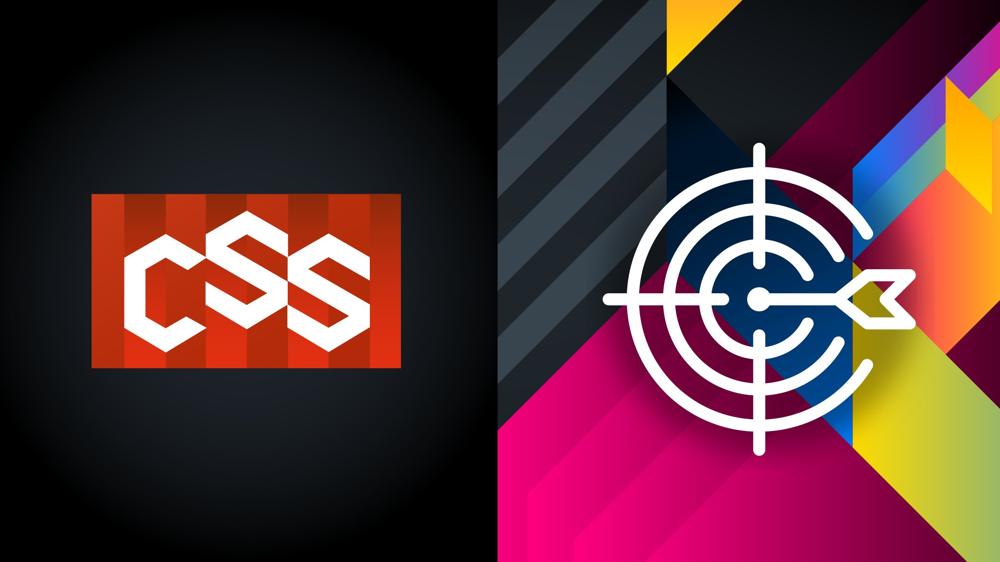
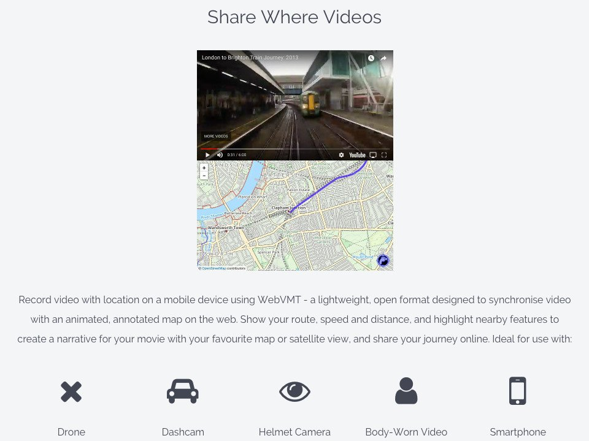
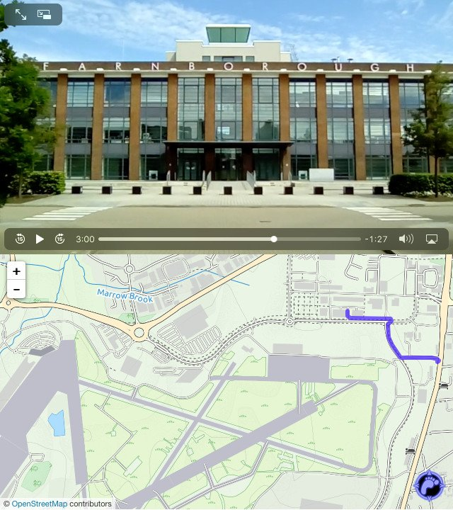
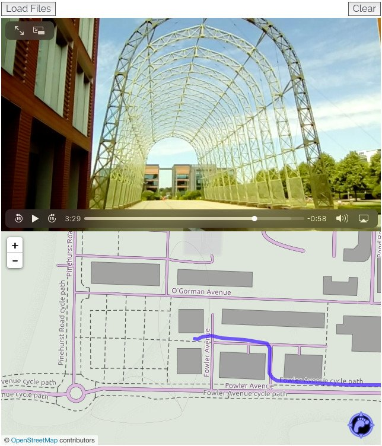
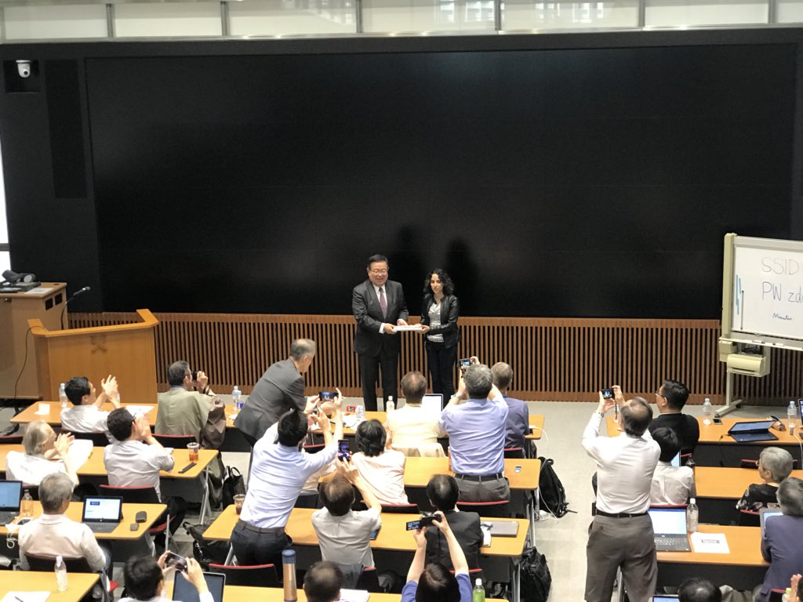
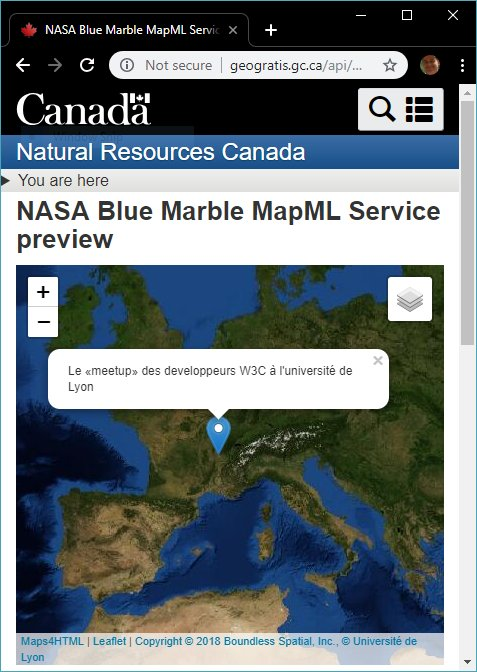
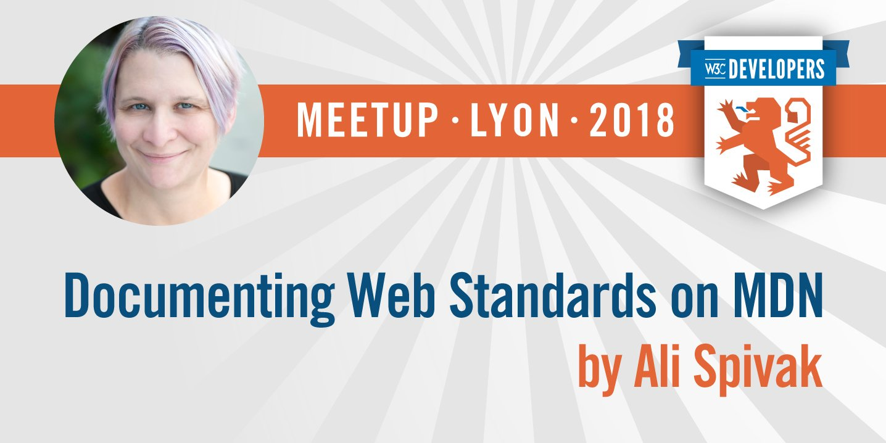
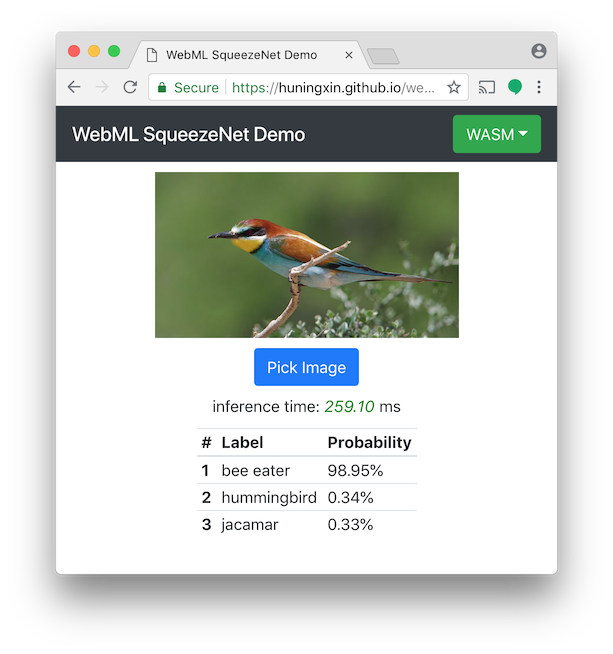

> September@w3c: W3Cx MOOC, @w3c workshops, business show, etc\. https://www\.w3\.org/participate/eventscal\.html 
> 
> 
> 14: opening of a new CSS Basics \#MOOC session for \#developers \#designers https://www\.edx\.org/course/css\-basics\-w3cx\-css\-0x\-0 \#HTML5 \#CSS with @MicrosoftEDU @thew3cx @edXOnline 
> 
> 

 [Sep 01 2018, 06:41:36 UTC](https://twitter.com/w3cdevs/status/1035779691217645568)

----

> Check out the \#digipub workshop's 17 position statements while awaiting for the workshop report\! https://www\.w3\.org/publishing/events/tokyo18\-workshop/papers\.html

 [Sep 01 2018, 06:41:38 UTC](https://twitter.com/w3cdevs/status/1035779699853733888)

----

> 18\-19: a \#digipub \#W3CWorkshop on publishing \#manga \#magazines, organized by @w3cpublishing and hosted by @Keio\_univ\_PR's Advanced Publishing Laboratory, in \#Tokyo 🇯🇵   
> https://www\.w3\.org/publishing/events/tokyo18\-workshop/

 [Sep 01 2018, 06:41:38 UTC](https://twitter.com/w3cdevs/status/1035779697911713792)

----

> 26\-29: @RestFest conference in \#Greenville\_SC 🇺🇸 http://2018\.restfest\.org/east/ \#RESTful \#apps 
> 
> 

 [Sep 01 2018, 06:41:39 UTC](https://twitter.com/w3cdevs/status/1035779703154659328)

----

> 26\-27: another great \#W3CWorkshop on \#permissions and user consent \#privacy \#security, hosted by @Qualcomm in \#SanDiego 🇺🇸 https://www\.w3\.org/Privacy/permissions\-ws\-2018/ \(position papers: https://www\.w3\.org/Privacy/permissions\-ws\-2018/papers\.html\)

 [Sep 01 2018, 06:41:39 UTC](https://twitter.com/w3cdevs/status/1035779701502078976)

----

> Thank you for the translation into Japanese\! This @w3c specification \(in \#WorkingDraft status\) defines a high\-level Web \#API for processing and synthesizing audio in \#WebApps https://www\.w3\.org/TR/2018/WD\-webaudio\-20180619/ \#html5j \#w3c\_keio https://twitter\.com/g200kg/status/1036097073827917825

 [Sep 04 2018, 09:58:41 UTC](https://twitter.com/w3cdevs/status/1036916448738856960)

----

> What's in a name? Quite a bit actually, and getting it right is by no mean easy \- the @webi18n has some useful reference material on how to deal with personal names around the world https://www\.w3\.org/International/questions/qa\-personal\-names\.en\.html https://t\.co/aHfctrZ55X

 [Sep 05 2018, 14:57:19 UTC](https://twitter.com/w3cdevs/status/1037353991129247745)

----

> 10\-11: @r12a gives an introduction to writing systems and Unicode \#tutorial @Unicode conference in \#SantaClara, CA 🇺🇸 and presents ways  to support text layout on the \#Web cc @AddisonI18N http://www\.unicodeconference\.org/program\.htm @webi18n 
> 
> 

 [Sep 07 2018, 16:34:27 UTC](https://twitter.com/w3cdevs/status/1038103210572038147)

----

> 13\-18: meet @tidoust to discuss and exchange on how media technologies on the \#Web evolve\! @IBCShow \#RAI https://show\.ibc\.org in \#Amsterdam 🇳🇱 https://www\.ibc\.org/ \#IBC2018

 [Sep 07 2018, 16:44:03 UTC](https://twitter.com/w3cdevs/status/1038105627585904641)

----

> We are excited to announce the upcoming @w3c \#free \#DevMeetup in \#Lyon 🇫🇷,  on 22 October 2018\! \#SaveTheDate https://www\.w3\.org/2018/10/Meetup/ @UniversiteLyon \#OFFBlendWebMix 
> 
> 
> Register \#asap\! Our \#meetup is open to everyone at no cost, but space is limited:  https://ti\.to/w3c/w3c\-developer\-meetup\-lyon\-2018cc

 [Sep 12 2018, 09:19:48 UTC](https://twitter.com/w3cdevs/status/1039805768592248833)

----

> In addition, do not miss the cool \#demonstrations of @w3c \#Web technologies either in deployment or under exploration and prototyping: \#WebVR \#WebAR \#MapML \#WebOfThings \#IntersectionObserver \#WebAuthn, Web &amp; Machine Learning, and many more\!

 [Sep 12 2018, 09:19:49 UTC](https://twitter.com/w3cdevs/status/1039805774015422464)

----

> Come listen to this year's awesome speakers: @nitot \(@Qwant\_FR\) @alispivak \(@MozDevNet\) @regocas \(@igalia \) @r12a \(@web18n\) and @rachelandrew on topics about \#CSS \#privacy \#i18n \#WebDocumentation 
> 
> 

 [Sep 12 2018, 09:19:49 UTC](https://twitter.com/w3cdevs/status/1039805771826036736)

----

> We'll provide more detailed info about the talks and the demonstrations in the coming weeks, so stay tuned\!

 [Sep 12 2018, 09:19:50 UTC](https://twitter.com/w3cdevs/status/1039805777555480577)

----

> And special thanks to our sponsors @nttcom @stickermule @Qwant\_FR  @mozilla and @Microsoft for supporting this event\! 
> 
> 

 [Sep 12 2018, 09:19:50 UTC](https://twitter.com/w3cdevs/status/1039805775483420672)

----

> The first part of @w3c's \#DevMeetup on October 22 in \#Lyon 🇫🇷 will be a series of \#demos of technologies ranging from under ongoing standardization to more exploratory or at the prototype stage: https://www\.w3\.org/2018/10/Meetup/demos\.html 
> 
> 
> As a first example of exploratory work, coming from https://www\.w3\.org/2017/sdwig/, the Web Video Map Tracks \#WebVMT format allows to share and index videos with location on the \#Web: https://w3c\.github\.io/sdw/proposals/geotagging/webvmt/ 
> 
> 

 [Sep 18 2018, 13:39:29 UTC](https://twitter.com/w3cdevs/status/1042045448364740608)

----

> A second demo: sharing location with video using \#WebVMT to race from London Victoria to Brighton by train in 4 minutes http://webvmt\.org/demos\#youtube 
> 
> 

 [Sep 18 2018, 13:39:31 UTC](https://twitter.com/w3cdevs/status/1042045457076248576)

----

> A first \#WebVMT demo: exploring more than a century of aviation history at Farnborough airfield, the birthplace of \#British aviation 🇬🇧 http://webvmt\.org/demos\#intro 
> 
> 

 [Sep 18 2018, 13:39:31 UTC](https://twitter.com/w3cdevs/status/1042045453636972544)

----

> Third demo: recording location with video using \#WebVMT on a smartphone and loading it into a \#WebBrowser to play alongside an animated, annotated map http://webvmt\.org/demos\#mobile 
> 
> 

 [Sep 18 2018, 13:39:32 UTC](https://twitter.com/w3cdevs/status/1042045460280750082)

----

> Come discover all these cool demos presented by @w3c's \#InvitedExpert Rob Smith @away\_team\. The \#DevMeetup is free and open to all, you just need to register\! https://ti\.to/w3c/w3c\-developer\-meetup\-lyon\-2018 
> 
> 

 [Sep 18 2018, 13:39:33 UTC](https://twitter.com/w3cdevs/status/1042045464114343937)

----

> Check out the test suite developed by the \#WorkingGroup: https://github\.com/web\-platform\-tests/wpt/tree/master/webaudio
> Great timing for the \#wac2018 conference \+ \#webaudioberlin meetup indeed\! The \#WebAudio @w3c specification describes a high\-level Web \#API for processing and synthesizing audio in \#WebApps \#timetoimplement https://twitter\.com/svgeesus/status/1042042947762573312

 [Sep 18 2018, 14:00:39 UTC](https://twitter.com/w3cdevs/status/1042050775852220420)

----

> Comments and feedback are welcome on \#WebAudio's \#github: https://github\.com/WebAudio/web\-audio\-api/issues

 [Sep 18 2018, 14:00:40 UTC](https://twitter.com/w3cdevs/status/1042050778863755265)

----

> You can get a sense from the event from the live\-tweets thread from @rachelnabors one of the presenters at the workshop https://twitter\.com/rachelnabors/status/1041847739468800002
> Yesterday and today were the dates for the @W3C Workshop on Digital Publication Layout and Presentation \(from \#Manga to \#Magazines\) \- “exploring the future of visually\-rich long\-form digital publications” \.\./2018/2018\-09\-tweets\.html\#x1035779697911713792

 [Sep 19 2018, 12:03:00 UTC](https://twitter.com/w3cdevs/status/1042383555895209986)

----

> See also the slides @fantasai presented there https://twitter\.com/fantasai/status/1042338854454231040 
> 
> 

 [Sep 19 2018, 12:03:01 UTC](https://twitter.com/w3cdevs/status/1042383557874855937)

----

> All the position papers and slides from the event are already linked from https://www\.w3\.org/publishing/events/tokyo18\-workshop/schedule\.html   
>   
> A workshop report is expected in a few weeks, with conclusions and proposed next steps for this rich topic\!

 [Sep 19 2018, 12:03:02 UTC](https://twitter.com/w3cdevs/status/1042383562270486528)

----

> \#developers and \#designers are using \#CSS on a daily basis in their Web developments, but can they have any influence on its definition? Of course they can\! And nowadays in a very simple way\. 
> 
> 
> Want to know what it takes to contribute to the development of \#CSS  specifications that style the \#Web? Come hear @regocas \(@igalia\) at the \#w3cdevs2018 \#Meetup on 22 Oct\. in \#Lyon\. Register at https://ti\.to/w3c/w3c\-developer\-meetup\-lyon\-2018 
> 
> 

 [Sep 20 2018, 08:22:27 UTC](https://twitter.com/w3cdevs/status/1042690440053567488)

----

> In this presentation, @regocas will talk about the @w3c @csswg: how it works, who is part of this group, where are their repositories and, more importantly, how anyone can provide \#feedback to improve the \#CSS specifications \.\./2018/2018\-04\-tweets\.html\#x986283413316472837

 [Sep 20 2018, 08:22:28 UTC](https://twitter.com/w3cdevs/status/1042690442532409345)

----

> This talk from @regocas will try to reduce the disconnect between Web developers and the \#CSS authors and implementors, proposing a closer cooperation and sharing light about how it can be articulated\. More at https://www\.w3\.org/2018/10/Meetup/

 [Sep 20 2018, 08:22:29 UTC](https://twitter.com/w3cdevs/status/1042690447485947904)

----

> Very related to this work are all the \#interoperability efforts that are being performed to build a cross\-browser testsuite for the Web\-platform stack\. @regocas will focus on the web\-platform\-tests repository and explain how to contribute to it https://github\.com/web\-platform\-tests/wpt

 [Sep 20 2018, 08:22:29 UTC](https://twitter.com/w3cdevs/status/1042690445032284160)

----

> Congrats to John Daggett \(@mozilla\), @Litherum \(Apple\) and @svgeesus \(@w3c\) and the @csswg for the newly published @w3c \#WebStandard CSS Fonts 3 https://www\.w3\.org/TR/css\-fonts\-3/ \#timetoadopt \#CSS https://twitter\.com/w3c/status/1042707072926855168
> The @csswg is already hard at work towards the next level of CSS Fonts https://www\.w3\.org/TR/2018/WD\-css\-fonts\-4\-20180920/\#introduction with planned support for variable fonts  
>   
> As usual, the work is happening on github https://github\.com/w3c/csswg\-drafts/tree/master/css\-fonts\-4

 [Sep 20 2018, 13:30:37 UTC](https://twitter.com/w3cdevs/status/1042767993024012289)

----

> And that new charter of the \#WebPerf working group is now approved\! 🎉 https://twitter\.com/w3c/status/1042792778978283521

 [Sep 20 2018, 16:26:59 UTC](https://twitter.com/w3cdevs/status/1042812377052454915)

----

> The opportunity to get involved in web standards with mentoring from a top notch standardista\! https://t\.co/UDmnSDgA5I

 [Sep 21 2018, 04:31:27 UTC](https://twitter.com/w3cdevs/status/1042994693145939968)

----

> \.@svgeesus shares the whole story about CSS &amp; Fonts https://www\.w3\.org/blog/2018/09/css\-fonts\-3\-is\-a\-w3c\-recommendation/ https://twitter\.com/w3c/status/1042912046445146112

 [Sep 21 2018, 06:58:57 UTC](https://twitter.com/w3cdevs/status/1043031812526694401)

----

> Another demonstration of an exploratory work at the @w3c \#DevMeetup, coming from https://www\.w3\.org/2017/sdwig/, is the Map Markup Language \(\#MapML\) https://www\.w3\.org/2018/10/Meetup/demos\.html 
> 
> 
> \#MapML is a proposed extension of \#HTML that integrates the \#Web and the \#GeoWeb in a way that lowers the barriers to making and using maps on the \#Web\. 
> 
> <video controls><source src="../media/1043154643314987008-5Y4PvdTYLIU462hO.mp4">Your browser does not support the video tag.</video>

 [Sep 21 2018, 15:07:01 UTC](https://twitter.com/w3cdevs/status/1043154640588734464)

----

> Mobile technology has allowed \#WebBrowser and other \#Apps to geo\-locate the user; MapML allows the browser to geo\-locate and represent resources from any Web site\!

 [Sep 21 2018, 15:07:03 UTC](https://twitter.com/w3cdevs/status/1043154648880898048)

----

> \#MapML is a proposal from the @w3c Geospatial Web mapping \#CommunityGroup http://maps4html\.org to the Web platform community to collaborate on a standard intended to help the platform to progressively achieve its full potential\.

 [Sep 21 2018, 15:07:03 UTC](https://twitter.com/w3cdevs/status/1043154647010222080)

----

> Come discover this cool demo presented by @w3c's \#InvitedExpert @prushforth of @NRCan / @RNCan\. The \#DevMeetup is free and open to all, you just need to register\! https://ti\.to/w3c/w3c\-developer\-meetup\-lyon\-2018 
> 
> 

 [Sep 21 2018, 15:07:04 UTC](https://twitter.com/w3cdevs/status/1043154653611995137)

----

> \#MapML is currently implemented as custom elements\. Our proposal to the Web platform community is to incubate this specification for native standardization\. 
> 
> 

 [Sep 21 2018, 15:07:04 UTC](https://twitter.com/w3cdevs/status/1043154650860535809)

----

> First, what is the current Intersection Observer API? it allows to detect if a particular HTML element is currently exposed in the visible viewport of the browser https://w3c\.github\.io/IntersectionObserver/ 
> 
> <video controls><source src="../media/1044625091080966144-UiD4fVTBlv9Xec4A.mp4">Your browser does not support the video tag.</video>
> Introducing another demo of exploratory work at the @w3c   
> \#w3cdevs2018 meetup on October 22 in Lyon: a new version of the Intersection Observer API https://www\.w3\.org/2018/10/Meetup/demos\.html \#OFFBlendWebMix

 [Sep 25 2018, 16:30:04 UTC](https://twitter.com/w3cdevs/status/1044625091080966144)

----

> It's already widely used on the Web, with 20%\+ of page loads e\.g\. in Chrome making use of it https://www\.chromestatus\.com/metrics/feature/timeline/popularity/1368

 [Sep 25 2018, 16:30:05 UTC](https://twitter.com/w3cdevs/status/1044625095543738372)

----

> Its use cases includes lazy loading images, fast scrolling for dynamic lists and detection of ad visibility\.  
>   
> With the exception of Safari, it's available across all the modern browsers https://developer\.mozilla\.org/en\-US/docs/Web/API/Intersection\_Observer\_API\#Browser\_compatibility  
>   
> and there is an active @webkit bug on this https://bugs\.webkit\.org/show\_bug\.cgi?id\=159475

 [Sep 25 2018, 16:30:05 UTC](https://twitter.com/w3cdevs/status/1044625093295575040)

----

> Specifically, it gives the iframe a strong guarantee that its content is visible on screen, and has not been painted over or altered in any way by the embedding document\.

 [Sep 25 2018, 16:30:06 UTC](https://twitter.com/w3cdevs/status/1044625100723671040)

----

> The primary motivation is to eliminate common patterns of fraud and abuse on the Web, \#clickjacking in particular, and to enable trust relationships between embedded third\-party iframes and their host documents

 [Sep 25 2018, 16:30:06 UTC](https://twitter.com/w3cdevs/status/1044625098999844865)

----

> The demo of the \#w3cdevs2018 meetup will be for features under consideration for a next version of the API: it would extend the current API to provide a strong guarantee that a particular \#HTML element is completely visible and unmodified

 [Sep 25 2018, 16:30:06 UTC](https://twitter.com/w3cdevs/status/1044625097561124866)

----

> Come discover this cool demo presented by Stefan Zager \(@google\)\. The \#w3cdevs2018 meetup is free and open to all, you just need to register\! https://ti\.to/w3c/w3c\-developer\-meetup\-lyon\-2018 
> 
> 

 [Sep 25 2018, 16:30:07 UTC](https://twitter.com/w3cdevs/status/1044625102359416833)

----

> In her talk, @alispivak will share some of the background history of @mozdevnet and how the Product Advisory Board \(PAB\) started last year is helping to better create the documentation developers want and need  
> https://www\.w3\.org/blog/2017/10/w3c\-to\-work\-with\-mdn\-on\-web\-platform\-documentation/
> Introducing another of our great speakers at \#w3cdevs2018 in \#Lyon: come hear @alispivak \(head of @mozilla developer ecosystem\) talk about @MozDevNet and its partnership with @w3c and browser vendors to document the Web\.  
>   
> Register at https://ti\.to/w3c/w3c\-developer\-meetup\-lyon\-2018 
> 
> 

 [Sep 26 2018, 15:03:38 UTC](https://twitter.com/w3cdevs/status/1044965727424446465)

----

> The second one was in August and the minutes are \(as always\) publicly available https://github\.com/mdn/pab/blob/master/meeting\-notes/2018\-07\-notes\.md  
>   
> We had a unicorn 🦄 as a guest star\!  
> https://twitter\.com/robertnyman/status/1025089955582763010

 [Sep 26 2018, 15:03:39 UTC](https://twitter.com/w3cdevs/status/1044965731144798208)

----

> The PAB had two face to face meetings \- the first one was back in January, and we shared back then how exciting it was \.\./2018/2018\-01\-tweets\.html\#x956109136302956544

 [Sep 26 2018, 15:03:39 UTC](https://twitter.com/w3cdevs/status/1044965729269895169)

----

> To hear directly from @alispivak on this and @mozdevnet in general, and meet many of the PAB members who will be at \#w3cdevs2018, do not forget to register https://www\.w3\.org/2018/10/Meetup/

 [Sep 26 2018, 15:03:40 UTC](https://twitter.com/w3cdevs/status/1044965735519473664)

----

> Among the many the exciting projects @mozdevnet is pushing and the PAB is tracking, most relevant for @w3cdevs is a push to make Web documentation a channel for input &amp; feedback to standardization \- lots of ideas toward that in our issue tracker https://github\.com/mdn/pab/issues?q\=is%3Aissue\+is%3Aopen\+label%3Astandardization

 [Sep 26 2018, 15:03:40 UTC](https://twitter.com/w3cdevs/status/1044965733778771968)

----

> in a few minutes, the @w3c workshop on permissions and user content will start in San Diego, CA 🇺🇸  
> \.\./2018/2018\-07\-tweets\.html\#x1018899131820118017
> The agenda for the workshop over the next two days is online https://www\.w3\.org/Privacy/permissions\-ws\-2018/schedule\.html

 [Sep 26 2018, 15:52:14 UTC](https://twitter.com/w3cdevs/status/1044977957830373377)

----

> The context\-setting talk will be given by @ThisIsJoFrank based on the position paper she published a few weeks ago https://twitter\.com/samsunginternet/status/1036954104860434432

 [Sep 26 2018, 15:52:15 UTC](https://twitter.com/w3cdevs/status/1044977961609449472)

----

> We wish all the participants plenty of inspiration to pave the way to making the Web both powerful and respectful of its users privacy\!

 [Sep 26 2018, 15:52:16 UTC](https://twitter.com/w3cdevs/status/1044977967443705857)

----

> Permissions and how they're presented, bundled, exposed are key to a number of the most existing ongoing developments in @w3c,  \#WebRTC, \#WebXR and \#ImmersiveWeb, \#WebPayments among others

 [Sep 26 2018, 15:52:16 UTC](https://twitter.com/w3cdevs/status/1044977965715607552)

----

> That and all the other position papers are linked from https://www\.w3\.org/Privacy/permissions\-ws\-2018/papers\.html

 [Sep 26 2018, 15:52:16 UTC](https://twitter.com/w3cdevs/status/1044977964058902528)

----

> Introducing our last \(but not least\) set of demos of not\-yet\-standards\-track work at @w3c \#w3cdevs2018 meetup October 22 in \#Lyon: \#MachineLearning for the Web https://www\.w3\.org/2018/10/Meetup/demos\.html\#demos\-explo \#OFFBlendWebMix
> A related \#CommunityGroup on Machine Learning for the Web is under preparation, with the objective to incubate dedicated low\-level Web \#APIs for machine learning inference in \#WebBrowser and in products using modern Web engines https://twitter\.com/anssik/status/1045002714080575488

 [Sep 27 2018, 12:28:51 UTC](https://twitter.com/w3cdevs/status/1045289163854090240)

----

> \.@NingxinHu \(@intel\) will present three demos of \#MachineLearning for the Web\.  
>   
> 1\) making real\-time object detection in browser a reality for compelling immersive Web experiences and more \#ImmersiveWeb \#MachineLearning https://www\.youtube\.com/watch?v\=XGgiDU\-8d60
> The Machine Learning Community Group has now been officially proposed: https://www\.w3\.org/community/blog/2018/10/03/proposed\-group\-machine\-learning\-for\-the\-web\-community\-group/ with a proposed charter

 [Sep 27 2018, 12:28:52 UTC](https://twitter.com/w3cdevs/status/1045289167893270528)

----

> 3\) real\-time human pose estimation in the browser enabling new class of experiences on the Web ranging from fitness, interactive installations to augmented reality \#ImmersiveWeb \#MachineLearning 
> 
> 

 [Sep 27 2018, 12:28:53 UTC](https://twitter.com/w3cdevs/status/1045289172536381440)

----

> 2\) image classification in the browser that works offline without dependency on cloud infrastructure\. \#MachineLearning 
> 
> 

 [Sep 27 2018, 12:28:53 UTC](https://twitter.com/w3cdevs/status/1045289169864609793)

----

> All these demos and more will be shown at the  \#w3cdevs2018 \#DevMeetup on October 22 in \#Lyon\. This event is free but you need to register\! https://ti\.to/w3c/w3c\-developer\-meetup\-lyon\-2018 
> 
> 

 [Sep 27 2018, 12:28:54 UTC](https://twitter.com/w3cdevs/status/1045289175375912960)

----

> The report of the publishing workshop \#w3ctokyows is not available yet, but you can already enjoy a thorough report from @EDRLab\_EPUB https://twitter\.com/EDRLab\_EPUB/status/1044918870170112000

 [Sep 27 2018, 13:43:30 UTC](https://twitter.com/w3cdevs/status/1045307947264483330)

----

> The \#WebRTC spec, which enables \#P2P audio\-video communication on the Web, has been split into two ✂️: the core work on PeerConnection API on the one hand, the Identity Framework on the other  
> https://twitter\.com/w3c/status/1045310885969956865
> The work on the PeerConnection continues in the same repository  
> https://github\.com/w3c/webrtc\-pc/  
>   
> The work on Identity for WebRTC has moved to https://github\.com/w3c/webrtc\-identity  
>   
> Both continue as Candidate Recommenations, looking for implementation \#timetoimplement  \.\./2018/2018\-04\-tweets\.html\#x988788171977748482

 [Sep 27 2018, 14:52:49 UTC](https://twitter.com/w3cdevs/status/1045325394033938432)