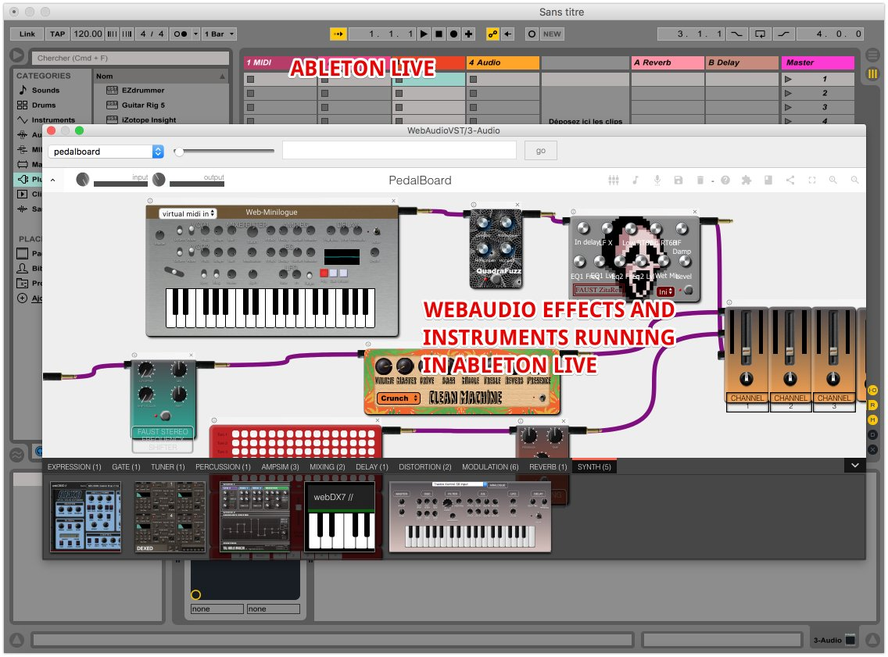
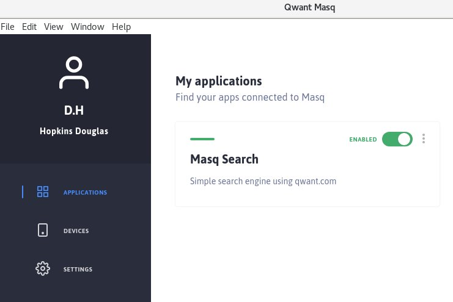
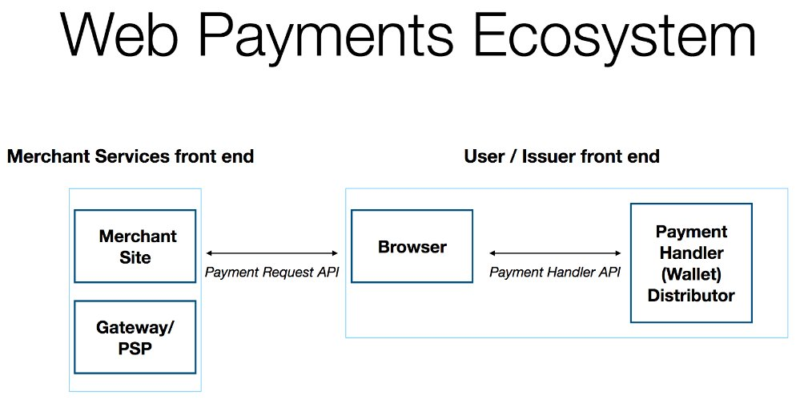
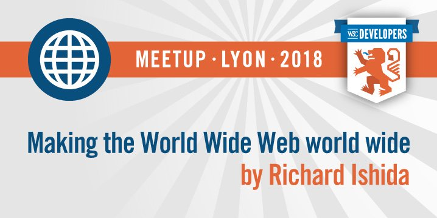
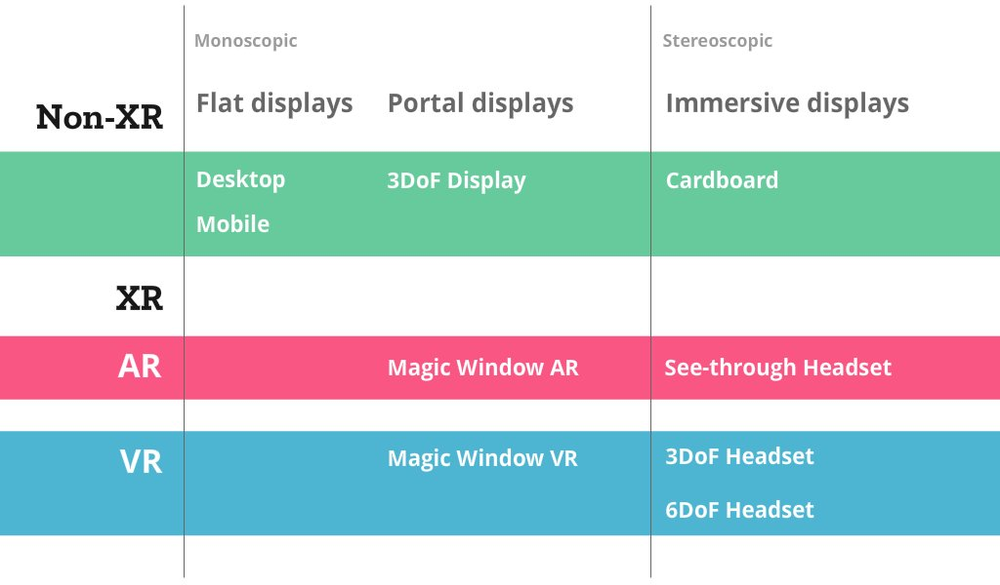
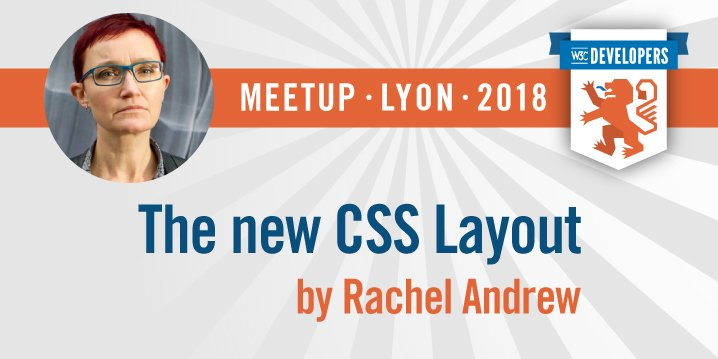

> October@w3c: conferences, webinar, W3Cx MOOCs, meetup and TPAC\! https://www\.w3\.org/participate/eventscal\.html 
> 
> 
> 1\-2: The @w3c's Web \#payments work will be presented by @mountainhippo @nexo\_standards annual conference in \#Paris 🇫🇷   
> https://twitter\.com/nexo\_standards/status/1044900640558911488

 [Oct 01 2018, 14:26:17 UTC](https://twitter.com/w3cdevs/status/1046768267799523328)

----

> 4\-6: @w3c's staff @dontcallmeDOM, @r12a and Bert Bos will be @ParisWeb, in \#BoisColombes 🇫🇷 https://www\.paris\-web\.fr/ 
> 
> 

 [Oct 01 2018, 14:26:18 UTC](https://twitter.com/w3cdevs/status/1046768273172439040)

----

> 15: Opening a new session of @thew3cx \#HTML5 Apps and Games \#MOOC for \#app \#developers and \#gamers https://www\.edx\.org/course/html5\-apps\-and\-games @micbuffa @edXOnline 
> 
> 

 [Oct 01 2018, 14:26:19 UTC](https://twitter.com/w3cdevs/status/1046768275571527680)

----

> 17: Sign up for an hour long \#webinar chaired by @JAlanBird\. Learn about the business value for participating in the Publishing \#BusinessGroup and review the exciting work being undertaken by the @w3cpublishing group   
> https://www\.w3\.org/2018/10/17\-publishing\-webinar/ \[11am\-12pm CEST\] 
> 
> 

 [Oct 01 2018, 14:26:20 UTC](https://twitter.com/w3cdevs/status/1046768280646635521)

----

> 18: @wseltzer presents a @w3c initiative aimed at improving \#advertising on the Web, @NABShow in \#NewYork 🇺🇸 https://www\.nabshowny\.com/

 [Oct 01 2018, 14:26:21 UTC](https://twitter.com/w3cdevs/status/1046768284719362049)

----

> 22: Opening a new session of @thew3cx \#JavaScript Introduction \#MOOC for \#developers and \#designers https://www\.edx\.org/course/javascript\-introduction @micbuffa @uca\_education @edXOnline 
> 
> 

 [Oct 01 2018, 14:26:22 UTC](https://twitter.com/w3cdevs/status/1046768287227498497)

----

> 22\-26: The international Web community gathers in \#Lyon 🇫🇷 for a  week  of \#F2FMeetings to foster creation and cooperation on \#WebStandards'  development https://www\.w3\.org/2018/10/TPAC/ \#w3cTPAC

 [Oct 01 2018, 14:26:23 UTC](https://twitter.com/w3cdevs/status/1046768292222980097)

----

> 24\-26: This year, @w3c partners with @blendwebmix, the annual Web  event mixing conferences, workshops and networking \- all organized in  \#Lyon 🇫🇷\! https://www\.blendwebmix\.com/ 
> 
> 

 [Oct 01 2018, 14:26:24 UTC](https://twitter.com/w3cdevs/status/1046768297109319682)

----

> 22: @w3c's annual \#DevMeetup takes place @UniversiteLyon from 6:30pm\. Come hear awesome speakers and discover \#Web technologies in action\. Thx to our sponsors @mozilla With You @Microsoft @Qwant\_FR  @nttcom and @stickermule\! https://www\.w3\.org/2018/10/Meetup/ \#w3cdevs2018 \#OFFBlendWebMix 
> 
> 

 [Oct 01 2018, 14:26:24 UTC](https://twitter.com/w3cdevs/status/1046768294932475907)

----

> The @w3c XML Entity Definitions for Characters \(2nd Edition\)  
> \#WebStandard has been translated into Japanese http://takamu\.sakura\.ne\.jp/xml\-entity\-names\-ja/index\.html, thanks to @y\_takamu\! @w3c\_keio \#html5j
> 高村さん @y\_takamu、XML Entity Definitions for Characters \(2nd Edition\) と文字に対するXML実体の定義\(第2版\)のすばらしい日本語訳をありがとう  http://takamu\.sakura\.ne\.jp/xml\-entity\-names\-ja/index\.html @w3c\_keio \#html5j @naomi5500

 [Oct 01 2018, 15:18:25 UTC](https://twitter.com/w3cdevs/status/1046781387934773248)

----

> Introducing \#WebAudio and a new set of related cool demos to be presented at @w3c's \#w3cdevs2018 \#meetup on October 22 in \#Lyon 🇫🇷   
> https://www\.w3\.org/2018/10/Meetup/demos\.html \#OFFBlendWebMix 
> 
> 
> Recently moved to \#CandidateRecommendation status, the @w3c \#WebAudio specification helps process and synthesize audio in \#WebApps https://twitter\.com/w3c/status/1045680900548235269

 [Oct 02 2018, 14:14:18 UTC](https://twitter.com/w3cdevs/status/1047127640052781056)

----

> Discover what \#WebAudio \#WebMidi \#WebAssembly and \#WebComponents allow you to create\! For ex\., see and hear how native virtual instruments and real\-time audio effects can be executed either directly into a \#Browser or native applications, without changing a single line of code\! 
> 
> 

 [Oct 02 2018, 14:14:21 UTC](https://twitter.com/w3cdevs/status/1047127649947213826)

----

> Another example is real time \#guitar amp simulations, audio effects and commercial quality synthesizers running as a \#WebApp \-\- demo feat\. @micbuffa 
> 
> <video controls><source src="../media/1047127654107942912-jDKS_b3qkNdpCnJ5.mp4">Your browser does not support the video tag.</video>

 [Oct 02 2018, 14:14:22 UTC](https://twitter.com/w3cdevs/status/1047127654107942912)

----

> Last example: discover how Artificial Intelligence \#AI can be used with \#WebAudio and other @w3c \#APIs to produce smart virtual music instruments https://codepen\.io/teropa/full/RMGxOQ/ 
> 
> 

 [Oct 02 2018, 14:14:23 UTC](https://twitter.com/w3cdevs/status/1047127660676165633)

----

> All these demos and more will be shown by @micbuffa of @wimmics @uca\_research @Laboratoire\_I3S @inria\_sophia at the \#w3cdevs2018 \#meetup on October 22 @UniversiteLyon\. This event is free but you need to register\! https://ti\.to/w3c/w3c\-developer\-meetup\-lyon\-2018 
> 
> 

 [Oct 02 2018, 14:14:24 UTC](https://twitter.com/w3cdevs/status/1047127664220418048)

----

> WAI\-ARIA Graphics Module and Graphics Accessibility API Mappings support the \#accessibility of \#graphics such as charts, graphs, maps, technical drawings and scientific diagrams\. \#ARIA works with \#SVG, \#HTML5 Canvas,  \#CSS styling, etc\. \.\./2018/2018\-02\-tweets\.html\#x961252466426892292
> Congrats to editors @AmeliasBrain, Joanmarie Diggs, @cooper\_w3c, Fred Esch and Rich Schwerdtfeger for advancing two @w3c\_wai \#ARIA specifications to \#WebStandard status\! \#timetoadopt https://twitter\.com/w3c/status/1047053151235465217

 [Oct 02 2018, 14:23:44 UTC](https://twitter.com/w3cdevs/status/1047130013408141312)

----

> Introducing another of our great speakers at \#w3cdevs2018 in \#Lyon: come hear @nitot \(@QwantCom's VP Advocacy\) talk about \#privacy on the Web https://www\.w3\.org/2018/10/Meetup/ \#OFFBlendWebMix 
> 
> 
> Qwant aims at protecting the privacy of its users when searching the Web, but recognizes users still like personalized services\. Find out how open source Web\-based innovation can help have it both ways\! \#Privacy \#Cryptography \#DeviceSyncing \#OpenSource

 [Oct 03 2018, 15:31:43 UTC](https://twitter.com/w3cdevs/status/1047509509663588353)

----

> During the \#meetup demo time, @nitot and Levent Demir will demonstrate  
> @QwantCom's Masq technology and how it manages to offer personalization while knowing nothing about users https://www\.w3\.org/2018/10/Meetup/demos\.html\#demos\-sponsors \#Masq \#OpenSource https://twitter\.com/QwantCom/status/1009726262657605632 
> 
> 

 [Oct 03 2018, 15:31:44 UTC](https://twitter.com/w3cdevs/status/1047509515166515200)

----

> To hear directly from @nitot on how online services can be personalized yet private by design, register to the @w3c \#meetup that will take place on Monday 22 october @UniversiteLyon https://ti\.to/w3c/w3c\-developer\-meetup\-lyon\-2018 
> 
> 

 [Oct 03 2018, 15:31:45 UTC](https://twitter.com/w3cdevs/status/1047509518945607680)

----

> And it is now up and running https://mobile\.twitter\.com/anssik/status/1047526339891404801

 [Oct 03 2018, 16:40:22 UTC](https://twitter.com/w3cdevs/status/1047526784491827201)

----

> “@ParisWeb il faut qu’on parle\.” @dontcallmeDOM à propos du W3C pour les développeurs Web, et de l’impact des Développeurs Web sur le Web\. 
> 
> 

 [Oct 04 2018, 12:07:07 UTC](https://twitter.com/w3cdevs/status/1047820406734901253)

----

> @ParisWeb follow us\! ;\)

 [Oct 04 2018, 12:14:51 UTC](https://twitter.com/w3cdevs/status/1047822352246091776)

----

> Samedi après\-midi, je te retrouve @ParisWeb, pour un atelier W3C/Développeurs\. https://www\.paris\-web\.fr/2018/ateliers/le\-w3c\-pour\-les\-developeurs\-web\-echanges\-et\-discussions\.php 
> 
> 

 [Oct 04 2018, 12:20:30 UTC](https://twitter.com/w3cdevs/status/1047823775105015814)

----

> Do not miss the upcoming free @w3c \#developers \#meetup in \#Lyon 🇫🇷, on Monday 22 October from 6:30pm @UniversiteLyon\. Great line up of speakers and cool demos of Web technologies in action: https://www\.w3\.org/2018/10/Meetup/ and https://www\.w3\.org/2018/10/Meetup/demos\.html Please register\! 
> 
> 
> A ne pas manquer par les \#designers \#developers de \#Lyon et du \#GrandLyon \! Venez rencontrer la communauté Web du @w3c lors de ce \#meetup gratuit : demos, présentations, discussions sont au menu de la soirée \! Il faut juste s'inscrire 👉 https://ti\.to/w3c/w3c\-developer\-meetup\-lyon\-2018 \#OFFBlendWebMix

 [Oct 04 2018, 16:17:11 UTC](https://twitter.com/w3cdevs/status/1047883338751639553)

----

> A big thank you to our sponsors @Qwant\_FR @Microsoft @mozilla @stickermule @nttcom @webcastors and WithYou\. With special thanks to @UniversiteLyon for hosting the event\! 
> 
> 

 [Oct 04 2018, 16:29:21 UTC](https://twitter.com/w3cdevs/status/1047886399393988610)

----

> Ce talk sera rejoué le 22 octobre à \#Lyon, lors du @w3c \#meetup \! https://www\.w3\.org/2018/10/Meetup/ \#i18n \#international \#OFFBlendWebMix \#PlayitAgain https://twitter\.com/mupsigraphy/status/1048216856933408769

 [Oct 08 2018, 10:35:22 UTC](https://twitter.com/w3cdevs/status/1049246869958922240)

----

> 29: @w3ctag organizes a \#public \#meetup "MeetTheTAG" in \#Paris, 🇫🇷@mozilla's offices\. Come learn about current TAG's work \(design reviews of emerging \#Web technologies\) and give feedback in real time\! https://github\.com/w3ctag/meetings/tree/gh\-pages/2018/10\-paris

 [Oct 08 2018, 14:43:21 UTC](https://twitter.com/w3cdevs/status/1049309274885816320)

----

> Excited to show streamlined \#WebPayments demos in @firefox and @googlechrome at \#w3cdevs2018 \#meetup on October 22 in \#Lyon 🇫🇷\! https://www\.w3\.org/2018/10/Meetup/demos\.html \#OFFBlendWebMix 
> 
> 
> The @w3payments suite of \#APIs lets users pay for goods and services quickly, efficiently, and securely using a variety of innovative payment methods \(credit cards, Google Pay , Apple Pay, etc\.\) 
> 
> 

 [Oct 09 2018, 16:22:18 UTC](https://twitter.com/w3cdevs/status/1049696567542845440)

----

> Thanks to the @w3c Web payment handler \#API, the Web can enable completely new and innovative payment experiences\. Faster \#CheckOut and more secure user experiences https://www\.w3\.org/TR/payment\-handler/

 [Oct 09 2018, 16:22:20 UTC](https://twitter.com/w3cdevs/status/1049696575654645761)

----

> The @w3c Web Payment \#API allows the user agent to act as intermediary between merchants, users and payment method providers: https://www\.w3\.org/TR/payment\-request/   
> \.\./2018/2018\-01\-tweets\.html\#x956510872108707840

 [Oct 09 2018, 16:22:20 UTC](https://twitter.com/w3cdevs/status/1049696573494575105)

----

> In their demo, @marcosc \(@mozilla\) and @rsolomakhin \(@google\) will show how different browsers can use the same code to facilitate \#payments on the Web\. Register now\! https://ti\.to/w3c/w3c\-developer\-meetup\-lyon\-2018 
> 
> 

 [Oct 09 2018, 16:22:21 UTC](https://twitter.com/w3cdevs/status/1049696577282080768)

----

> \.@r12a is responsible for the internationalization activity in @w3c @webi18n whose work is to ensure that Web technologies can be used in as many languages and cultures as possible \(and ultimately, all of them\)
> Introducing one more of our great speakers lineup at the \#w3cdevs2018 \#meetup \- come hear from @r12a what it takes to make and keep the \#Web truly world wide on Oct 22 in \#Lyon https://www\.w3\.org/2018/10/Meetup/ 
> 
> 

 [Oct 10 2018, 12:22:35 UTC](https://twitter.com/w3cdevs/status/1049998628473974784)

----

> He will also highlight how to get involved \- if you too believe the Web is meant to be a universal computing platform, you too can help in making that vision true\.  
> To come and hear from @r12a in \#Lyon, do not forget to register for the free event https://ti\.to/w3c/w3c\-developer\-meetup\-lyon\-2018 
> 
> 

 [Oct 10 2018, 12:22:36 UTC](https://twitter.com/w3cdevs/status/1049998631825301504)

----

> In his talk, @r12a will present how @webi18n makes it a reality, and will introduce the recently launched Internationalization Initiative which is reinforcing that program https://twitter\.com/webi18n/status/1016669678708588545

 [Oct 10 2018, 12:22:36 UTC](https://twitter.com/w3cdevs/status/1049998630155939841)

----

> and a reminder, in case \#Houdini doesn't ring a bell \.\./2018/2018\-04\-tweets\.html\#x983277098705063936
> More \#CSS \#Houdini implementation, yay\! https://twitter\.com/DasSurma/status/1050322467481374721

 [Oct 11 2018, 10:01:46 UTC](https://twitter.com/w3cdevs/status/1050325577390014466)

----

> \#WebAuthn is expected to reduce the risks associated with passwords significantly  
> \.\./2018/2018\-03\-tweets\.html\#x976111114739175426
> Introducing another demo on schedule of our \#w3cdevs2018 \#meetup in \#Lyon 🇫🇷 \- a set of illustrations on how \#WebAuthN is set to change how we authenticate on the Web by @ve7jtb, Emil Lundenberg \(@yubico\) and @christiaanbrand \(@google\)   
> https://www\.w3\.org/2018/10/Meetup/demos\.html

 [Oct 11 2018, 14:08:11 UTC](https://twitter.com/w3cdevs/status/1050387591432982528)

----

> To enjoy these demos, all of our exciting \#w3cdevs2018 demos and talks, make sure to register for the event on Oct 22: https://ti\.to/w3c/w3c\-developer\-meetup\-lyon\-2018 
> 
> 

 [Oct 11 2018, 14:08:12 UTC](https://twitter.com/w3cdevs/status/1050387595069415424)

----

> We will also get a demo from @drsecure on how \#WebAuthn and Web Payments can be used together to make online payments safer  
> \.\./2018/2018\-04\-tweets\.html\#x987306196708274176

 [Oct 11 2018, 14:08:12 UTC](https://twitter.com/w3cdevs/status/1050387593144258560)

----

> This \#CommunityGroup started in March this year as we reported back then \.\./2018/2018\-03\-tweets\.html\#x976128411654537217
> What technical approaches, in what procedural context, can be explored to help with the issues brought by technology in the social discourse \(while avoiding creating new ones\)? The \#CredibleWeb \#CommunityGroup is reporting its progress on the topic https://twitter\.com/sandhawke/status/1050501418946371585

 [Oct 12 2018, 09:33:37 UTC](https://twitter.com/w3cdevs/status/1050680882380591104)

----

> \#fr J\-7 avant le \#meetup \#w3cdevs2018 le 22 octobre à \#Lyon 🇫🇷 \- une occasion unique de découvrir les nouveautés de la plate\-forme Web présentées directement par ceux qui les bâtissent \! Les places partent vite, inscrivez vous rapidement \! \#OFFBlendWebMix https://www\.w3\.org/2018/10/Meetup/

 [Oct 15 2018, 12:57:33 UTC](https://twitter.com/w3cdevs/status/1051819366034092034)

----

> Only 6 days before our \#w3cdevs2018 \#meetup in Lyon 🇫🇷 during \#w3cTPAC \- introducing another topic of our demo sessions: \#ImmersiveWeb, i\.e\. how to bring augmented and virtual reality \(AR, VR, XR\) to Web browsers \#OFFBlendWebMix  
> https://www\.w3\.org/2018/10/Meetup/demos\.html
> During the \#w3cdevs2018 demo session, we'll get demos of the \#ImmersiveWeb in action via \#WebXR from @rcabanier, courtesy of @MagicLeapDevs

 [Oct 16 2018, 13:40:38 UTC](https://twitter.com/w3cdevs/status/1052192597282672641)

----

> A couple of weeks ago, the @w3c \#ImmersiveWeb Working Group was launched, to bring the work on \#WebXR to the standardization track https://twitter\.com/w3c/status/1044305804185276417

 [Oct 16 2018, 13:40:39 UTC](https://twitter.com/w3cdevs/status/1052192601334398976)

----

> As usual, that \#WebXR API is developed in github https://github\.com/immersive\-web/webxr/ with in particular a detailed explainer on how the technology is expected to be used https://github\.com/immersive\-web/webxr/blob/master/explainer\.md

 [Oct 16 2018, 13:40:40 UTC](https://twitter.com/w3cdevs/status/1052192606879240192)

----

> The \#WebXR Device API brings the right primitives to create VR &amp; AR experiences in Web browsers: connecting to VR headsets, setting up the right rendering path, support for the right input devices, etc 
> 
> 

 [Oct 16 2018, 13:40:40 UTC](https://twitter.com/w3cdevs/status/1052192603502854145)

----

> Meanwhile, the \#ImmersiveWeb Community Group continues in parallel to incubate lots of other needed bricks to make the Web a great platform for XR https://www\.w3\.org/community/immersive\-web/ https://github\.com/immersive\-web/

 [Oct 16 2018, 13:40:41 UTC](https://twitter.com/w3cdevs/status/1052192609500725252)

----

> To enjoy this \#XR demos, all of our other exciting \#w3cdevs2018 demos and talks, make sure to register for the event on Oct 22: https://ti\.to/w3c/w3c\-developer\-meetup\-lyon\-2018/ 
> 
> 

 [Oct 16 2018, 13:40:42 UTC](https://twitter.com/w3cdevs/status/1052192611748855813)

----

> TPAC \(aka Technical Plenary &amp; Advisory Committee\) is the biggest event in the @w3c year, where most W3C groups come together in the same place to have their face\-to\-face meetings, and have joint meetings with one another https://www\.w3\.org/2018/10/TPAC/ 
> 
> 
> If you're coming to \#w3cTPAC next week in Lyon, these cards provide a great overview of all you need to know about the week https://twitter\.com/w3c/status/1052189412900184064

 [Oct 16 2018, 15:07:32 UTC](https://twitter.com/w3cdevs/status/1052214466673299461)

----

> 36 Working and Interest Group meetings, 10 Community Group meetings happening the same week in the same place \- you can feel the future of the Web Platform shaping up organically across these groups and meetings https://www\.w3\.org/2018/10/TPAC/schedule\.html

 [Oct 16 2018, 15:07:33 UTC](https://twitter.com/w3cdevs/status/1052214471006048256)

----

> More importantly, it's a unique opportunity for the @w3c community at large to meet together, exchange ideas, plan for new work, and socialize\.

 [Oct 16 2018, 15:07:33 UTC](https://twitter.com/w3cdevs/status/1052214469705764865)

----

> naturally, there is also our very own \#w3cdevs2018 meetup on the Monday night with talks and demos, and exchanges with the local dev community https://www\.w3\.org/2018/10/Meetup/

 [Oct 16 2018, 15:07:34 UTC](https://twitter.com/w3cdevs/status/1052214475468759042)

----

> In addition to these meetings, the Wednesday of the week is run as an unconference, across group boundaries \- all the participants are invited to make and review suggestions for breakout sessions that will run throughout that day https://www\.w3\.org/wiki/TPAC/2018/SessionIdeas\#Proposed\_sessions 
> 
> 

 [Oct 16 2018, 15:07:34 UTC](https://twitter.com/w3cdevs/status/1052214472549560320)

----

> \.@rachelandrew will talk about the new CSS layout, which also happens to be the title of her latest published book \(coincidence???\)  
> https://twitter\.com/rachelandrew/status/917764714414747651
> Announcing our last \(but not least by any margin\) speaker at the \#w3cdevs2018 \#meetup next Monday in \#Lyon 🇫🇷 \- @rachelandrew \- invited expert to @csswg, editor in chief of @smashingmag, and independent web developer https://www\.w3\.org/2018/10/Meetup/ 
> 
> 

 [Oct 17 2018, 14:13:10 UTC](https://twitter.com/w3cdevs/status/1052563173553786880)

----

> To come and hear from @rachelandrew in \#Lyon, do not forget to register for the free event https://ti\.to/w3c/w3c\-developer\-meetup\-lyon\-2018/ 
> 
> 

 [Oct 17 2018, 14:13:11 UTC](https://twitter.com/w3cdevs/status/1052563175776952320)

----

> \#WebAuthN stands for Web Authentication and provides an API to integrate external security devices in Web browsers, enabling more secure flows both in registration and authentication\. Using your phone as a phishing\-resistant security key is a game changer\!  
> \.\./2018/2018\-03\-tweets\.html\#x976111114739175426
> The clock is ticking \- just 4 days left before our \#w3cdevs2018 \#meetup in \#Lyon 🇫🇷 @UniversiteLyon \! The last topic of our demos of ongoing standardization efforts will be \#WebAuthN \#OFFBlendWebMix  
> https://www\.w3\.org/2018/10/Meetup/demos\.html

 [Oct 18 2018, 12:52:01 UTC](https://twitter.com/w3cdevs/status/1052905138472579072)

----

> To enjoy these demos, all of our exciting \#w3cdevs2018 demos and talks, make sure to register for the event on Oct 22: https://ti\.to/w3c/w3c\-developer\-meetup\-lyon\-2018/

 [Oct 18 2018, 12:52:02 UTC](https://twitter.com/w3cdevs/status/1052905142469763072)

----

> The demos will show \#WebAuthn in combination with \#Bluetooth Low Energy, with biometric devices, etc; it will also show the possible role of \#WebAuthN in providing more secure \#WebPayment workflows, a key aspect at the intersection of UX and security \.\./2018/2018\-04\-tweets\.html\#x987306196708274176

 [Oct 18 2018, 12:52:02 UTC](https://twitter.com/w3cdevs/status/1052905140854894592)

----

> The name \#CSS Houdini refers to the magic box that CSS brings to the Web: browsers do lots of amazing work, but leave little for devs\. to intervene\. Thx to CSS Houdini, certain parts of the CSS engine will be exposed to \#WebDevelopers \.\./2018/2018\-04\-tweets\.html\#x983277092501671937

 [Oct 18 2018, 15:35:46 UTC](https://twitter.com/w3cdevs/status/1052946348608315394)

----

> \#CSS Houdini lets you build polyfills for CSS and experiment       with crafting new CSS properties or values and has been developed as a joint effort of the @csswg and @w3ctag \.\./2018/2018\-08\-tweets\.html\#x1027861858450071552
> Another @w3c work in progress that will be demo\-ed at the       \#w3cdevs2018 \#meetup in \#Lyon: the \#CSS \#Houdini APIs \#OFFBlendWebMix https://www\.w3\.org/2018/10/Meetup/demos\.html

 [Oct 18 2018, 15:35:46 UTC](https://twitter.com/w3cdevs/status/1052946346469154816)

----

> Register to @w3c's \#DevMeetup and come hear @bfgeek \(@google\) talk about CSS Houdini\! https://ti\.to/w3c/w3c\-developer\-meetup\-lyon\-2018 \#OFFBlendWebMix 
> 
> 

 [Oct 18 2018, 15:35:47 UTC](https://twitter.com/w3cdevs/status/1052946350374051840)

----

> The first demo is immersive\-style \#telepresence, that is an application enabling an operator to have a real\-time sensation of being at a difference place, and being able to interact with the \#remote environment via a \#robot \#WebRTC 
> 
> 
> Introducing the last demos of the \#w3cdevs2018 \#meetup: @nttcomm's \#WebRTC Gateway \- https://www\.w3\.org/2018/10/Meetup/demos\.html \#Lyon @UniversiteLyon 
> 
> 

 [Oct 19 2018, 12:16:20 UTC](https://twitter.com/w3cdevs/status/1053258546635309056)

----

> The second demo is about sending data to the cloud\. @nttcom has developed a new platform to let the users freely compose their original media processing pipeline \(e\.g\. recording and voice recognition\) \#WebRTC \#VoiceRecognition \#MediaProcessing 
> 
> 

 [Oct 19 2018, 12:16:22 UTC](https://twitter.com/w3cdevs/status/1053258552679297024)

----

> Come discuss with the @nttcom's team @komasshu, Jun Makishi and Toshiya Nakakura on what \#WebRTC can do, and how their gateway platform can help realize your application with real\-time multimedia data\. 
> 
> 

 [Oct 19 2018, 12:16:23 UTC](https://twitter.com/w3cdevs/status/1053258556378673152)

----

> The @w3c \#DevMeetup demos will start at 6:30pm next Monday 22October\. We invite \#developers and \#designers from \#Lyon and \#GrandLyon to attend\! Register fast: https://ti\.to/w3c/w3c\-developer\-meetup\-lyon\-2018 \#OFFBlendWebMix 
> 
> 

 [Oct 19 2018, 12:16:24 UTC](https://twitter.com/w3cdevs/status/1053258562976268288)

----

> A sample of stickers avail\. at tonight's \#w3cdevs2018  \#devmeetup and during \#w3cTPAC too\. Thanks to @stickermule\! The Web roars in \#Lyon\! 😄 
> 
> 

 [Oct 22 2018, 13:49:26 UTC](https://twitter.com/w3cdevs/status/1054369137034698757)

----

> \#w3cTPAC is wrapping up after an intensive week of @w3c meetings\. For those in \#Paris Monday October 29, reminder there is a @w3ctag meetup hosted by @MozillaParis https://ti\.to/w3c\-tag/meet\-the\-tag\-paris

 [Oct 26 2018, 14:20:10 UTC](https://twitter.com/w3cdevs/status/1055826424257527809)