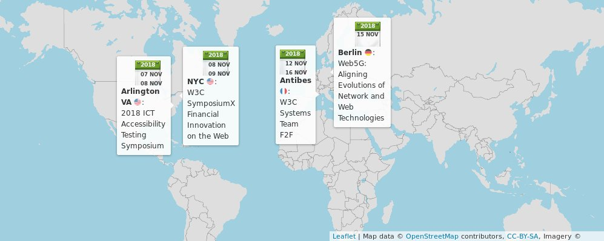
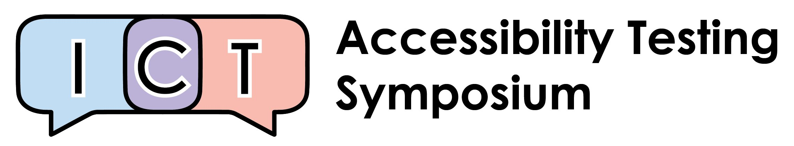
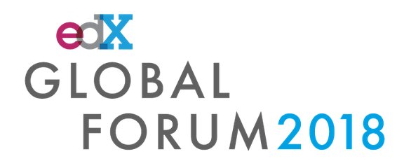
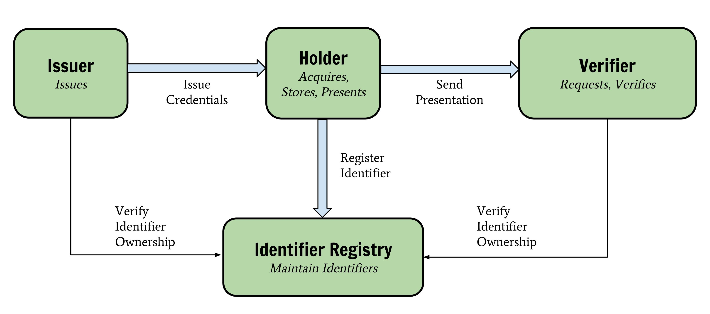
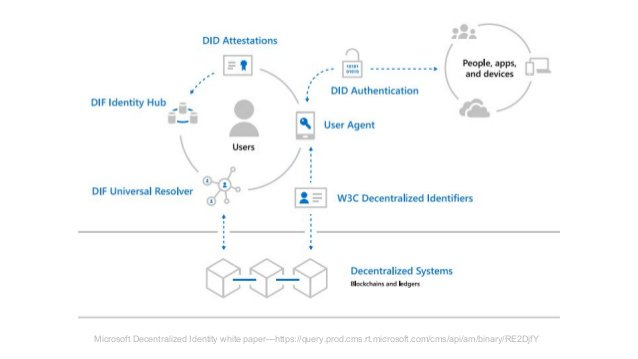

> November@w3c: meetings, talks, conferences, etc\. https://www\.w3\.org/participate/eventscal\.html 
> 
> 
> Nov 7\-8: the @w3c\_wai team participates in the 2018 ICT Accessibility Testing Symposium @A11yTesting18 in \#Arlington 🇺🇸 https://www\.ictaccessibilitytesting\.org/ \#a11y \#accessibility 
> 
> 

 [Nov 05 2018, 14:35:44 UTC](https://twitter.com/w3cdevs/status/1059454221915951105)

----

> Nov 8: @ibjacobs speaks at @w3c and FortuneTimesNYC's SymposiumX on financial innovation on the Web thanks to @w3payments , in \#NewYork 🇺🇸 https://www\.eventbrite\.com/e/symposiumx\-financial\-innovation\-on\-the\-web\-tickets\-49402053873 
> 
> 

 [Nov 05 2018, 14:35:46 UTC](https://twitter.com/w3cdevs/status/1059454226856853510)

----

> Nov 15: @dontcallmeDOM presents \#Web5G: Aligning Evolutions of Network and \#Web Technologies in \#Berlin 🇩🇪 during @fraunhoferfokus 's FUSECO forum as part of \#Berlin5GWeek https://www\.fokus\.fraunhofer\.de/day\-1\-e37144786b024dd0\#Panel\-a3ebb51c 
> 
> 

 [Nov 05 2018, 14:35:47 UTC](https://twitter.com/w3cdevs/status/1059454232896643072)

----

> Nov 12\-16: the @w3c\_systeam organizes its annual \#f2fmeeting in \#SophiaAntipolis 🇫🇷\.  
>   
> On the menu: \#github integration, modern tooling and infrastructure upgrades\. https://github\.com/w3c/modern\-tooling/

 [Nov 05 2018, 14:35:47 UTC](https://twitter.com/w3cdevs/status/1059454231256711168)

----

> Nov 17: The Chinese Web Interest Group meets in Hangzhou 🇨🇳  
> https://github\.com/w3c/chinese\-ig/blob/master/meetings/2018\-11\-17\.md
> Nov\. 15: @jeff\_jaffe presents @thew3cx's global impact at the @edXOnline Global Forum, in Boston 🇺🇸 https://globalforum\.edx\.org/ 
> 
> 

 [Nov 05 2018, 15:25:34 UTC](https://twitter.com/w3cdevs/status/1059466762150969344)

----

> https://twitter\.com/w3c/status/1059804339047407616

 [Nov 06 2018, 13:47:46 UTC](https://twitter.com/w3cdevs/status/1059804536662036482)

----

> https://twitter\.com/w3c/status/1059803971307618305

 [Nov 06 2018, 13:47:46 UTC](https://twitter.com/w3cdevs/status/1059804535324098560)

----

> \#WebPayments from @w3payments \.\./2018/2018\-04\-tweets\.html\#x987306196708274176

 [Nov 12 2018, 13:24:22 UTC](https://twitter.com/w3cdevs/status/1061972977120673794)

----

> The scope for the \#W3CWorkshop includes alignment between several relevant efforts in this space:   
> \#WebAuthn \.\./2018/2018\-05\-tweets\.html\#x997371997620506624
> Friday this week \(Nov 16 🗓️\) is the last day to apply to participate to the @w3c workshop on Strong \#Authentication and \#Identity https://www\.w3\.org/Security/strong\-authentication\-and\-identity\-workshop/cfp\.html  
> https://twitter\.com/w3c/status/1048204859781124096

 [Nov 12 2018, 13:24:22 UTC](https://twitter.com/w3cdevs/status/1061972975690366978)

----

> Verifiable Credentials \- the work from the Verifiable Claims Working Group aims at a providing mechanism to express credentials such as driver's licenses or university degrees on the Web in a way that is  secure, privacy respecting, and machine verifiable https://w3c\.github\.io/vc\-data\-model/ 
> 
> 

 [Nov 12 2018, 13:24:23 UTC](https://twitter.com/w3cdevs/status/1061972978475433984)

----

> Decentralized identifiers aims at building identifiers without central authority \- a key component of so called "self\-sovereign identity" \#ssi, i\.e\. lifetime portable identity for any person, org or thing that doesn't depend on any centralized authority and can't be taken away 
> 
> 

 [Nov 12 2018, 13:24:24 UTC](https://twitter.com/w3cdevs/status/1061972985731563520)

----

> Most notably among its work items, the work on Decentralized Identifiers \#DID is expected to be under the spotlight at the workshop https://w3c\-ccg\.github\.io/did\-spec/

 [Nov 12 2018, 13:24:24 UTC](https://twitter.com/w3cdevs/status/1061972983831556097)

----

> In addition to this existing ongoing @w3c standardization efforts, it will also be looking at technologies under incubation in in the Credentials \#CommunityGroup  
> https://www\.w3\.org/community/credentials/

 [Nov 12 2018, 13:24:24 UTC](https://twitter.com/w3cdevs/status/1061972982044786688)

----

> The workshop itself will happen on Dec 10\-11 in \#Seattle 🇺🇸 hosted by @microsoft @AzureAD https://twitter\.com/azuread/status/1050425095003369472

 [Nov 12 2018, 13:24:25 UTC](https://twitter.com/w3cdevs/status/1061972989112184834)

----

> Of course, a lot of relevant work in this space happens in other organizations and communities: @ietf, @isostandards, @openidconnect, @oauth\_2, @OASISopen with \#SAML which we hope to see represented there

 [Nov 12 2018, 13:24:25 UTC](https://twitter.com/w3cdevs/status/1061972987941998593)

----

> So, if you have something to contribute to this conversation, you just have a few days left \(until Friday Nov 16 🗓️\) to apply \- don't miss it\!

 [Nov 12 2018, 13:24:26 UTC](https://twitter.com/w3cdevs/status/1061972990450196480)

----

> The @w3c ARIA Working Group has been rechartered for 3 more years, to continue its work on \#WAI\_ARIA and its mappings to native host languages https://www\.w3\.org/2018/11/aria\-charter https://twitter\.com/w3c/status/1060972362370351105
> The more detailed roadmap  https://www\.w3\.org/WAI/ARIA/roadmap of the group includes:  
> \* achieving parity with native host language semantics  
> \* providing support for the \#accessibility Object Model \.\./2018/2018\-02\-tweets\.html\#x959464445423517697

 [Nov 12 2018, 15:10:33 UTC](https://twitter.com/w3cdevs/status/1061999698649726976)

----

> \* developing and maintaining additional \#WAI\_ARIA features for authors and end users  
> \* ensuring consistency in platform \#accessibility API Mappings

 [Nov 12 2018, 15:10:34 UTC](https://twitter.com/w3cdevs/status/1061999701568950272)

----

> No implementation yet, but @GoogleChromeDev has ongoing work on it https://bugs\.chromium\.org/p/chromium/issues/detail?id\=805271

 [Nov 15 2018, 11:48:03 UTC](https://twitter.com/w3cdevs/status/1063035901243219968)

----

> For instance, an &lt;hello\-wolrd&gt; component defined with  
>   &lt;template&gt;Hello &lt;span part\=name&gt;World&lt;/span&gt;&lt;/template&gt;  
> could be styled in a page using the compenent with  
>   hello\-world::part\(name\) \{ color: red;\}
> \#CSS Shadow Parts brings a new CSS selector \(::part\(\)\) to enable stylistic customization of Web components: \#WebComponents creators get to identify which part of the Shadow DOM they create can have their style customized in the hosting page\.  
> https://www\.w3\.org/TR/css\-shadow\-parts\-1/ https://twitter\.com/w3c/status/1063014804317749249

 [Nov 15 2018, 11:48:03 UTC](https://twitter.com/w3cdevs/status/1063035899842322432)

----

> As usual, the editors draft https://drafts\.csswg\.org/css\-shadow\-parts/ is maintained in github in the @csswg repository of specs where issues and feedback can be brought https://github\.com/w3c/csswg\-drafts/tree/master/css\-shadow\-parts\-1

 [Nov 15 2018, 11:48:04 UTC](https://twitter.com/w3cdevs/status/1063035903269052416)

----

> If you want a blue beanie to show your support of \#webstandards and \#a11y on \#BlueBeanieDay, you can get a @w3c one at https://shop\.spreadshirt\.fr/w3cshop/w3cbluebeanie\-A13465468?size\=29 
> 
> 

 [Nov 30 2018, 15:12:41 UTC](https://twitter.com/w3cdevs/status/1068523214198853637)