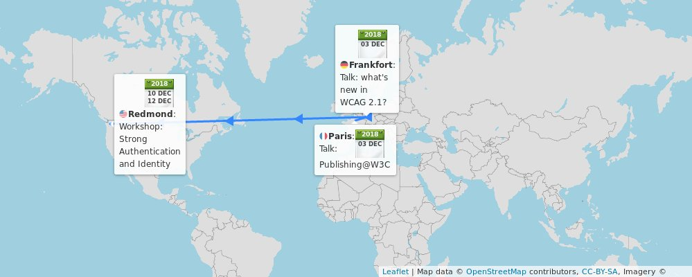
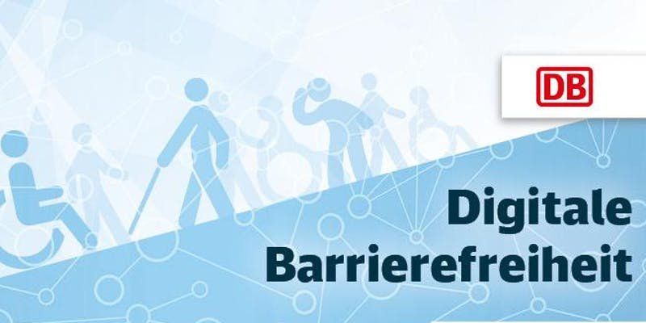
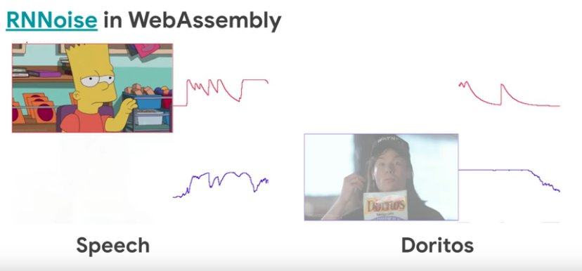

> 🗓️ December@w3c: conferences, workshop, etc\. https://www\.w3\.org/participate/eventscal\.html 
> 
> 
> Dec\. 3: @ivan\_herman, @lmrlaurent and Daihei Shiohama present the @w3cpublishing work at the "Assises du Livre numérique" event @SNEedition, in \#Paris 🇫🇷 https://www\.sne\.fr/evenement\_sne/les\-10\-ans\-des\-assises\-du\-livre\-numerique/ \#EPUB \#eBook \#livre \#numerique

 [Dec 01 2018, 08:12:35 UTC](https://twitter.com/w3cdevs/status/1068779882342162432)

----

> Dec\. 3: Eric Eggert @yatil of @w3c\_wai presents "News in \#WCAG21" at the @DB\_Bahn "Digital Accessibility \- Eliminating Barriers through Technology" event, in \#Frankfurt 🇩🇪 \#a11y \#accessibility\. Register at https://www\.eventbrite\.de/e/digitale\-barrierefreiheit\-durch\-technik\-barrieren\-beseitigen\-tickets\-52080012720 @DB\_Skydeck @dbsystel \#RheinMainRocks

 [Dec 01 2018, 08:12:36 UTC](https://twitter.com/w3cdevs/status/1068779886725263361)

----

> Dec\. 3: Eric Eggert @yatil @w3c\_wai präsentiert "News in \#WCAG21" bei der @DB\_Bahn "Digital Accessibility \- Eliminating Barriers through Technology" veranstaltung, in \#Frankfurt 🇩🇪 \#a11y \#accessibility\. Hier anmelden: https://www\.eventbrite\.de/e/digitale\-barrierefreiheit\-durch\-technik\-barrieren\-beseitigen\-tickets\-52080012720 @DB\_Skydeck @dbsystel \#RheinMainRocks 
> 
> 

 [Dec 01 2018, 08:12:37 UTC](https://twitter.com/w3cdevs/status/1068779889208250373)

----

> \.\.\. Find out more about the workshop's agenda https://www\.w3\.org/Security/strong\-authentication\-and\-identity\-workshop/schedule\.html and its context: \.\./2018/2018\-11\-tweets\.html\#x1061972975690366978

 [Dec 01 2018, 08:12:38 UTC](https://twitter.com/w3cdevs/status/1068779894992224256)

----

> Dec\. 10\-11: \#W3CWorkshop on Strong \#Authentication and \#Identity, in Redmond, \#Seattle 🇺🇸 hosted by @microsoft @azuread https://www\.w3\.org/Security/strong\-authentication\-and\-identity\-workshop/

 [Dec 01 2018, 08:12:38 UTC](https://twitter.com/w3cdevs/status/1068779893570371584)

----

> Election time 🗳️ for the @w3c Technical Architecture Group @w3ctag\!  
>   
> If you want a refresher on what is the TAG: \.\./2018/2018\-01\-tweets\.html\#x957974903122219008
> Three seats are up for election and four people have been  nominated as candidates: Alice Boxhall from @googlechrome, Travis Leithead from @microsoft,  Sangwhan Moon from Odd Concepts, and Theresa O'Connor from @apple

 [Dec 04 2018, 13:31:53 UTC](https://twitter.com/w3cdevs/status/1069947401056804864)

----

> Travis Leithead \(@TravisLeithead\) promotes the need for ever more reviews of specifications and documents produced by @w3c \#WorkingGroups and  \#CommunityGroups

 [Dec 04 2018, 13:31:54 UTC](https://twitter.com/w3cdevs/status/1069947406173827074)

----

> Alice Boxhall's \(@sundress\) interests are focused on anchoring Web architecture in \#accessibility \#a11y: “I believe that the TAG is in a unique position to gently influence the direction of the web towards greater accessibility by default”

 [Dec 04 2018, 13:31:54 UTC](https://twitter.com/w3cdevs/status/1069947404852584448)

----

> Each of the four candidates have posted statements about their candidature https://www\.w3\.org/2018/12/03\-tag\-nominations

 [Dec 04 2018, 13:31:54 UTC](https://twitter.com/w3cdevs/status/1069947403543998464)

----

> The @w3c membership elects the @w3ctag members \(election open until 🗓️4 January 2019\) \- the results will be announced around mid\-January\. Stay tuned\!

 [Dec 04 2018, 13:31:55 UTC](https://twitter.com/w3cdevs/status/1069947409617293312)

----

> Theresa O'Connor \(@hober\) wants to work on ensuring “the long term viability and flourishing of the Web”, by ensuring among other things its wide applicability, e\.g\. in @w3cpublishing efforts, and good ongoing collaboration with @whatwg

 [Dec 04 2018, 13:31:55 UTC](https://twitter.com/w3cdevs/status/1069947408463872000)

----

> Sangwhan Moon \(@sangwhanmoon\) is an active contributor to \#WebStandards and is helping \#inclusion of Korean, Japanese and Asian Web communities to be engaged in W3C's work

 [Dec 04 2018, 13:31:55 UTC](https://twitter.com/w3cdevs/status/1069947407306289152)

----

> The @w3c BD Comics Manga Community Group is indeed open to all to join “to study and document, for all kinds of visual narratives expressed  digitally, a common conceptual model and associated sets of controlled  values” https://www\.w3\.org/community/bdcomacg/ https://twitter\.com/lmrlaurent/status/1069956095953829888

 [Dec 04 2018, 14:26:55 UTC](https://twitter.com/w3cdevs/status/1069961248496910336)

----

> As many other in tech, the @W3C community has a \#diversity issue to address\.  
> @LeonieWatson shares in this video what the \#CommunityGroup she created earlier this year hopes to do in this space  
> https://vimeo\.com/303668138
> This Community Group started as the W3C Women \#CommunityGroup, and got recently rebranded as the \#Inclusion and \#Diversity \#CommunityGroup to broaden its scope\.  
> https://www\.w3\.org/community/w3c\-women/2018/11/21/call\-for\-participation\-in\-the\-w3c\-inclusion\-and\-diversity\-community\-group/

 [Dec 04 2018, 16:32:36 UTC](https://twitter.com/w3cdevs/status/1069992880519942150)

----

> Some groups in W3C have developed and are experimenting with complementary rules for their \#CodeOfConduct, e\.g\. recently the \#ImmersiveWeb Working Group https://immersive\-web\.github\.io/homepage/code\-of\-conduct\.html

 [Dec 04 2018, 16:32:37 UTC](https://twitter.com/w3cdevs/status/1069992884454199301)

----

> The work of this group is expected to be complementary to other efforts @w3c started over the year such as the Positive Work  Environment Community Group that develops and maintains the global @w3c \#CodeofConduct  
> https://www\.w3\.org/blog/2018/09/positive\-work\-environment\-community\-group/

 [Dec 04 2018, 16:32:37 UTC](https://twitter.com/w3cdevs/status/1069992883237937153)

----

> The @w3ctag has also asked \(via its chair @torgo\) that its composition be more diverse, asking the w3c membership to pay attention to that criteria when offering candidates to the TAG election http://slides\.com/torgo/tag\-update\-acberlin\-05\-2018\#/0/11

 [Dec 04 2018, 16:32:38 UTC](https://twitter.com/w3cdevs/status/1069992888405254145)

----

> This led to the set up of a TPAC diversity scholarship which the first   
> few people benefited from at our \#w3cTPAC meeting end of October   
> https://twitter\.com/w3c/status/1011697058988941314

 [Dec 04 2018, 16:32:38 UTC](https://twitter.com/w3cdevs/status/1069992887037898753)

----

> The topic of diversity was also a key topic discussed at the W3C membership meeting a few months ago  
> https://www\.w3\.org/blog/2018/06/w3c\-strategic\-highlights\-for\-spring\-2018\-and\-advisory\-committee\-meeting/

 [Dec 04 2018, 16:32:38 UTC](https://twitter.com/w3cdevs/status/1069992885871931392)

----

> Thanks to @webcastors for filming this interview, and thanks to @LeonieWatson for accepting to summarize this effort in this impromptu interview\! This is a first of a series of short interview we captured during \#w3cTPAC this year, stay tuned for more\!

 [Dec 04 2018, 16:32:39 UTC](https://twitter.com/w3cdevs/status/1069992892423380992)

----

> If you are interested in helping, the Inclusion and Diversity Community Group is open to all to join https://www\.w3\.org/community/w3c\-women/

 [Dec 04 2018, 16:32:39 UTC](https://twitter.com/w3cdevs/status/1069992891135811584)

----

> \.@LeonieWatson covers in this video some of the other ideas in this space, including collaboration with @GirlsWhoCode or the Grace Hopper Celebration \#GHC18 https://vimeo\.com/303668138

 [Dec 04 2018, 16:32:39 UTC](https://twitter.com/w3cdevs/status/1069992889810411521)

----

> If you want to help make Web pages more pronounceable, a @w3c task force is starting to look at this\. https://twitter\.com/theA11Y/status/1070654681175728129
> Among other inputs to the work, an exploration of bringing SSML into HTML would help provide indications on pronunciation of HTML pages:  
> https://github\.com/mhakkinen/SSMLinHTMLproposal

 [Dec 06 2018, 16:03:49 UTC](https://twitter.com/w3cdevs/status/1070710412050612225)

----

> This is obviously helpful for assistive technologies \#accessibility, but this may also be of interest e\.g\. for voice assistants? Maybe something for the Voice Assistant Standardization \#CommunityGroup /cc @edent https://www\.w3\.org/community/voice\-assistant/

 [Dec 06 2018, 16:03:50 UTC](https://twitter.com/w3cdevs/status/1070710414655275010)

----

> A key aspect to giving input and feedback on a @w3c spec is … to be able to find the right spec \- @rachelandrew explains it all for \#CSS https://twitter\.com/24ways/status/1073367216559673344

 [Dec 14 2018, 07:22:31 UTC](https://twitter.com/w3cdevs/status/1073478325094543360)

----

> A reminder about where the SVG2 spec is at https://twitter\.com/svgeesus/status/1026846936236740608 
> 
> 
> The proposed new charter for the @svgwg suggests to focus its work on stabilization and interoperability testing of the core SVG 2 specification towards its finalization  
> https://www\.w3\.org/Graphics/SVG/svg\-2019\-ac\.html https://twitter\.com/w3c/status/1073508917253156864

 [Dec 17 2018, 15:57:27 UTC](https://twitter.com/w3cdevs/status/1074695075479859200)

----

> To continue the work on other features that would not pass the mark in terms of interoperability in the short term, the proposal on the table is to have a companion \#CommunityGroup to incubate these ideas further https://www\.w3\.org/community/

 [Dec 17 2018, 15:57:28 UTC](https://twitter.com/w3cdevs/status/1074695077597990914)

----

> Congrats to editors Joanmarie Diggs, @BryanEGaraventa and Michael Cooper of @w3c\_wai for the newly published @w3c \#WebStandard \#WAI\_ARIA \#accessibility \#a11y \#timetoadopt https://twitter\.com/w3c/status/1074935116957388800

 [Dec 18 2018, 08:16:48 UTC](https://twitter.com/w3cdevs/status/1074941537619009536)

----

> Last week, the \#WebRTC Working Group published its first release of its use cases for the next version of WebRTC https://twitter\.com/dret/status/1072423944383328256
> \#WebRTC is already widely used to power videoconferences and collaboration systems, in Web browsers and in other ecosystems \(e\.g\. native apps\)\. But its use has expanded beyond that initial core, leading to needs for more features and more optimizations\.  
> \.\./2018/2018\-07\-tweets\.html\#x1014175796758503424

 [Dec 18 2018, 14:19:42 UTC](https://twitter.com/w3cdevs/status/1075032865027563521)

----

> The concrete work on APIs to support these new use cases has already started, but is still in its very early phase https://www\.w3\.org/2011/04/webrtc/wiki/NV\_Documents\.

 [Dec 18 2018, 14:19:43 UTC](https://twitter.com/w3cdevs/status/1075032869771378695)

----

> The use cases document highlight some of these needs: improved performance for gaming, mobility, video conferencing, file sharing, \#IoT; improved support for processing audio and video feeds e\.g\. for \#MachineLearning\. 
> 
> 

 [Dec 18 2018, 14:19:43 UTC](https://twitter.com/w3cdevs/status/1075032867791605761)

----

> The \#WebRTC Working Group is still iterating on these use cases, to make sure they understand the full range of needs and their priorities\.   
>   
> If you want to chime in, head to the github repo\! https://github\.com/w3c/webrtc\-nv\-use\-cases/

 [Dec 18 2018, 14:19:44 UTC](https://twitter.com/w3cdevs/status/1075032872237625350)

----

> You can hear from @juberti on what @google sees as exciting opportunities in \#WebRTC NV on a talk he gave recently  
> https://www\.youtube\.com/watch?v\=gV354kWh08o&feature\=youtu\.be&list\=PL4\_h\-ulX5eNfaM0QM5r\-PewWaY\_zgLH7b&t\=1226

 [Dec 18 2018, 14:19:44 UTC](https://twitter.com/w3cdevs/status/1075032870912253953)

----

> For our French\-reading followers: a report from two participants to this year \#w3cTPAC with an introduction to what participation to W3C groups looks like https://twitter\.com/access42net/status/1075390298010869760

 [Dec 19 2018, 15:31:13 UTC](https://twitter.com/w3cdevs/status/1075413250639060992)

----

> Progressive font enrichment enables to download only a subset of the font you need, particularly useful in languages and scripts that require lots of glyphs \.\./2018/2018\-04\-tweets\.html\#x981906698813222913
> The Web Fonts Working Group is restarting its work under a new charter to work on progressive font enrichment https://www\.w3\.org/Fonts/WG/webfonts\-2018\.html https://twitter\.com/w3c/status/1073539111468916736

 [Dec 19 2018, 15:46:11 UTC](https://twitter.com/w3cdevs/status/1075417017866440707)