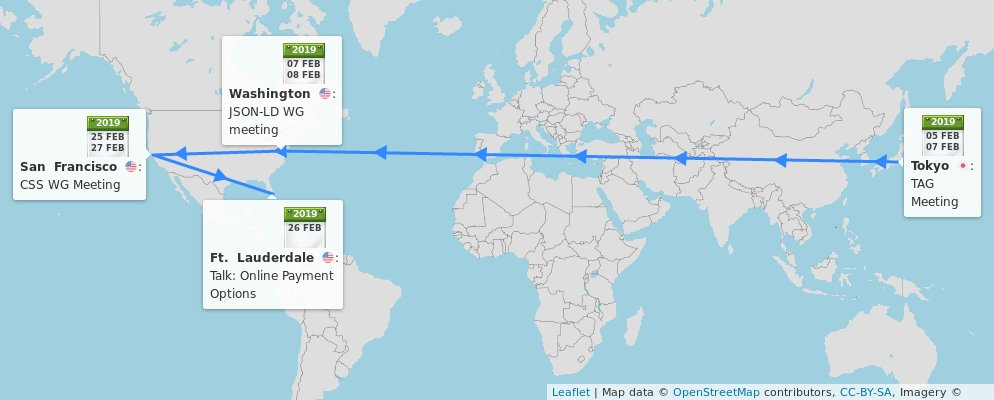
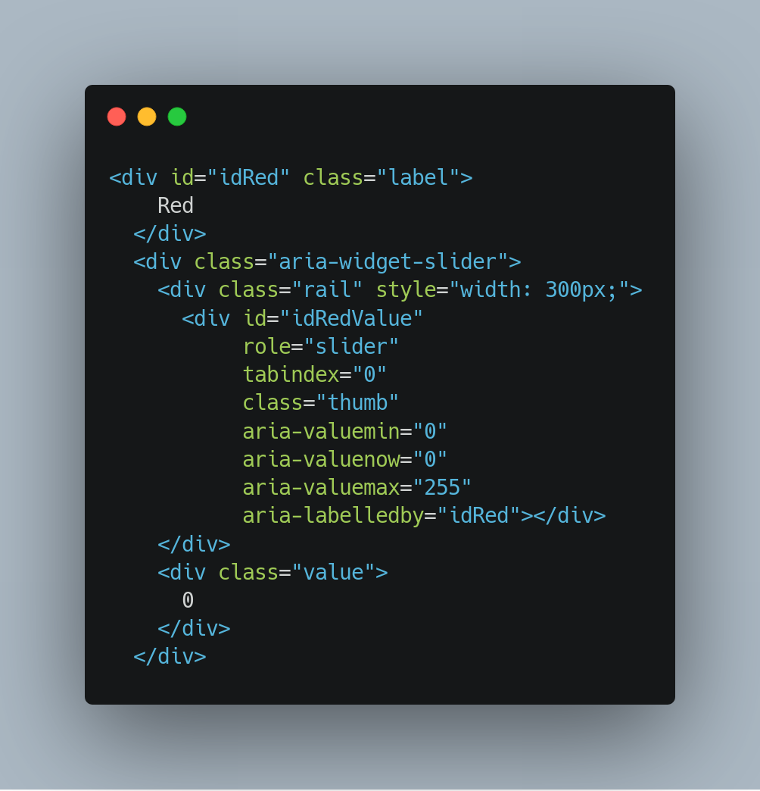

> \#timetoimplement The @csswg seeks feedback on \#github https://github\.com/w3c/csswg\-drafts until 1 May 2019 https://twitter\.com/w3c/status/1091020918023966726

 [Feb 01 2019, 09:45:46 UTC](https://twitter.com/w3cdevs/status/1091271379499003904)

----

> 🏆 \#HTML5 is in the Top 50 Developer Tools of 2018\! "The innovation built on top of HTML5 continues to amaze all" via StackShare https://stackshare\.io/posts/top\-developer\-tools\-2018\#html5

 [Feb 01 2019, 11:10:02 UTC](https://twitter.com/w3cdevs/status/1091292586642272257)

----

> 🗓️ February@w3c: @w3c groups' meetings, @thew3cx \#HTML5 course, Web payments conference, @W3CAustralia's roadshow, etc\. More at https://www\.w3\.org/participate/eventscal\.html 
> 
> 
> 5\-7 Feb\.: The @w3ctag holds its \#f2fmeeting in \#Tokyo 🇯🇵, hosted by @google https://github\.com/w3ctag/meetings/tree/gh\-pages/2019/02\-tokyo 
> 
> 

 [Feb 01 2019, 14:12:35 UTC](https://twitter.com/w3cdevs/status/1091338526300536832)

----

> 7\-8 Feb\.: The @w3c \#JSONLD \#WorkingGroup meets @FolgerLibrary in \#Washington, 🇺🇸 https://www\.w3\.org/2018/json\-ld\-wg/Meetings/F2F/2019\.02\.DC   
> \.\./2018/2018\-01\-tweets\.html\#x956888716076822533 
> 
> 

 [Feb 01 2019, 14:12:36 UTC](https://twitter.com/w3cdevs/status/1091338530951970818)

----

> 12 Feb\.: Launch of a new @thew3cx \#MOOC session about \#HTML5 Coding Essentials and Best Practices with Prof\. @micbuffa\. Enroll now and earn your @w3c Front\-End Web Developer program certificate\! https://www\.edx\.org/course/html5\-coding\-essentials\-and\-best\-practices 
> 
> 

 [Feb 01 2019, 14:12:37 UTC](https://twitter.com/w3cdevs/status/1091338534538170368)

----

> 26 Feb\.: @ibjacobs presents online \#payment options during a @SmarterPayments \#MAGMidYear19 conference panel, in \#FortLaunderdale, FL 🇺🇸 \#WebPayment   
> https://twitter\.com/SmarterPayments/status/1081256211742449670 
> 
> 

 [Feb 01 2019, 14:12:38 UTC](https://twitter.com/w3cdevs/status/1091338540573773824)

----

> 25\-27 Feb\.: The @csswg meets at @google offices in \#SanFrancisco, 🇺🇸 https://wiki\.csswg\.org/planning/sf\-2019

 [Feb 01 2019, 14:12:38 UTC](https://twitter.com/w3cdevs/status/1091338539311288320)

----

> 14, 21 and 22 Feb\.: \#Melbourne \#Sydney or \#Canberra? @w3c, @W3CAustralia and @ourANU organize their 2nd roadshow on the Future of the \#Web: "Who is Managing your \#privacy and \#Identity on the Web?" https://cecs\.anu\.edu\.au/events/w3c\-anu\-future\-web\-who\-managing\-your\-privacy\-and\-identity\-web 
> 
> 

 [Feb 01 2019, 14:12:38 UTC](https://twitter.com/w3cdevs/status/1091338537637695494)

----

> It illustrates the plasticity of the \#Web as a platform: entertainment, commerce, communication, connectivity and also compute platform\! New work is cooked in the strategy funnel on \#github https://github\.com/w3c/strategy/projects/2 by W3C's strategy team:  
> \.\./2018/2018\-04\-tweets\.html\#x982232776920334339
> To add to the great series of @w3c Strategic Highlights blog posts on https://www\.w3\.org/blog/, watch this short video where @wseltzer explores emerging trends of the Web Platform and how they translate in terms of new technical work in W3C: https://vimeo\.com/313340825 https://twitter\.com/w3c/status/1087333884717658113

 [Feb 04 2019, 17:21:04 UTC](https://twitter.com/w3cdevs/status/1092473125109944320)

----

> Thanks to @wseltzer for taking the time at \#w3ctpac2018 to show us the view from @w3c's strategy for the future of the \#Web https://vimeo\.com/313340825 \#Lyon \#October2018

 [Feb 04 2019, 17:21:05 UTC](https://twitter.com/w3cdevs/status/1092473127408467968)

----

> Today, the \#ImmersiveWeb Working Group released its first official draft of \#WebXR Device \#API\. WebXR is the successor to \#WebVR, as @Lady\_Ada\_King explains in the third and last part of her interview on Web &amp; XR \(virtual \+ augmented reality\)  https://vimeo\.com/313372258
> In her first video, we learned how the Web and XR complement each other so well \.\./2019/2019\-01\-tweets\.html\#x1087765256846348289

 [Feb 05 2019, 14:21:14 UTC](https://twitter.com/w3cdevs/status/1092790255881719808)

----

> \#WebXR is set to replace \#WebVR: it provides better integration with the rest of the Web platform, and a much firmer ground for Augmented Reality \#AR in addition to Virtual Reality \#VR \.\./2018/2018\-10\-tweets\.html\#x1052192603502854145

 [Feb 05 2019, 14:21:15 UTC](https://twitter.com/w3cdevs/status/1092790260025692165)

----

> Her second video shows how \#VR is already deployed on the Web today \.\./2019/2019\-01\-tweets\.html\#x1090307687106129924

 [Feb 05 2019, 14:21:15 UTC](https://twitter.com/w3cdevs/status/1092790258519994373)

----

> The @w3c \#ImmersiveWeb \#WorkingGroup was meeting in California last week, with lots of progress made around the management of input controllers, hit testing for \#AR and much more, to be brought to the specification in the upcoming few weeks https://twitter\.com/NellWaliczek/status/1092495882157576193

 [Feb 05 2019, 14:21:16 UTC](https://twitter.com/w3cdevs/status/1092790265251856384)

----

> The WebXR spec is developed on \#github where you should go to bring feedback on the \#API https://github\.com/immersive\-web/webxr/

 [Feb 05 2019, 14:21:16 UTC](https://twitter.com/w3cdevs/status/1092790263968382976)

----

> The best way to play with \#WebXR at the moment is through the WebVR\-based \#polyfill https://github\.com/immersive\-web/webxr\-polyfill

 [Feb 05 2019, 14:21:16 UTC](https://twitter.com/w3cdevs/status/1092790262793945088)

----

> With this First Public Working Draft, \#WebXR Device API starts its path on the standardization track, aiming to become a @w3c \#WebStandard https://www\.w3\.org/TR/2019/WD\-webxr\-20190205/ https://twitter\.com/w3c/status/1092789169598935040

 [Feb 05 2019, 14:21:16 UTC](https://twitter.com/w3cdevs/status/1092790261497974784)

----

> Thanks again to @Lady\_Ada\_King for sharing the vision behind the \#ImmersiveWeb in this 3\-part video series\! https://vimeo\.com/313372258

 [Feb 05 2019, 14:21:17 UTC](https://twitter.com/w3cdevs/status/1092790266942115845)

----

> in a little more than an hour ⌚️… https://twitter\.com/w3c\_wai/status/1092810733979607041

 [Feb 05 2019, 15:44:47 UTC](https://twitter.com/w3cdevs/status/1092811279134347266)

----

> In this talk, @alispivak shares some of the history of @MozDevNet and how the Product Advisory Board \(PAB\) started end of 2017 is helping to better create the documentation developers want and need\.  
> \.\./2018/2018\-09\-tweets\.html\#x1044965733778771968
> Another video from our \#w3cdevs2018 meetup last October in \#Lyon: @alispivak presents @MozDevNet and its intersections with @w3c standardization https://vimeo\.com/312902015

 [Feb 06 2019, 16:54:17 UTC](https://twitter.com/w3cdevs/status/1093191160024059905)

----

> Also, impressive report on the progress accomplished in 2018, with more goodness expected in 2019 https://twitter\.com/MozDevNet/status/1086502592363053057

 [Feb 06 2019, 16:54:18 UTC](https://twitter.com/w3cdevs/status/1093191164763795456)

----

> Among the highlights of the meeting from a @w3cdevs perspective: an upcoming Web developer survey to identify gaps and needs in the Web platform, a cross\-browser dev conference in 2019, and solid plans for increasing interactions between docs &amp; standardization

 [Feb 06 2019, 16:54:18 UTC](https://twitter.com/w3cdevs/status/1093191163564253184)

----

> The MDN Product Advisory Board recently met in \#NYC \- the minutes of the meeting are available in their github repo https://github\.com/mdn/pab/blob/master/meeting\-notes/2019\-01\-notes\.md https://twitter\.com/torgo/status/1085917149418479616

 [Feb 06 2019, 16:54:18 UTC](https://twitter.com/w3cdevs/status/1093191162192642049)

----

> Thanks to @alispivak for her talk to the \#w3cdevs2018\! https://vimeo\.com/312902015

 [Feb 06 2019, 16:54:19 UTC](https://twitter.com/w3cdevs/status/1093191166705700870)

----

> That group is already responsible for the maintenance of the Device Orientation API, which has recently got renewed attention in a tension between mitigation of privacy concerns &amp; backwards compatibility https://twitter\.com/anssik/status/1092782455969538049
> The new charter for the Devices and Sensors Working Group adds maintenance of the existing Geolocation API \(navigator\.getCurrentPosition\(\)\) to its existing scope https://www\.w3\.org/2019/02/DeviceAPICharter\-ac\.html https://twitter\.com/w3c/status/1093184121663303686
> The updated charter has now been approved\! https://www\.w3\.org/2019/03/devices\-sensors\-wg\-charter\.html  
>   
> What do we want? A maintained Geolocation API\!  
> When do we want it? Now\!  
> Where do we want it? 📍  
>   
> https://twitter\.com/w3c/status/1106456302925025281

 [Feb 06 2019, 17:19:16 UTC](https://twitter.com/w3cdevs/status/1093197445713088515)

----

> They are also developing a new Geolocation API based on the Generic sensor framework  
> \.\./2018/2018\-08\-tweets\.html\#x1034893860479148032

 [Feb 06 2019, 17:19:16 UTC](https://twitter.com/w3cdevs/status/1093197447730466816)

----

> For a reminder about what Decentralized Identifiers are \.\./2018/2018\-11\-tweets\.html\#x1061972983831556097
> A charter for a possible brand new @w3c working group \- Decentralized Identifier \#DID https://w3c\-ccg\.github\.io/did\-wg\-charter/ https://twitter\.com/w3c/status/1093455619686830080

 [Feb 07 2019, 13:34:26 UTC](https://twitter.com/w3cdevs/status/1093503255097864193)

----

> This would follow up on the work of the Credentials \#CommunityGroup https://www\.w3\.org/community/credentials/ whose work already seeded the work on W3C verifiable credentials https://www\.w3\.org/2017/vc/WG/ \.\./2018/2018\-11\-tweets\.html\#x1061972978475433984

 [Feb 07 2019, 13:34:27 UTC](https://twitter.com/w3cdevs/status/1093503256347713536)

----

> This document provides detailed examples and analysis on how to use \#WAI\_ARIA for various well\-known UI patterns, e\.g\. grids, sliders, accordions, alerts\. 
> 
> 
> 
> 
> If you use \#WAI\_ARIA to make your Web applications accessible, take a look at the new release of the @w3c\_wai \#WAI\_ARIA authoring practices:  
> https://www\.w3\.org/TR/2019/NOTE\-wai\-aria\-practices\-1\.1\-20190207/

 [Feb 08 2019, 13:29:46 UTC](https://twitter.com/w3cdevs/status/1093864467534893056)

----

> And make sure to prefer and respect existing HTML semantics where ever possible https://www\.w3\.org/TR/using\-aria/\#rule1

 [Feb 08 2019, 13:29:47 UTC](https://twitter.com/w3cdevs/status/1093864470655483907)

----

> But before sticking \#WAI\_ARIA attributes everywhere, remember that \*No ARIA is better than Bad ARIA\*   
> https://www\.w3\.org/TR/2019/NOTE\-wai\-aria\-practices\-1\.1\-20190207/\#no\_aria\_better\_bad\_aria

 [Feb 08 2019, 13:29:47 UTC](https://twitter.com/w3cdevs/status/1093864469552394240)

----

> Definitely add Web programming skills to your resume\! https://www\.edx\.org/professional\-certificate/front\-end\-web\-developer\-9 https://twitter\.com/edXOnline/status/1094264698822934529

 [Feb 11 2019, 10:28:54 UTC](https://twitter.com/w3cdevs/status/1094906112233693185)

----

> At last \#w3cdevs2018 \#meetup, we had the pleasure to hear @nitot explain how \#OpenSource Web\-based innovations can help get personalized online services without sacrificing \#privacy: https://vimeo\.com/312901105
> Thanks to @webcastors for shooting the video during the \#meetup and to @QIHU\_Official for providing its English transcripts and Chinese subtitles \#October2018 \#Lyon https://www\.w3\.org/2018/10/Meetup/

 [Feb 13 2019, 14:50:33 UTC](https://twitter.com/w3cdevs/status/1095696737690402817)

----

> Speaking of \#privacy, and if you happen to be in \#Melbourne, \#Sydney or \#Canberra in the coming weeks, go hear from leading experts as they discuss progress and challenges to protect private data\.  https://twitter\.com/W3CAustralia/status/1090866532505116672

 [Feb 13 2019, 14:50:34 UTC](https://twitter.com/w3cdevs/status/1095696740920016896)

----

> Are you based in \#Europe and actively involved in @w3c \#WebStandards development? Do apply for funding this work \(before March 4\)\! https://www\.standict\.eu/OpenCalls/5th\-Open\-Call @Stand\_ICT https://twitter\.com/Stand\_ICT/status/1085880413095149568
> Financial support is available for standardization linked with a list of well identified topics, many of which intersect with @w3c's agenda\. Check them out: https://www\.standict\.eu/OpenCalls/5th\-Open\-Call\#Topics

 [Feb 15 2019, 09:43:23 UTC](https://twitter.com/w3cdevs/status/1096344210771509249)

----

> Applicants must reside/work in \#Europe 🇪🇺, and have experience wrt development of standards\. To our followers who give feedback, contribute to and implement @w3c specifications, how about submitting an application now? 🙋‍♀️🙋‍♂️https://www\.standict\.eu/applicant/register

 [Feb 15 2019, 09:43:24 UTC](https://twitter.com/w3cdevs/status/1096344214332420096)

----

> To all \#developers, this beta release needs to be tested on a very large scale to ensure it operates as expected on all sorts of EPUB 3 files, especially those including EPUB 3\.2's new features\. EPUBCheck 4\.2\.0 is available for download:  https://github\.com/w3c/epubcheck/releases/tag/v4\.2\.0\-beta https://twitter\.com/w3c/status/1100109031669198848

 [Feb 25 2019, 19:32:28 UTC](https://twitter.com/w3cdevs/status/1100116335315566593)

----

> This specification gives Web \#developers the capability to measure the \#performance of their \#applications, by specifically creating custom performance metrics for individual page elements\.
> Congrats to editor @igrigorik and the @webperfwg for the newly published @w3c \#WebStandard "User Timing Level 2": https://www\.w3\.org/TR/user\-timing\-2/ \#WebPerf \#timetoadopt https://twitter\.com/w3c/status/1100342373383655425

 [Feb 26 2019, 10:59:23 UTC](https://twitter.com/w3cdevs/status/1100349604661473280)

----

> Read the primer https://w3c\.github\.io/perf\-timing\-primer/\#user\-timing and other @MozDevNet related resources https://developer\.mozilla\.org/en\-US/docs/Web/API/User\_Timing\_API/Using\_the\_User\_Timing\_API on how to use the User Timing \#API

 [Feb 26 2019, 10:59:24 UTC](https://twitter.com/w3cdevs/status/1100349605848469504)

----

> Are you also based in \#Europe and actively involved in @w3c \#WebStandard development? Do apply for funding your work before March 4 \- ONE WEEK left\! https://www\.standict\.eu/OpenCalls/5th\-Open\-Call https://twitter\.com/Stand\_ICT/status/1099957622277578752

 [Feb 26 2019, 11:05:36 UTC](https://twitter.com/w3cdevs/status/1100351167174004737)

----

> As a preamble of today's panel, check this short video of @ibjacobs giving an update of @w3payments' work to make \#payments on the \#Web easier and more \#secure   
> https://vimeo\.com/313894743 \.\./2019/2019\-02\-tweets\.html\#x1091338540573773824
> One of @w3payments' priorities in 2019 is to finalize the Payment Request \#API allowing merchants' \#websites to use one or more payment methods, with \#browsers facilitating the payment flow between merchant and user: https://www\.w3\.org/TR/payment\-request/

 [Feb 26 2019, 13:28:18 UTC](https://twitter.com/w3cdevs/status/1100387080457388034)

----

> Thanks to @ibjacobs for taking the time at \#w3ctpac2018 to do this short summary of @w3c \#WebPayment work: https://vimeo\.com/313894743  \#Lyon \#October2018

 [Feb 26 2019, 13:28:19 UTC](https://twitter.com/w3cdevs/status/1100387083120713728)

----

> And if you ever wondered about the comparative meanings of inter­nation­ali­zation \(i18n\) and localization \(l10n\), see in https://www\.w3\.org/International/questions/qa\-i18n and/or read this recent article by @stokel: https://twitter\.com/CodepointsNet/status/1100432376402972673
> How to make the World Wide Web really world wide? At last \#w3cdevs2018 \#meetup, we had the pleasure to hear @r12a explain how @w3c's I18n activity \(@webi18n\) help secure universal access to the \#Web, regardless of  \#language, \#script, or \#culture   
> https://vimeo\.com/312910612

 [Feb 26 2019, 17:46:43 UTC](https://twitter.com/w3cdevs/status/1100452112478191616)

----

> Thanks to @webcastors for shooting the video during the \#meetup and to @QIHU\_Official for providing its English transcripts and Chinese subtitles \#October2018 \#Lyon https://vimeo\.com/312910612

 [Feb 26 2019, 17:46:44 UTC](https://twitter.com/w3cdevs/status/1100452114151682050)