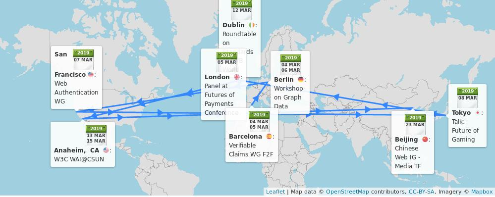
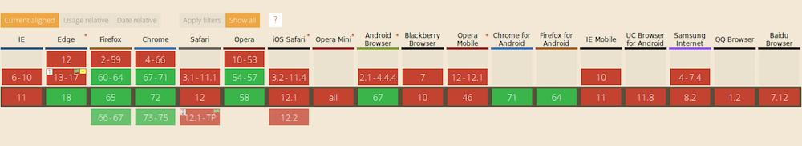
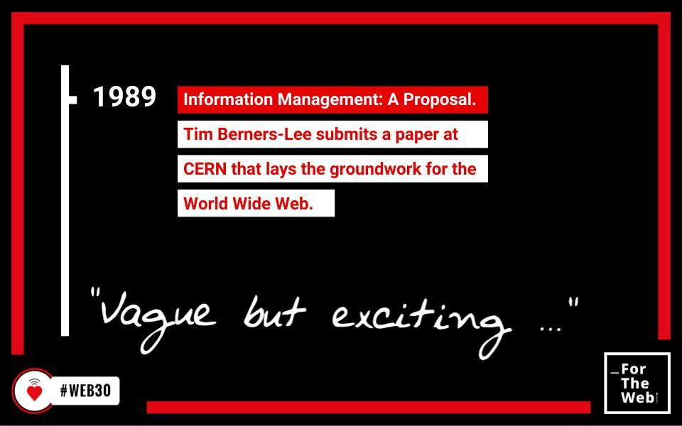
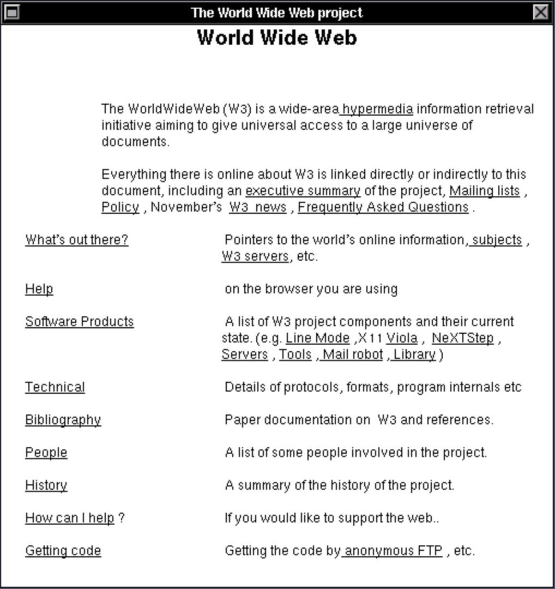
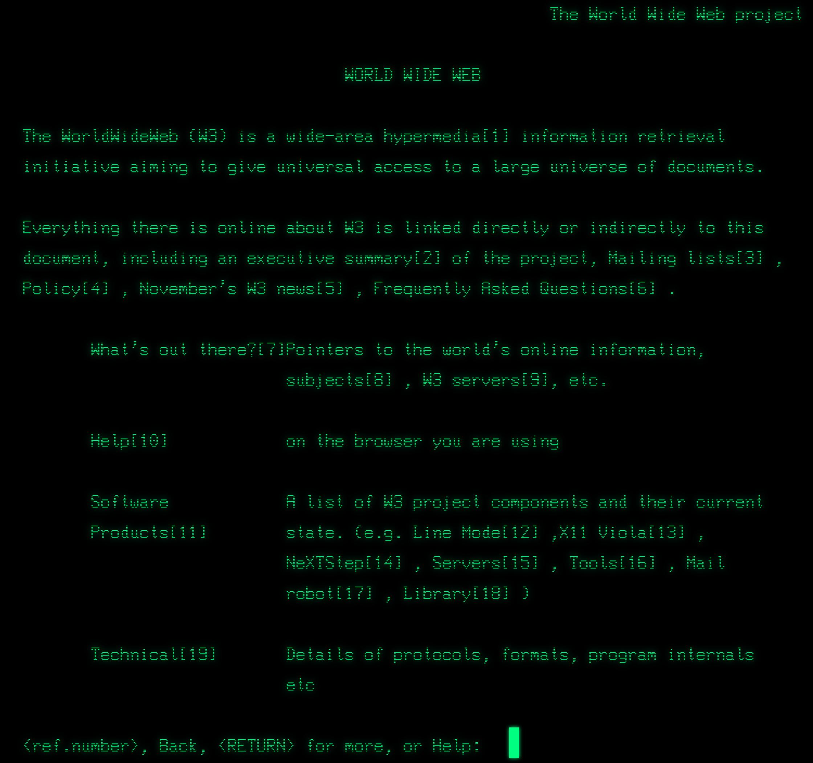

> 🗓️ March@w3c: \#W3CWorkshop, @w3c\_wai team at CSUN, groups' meetings, etc\. https://www\.w3\.org/participate/eventscal\.html 
> 
> 
> 4\-5 Mar\.: The @w3c Verifiable Claims \#WorkingGroup meets in \#Barcelona 🇪🇸 @PayInnHub to continue to develop use cases and standards for expressing and exchanging "claims" verified by a 3rd party, and make the \#Web more \#secure https://w3c\.github\.io/verifiable\-claims/f2f/2019\-03\-Barcelona/   
> \.\./2018/2018\-11\-tweets\.html\#x1061972978475433984

 [Mar 01 2019, 14:05:56 UTC](https://twitter.com/w3cdevs/status/1101483715253932032)

----

> 4\-6 Mar\.: Hosted by @neo4j in \#Berlin 🇩🇪, the \#W3CWorkshop Web Standardization for Graph Data discusses creating bridges between \#RDF, \#PropertyGraph and \#SQL\. Event sponsored by @ontotext, @Oracle, @arangodb, @LDBCouncil, and @boost4\_0 of @EU\_H2020   
> https://www\.w3\.org/Data/events/data\-ws\-2019/

 [Mar 01 2019, 14:05:57 UTC](https://twitter.com/w3cdevs/status/1101483718424911872)

----

> 7 Mar\.: The @w3c \#WebAuthn \#WorkingGroup has a \#f2fmeeting to kick off work on \#WebAuthn level 2\. The meetings are hosted by @google in \#SanFrancisco 🇺🇸 https://www\.w3\.org/Webauthn/ 
> 
> 

 [Mar 01 2019, 14:05:58 UTC](https://twitter.com/w3cdevs/status/1101483722736652288)

----

> 5 Mar\.: @JAlanBirdW3C shows the relevance of \#standards in creating real value in the \#payments ecosystem at the @vendorcom's Future of Payments conference in \#London 🇬🇧   
> https://www\.vendorcom\.com/event\.php?event\_id\=893

 [Mar 01 2019, 14:05:58 UTC](https://twitter.com/w3cdevs/status/1101483720505257984)

----

> 12 Mar\.: Bringing his Web Media expertise, @tidoust speaks about the importance of \#Web \#standards at the \#DVBWorld 2019 conference in \#Dublin 🇮🇪 @dvb\_project https://www\.dvbworld\.org/ 
> 
> 

 [Mar 01 2019, 14:05:59 UTC](https://twitter.com/w3cdevs/status/1101483727157452800)

----

> 8 Mar\.: @tidoust presents the potential of \#gaming on the \#Web using \#standards, at the IoT International Symposium 2019 in \#Tokyo, 🇯🇵  
> https://smartiot\-forum\.jp/application/files/9015/5082/6875/forum\-soukaisympo2019\_en\_v2\.pdf  
> https://w3c\.github\.io/web\-roadmaps/games/

 [Mar 01 2019, 14:05:59 UTC](https://twitter.com/w3cdevs/status/1101483725819383808)

----

> 14 Mar\.: @sabouzah, Wilco Fiers and @1mjmueller run a session on \#accessibility Conformance Testing \(ACT\) and how it can make your testing tools and manual evaluation more transparent and accurate, in \#Anaheim 🇺🇸, \#a11y \#WCAG\_ACT   
> https://www\.csun\.edu/cod/conference/2019/sessions/index\.php/public/presentations/view/1045

 [Mar 01 2019, 14:06:00 UTC](https://twitter.com/w3cdevs/status/1101483732115034115)

----

> 14 Mar\.: @sabouzah and @wahlbin explores how \#WCAG21 helps \#developers design accessible desktop and mobile \#websites and \#apps for a variety of devices, including smart phones and beyond, \#CSUNATC19 \#Anaheim 🇺🇸 \#accessibility \#a11y  
> https://www\.csun\.edu/cod/conference/2019/sessions/index\.php/public/presentations/view/1187

 [Mar 01 2019, 14:06:00 UTC](https://twitter.com/w3cdevs/status/1101483730810613760)

----

> 13 Mar\.: @shawn\_slh and @awkawk explore the low vision, cognitive and mobile user needs as part of the success criteria of the \#WCAG21 requirement at the 34th \#CSUNATC19 conference, \#Anaheim 🇺🇸 \#accessibility \#a11y  
> https://www\.csun\.edu/cod/conference/2019/sessions/index\.php/public/presentations/view/1325           
> https://twitter\.com/CSUNCOD/status/1098250933295894529

 [Mar 01 2019, 14:06:00 UTC](https://twitter.com/w3cdevs/status/1101483728797421569)

----

> 14 Mar\.: @cooper\_w3c explains how the @w3c Accessible Platform Architectures \(APA\) \#WorkingGroup checks @w3c specifications provide support for \#accessibility, \#CSUNATC19 \#Anaheim 🇺🇸, \#a11y   
> https://www\.csun\.edu/cod/conference/2019/sessions/index\.php/public/presentations/view/1177

 [Mar 01 2019, 14:06:01 UTC](https://twitter.com/w3cdevs/status/1101483734233157632)

----

> 15 Mar\.: @shawn\_slh, Brent Bakken and @yatil run a tutorial on new and             in\-progress @w3c\_wai education and outreach material related to Web \#accessibility, \#CSUNATC19 \#Anaheim 🇺🇸, \#a11y   
> https://www\.csun\.edu/cod/conference/2019/sessions/index\.php/public/presentations/view/1259

 [Mar 01 2019, 14:06:02 UTC](https://twitter.com/w3cdevs/status/1101483737085288449)

----

> 23 Mar\.: The @w3c Chinese Web \#InterestGroup Media Task Force has a \#f2fmeeting in \#Beijing 🇨🇳\. Read the list of attendees and agenda topics: https://github\.com/w3c/chinese\-ig/blob/master/meetings/2019\-03\-23\.md

 [Mar 01 2019, 14:06:03 UTC](https://twitter.com/w3cdevs/status/1101483742814720001)

----

> 15 Mar\.: the @w3c\_wai team \(Judy Brewer, @sabouzah and RuoXi Ran\) present progress and upcoming goals for \#international uptake of Web \#accessibility \#standards, including \#China, \#Europe, and low and middle income countries, \#a11y \#CSUNATC19 \#Anaheim 🇺🇸  
> https://www\.csun\.edu/cod/conference/2019/sessions/index\.php/public/presentations/view/1316

 [Mar 01 2019, 14:06:03 UTC](https://twitter.com/w3cdevs/status/1101483740721827846)

----

> Congrats to editors @balfanz, @aczeskis, @equalsJeffH, J\.C\. Jones, Michael B\. Jones, Akshay Kumar, @AngeloSunmile, Rolf Lindemann, and Emil Lundberg for the newly published @w3c \#WebStandard Web Authentication \#WebAuthn: https://www\.w3\.org/TR/webauthn/ \#timetoadopt https://twitter\.com/w3c/status/1102555604151947265
> The Web Authentication \#API \(also known as \#WebAuthn\) allows servers to register and authenticate users using public key \#cryptography instead of a \#password  
> \.\./2018/2018\-03\-tweets\.html\#x976111114739175426

 [Mar 04 2019, 13:36:21 UTC](https://twitter.com/w3cdevs/status/1102563433201975296)

----

> The \#WebAuthn API helps to eliminate passwords entirely\. \#Webauthn can be used both in single factor and multi\-factor authentication schema\. See different usage demos at https://webauthn\.io/ 
> 
> 

 [Mar 04 2019, 13:36:22 UTC](https://twitter.com/w3cdevs/status/1102563438327484419)

----

> As passwords can be insecure or hard to remember, \#developers have also to worry about all the complications of passing passwords through systems and safely storing them in databases \(about 81% of all hacking\-related breaches leverage stolen or weak \#passwords\) 
> 
> 

 [Mar 04 2019, 13:36:22 UTC](https://twitter.com/w3cdevs/status/1102563436477771782)

----

> \#WebAuthn is supported in the \#Chrome, \#firefox, and \#edge \#browsers, and is in technical preview in \#Safari: https://twitter\.com/webkit/status/1070377771724083201\. See also https://caniuse\.com/\#feat\=webauthn 
> 
> 

 [Mar 04 2019, 13:36:23 UTC](https://twitter.com/w3cdevs/status/1102563442458808320)

----

> While \#WebAuthn is an important tool, it is always important to remember that \#security should be incorporated into every step of how software is designed and developed

 [Mar 04 2019, 13:36:23 UTC](https://twitter.com/w3cdevs/status/1102563441305358343)

----

> The \#WebAuthn \#API is a core component of @FIDOAlliance's \#FIDO2 set of specs, along the \#CTAP protocol: https://fidoalliance\.org/fido2/  
> With \#FIDO2 and \#WebAuthn, all users around the world are now allowed to "log on" safely, and industries now count on better \#security \#privacy

 [Mar 04 2019, 13:36:23 UTC](https://twitter.com/w3cdevs/status/1102563440047067136)

----

> \.@fantasai, who edits 45\+ specifications, has more than a little bit of experience to share on the topic\! 
> 
> 

 [Mar 07 2019, 15:25:00 UTC](https://twitter.com/w3cdevs/status/1103677939781115907)

----

> Unless you've been involved in standardization efforts, you may not know the key role spec editors play in the making of a @w3c standard\. Not only do they turn ideas and discussions in concrete documents, but they very often generate most of the ideas and animate the discussions\!
> In this last video from our series of \#w3ctpac2018  interviews, @fantasai, @csswg editor extraordinaire, shares some of the best practices editors should follow when writing specifications  
> https://vimeo\.com/313895322

 [Mar 07 2019, 15:25:00 UTC](https://twitter.com/w3cdevs/status/1103677938166304770)

----

> During \#w3ctpac2018, @fantasai and @marcosc \(another prolific editor, and maintainer of the widely used ReSpec tool to edit specifications\) animated a breakout to present and discuss shared best practices for editors\. https://www\.w3\.org/2018/10/24\-tpac\-minutes\.html

 [Mar 07 2019, 15:25:02 UTC](https://twitter.com/w3cdevs/status/1103677947150561280)

----

> She also has a skill for best practices in general, e\.g\. her \#CSS best http://fantasai\.inkedblade\.net/style/talks/best\-practices/ \- these best practices are featured in the @thew3cx CSS Basics course: https://www\.edx\.org/course/css\-basics

 [Mar 07 2019, 15:25:02 UTC](https://twitter.com/w3cdevs/status/1103677945447632898)

----

> Thanks @fantasai for taking the time to make this interview, and to @webcastors for capturing it  
> https://vimeo\.com/313895322

 [Mar 07 2019, 15:25:03 UTC](https://twitter.com/w3cdevs/status/1103677950212431872)

----

> The best practices for editors cover topics ranging from how to structure a specification to how to quality\-check it and how to manage input and feedback\.  
> https://lists\.w3\.org/Archives/Public/spec\-prod/2018OctDec/0011\.html

 [Mar 07 2019, 15:25:03 UTC](https://twitter.com/w3cdevs/status/1103677948870184960)

----

> Today is \#InternationalWomensDay  a good time to revisit the work that our own community needs to accomplish to improve its diversity, including with regard to women participation \.\./2018/2018\-12\-tweets\.html\#x1069992880519942150

 [Mar 08 2019, 15:10:55 UTC](https://twitter.com/w3cdevs/status/1104036780209303554)

----

> SVG stands for Scalable Vector Graphics\. Published as a @w3c \#WebStandard \(https://www\.w3\.org/TR/SVG11/\), SVG is a vector\-based image format "capable of just about anything" \- see @chriscoyier's articles, videos, tutorials, etc\.: https://css\-tricks\.com/lodge/svg/ 
> 
> 
> 🗣️ Care about \#SVG? Awaiting a new release of the \#specification with features you are dreaming of? Now is your time to contribute your ideas \#developers \#Web https://w3c\.github\.io/charter\-drafts/svgcg\-2019\.html

 [Mar 11 2019, 14:50:12 UTC](https://twitter.com/w3cdevs/status/1105118733092179968)

----

> \.@AmeliasBrain, chair of the @w3c \#SVG \#CommunityGroup, welcomes input and feedback on her proposed \#charter, so to make it easier for implementers, content creators the SVG community to engage with the SVG \#Working Group:  
> https://w3c\.github\.io/charter\-drafts/svgcg\-2019\.html

 [Mar 11 2019, 14:50:13 UTC](https://twitter.com/w3cdevs/status/1105118737882103813)

----

> and 2\) in a \#CommunityGroup created last month which goal is to gather and incubate new features and requirements for SVG: https://www\.w3\.org/community/svgcg/

 [Mar 11 2019, 14:50:13 UTC](https://twitter.com/w3cdevs/status/1105118736686698501)

----

> The work in SVG happens in two venues: 1\) in the SVG \#WorkingGroup \(@svgwg\) where \#SVG2 is being developed: https://www\.w3\.org/TR/SVG2/   
> https://twitter\.com/svgeesus/status/1026846936236740608

 [Mar 11 2019, 14:50:13 UTC](https://twitter.com/w3cdevs/status/1105118735201906688)

----

> All proposals should be gathered in one place\. To help record your ideas on the SVG Community Group \#charter in a structured way, please submit feedback and/or file issues in \#github https://github\.com/w3c/charter\-drafts/issues/new?title\=\[svgcg\-2019\] \#DontBeShy \!\!

 [Mar 11 2019, 14:50:14 UTC](https://twitter.com/w3cdevs/status/1105118741954813952)

----

> The \#SVG \#CommunityGroup is designed to make it easy for people to propose ideas with guidance and support from people with experience in Web \#standards\. The goal is to create a convincing package that SVG needs this or that new feature\!

 [Mar 11 2019, 14:50:14 UTC](https://twitter.com/w3cdevs/status/1105118740818128897)

----

> While this draft charter incorporates some of the discussions held in the @svgwg https://www\.w3\.org/Graphics/SVG/, it needs new development ideas brought by the \#Web community: https://www\.w3\.org/community/svgcg/2019/03/08/draft\-svg\-community\-group\-charter\-for\-discussion/

 [Mar 11 2019, 14:50:14 UTC](https://twitter.com/w3cdevs/status/1105118739094294529)

----

> Developing the Web,   
>  one page,   
>  one style sheet,   
>  one library,  
>  one framework,  
>  one site,  
>  one standard,  
>  one protocol,  
>  one best practice,  
>  one prototype,  
>  one mistake,  
>  one crazy idea,  
>  …  
> one contribution at a time\. Here is to many more years of creativity \#ForTheWeb \#Web30 https://twitter\.com/internetsociety/status/1105355260909047809

 [Mar 12 2019, 10:17:49 UTC](https://twitter.com/w3cdevs/status/1105412571279048704)

----

> The Web aspires to be a universal platform, not only in terms of who can use it where and how, but also as a platform that anyone can help building \.\./2019/2019\-03\-tweets\.html\#x1105412571279048704
> It is not obvious to many how to get involved in the development and standardization of Web technologies\.

 [Mar 12 2019, 17:10:48 UTC](https://twitter.com/w3cdevs/status/1105516504542597120)

----

> Fixing this requires lots of hard work \- there has been progress, but lots more is undoubtedly needed\.

 [Mar 12 2019, 17:10:49 UTC](https://twitter.com/w3cdevs/status/1105516509189885953)

----

> Part of it is knowing it is at all possible, part of it is that it's hard to find your way, part of it is that once you've found it, it can be hard to be or feel effective in bringing changes, and overall, it takes time, energy and in a number of cases, money\.

 [Mar 12 2019, 17:10:49 UTC](https://twitter.com/w3cdevs/status/1105516507768020999)

----

> \.@dontcallmeDOM shared his story https://twitter\.com/dontcallmeDOM/status/1105505465151172608

 [Mar 12 2019, 17:10:50 UTC](https://twitter.com/w3cdevs/status/1105516512738246656)

----

> What are your stories of getting involved in \#Web standards?

 [Mar 12 2019, 17:10:50 UTC](https://twitter.com/w3cdevs/status/1105516511605780483)

----

> But part of it is also to understand how and why others came to be involved\. @w3c has over the years had many different profiles  involved for many different reasons: tech obviously, but also writers; musicians, linguists, philosophers, etc

 [Mar 12 2019, 17:10:50 UTC](https://twitter.com/w3cdevs/status/1105516510389456896)

----

> so did @TzviyaSiegman https://twitter\.com/TzviyaSiegman/status/1105513000214163461  
>   
> what is yours?

 [Mar 12 2019, 17:10:51 UTC](https://twitter.com/w3cdevs/status/1105516514537598976)

----

> \#w3corigin https://twitter\.com/wz43rtx/status/1105791774419759104

 [Mar 13 2019, 12:05:51 UTC](https://twitter.com/w3cdevs/status/1105802147780878337)

----

> \#w3corigin https://twitter\.com/kennethrohde/status/1105798441354043393

 [Mar 13 2019, 12:06:18 UTC](https://twitter.com/w3cdevs/status/1105802262222438400)

----

> The \#Web was invented on 12 March 1989, but by the end of 1990, @timberners\_lee had written the WorldWideWeb which was both a reader and an editor of Web pages   
> https://twitter\.com/anildash/status/1105562242211348480
> Yesterday, the world was celebrating \#Web30  
> 🎂  🥂 
> 
> 

 [Mar 13 2019, 15:24:27 UTC](https://twitter.com/w3cdevs/status/1105852128801763329)

----

> If you feel nostalgic and want to browse old Web pages on a variety of virtual old \#browsers, try http://oldweb\.today/ \- it includes WWW on NextStep \- e\.g\. http://oldweb\.today/WWW/http://www\.w3\.org/ The infrastructure behind that service itself is also on \#github https://github\.com/oldweb\-today/netcapsule

 [Mar 13 2019, 15:24:28 UTC](https://twitter.com/w3cdevs/status/1105852132081717249)

----

> The code of WorldWideWeb, later renamed Nexus, the world's first \#WebBrowser, is on \#github\. This is a source import from 0\.15 for NextStep\.  
> https://github\.com/cynthia/WorldWideWeb 
> 
> 

 [Mar 13 2019, 15:24:28 UTC](https://twitter.com/w3cdevs/status/1105852130185883649)

----

> Last month, some of these brilliant developers/designers and others were asked to show how pages would look in WorldWideWeb by rebuilding its UI and rendering in HTML/CSS/JS\. Anyone can play with it at https://worldwideweb\.cern\.ch/browser \- try to open a URL\! 😁https://worldwideweb\.cern\.ch/images/howto/openurl\_small\.mp4

 [Mar 13 2019, 15:24:29 UTC](https://twitter.com/w3cdevs/status/1105852137387499521)

----

> In 2013, @CERN convened 12 Web developers, designers, writers, standardistas, and technologists to rebuild the line\-mode browser in the modern \#browsers\. Read the \#MakingOf: http://line\-mode\.cern\.ch/makingof/ 
> 
> 

 [Mar 13 2019, 15:24:29 UTC](https://twitter.com/w3cdevs/status/1105852133423935488)

----

> If you want to help the \#Web keep track of its own history, the @w3c Web History \#CommunityGroup collects valuable information such as software, documents, testimonials, etc\. This group is open to all, so if you have a resource to share, please do so\! https://www\.w3\.org/community/webhistory/

 [Mar 13 2019, 15:24:30 UTC](https://twitter.com/w3cdevs/status/1105852140185141248)

----

> Now, wouldn't it be fun to get the original WorldWideWeb as a \#WebAssembly compiled module in recent browsers? Is that even doable? Let us know\! 🗣️

 [Mar 13 2019, 15:24:30 UTC](https://twitter.com/w3cdevs/status/1105852138905919488)

----

> Congrats @visionsremain and thanks for helping improve the Web\!

 [Mar 14 2019, 13:41:06 UTC](https://twitter.com/w3cdevs/status/1106188507410821120)

----

> https://twitter\.com/marcosc/status/1106175817527123973
> A story in two acts: \.\./2018/2018\-09\-tweets\.html\#x1042994693145939968

 [Mar 14 2019, 13:41:06 UTC](https://twitter.com/w3cdevs/status/1106188505619857411)

----

> As \#GDC2019 starts, we're excited to announce a  @w3c \#workshop on Web Games organized by @tidoust, chaired by @deltakosh from @babylonjs fame https://www\.w3\.org/2018/12/games\-workshop/ https://twitter\.com/w3c/status/1107636206962126849
> The Web is already a pretty rich platform for games, with a number of its recent evolutions directly inspired by the needs from game developers: e\.g\. \#WebAssembly or the \#Gamepad \#API\. The @w3c Games on the Web roadmap gives a good overview https://w3c\.github\.io/web\-roadmaps/games/

 [Mar 18 2019, 15:56:30 UTC](https://twitter.com/w3cdevs/status/1107672132794880000)

----

> Among the expected topics: \#3D graphics and the role of \#WebGPU, multithreading, \#WebAssembly, cloud\-based gaming in the browser, game input, \#WebAudio, etc\.

 [Mar 18 2019, 15:56:31 UTC](https://twitter.com/w3cdevs/status/1107672138343960576)

----

> That isn't to say all their needs are covered, and with the continuous innovation in this space, this \#W3CWorkshop opens up an opportunity for the Games and Web people to determine together what priorities the Open Web Platform needs to address\. 
> 
> 

 [Mar 18 2019, 15:56:31 UTC](https://twitter.com/w3cdevs/status/1107672136087420928)

----

> If you're new to the topic, you can get a flavor of game dev on the Web by following @thew3cx \#MOOC on \#HTML5 \#Apps and \#Games by @micbuffa, and learn basic concepts of game development, collision detection, sprite\-based animation, etc\.  
> https://www\.edx\.org/course/html5\-apps\-and\-games\-2 
> 
> 

 [Mar 18 2019, 15:56:32 UTC](https://twitter.com/w3cdevs/status/1107672139556098049)

----

> And if you care about making the Web a great platform for games \(and improving for other usages while doing so\), mark your calendar for June 27\-28 in Seattle 🇺🇸, and register your interest or submit a position paper by May 10 🗓️  
> https://www\.w3\.org/2018/12/games\-workshop/

 [Mar 18 2019, 15:56:33 UTC](https://twitter.com/w3cdevs/status/1107672142722854912)

----

> Much progress was made \- \#KUTGW https://twitter\.com/agouaillard/status/1109486743798071297

 [Mar 24 2019, 17:44:53 UTC](https://twitter.com/w3cdevs/status/1109873736210137089)

----

> As we covered before, testing the proper implementation of \#WebRTC is rather more complicated than testing usual \#browser APIs \.\./2018/2018\-07\-tweets\.html\#x1014139041112051718
> Yesterday and today, a subset of the \#WebRTC Working Group  and other active \#WebRTC community members were using the \#ietf104 \#ietfhackathon in Prague 🇨🇿 as an opportunity to make progress on the test suite needed to bring \#WebRTC to Recommendation https://twitter\.com/agouaillard/status/1109808773605089281

 [Mar 24 2019, 17:44:53 UTC](https://twitter.com/w3cdevs/status/1109873734679257091)

----

> Hear, hear\! Please apply \#asap for this @w3c\_wai front\-end \#accessibility specialist position \- looking forward to work with you at W3C\! https://twitter\.com/w3c\_wai/status/1110191959895883776

 [Mar 27 2019, 17:23:05 UTC](https://twitter.com/w3cdevs/status/1110955413862666241)

----

> This proposal has emerged from the discussions of the \#Web5G workshop last May \.\./2018/2018\-07\-tweets\.html\#x1018872410068660225
> A proposed charter for a brand new Web &amp; Networks Interest Group https://www\.w3\.org/2019/03/web\-networks\-charter\-draft\.html  
>   
> The group would look at the needs &amp; opportunities emerging from evolutions from the network layer \(\#5G, \#EdgeComputing, \#QUIC\) and match them to app capabilities  
> https://twitter\.com/w3c/status/1111275910781648901

 [Mar 28 2019, 14:46:44 UTC](https://twitter.com/w3cdevs/status/1111278454308249607)