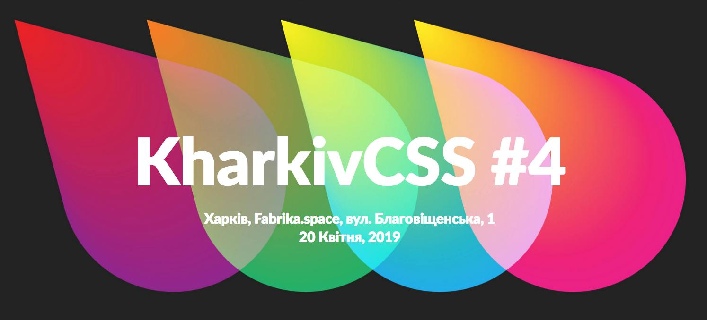
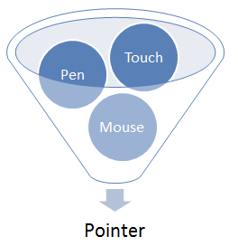

> 🗓️ April@w3c: \#WorkingGroup meetings, talks, SymposiumX, etc\. https://www\.w3\.org/participate/eventscal\.html 
> 
> 
> 2\-3 April: Hosted by @Visa, the @w3payments \#WorkingGroup meets in \#FosterCity 🇺🇸 to discuss next features for the Payment Request \#API and more\.\.\. https://github\.com/w3c/webpayments/wiki/FTF\-Agenda\-201904 \#Payments

 [Apr 01 2019, 11:15:32 UTC](https://twitter.com/w3cdevs/status/1112674855793639427)

----

> 7\-9 April: @w3c convenes its member representatives and staff to a 2\-day \#f2fmeeting in \#Quebec, 🇨🇦 \#quebeccongres

 [Apr 01 2019, 11:15:33 UTC](https://twitter.com/w3cdevs/status/1112674860692574209)

----

> 8 April: @JalanbirdW3C presents the need for \#WebStandards to make stream advertising work on the \#Web @NABShow in \#LasVegas 🇺🇸 https://www\.nabshow\.com/  
> https://twitter\.com/NABShow/status/1110315546577461255

 [Apr 01 2019, 11:15:33 UTC](https://twitter.com/w3cdevs/status/1112674858759045121)

----

> 20 April: @svgeesus and @LeaVerou present all things incl\. secrets related to \#SVG, \#CSS, and \#WebStandards in general @KharkivCSS in \#Kharkiv, 🇺🇦 http://kharkivcss\.org/ 
> 
> 

 [Apr 01 2019, 11:15:34 UTC](https://twitter.com/w3cdevs/status/1112674864534638592)

----

> 11\-12 April: @sabouzah speaks @ablesummit in \#Beirut 🇱🇧, https://sites\.aub\.edu\.lb/able/ \#accessibility \#a11y   
> https://twitter\.com/ablesummit/status/1091850986593898496

 [Apr 01 2019, 11:15:34 UTC](https://twitter.com/w3cdevs/status/1112674863142064128)

----

> 11 April: JEPA and @w3c organize an event to share information about gaps and requirements for support of Japanese on the Web and in eBooks, in \#Tokyo, 🇯🇵 https://kokucheese\.com/event/index/558596/ The @w3c's Japanese Layout Task Force organizes a kick\-off meeting too: https://w3c\.github\.io/jlreq/charter/ \#i18n

 [Apr 01 2019, 11:15:34 UTC](https://twitter.com/w3cdevs/status/1112674861858676736)

----

> 26 April: @draggett presents Open markets of \#IoT services and the emergence of the Sentient \#Web https://www\.iottechexpo\.com/global/talk/iot\-innovation\-security\-for\-iot\-devices/ @iottechexpo, in \#London 🇬🇧 
> 
> 

 [Apr 01 2019, 11:15:35 UTC](https://twitter.com/w3cdevs/status/1112674868510814210)

----

> 23 April: @RachelYager of @FortuneTimesNYC and @w3c organize SYMPOSIUMX dedicated to Financial Innovation on the Web, in \#NYC, 🇺🇸  Register now\! https://www\.eventbrite\.com/e/symposiumx\-financial\-innovation\-on\-the\-web\-tickets\-55839800346 \#Security \#Payments \#Privacy \#Identity

 [Apr 01 2019, 11:15:35 UTC](https://twitter.com/w3cdevs/status/1112674866757554176)

----

> 30 April\-2 May: Hosted by @levelaccessa11y, the @w3c \#WAI\_ARIA \#WorkingGroup meets f2f in \#SanFrancisco 🇺🇸 to discuss   
> \#WAI\_ARIA role parity https://www\.w3\.org/WAI/ARIA/wiki/Meetings/F2F\_Spring\_2019 \#accessibility \#a11y

 [Apr 01 2019, 11:15:36 UTC](https://twitter.com/w3cdevs/status/1112674870809235458)

----

> 最近公開された @w3c Pointer Events — Level 2 \#WebStandard は日本語に翻訳されています : https://triple\-underscore\.github\.io/pointerevents\-ja\.html   
> どうもありがとう @strontium91 \! ＃html5j \#w3c\_keio 
> 
> 
> Thanks to @strontium91, the recently published @w3c Pointer Events — Level 2 \#WebStandard has been translated into Japanese: https://triple\-underscore\.github\.io/pointerevents\-ja\.html \#html5j \#w3c\_keio https://twitter\.com/w3c/status/1115600989321551873

 [Apr 16 2019, 10:26:05 UTC](https://twitter.com/w3cdevs/status/1118098229214810112)

----

> 24 April: opening a new session of @thew3cx JavaScript Introduction \#MOOC https://www\.edx\.org/course/javascript\-introduction\-2 @edXOnline @uca\_education @micbuffa \#javascript 
> 
> 

 [Apr 16 2019, 11:59:06 UTC](https://twitter.com/w3cdevs/status/1118121634769117186)

----

> Deadline for expressions of interest is today\! "Expressions of interest should briefly explain the participant's interest in the workshop in a few sentences"\. See more on how to participate: https://www\.w3\.org/WoT/ws\-2019/participation\.html https://twitter\.com/w3c/status/1111319577697402881

 [Apr 23 2019, 13:06:56 UTC](https://twitter.com/w3cdevs/status/1120675424135262209)

----

> The spring edition of the \#roadmap of \#WebApps on mobile is out\! It highlights new exploratory work of the @w3c @wicg\_ group https://www\.w3\.org/2019/04/web\-roadmaps/mobile/ \#April2019 thanks to @tidoust @XueFuqiao @W3CChina @Beihang1952
> For example, KV Storage, a simple async key\-value \#storage \#API, which integrates with \#IndexedDB, is proposed as a modern successor to localStorage to improve Web \#performance   
> https://www\.w3\.org/2019/04/web\-roadmaps/mobile/storage\.html\#kv\-storage

 [Apr 24 2019, 10:16:54 UTC](https://twitter.com/w3cdevs/status/1120995019257733122)

----

> Finally, the @csswg has started to work on the Resize Observer specification which describes an \#API for observing changes to Element’s size\. This helps solve the Element Queries problem in a responsive context   
> https://www\.w3\.org/2019/04/web\-roadmaps/mobile/adaptation\.html\#resize\-observer

 [Apr 24 2019, 10:25:37 UTC](https://twitter.com/w3cdevs/status/1120997214527135744)

----

> Then, in order to strengthen \#security, Trusted Types allows applications to lock down DOM\-based XSS injection sinks \(e\.g\. Element\.innerHTML, or Location\.href setters\) to only accept non\-spoofable, typed values in place of strings https://www\.w3\.org/2019/04/web\-roadmaps/mobile/security\.html\#trusted\-types

 [Apr 24 2019, 10:25:37 UTC](https://twitter.com/w3cdevs/status/1120997212987719680)

----

> Check out for more \#Web technologies developed in @w3c that increase the capabilities of \#Webapps, how they apply more specifically to the mobile context and what are their current implementations: https://www\.w3\.org/Mobile/roadmap/

 [Apr 24 2019, 10:25:38 UTC](https://twitter.com/w3cdevs/status/1120997216158662656)

----

> The Conversational Interfaces Community Group focuses more specifically on how to model a dialogue and its expected outcomes https://www\.w3\.org/community/conv/

 [Apr 25 2019, 07:29:10 UTC](https://twitter.com/w3cdevs/status/1121315198210584576)

----

> The Voice Assistant Community Group is exploring the general space of standardization needs for voice\-based assistants https://www\.w3\.org/community/voice\-assistant/

 [Apr 25 2019, 07:29:10 UTC](https://twitter.com/w3cdevs/status/1121315196994314241)

----

> The Voice Interaction Community Group follows up on the VoiceXML family of specifications standardized in W3C some years ago to watch and see what new standards might be relevant https://www\.w3\.org/community/voiceinteraction/
> By "conversational interfaces", we mean a bunch of exploratory work happening around how to make the Web work better with voice\-based interactions, including voice assistants\. https://twitter\.com/HandNF/status/1121172303818174464

 [Apr 25 2019, 07:29:10 UTC](https://twitter.com/w3cdevs/status/1121315195668897795)

----

> There is also the accessibility angle of making Web pages more pronounceable being looked at in the Accessible Platform Architecture Working Group \.\./2018/2018\-12\-tweets\.html\#x1070710412050612225

 [Apr 25 2019, 07:29:11 UTC](https://twitter.com/w3cdevs/status/1121315202014830593)

----

> This comes in complement to more settled work, such as the one enabled by the Speech Synthesis and Speech Recognition browser APIs developed in the Speech API Community Group https://www\.w3\.org/community/speech\-api/

 [Apr 25 2019, 07:29:11 UTC](https://twitter.com/w3cdevs/status/1121315200743956480)

----

> The Functional Knowledge Graph Community Group is looking at how to expose Web pages functions to AI assistants https://www\.w3\.org/community/fkg/

 [Apr 25 2019, 07:29:11 UTC](https://twitter.com/w3cdevs/status/1121315199431184391)