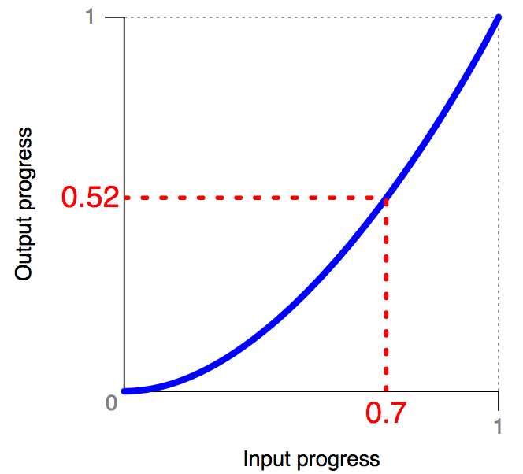

> May@w3c: conferences, groups' meetings, W3Cx course on HTML5 Apps and Games, etc\. https://www\.w3\.org/participate/eventscal\.html 
> 
> 
> 8 May: @dontcallmeDOM presents \#Web5G vision at the \#5GMediaRoad2019 conference, organized by @IRTpresse as part of the @mediaroad\_eu EU project, in \#Munich 🇩🇪   
> https://twitter\.com/IRTpresse/status/1108386849935056897

 [May 02 2019, 14:26:45 UTC](https://twitter.com/w3cdevs/status/1123957000994533376)

----

> 13\-14 May: the @w3c\_wai Education and Outreach \#WorkingGroup participants hold a 2\-day \#f2fmeeting in \#Austin 🇺🇸 https://www\.w3\.org/WAI/EO/wiki/EOWG\_F2F\_May\_2017

 [May 02 2019, 14:26:47 UTC](https://twitter.com/w3cdevs/status/1123957009458577410)

----

> 10 May: save this date\! this is the deadline to register and submit your statement of interest for the \#W3CWokshop on Web \#games\! \#gaming \#multiplayer \#3D \#WebXR \#WebAssembly \#APIs \#cloud \#WebAudio   
> Find out more in https://www\.w3\.org/2018/12/games\-workshop/   
> https://cards\.twitter\.com/cards/18ce53z7ril/7ansq

 [May 02 2019, 14:26:47 UTC](https://twitter.com/w3cdevs/status/1123957006908514304)

----

> 17 May: @yatil and @shawn\_slh from the @w3c\_wai team speak at AccessU'2019 in \#Dusseldorf 🇩🇪 https://knowbility\.org/programs/accessu/2019/ @knowbility   
> https://twitter\.com/knowbility/status/1118215771077869568

 [May 02 2019, 14:26:48 UTC](https://twitter.com/w3cdevs/status/1123957013296439296)

----

> 15 May: launching a new session of @thew3cx \#HTML5 Apps and Games \#MOOC\! Learn animation techniques with @micbuffa: https://www\.edx\.org/course/html5\-apps\-and\-games @edXonline \#apps \#Web \#gaming  
> https://cards\.twitter\.com/cards/18ce53z7ril/7anyh

 [May 02 2019, 14:26:48 UTC](https://twitter.com/w3cdevs/status/1123957011861970945)

----

> 20 May: @FIDOAlliance organizes a FIDO \#Authentication Developer Workshop in \#Prague 🇨🇿 https://fidoalliance\.org/event/developer\-workshop\-prague/ \#WebAuthn \#FIDO2 
> 
> 

 [May 02 2019, 14:26:49 UTC](https://twitter.com/w3cdevs/status/1123957016899260419)

----

> 21 May: @w3ctag also organizes a public \#devmeetup "Meet the TAG", also in \#Reykjavik 🇮🇸\. Join them in a conversation about the future of the Web\!  https://ti\.to/w3c\-tag/meet\-the\-tag\-reykjavik

 [May 02 2019, 14:26:50 UTC](https://twitter.com/w3cdevs/status/1123957021118750732)

----

> 21\-23 May: the @w3ctag holds its \#f2fmeeting @vivaldibrowser's offices in \#Reykjavik 🇮🇸 https://github\.com/w3ctag/meetings/tree/gh\-pages/2019/05\-reykjavik

 [May 02 2019, 14:26:50 UTC](https://twitter.com/w3cdevs/status/1123957019793338369)

----

> 23\-24 May: the @w3c \#SecondScreen \#WorkingGroup participants meet in Berlin 🇩🇪, hosted by @fraunhoferfokus https://www\.w3\.org/wiki/Second\_Screen/Meetings/May\_2019\_F2F

 [May 02 2019, 14:26:51 UTC](https://twitter.com/w3cdevs/status/1123957024985886721)

----

> 21\-22 May: 8th FOKUS Media Web Symposium @fraunhoferfokus, in \#Berlin 🇩🇪 https://www\.fokus\.fraunhofer\.de/go/mws \#FOKUSMWS  
> https://twitter\.com/fraunhoferfokus/status/1113736782187724800

 [May 02 2019, 14:26:51 UTC](https://twitter.com/w3cdevs/status/1123957022817386499)

----

> Another @w3CAB election is starting, with no fewer than 12 candidates for 7 seats https://twitter\.com/torgo/status/1124199801434845189
> Should you need it, a reminder of what the @w3CAB is \.\./2018/2018\-05\-tweets\.html\#x991733862685437953
> The 12 candidates are: @t \(@Mozilla\), Heejin Chung \(@Samsung\), @fantasai \(\#W3CInvitedExpert\), @AaronGustafson \(@Microsoft\), @scarynige \(@BBC\), @chaals \(@ConsenSys\), Avneesh Singh \(@DAISYConsortium\) \.\.\.

 [May 03 2019, 08:07:09 UTC](https://twitter.com/w3cdevs/status/1124223859497033729)

----

> See also their current priorities for 2019 https://www\.w3\.org/wiki/AB/2019\_Priorities

 [May 03 2019, 08:07:10 UTC](https://twitter.com/w3cdevs/status/1124223863561314304)

----

> A warm welcome to both the @w3c Immersive Web \#WorkingGroup and \#CommunityGroup's participants and chairs @Lady\_Ada\_King @cwilso @TrevorFSmith\! 🤩 https://twitter\.com/ImmersiveWebW3C/status/1123288283566333952

 [May 03 2019, 12:23:10 UTC](https://twitter.com/w3cdevs/status/1124288285768130561)

----

> \.\.\. Eric Siow \(@intel\), @alanstearns \(@Adobe\), @LeonieWatson \(@TetraLogical\) @cwilso \(@Google\), and Judy Zhu \(@AlibabaGroup\)\.  
> Read their nomination statements: https://www\.w3\.org/2019/05/02\-ab\-nominations

 [May 03 2019, 12:53:23 UTC](https://twitter.com/w3cdevs/status/1124295890867453953)

----

> The \#CSS easing module gives keywords and other syntaxes to use inside the \#transition and \#animation properties\. Smooth \#timing/easing functions correlate a time ratio to an output ratio, both expressed as <number>s\. 
> 
> 

 [May 06 2019, 16:10:15 UTC](https://twitter.com/w3cdevs/status/1125432599395143680)

----

> CSS easing determines the speed of an animation or transition; how it speeds up at the start, and slows down at the end\. Check out this pen \(one out of many other ones\) which demonstrates the predefined easing functions: https://codepen\.io/KeenanC/pen/EqHbp via @CodePen
> This CSS \#animation technique has reached \#CandidateRecommendation status\. It's \#timetoimplement\! https://www\.w3\.org/TR/2019/CR\-css\-easing\-1\-20190430/ https://twitter\.com/csswg/status/1123883839137505285

 [May 06 2019, 16:10:15 UTC](https://twitter.com/w3cdevs/status/1125432598023503872)

----

> Check out the current browser compatibility at https://developer\.mozilla\.org/en\-US/docs/Web/CSS/timing\-function and do not hesitate to suggest an edit for this specification: https://github\.com/w3c/csswg\-drafts/blob/master/css\-easing\-1/Overview\.bs

 [May 06 2019, 16:10:16 UTC](https://twitter.com/w3cdevs/status/1125432601039208448)

----

> Thanks to @strontium91, the @w3c CSS Fonts Module Level 3 \#WebStandard has been translated into Japanese: https://triple\-underscore\.github\.io/css\-fonts\-ja\.html  \#html5j \#w3c\_keio
> \#WebStandard @w3c CSS Fonts Module Level 3 は日本語に翻訳されています : https://triple\-underscore\.github\.io/css\-fonts\-ja\.html どうもありがとう @strontium91 \! \#html5j \#w3c\_keio 
> 
> 

 [May 07 2019, 06:07:12 UTC](https://twitter.com/w3cdevs/status/1125643223039393792)

----

> Also 👋, we're actively looking at improving \#diversity at the workshop\. Are you part of an \#inclusive community focused on \#games? Do you develop, design, localize, monetize, distribute, play, review games? Come and share your experience\! 👍
> 🗣️ 🗓️ Deadline EXTENDED to 24 May\!   
> Read registration details at https://www\.w3\.org/2018/12/games\-workshop/ \.\./2019/2019\-05\-tweets\.html\#x1123957006908514304

 [May 13 2019, 12:15:39 UTC](https://twitter.com/w3cdevs/status/1127910275695427584)

----

> A big thank you from @w3cdevs 🤩 https://twitter\.com/bromann/status/1128599785492103168

 [May 15 2019, 10:00:24 UTC](https://twitter.com/w3cdevs/status/1128601013353689089)

----

> \.\./2019/2019\-03\-tweets\.html\#x1111278452743827457
> The Web & Networks Interest Group is now ready to start its work on bridging network & application evolutions\! http://www\.w3\.org/web\-networks/ https://twitter\.com/w3c/status/1128940523920740353

 [May 16 2019, 09:11:16 UTC](https://twitter.com/w3cdevs/status/1128951036247519232)

----

> Are you based in \#Europe and actively involved in @w3c \#WebStandards  development? Do apply for funding this work \(before June 28\) and help shape the future standards\!  https://www\.standict\.eu/node/2076/ @Stand\_ICT https://twitter\.com/Stand\_ICT/status/1125291561695305729
> Financial support is available for standardization linked with a list of identified topics that follow the @EU\_Commission 2019 Rolling plan on ICT Standardisation\. Many of them intersect with @w3c's agenda: \#privacy \#security \#a11y, \#payments, etc\. https://www\.standict\.eu/node/2076/\#Topics

 [May 16 2019, 13:40:41 UTC](https://twitter.com/w3cdevs/status/1129018837893079040)

----

> Applicants must reside/work in \#Europe 🇪🇺, and have experience wrt the development of standards\. To our followers who give feedback, contribute to and implement @w3c specifications, how about submitting an application now? 🙋‍♀️🙋‍♂️ https://www\.standict\.eu/applicant/register

 [May 16 2019, 13:40:42 UTC](https://twitter.com/w3cdevs/status/1129018842204778498)

----

> What's on the menu for Web \#games? Come and learn from the greatest games chefs at this \#W3CWokshop chaired by @deltakosh \(@Microsoft\) with help from @tidoust and all other program committee members\!\! Register soon before 24 May and bring your own lapwok\! https://cards\.twitter\.com/cards/18ce53z7ril/7ansq

 [May 21 2019, 16:44:56 UTC](https://twitter.com/w3cdevs/status/1130877142806540293)

----

> Discussions and feedback, as usual, should happen on the github repository https://github\.com/WICG/ad\-click\-attribution/issues/
> \.@webkit's latest addition for privacy\-preserving ad\-click tracking has been submitted as a @wicg\_ proposal https://wicg\.github\.io/ad\-click\-attribution/index\.htm https://twitter\.com/webkit/status/1131185442471256066

 [May 22 2019, 15:55:14 UTC](https://twitter.com/w3cdevs/status/1131227024788512774)

----

> To increase gender diversity and expertise from across multiple countries and cultures, @w3c has established a TPAC Diversity Fund, generously sponsored by W3C Members @Siteimprove, @paciellogroup, @microsoft, @Samsung, @TetraLogical, @dynomapper, @Adobe, and @Coil https://twitter\.com/w3c/status/1133005508464533504
> TPAC \(aka Technical Plenary & Advisory Committee\) is @w3c's biggest annual event, where most W3C groups come together in the same place to have their \#f2fmeeting, etc\. Upcoming \#w3cTPAC is 16\-20 September, in \#Fukuoka, 🇯🇵 🗾  
> https://cards\.twitter\.com/cards/18ce53z7ril/7fqvr

 [May 27 2019, 14:45:52 UTC](https://twitter.com/w3cdevs/status/1133021507368693760)

----

> \#w3cTPAC is a unique opportunity for the @w3c community at large to meet together, exchange ideas, plan for new work, and socialize\.

 [May 27 2019, 14:45:53 UTC](https://twitter.com/w3cdevs/status/1133021512796123136)

----

> So, please apply before 14 July 2019\! 📑 Applicants should be from a group that is under\-represented in the \#Web community, and unable to attend \#w3cTPAC without financial help\.   
> Find more info in the application form: https://www\.w3\.org/2002/09/wbs/1/diversity\-fund\-2019/ \#diversity \#inclusion

 [May 27 2019, 14:45:54 UTC](https://twitter.com/w3cdevs/status/1133021514113146880)

----

> Want your Web or native \#apps to "blend"? Check out the latest @w3c \#CSS first \#WorkingDraft: CSS Color Adjust Module Level 1 https://www\.w3\.org/TR/2019/WD\-css\-color\-adjust\-1\-20190521/ \#timetocomment \#timetodiscover https://twitter\.com/csswg/status/1131682973722566657
> The idea isn't new\. Over 20 years ago, Netscape ONE tried to visually blend \#Web apps into their environment by making the desktop itself a \#webapp\. The original \#CSS level 2 had "system colors" \(now deprecated\)\. Later, the CSS Color module proposed "flavor"

 [May 28 2019, 09:14:49 UTC](https://twitter.com/w3cdevs/status/1133300584717672449)

----

> The module improves \#accessibility, too\. \#Developers can find out if \#a11y features, such as high\-contrast mode, are in force and cooperate by adjusting the style

 [May 28 2019, 09:14:50 UTC](https://twitter.com/w3cdevs/status/1133300588719083521)

----

> The new model uses media queries to check if the user has defined colors\. The "color\-scheme" property makes an element use them\. You can even choose to allow only light or dark color schemes: https://www\.w3\.org/TR/2019/WD\-css\-color\-adjust\-1\-20190521/\#color\-scheme\-prop

 [May 28 2019, 09:14:50 UTC](https://twitter.com/w3cdevs/status/1133300587360071680)

----

> The @csswg invites implementers to track open issues at https://github\.com/w3c/csswg\-drafts/issues?q\=is%3Aopen\+is%3Aissue\+label%3Acss\-color\-adjust\-1

 [May 28 2019, 09:14:51 UTC](https://twitter.com/w3cdevs/status/1133300589989957633)