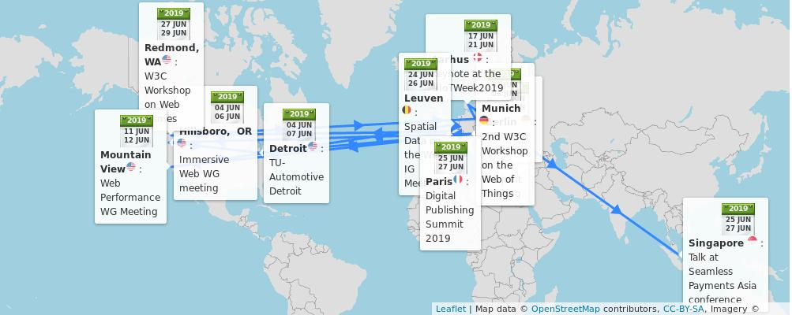

> 3\-5 June: 2nd \#W3CWorkshop on the Web of Things, hosted by @siemens in \#Munich 🇩🇪 https://www\.w3\.org/WoT/ws\-2019/ \#IoT 
> 
> 
> 🗓️ June@w3c: W3C workshops, Working groups' meetings, digipub and payments events, etc\. https://www\.w3\.org/participate/eventscal\.html 
> 
> 

 [Jun 02 2019, 07:25:46 UTC](https://twitter.com/w3cdevs/status/1135085079947022336)

----

> 4\-5 June: @dontcallmeDOM attends the @MozDevNet product Advisory Board \#f2fmeeting in \#Berlin 🇩🇪
> 4\-7 June: The @csswg meets in \#Toronto 🇨🇦 @mozilla's offices https://wiki\.csswg\.org/planning/toronto\-2019

 [Jun 02 2019, 07:25:47 UTC](https://twitter.com/w3cdevs/status/1135085085278031872)

----

> 4\-5 June: The Immersive Web \#Working Group @immersiveWebW3C holds      its \#f2fmeeting in \#Hillsboro 🇺🇸, hosted by @intel\. See their agenda: https://github\.com/immersive\-web/administrivia/blob/master/F2F\-Jun\-2019/schedule\.md

 [Jun 02 2019, 07:25:47 UTC](https://twitter.com/w3cdevs/status/1135085083495489536)

----

> 17\-21 June: @dsraggett keynotes at the \#IoTWeek2019 in \#Aarhus 🇩🇰\#IoT \#standards @iot\_forum https://iotweek\.org/program\-2019/ 
> 
> 

 [Jun 02 2019, 07:25:48 UTC](https://twitter.com/w3cdevs/status/1135085089979817986)

----

> 11 June: The @webperfwg holds its \#f2fmeeting in \#MountainView 🇺🇸, hosted by @google https://docs\.google\.com/document/d/12ANc7fbKpjs\_\_Qw\_0DxM74u49276vTwRwCPyBxUkfBw/ \#WebPerf

 [Jun 02 2019, 07:25:48 UTC](https://twitter.com/w3cdevs/status/1135085088625037312)

----

> 6\-7 June: The joint Web of Things \#WorkingGroup and \#CommunityGroup meetings are co\-located with the @w3c \#WoT workshop,       in \#Munich 🇩🇪  at @TU\_Muenchen\. Full agenda avail\. at: https://www\.w3\.org/WoT/IG/wiki/F2F\_meeting,\_6\-7\_June\_2019,\_Munich,\_Germany \#IoT

 [Jun 02 2019, 07:25:48 UTC](https://twitter.com/w3cdevs/status/1135085087303884801)

----

> 24\-25 June: The Spatial Data on the Web \#InterestGroup meets in \#Leuven 🇧🇪 @w3c @opengeospatial https://www\.w3\.org/2017/sdwig/meetings/f2f\-4\.html

 [Jun 02 2019, 07:25:49 UTC](https://twitter.com/w3cdevs/status/1135085094270656512)

----

> 25\-26 June: The @w3cpublishing's work is presented at the Digital Publishing Summit in \#Paris 🇫🇷, @EDRLab\_EPUB \#dpubsummit \#audiobook   
> Register soon\! https://www\.edrlab\.org/events/dpub\-summit\-2019/ 
> 
> 

 [Jun 02 2019, 07:25:50 UTC](https://twitter.com/w3cdevs/status/1135085095621189633)

----

> 27\-28 June: \#W3CWorkshop on Web games in \#Redmond 🇺🇸, https://www\.w3\.org/2018/12/games\-workshop/ hosted by @microsoft \#gaming https://cards\.twitter\.com/cards/18ce53z7ril/7ansq

 [Jun 02 2019, 07:25:51 UTC](https://twitter.com/w3cdevs/status/1135085100301836288)

----

> 25\-27 June: W3C Evangelist's @RachelYager speaks about the digital transformation of \#payments at @seamlessasia \#SeamlessSummit in \#Singapore 🇸🇬 https://www\.terrapinn\.com/exhibition/seamless/agenda\.stm   
> Meet also @alanbirdW3C and @naomi5500 to discuss alternative payment technologies \#WebPayments

 [Jun 02 2019, 07:25:51 UTC](https://twitter.com/w3cdevs/status/1135085098704003072)

----

> The recently chartered Media Working Group to the rescue\! https://twitter\.com/w3c/status/1131462059152093184 https://twitter\.com/hgsujay/status/1135422433635307521
> The auto\-play policy detection specification \(incubated in the @wicg\_\) allows Web developers to determine whether their media will be played automatically, which in turns enable browsers to take more restrictive media play policies https://github\.com/wicg/autoplay/

 [Jun 03 2019, 09:16:03 UTC](https://twitter.com/w3cdevs/status/1135475222419824641)

----

> This in fact resulted from earlier attempts at preventing auto\-play which made building some media\-based experience too cumbersome https://twitter\.com/ChromiumDev/status/909690388990046210

 [Jun 03 2019, 09:16:04 UTC](https://twitter.com/w3cdevs/status/1135475225162858496)

----

> These elected @W3CAB participants join the continuing ones: Jay \(Junichi\) Kishigami \(@NTTPR\), @frivoal \(\#W3CInvitedExpert\), @TzviyaSiegman \(@WileyGlobal\) and David Singer \(@Apple\)
> Congrats to @fantasai \(\#W3CInvitedExpert\), @chaals \(@ConsenSys\), Avneesh Singh \(@DAISYConsortium\), Eric Siow \(@intel\), @LeonieWatson \(@TetraLogical\), @cwilso \(@Google\), and Judy Zhu \(@AlibabaGroup\)\!\! 👏👏 https://twitter\.com/w3c/status/1135836408101445632

 [Jun 04 2019, 12:03:47 UTC](https://twitter.com/w3cdevs/status/1135879821882548225)

----

> The @W3CAB's 2019 priorities are \#Globalization, \#Diversity, Evergreen  \#standards, Legal entity, @WHATWG partnership, horizontal review redesign, new work areas, etc\. Check them out: https://www\.w3\.org/wiki/AB/2019\_Priorities

 [Jun 04 2019, 12:03:48 UTC](https://twitter.com/w3cdevs/status/1135879826827612160)

----

> Created in 1998, the @W3CAB provides ongoing guidance to the @w3c team  on issues of strategy, management, legal matters, process, and conflict resolution\. It serves its members by tracking and handling issues raised in member meetings\. https://www\.w3\.org/wiki/AB

 [Jun 04 2019, 12:03:48 UTC](https://twitter.com/w3cdevs/status/1135879824269021184)

----

> 📢 New on the \#games workshop's menu: the agenda https://www\.w3\.org/2018/12/games\-workshop/agenda\.html 🎮👾 and the position papers https://www\.w3\.org/2018/12/games\-workshop/papers\.html 📃🗂️  
> Many thanks to @microsoft for hosting the event and to @FacebookGaming for supporting it\! \.\./2019/2019\-06\-tweets\.html\#x1135085100301836288
> https://cards\.twitter\.com/cards/18ce53z7ril/7ansq

 [Jun 14 2019, 12:33:18 UTC](https://twitter.com/w3cdevs/status/1139511128810315776)

----

> The @w3c "Character Model for the World Wide Web: String Matching" \#WorkingGroup note has been translated into Japanese: http://www\.asahi\-net\.or\.jp/\~ax2s\-kmtn/internet/character/NOTE\-charmod\-norm\-20190204\.html Thank you @omnidirect \! \#html5j \#w3c\_keio \#i18n @webi18n
> \.@w3c's \#WorkingGroup note ウェブの文字モデル: 文字列マッチング は日本語に翻訳されています：http://www\.asahi\-net\.or\.jp/\~ax2s\-kmtn/internet/character/NOTE\-charmod\-norm\-20190204\.html どうもありがとう @omnidirect \! ＃html5j \#w3c\_keio \#i18n @webi18n

 [Jun 14 2019, 13:34:51 UTC](https://twitter.com/w3cdevs/status/1139526618924376064)

----

> 🗣️📣 \#developers \#designers etc\., please apply for \#w3cTPAC's \#diversity \#inclusion fund before 14 July 2019\! See https://www\.w3\.org/blog/2019/diversity\-at\-w3c\-2019\-update\-launch\-of\-tpac\-diversity\-fund/\#fund, and if you want to know more, our DMs are open\. \.\./2019/2019\-05\-tweets\.html\#x1133021507368693760

 [Jun 17 2019, 16:24:19 UTC](https://twitter.com/w3cdevs/status/1140656429084348417)

----

> 🗣️ Get ready for an exciting \#ViewSourceConf \- 30 Sept\.\-1 Oct\., in Amsterdam 🇳🇱\! Purchase your tickets now: https://2019\.viewsourceconf\.org/ and come discuss \#BestPractices for building for the \#Web, as well as \#WebStandards' creation and support with \#browser vendors and others\. https://twitter\.com/viewsourceconf/status/1140644507639091205

 [Jun 18 2019, 14:33:52 UTC](https://twitter.com/w3cdevs/status/1140991020248829953)

----

> 26 June: a \#w3cdevs and \#SeattleJS \#meetup hosted by @galvanize \! Are you going? Register soon: https://www\.meetup\.com/seattlejs/events/262333824/ 
> 
> 

 [Jun 18 2019, 16:15:15 UTC](https://twitter.com/w3cdevs/status/1141016536183988227)

----

> Another outcome of this \#W3CWorkshop is a guide for feature \#developers: "Adding another permission?", authored by @npdoty   
> https://github\.com/w3cping/adding\-permissions/blob/master/README\.md
> Recognizing that users suffer from permission"fatigue", workshop participants explored several models to avoid prompts\. Read more in the report: https://www\.w3\.org/Privacy/permissions\-ws\-2018/report\.html https://twitter\.com/w3c/status/1141403024990060545

 [Jun 20 2019, 09:52:40 UTC](https://twitter.com/w3cdevs/status/1141645031159336960)

----

> Next week on June 26 in \#Seattle 🇺🇸 a co\-hosted @w3c \+ @SeattleJS meetup, the day before the Web Games workshop starts \- don't miss it\! \#WebXR, \#WebGPU and video streaming on the menu https://twitter\.com/seattlejs/status/1141010707502133249

 [Jun 21 2019, 08:16:25 UTC](https://twitter.com/w3cdevs/status/1141983197372305408)

----

> The \#w3cgames2019 Workshop on Web Games is about to start \- and will be live\-streamed\!  
> https://mps\-eventreg\.com/gk/g/6zhXQMcr3ax\-835 https://www\.w3\.org/2018/12/games\-workshop/
> See agenda of the workshop for the next two days https://www\.w3\.org/2018/12/games\-workshop/agenda\.html

 [Jun 27 2019, 15:54:15 UTC](https://twitter.com/w3cdevs/status/1144272741802991619)

----

> The second day of the workshop \#w3cgames2019 is starting now \- join the live stream at https://mps\-eventreg\.com/gk/g/6zhXQMcr3ax\-835 if you want to follow remotely\.  
>   
> First on the agenda today, the role of audio in Web games https://www\.w3\.org/2018/12/games\-workshop/agenda\.html

 [Jun 28 2019, 15:47:40 UTC](https://twitter.com/w3cdevs/status/1144633469944774657)