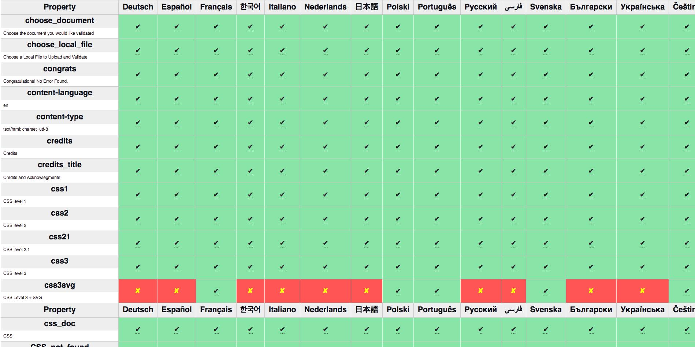

> 10\-12 July: @JAlanBirdW3C speaks at the Financial Innovation and   Payments Summit, in \#NewPort RI 🇺🇸 @opal\_group https://twitter\.com/financialit\_net/status/1141330797913432070
> 🗓️ July@w3c: a slow month as Northern hemisphere summer starts \- https://www\.w3\.org/participate/eventscal\.html

 [Jul 02 2019, 09:41:26 UTC](https://twitter.com/w3cdevs/status/1145990857604128768)

----

> 2 \- or it starts by developing a new type of strings \(e\.g\. rdf:LocalizableString\) that would, overtime, replace the basic string type; this would allow to stage updates to specs and implementations on a longer period

 [Jul 02 2019, 09:52:44 UTC](https://twitter.com/w3cdevs/status/1145993702730608641)

----

> Since so many other specifications depend on \#RDF core, the proposed charter suggests two approaches:   
> 1 \- either the group updates the basic definition of strings in RDF \(known as langString\) and thus updates all the dependent specs to reflect that change as needed\.
> This new proposed charter in the \#SemanticWeb \#LinkedData space proposes nothing less than a revision to the core of \#RDF to enable proper support for \#internationalization in strings\. https://w3c\.github\.io/rdf\-dir\-literal/draft\-charter\.html https://twitter\.com/w3c/status/1145622213225304064

 [Jul 02 2019, 09:52:44 UTC](https://twitter.com/w3cdevs/status/1145993701308751872)

----

> \#JSON strings have similar issues with regard to \#internationalization \- see some of the exploration @webi18n has done in that space too https://www\.w3\.org/TR/string\-meta/

 [Jul 02 2019, 09:52:45 UTC](https://twitter.com/w3cdevs/status/1145993706358681600)

----

> To comment on the charter, use the github repository where it has been developed https://github\.com/w3c/rdf\-dir\-literal/issues

 [Jul 02 2019, 09:52:45 UTC](https://twitter.com/w3cdevs/status/1145993705184256000)

----

> The problem space and the envisioned solutions are described in more details in RDF Literals and Base Directions https://w3c\.github\.io/rdf\-dir\-literal/

 [Jul 02 2019, 09:52:45 UTC](https://twitter.com/w3cdevs/status/1145993704030842880)

----

> 14 July: Deadline to apply to the \#w3cTPAC \#diversity fund \.\./2019/2019\-06\-tweets\.html\#x1140656429084348417

 [Jul 02 2019, 12:26:46 UTC](https://twitter.com/w3cdevs/status/1146032466588835846)

----

> 8 July: Deadline to register to the Workshop on Data Models for Transportation where the future of standards relating to automotive and transportation data will be discussed https://www\.w3\.org/auto/events/data\-ws\-2019/cfp\.html https://twitter\.com/w3c/status/1144233681827127297

 [Jul 02 2019, 12:26:46 UTC](https://twitter.com/w3cdevs/status/1146032464881704961)

----

> Two important upcoming deadlines nonetheless:

 [Jul 02 2019, 12:26:46 UTC](https://twitter.com/w3cdevs/status/1146032463417892864)

----

> \.@torgo and @Lady\_Ada\_King talk about \#diversity in the industry and in @w3c \- in particular about the \#w3cTPAC diversity fund at 2:20 \- in their podcast interview with @MobileMatters\_ https://twitter\.com/MobileMatters\_/status/1145677621918883840 \.\./2019/2019\-07\-tweets\.html\#x1146032466588835846

 [Jul 03 2019, 05:59:11 UTC](https://twitter.com/w3cdevs/status/1146297313754853376)

----

> Web \#developers \#designers, we want to hear from you\! Designed in collaboration with browser vendors and @w3c, @MozDevNet just launched a Web Developer and Designer Needs Assessments survey: https://qsurvey\.mozilla\.com/s3/Developer\-Needs\-Assessment\-2019
> Take this opportunity to influence browser vendors\! Let us know where  you are experiencing difficulties when building for the Web\.

 [Jul 16 2019, 21:36:12 UTC](https://twitter.com/w3cdevs/status/1151244163595296768)

----

> 登録は今開いています！  
> https://ti\.to/w3c/w3c\-developer\-meetup\-fukuoka\-2019 https://twitter\.com/keita\_kawamoto/status/1140453009513578497

 [Jul 18 2019, 09:01:32 UTC](https://twitter.com/w3cdevs/status/1151779020683513856)

----

> The \#CSS Validator is currently available in 21 languages\! 🤩🙌 Many thanks to all the volunteer contributors for making this free @w3c service accessible to Web \#developers and \#designers the world over 🌍   
> https://jigsaw\.w3\.org/css\-validator/ 
> 
> 
> There are other languages to serve, so if you are interested to translate in your native language, please find guidelines and instructions on how to contribute: https://jigsaw\.w3\.org/css\-validator/translations\.html   
> Thank you\! 
> 
> 

 [Jul 18 2019, 15:22:22 UTC](https://twitter.com/w3cdevs/status/1151874862740312064)

----

> レジストレーション開始した！Registration is now open: https://ti\.to/w3c/w3c\-developer\-meetup\-fukuoka\-2019 \#developers \#designers \#Fukuoka \#html5j @w3c\_keio

 [Jul 22 2019, 08:28:19 UTC](https://twitter.com/w3cdevs/status/1153220214240219141)

----

> This draft document is it the result of many individuals and organisations that have committed to working together to build a better \#Web\.   
> Feedback welcome\! https://twitter\.com/webfoundation/status/1153582532501430272

 [Jul 23 2019, 09:59:55 UTC](https://twitter.com/w3cdevs/status/1153605652457119744)

----

> Last month, we, the devrel team, co\-organized with @seattlejs a very successul and energizing \#meetup\! Check out the talks' videos shot that day: https://www\.youtube\.com/playlist?list\=PLfCgUsc2B8DULnyLiN\_ThYKJBWiPNf\-tM   
> @dontcallmeDOM @NellWaliczek @deltakosh @dougsillars cc @tidoust \! https://twitter\.com/seattlejs/status/1144053702774312960

 [Jul 25 2019, 16:03:54 UTC](https://twitter.com/w3cdevs/status/1154422029975769089)

----

> Listen to Peter Snyder, privacy researcher @Brave, summarizing his talk at the W3C Track of @TheWebConf: how to improve the standards process to make it easier to protect browser users' privacy\! https://vimeo\.com/342289255 https://twitter\.com/wseltzer/status/1139202516157992960

 [Jul 26 2019, 11:10:46 UTC](https://twitter.com/w3cdevs/status/1154710648904925184)

----

> 🙏 \#developers \#designers, please contribute\!   
> By translating the @w3c\_wai resources, you help expand the reach of accessibility information to make digital accessibility better for everyone https://twitter\.com/w3c\_wai/status/1156194755514122240

 [Jul 30 2019, 14:30:27 UTC](https://twitter.com/w3cdevs/status/1156210451816075266)