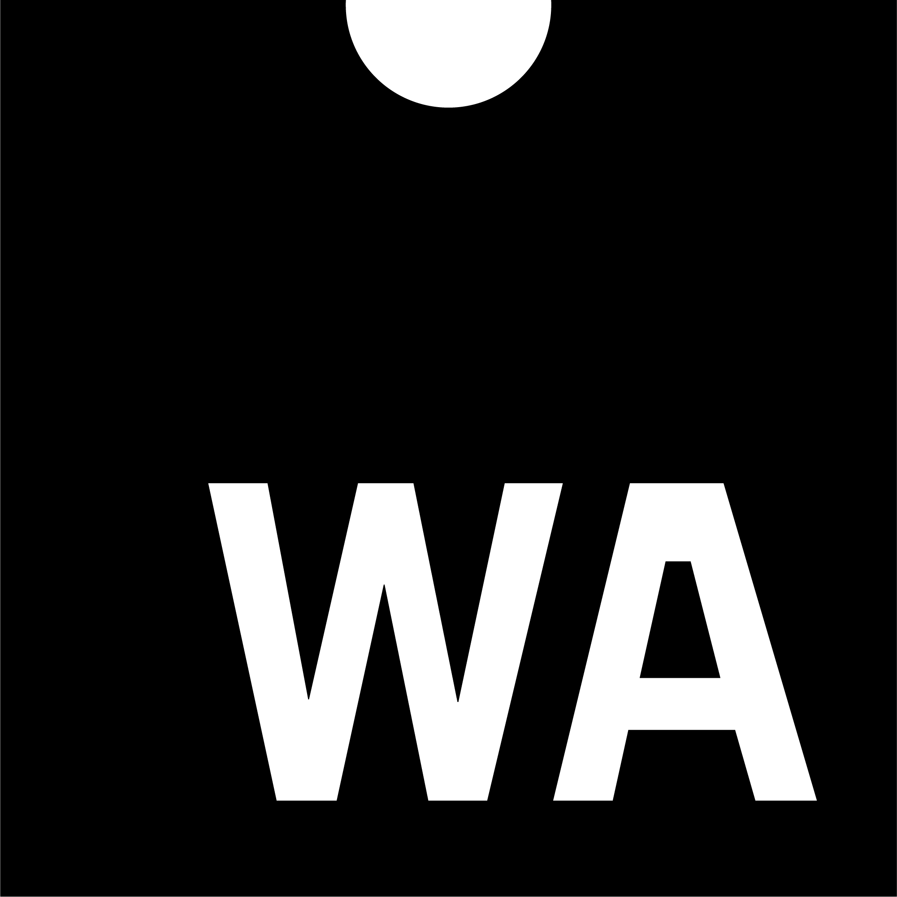

> If you happen to be in \#Fukuoka on 16 Sept, register to our \#developer \#meetup \#w3cdevs2019 co\-located with \#w3cTPAC  
> https://cards\.twitter\.com/cards/18ce53z7ril/7qm0z
> 🗓️August@w3c: another slow month, awaiting a very busy September\! In the meantime, a few reminders:

 [Aug 01 2019, 08:50:53 UTC](https://twitter.com/w3cdevs/status/1156849773217026048)

----

> W3Cは福岡をはじめ全国各地から地元のWebデザイナーやアプリケーション開発者を招き、W3Cコミュニティとのデモンストレーション、プレゼンテーション、そしてディスカッションに参加します https://ti\.to/w3c/w3c\-developer\-meetup\-fukuoka\-2019 \#w3cdevs2019 \#w3c\_keio @naomi5500 \#html5j

 [Aug 01 2019, 08:50:54 UTC](https://twitter.com/w3cdevs/status/1156849776165625856)

----

> Get your ticket for the @viewsourceconf, 30 Sept\-1 Oct in \#Amsterdam, a conference for future\-thinking front\-end developers  
> https://twitter\.com/viewsourceconf/status/1140644507639091205

 [Aug 01 2019, 08:50:55 UTC](https://twitter.com/w3cdevs/status/1156849778640203777)

----

> The @MozDevNet Web Developer and Designer survey is still open, so please add your voice\! https://cards\.twitter\.com/cards/18ce53z7ril/7qblf

 [Aug 01 2019, 08:50:56 UTC](https://twitter.com/w3cdevs/status/1156849782943625216)

----

> \#WebAssemby \(or \#WASM\) is a game changer for the \#Web platform, and its \#WorkingGroup \(https://www\.w3\.org/community/webassembly/\) issued 3 documents in Candidate Recommendation status, so \#timetoimplement\! https://twitter\.com/w3c/status/1151825580721131520
> \#WebAssembly is a low\-level assembly language that provides fast, efficient and portable features\. In \#browsers, it is designed to complement and work alongside \#JavaScript   
> \.\./2018/2018\-02\-tweets\.html\#x964131886716112898 
> 
> 

 [Aug 01 2019, 13:44:24 UTC](https://twitter.com/w3cdevs/status/1156923638182023168)

----

> 1\) "WebAssembly Core Specification" describes a safe, portable, low\-level code format designed for efficient execution and compact representation \#performance   
> https://www\.w3\.org/TR/2019/CR\-wasm\-core\-1\-20190718/

 [Aug 01 2019, 13:44:28 UTC](https://twitter.com/w3cdevs/status/1156923653432520707)

----

> 3\) "WebAssembly Web API" describes the integration of WebAssembly with the broader \#WebPlatform  
> https://www\.w3\.org/TR/2019/CR\-wasm\-web\-api\-1\-20190718/

 [Aug 01 2019, 13:44:29 UTC](https://twitter.com/w3cdevs/status/1156923660353056768)

----

> 2\) "WebAssembly JavaScript Interface" provides an explicit \#JavaScript \#API for interacting with \#WebAssembly  
> https://www\.w3\.org/TR/2019/CR\-wasm\-js\-api\-1\-20190718/

 [Aug 01 2019, 13:44:29 UTC](https://twitter.com/w3cdevs/status/1156923658163687424)

----

> Listen to @luke\_wagner, @from Mozilla, who gave an overview of \#WASM at last month's \#W3CWorkshop on Web Games \#w3cgames2019\. He notably details the WebIDL Bindings proposal to hook Web APIs into \#WebAssembly  
> https://vimeo\.com/350135351

 [Aug 01 2019, 13:44:30 UTC](https://twitter.com/w3cdevs/status/1156923662479646728)

----

> Check out this other short video of @luke\_wagner shot last year at \#w3cTPAC \#Lyon https://vimeo\.com/311391518

 [Aug 01 2019, 13:44:31 UTC](https://twitter.com/w3cdevs/status/1156923667919593472)

----

> The videos of the talks at \#w3cgames2019 are online\! Watch them at https://vimeo\.com/showcase/6176604  
>   
> https://cards\.twitter\.com/cards/18ce53z7ril/7tfyb
> Successful \#w3cgames2019 event hosted by @Microsoft\! The report reflects the discussions on threading support, WebIDL Bindings in \#WebAssembly, latency, cloud gaming, \#monetization, indie \#games, etc\.: https://www\.w3\.org/2018/12/games\-workshop/report\.html  
> And huge thanks to @FacebookGaming for sponsoring\! https://twitter\.com/w3c/status/1157239712375087105

 [Aug 02 2019, 12:44:33 UTC](https://twitter.com/w3cdevs/status/1157270965723774976)

----

> It's \#GeekWeek\! From today to 9 August, @w3c staff is taking a week to experiment, explore and innovate\. It is a time to collaborate with colleagues with different expertise, and broaden one's horizon\.

 [Aug 05 2019, 12:18:10 UTC](https://twitter.com/w3cdevs/status/1158351485996085248)

----

> 3D rendering is not only about GPU features\. Efficient traversal in \#JavaScript using multiple cores is tough as there's no way to share structured objects across \#WebWorkers\. Check out the discussion on threading at \#w3cgames2019 @deltakosh: https://www\.w3\.org/2018/12/games\-workshop/report\.html
> For more, watch the videos of the \#W3CWorkshop \#w3cgames2019 talks: https://vimeo\.com/showcase/6176604

 [Aug 12 2019, 15:10:19 UTC](https://twitter.com/w3cdevs/status/1160931526873366529)

----

> Open for registration\! Awesome speakers and great networking at next month's \#developer \#meetup \#w3cdevs2019 co\-located with \#w3cTPAC \#Fukuoka 🇯🇵   
> https://www\.w3\.org/2019/09/Meetup/

 [Aug 12 2019, 16:43:38 UTC](https://twitter.com/w3cdevs/status/1160955010211098624)

----

> Call to action\! 👉The Gamepad \#API needs more engagement to finalize version 1 and add support for modern \#gamepad features \(e\.g\. touchpad and light indicators\) later on\. Read @tidoust's \#gamepad discussion summary in the \#w3cgames2019 report:   
> https://www\.w3\.org/2018/12/games\-workshop/report\.html
> Watch also the \#w3cgames2019 videos: https://vimeo\.com/showcase/6176604

 [Aug 14 2019, 12:29:12 UTC](https://twitter.com/w3cdevs/status/1161615754929823745)

----

> \#WebTransport and WebCodecs to the rescue at \#w3cgames2019 to reduce latency of transmission in cloud gaming scenarios: https://www\.w3\.org/2018/12/games\-workshop/report\.html\#webtransport \#gaming \#HTML5
> \#w3cgames2019 \#W3CWorkshop videos are also online\! https://vimeo\.com/showcase/6176604

 [Aug 21 2019, 10:52:22 UTC](https://twitter.com/w3cdevs/status/1164128102353637376)

----

> @matatk and @uxcodeline explore \#accessibility needs and solutions for \#games at \#w3cgames2019: https://www\.w3\.org/2018/12/games\-workshop/report\.html\#a11y \#a11y \#ux

 [Aug 21 2019, 19:57:05 UTC](https://twitter.com/w3cdevs/status/1164265182874525696)

----

> There are tons of audio\-processing code written in C/C\+\+\. @hochsays proposes a low\-level Audio Device Client specification to help port this code to the \#Web at \#W3CWorkshop \#w3cgames2019\. Read the discussion summary: https://www\.w3\.org/2018/12/games\-workshop/report\.html\#audio
> \.\.\. and/or listen to @hochsays' talk "Better and faster audio I/O on the Web": https://vimeo\.com/350904743

 [Aug 22 2019, 20:13:49 UTC](https://twitter.com/w3cdevs/status/1164631781506801666)

----

> Discussions about \#discoverability and \#monetization of \#games on the Web were led by @tcmg at the \#W3CWorkshop \#w3cgames2019 \- read the summary: https://www\.w3\.org/2018/12/games\-workshop/report\.html\#discoverability

 [Aug 26 2019, 09:18:17 UTC](https://twitter.com/w3cdevs/status/1165916365930340353)

----

> Comments welcomed on the updated @w3c\_wai draft document on "Alternatives to Visual Turing Tests on the Web" that addresses the \#CAPTCHA \#accessibility issue: https://www\.w3\.org/TR/turingtest/ \#a11y https://twitter\.com/w3c/status/1164993084289167363

 [Aug 26 2019, 10:47:43 UTC](https://twitter.com/w3cdevs/status/1165938872058036224)

----

> Come listen to this year's awesome speakers: @sundress \(@Google\), @Lady\_Ada\_King \(@samsunginternet\), @linclark \(@mozilla\), Yutaka Obuchi \(@pixiv\_corp\), @somelaniesaid \(@MSEdgeDev\) on topics related to \#WebXR \#HighContrast \#CSS \#accessibility \#WebXR \#WebAssembly \#WASM \#3DGraphics https://twitter\.com/w3c/status/1166335287557074944
> Special thanks to our sponsors @nttcom @Microsoft @pepabo @mozilla @stickermule @igalia @Yubico @saucelabs @webcastors @l\_withyou for supporting this event\!  
> https://www\.w3\.org/2019/09/Meetup/sponsors\.html

 [Aug 27 2019, 13:22:44 UTC](https://twitter.com/w3cdevs/status/1166340269379375111)

----

> Important upcoming \#W3CWorkshop hosted by @plutoVR, 5\-6 November 2019 in \#Seattle 🇺🇸 and chaired by @LeonieWatson https://www\.w3\.org/2019/08/inclusive\-xr\-workshop/ cc @ImmersiveWebW3C @dontcallmeDOM   
> \#WebXR \#ImmersiveWeb \#accessibility \#a11y \#UX \#InclusiveDesign https://twitter\.com/w3c/status/1166996258877321217

 [Aug 29 2019, 10:05:17 UTC](https://twitter.com/w3cdevs/status/1167015355686019072)

----

> One week left\! Are you based in \#Europe 🇪🇺 and actively involved in @w3c \#WebStandards development? Do apply for funding this work \(before Sept\. 6\) and help shape the future standards\! https://www\.standict\.eu/OpenCalls/standicteu\-8th\-open\-call @Stand\_ICT https://twitter\.com/Stand\_ICT/status/1167431088618332160
> To our followers who give feedback, contribute to and implement @w3c specifications, financial support is available \. So, how about submitting an application now? 🙋‍♀️🙋‍♂️https://www\.standict\.eu/applicant/register

 [Aug 31 2019, 06:59:08 UTC](https://twitter.com/w3cdevs/status/1167693285521072131)