> 🗓️ September@w3c: \#W3CWorkshop, @thew3cx MOOCs, W3C TPAC and DevMeetup in \#Japan, etc\. https://www\.w3\.org/participate/eventscal\.html 
> 
> 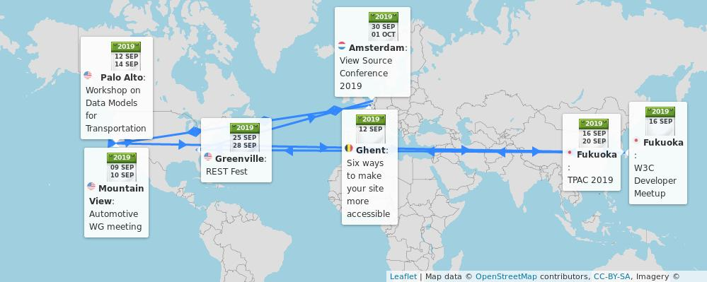
> 9\-10 Sept\.: Hosted by @BMW, the @w3c \#auto \#WorkingGroup meets in \#MountainView 🇺🇸 https://www\.w3\.org/auto/wg/wiki/Main\_Page\#Upcoming\_F2F\_Meetings

 [Sep 02 2019, 12:54:45 UTC](https://twitter.com/w3cdevs/status/1168507553770344448)

----

> 10 Sept\.: Learn how to build Web sites with \#HTML5 and \#CSS with this @thew3cx \#MOOC: https://www\.edx\.org/course/html5\-and\-css\-fundamentals\-2 @Microsoft @edXonline 
> 
> 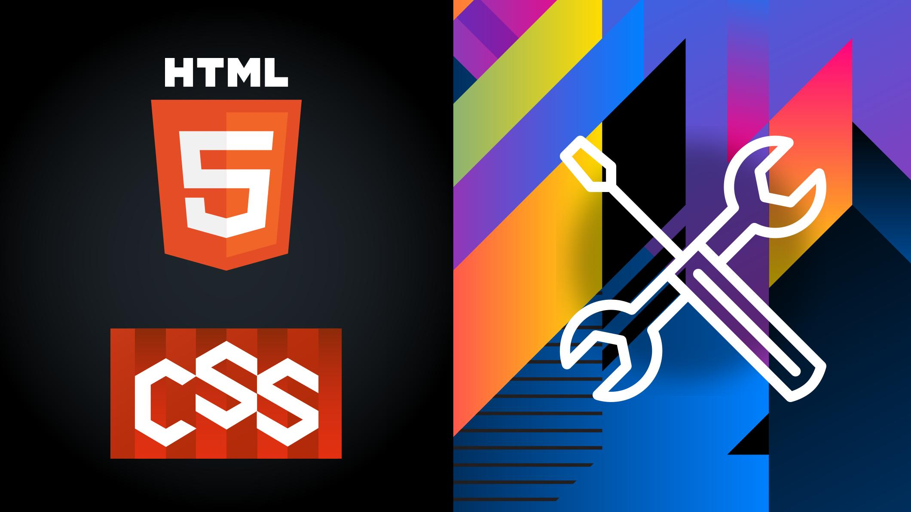

 [Sep 02 2019, 12:54:51 UTC](https://twitter.com/w3cdevs/status/1168507578051174408)

----

> 12 Sept\.: @hdv of the @w3c\_wai team explains 6 ways to make your \#WebSite more accessible, at the \#Ghent inclusive design \#meetup 🇧🇪: https://www\.meetup\.com/Inclusive\-Design/events/262945395/ \#accessibility \#a11y @watt\_factory

 [Sep 02 2019, 12:54:52 UTC](https://twitter.com/w3cdevs/status/1168507582253797376)

----

> 12\-13 Sept: 2 days of talks and discussions at the \#W3CWorkshop on Data Models for Transportation in \#PaloAlto 🇺🇸; hosted by @Uber and sponsored by @geotab: https://www\.w3\.org/auto/events/data\-ws\-2019/  \#ConnectedCar \#auto \#DataModel 
> 
> 

 [Sep 02 2019, 12:54:55 UTC](https://twitter.com/w3cdevs/status/1168507596090699777)

----

> 16 Sept\.: We're excited to meet Japanese \#Web \#developers and \#designers in \#Fukuoka 🇯🇵 for the annual @w3c \#devmeetup \#w3cdevs2019\! Check out the awesome speakers and great demos:   
> https://www\.w3\.org/2019/09/Meetup/

 [Sep 02 2019, 12:54:57 UTC](https://twitter.com/w3cdevs/status/1168507605830045697)

----

> 16\-20 Sept\.: @w3c members, staff and invited experts meet in \#Fukuoka 🇯🇵 to shape the future of \#Web standards\! \#w3cTPAC  
> https://www\.w3\.org/2019/09/TPAC/

 [Sep 02 2019, 12:54:58 UTC](https://twitter.com/w3cdevs/status/1168507609017737218)

----

> 18 Sept\.: Learn how to take your Web pages from bland to bold with the power of CSS styling with @thew3cx\! Enroll the \#CSS Basics \#MOOC: https://www\.edx\.org/course/css\-basics @edXonline @Microsoft 
> 
> 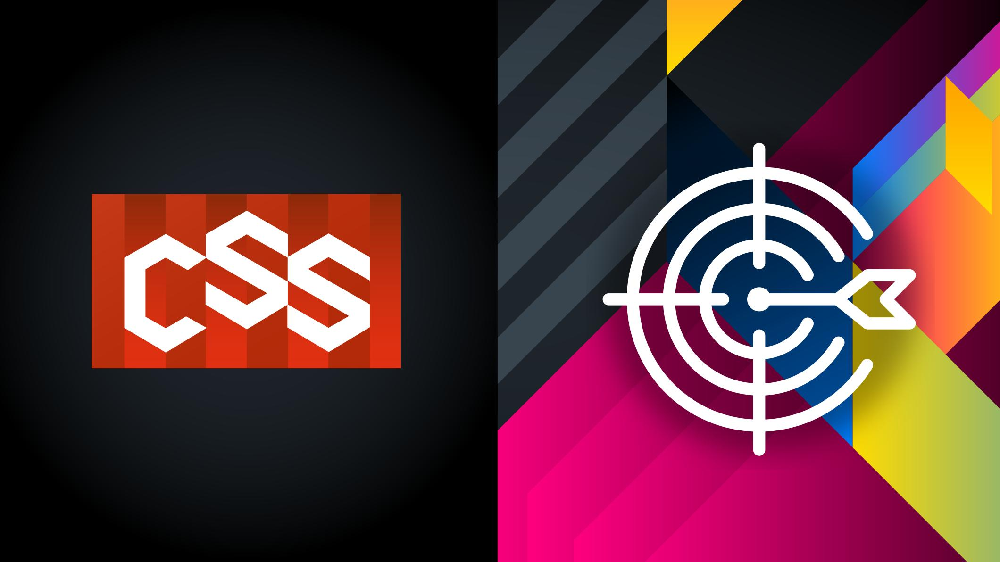

 [Sep 02 2019, 12:55:03 UTC](https://twitter.com/w3cdevs/status/1168507628118597632)

----

> 25\-28 Sept\.: Check out the @restfest conference in \#Greenville 🇺🇸 \#REST \#API \#WebServices  
> https://twitter\.com/restfest/status/1164177333202239489

 [Sep 02 2019, 12:55:04 UTC](https://twitter.com/w3cdevs/status/1168507632430268416)

----

> 30 Sept\.\-1 Oct\.: Impressive line of speakers, lighting talks, conversation corners, etc\. ➡️ all of it is in \#Amsterdam 🇳🇱 @viewsourceconf\!  The @w3c staff @hdv, @marieforgue and @dontcallmeDOM are looking forward to your questions \- register soon\! https://mozilla\-tito\-vs\.netlify\.com/ 
> 
> 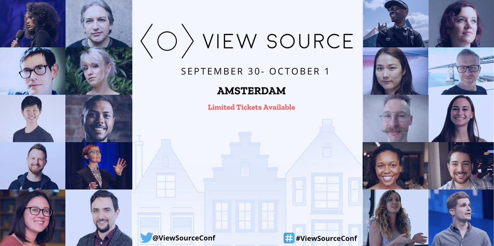

 [Sep 02 2019, 12:55:10 UTC](https://twitter.com/w3cdevs/status/1168507658002980864)

----

> Want to know how to apply a \#HighContrast theme to view digital interfaces in a limited color palette? Do not miss @somelaniesaid's talk in \#Fukuoka 🇯🇵 \#w3cdevs2019 \#CSS \#accessibility  
> https://www\.w3\.org/2019/09/Meetup/speaker\-melanie\.html

 [Sep 03 2019, 09:01:59 UTC](https://twitter.com/w3cdevs/status/1168811365781463041)

----

> Listen to Judy Zhu @AlibabaGroup explaining why there is a need for standardization of Mini Apps, a widely Web\-based format for apps in China and other markets, at @w3c Track @TheWebConf\. The Chinese Web \#InterestGroup meets in \#Fukuoka \#w3cTPAc on 20 Sept  
> https://vimeo\.com/357308688

 [Sep 03 2019, 09:49:41 UTC](https://twitter.com/w3cdevs/status/1168823370869346304)

----

> Listen to @metaviv from the Thoughtful Technology Project reporting on his talk @WebConf on the W3C \#CredibleWeb \#CommunityGroup and its goals of fighting \#misinformation with a Data Ecosystem \(https://credweb\.org/\) cc @sandhawke   
> https://vimeo\.com/357329636

 [Sep 03 2019, 10:00:34 UTC](https://twitter.com/w3cdevs/status/1168826109561122816)

----

> Last W3C track @TheWebConf video with @andrewshikiar, CMO @FIDOAlliance, who tells us how \#FIDO2 and \#WebAuthn help solve the problems with \#passwords on the Web\!  
> https://vimeo\.com/357306658

 [Sep 03 2019, 10:18:38 UTC](https://twitter.com/w3cdevs/status/1168830653019938820)

----

> Did you know that many important technological advances have been driven by the needs of people with \#disabilities? Find out more from @sundress at \#w3cdevs2019 in \#Fukuoka 🇯🇵on 16 Sept\. @ITEventFukuoka \#a11y \#accessibility   
> https://www\.w3\.org/2019/09/Meetup/speaker\-alice\.html

 [Sep 03 2019, 16:59:13 UTC](https://twitter.com/w3cdevs/status/1168931466098728960)

----

> What is \#WebXR? What features the \#WebXR Device \#API bring to the \#ImmersiveWeb? Find out more from @Lady\_Ada\_King at \#w3cdevs2019 in \#Fukuoka 🇯🇵 on 16 Sept\. @ITEventFukuoka \#VirtualReality \#AugmentedReality @ImmersiveWebW3C   
> https://www\.w3\.org/2019/09/Meetup/speaker\-ada\.html

 [Sep 06 2019, 15:33:11 UTC](https://twitter.com/w3cdevs/status/1169996976924090369)

----

> Find out about VRM, a format for \#3D \#Avatars on the Web, presented by @FMS\_Cat at \#w3cdevs2019 in \#Fukuoka 🇯🇵 on 16 Sept\. @ITEventFukuoka Register soon\!  
> https://www\.w3\.org/2019/09/Meetup/speaker\-yutaka\.html

 [Sep 06 2019, 15:44:32 UTC](https://twitter.com/w3cdevs/status/1169999835359059968)

----

> どうもありがとう！This \#w3cdevs2019 \#developer meetup is made possible with the support of @Microsoft, @nttcom, @pepabo, @mozilla, @stickermule, @igalia, @Yubico, @saucelabs, @webcastors, and @l\_withyou  
> https://www\.w3\.org/2019/09/Meetup/sponsors\.html

 [Sep 06 2019, 15:48:59 UTC](https://twitter.com/w3cdevs/status/1170000952348368896)

----

> Find out with @linclark why \#WASM \#WebAssembly is a game changer on the \#Web and how it complements \#JavaScript for tasks that are CPU intensive for example\. It's next Monday in \#Fukuoka 🇯🇵 at the \#w3cdevs2019 \#meetup\! @ITFukuoka \#html5j  
> https://www\.w3\.org/2019/09/Meetup/speaker\-lin\.html

 [Sep 09 2019, 14:32:29 UTC](https://twitter.com/w3cdevs/status/1171068865415208960)

----

> 📢🆕\! This resource helps understand and create \#captions / \#subtitles, audio description of visual information, descriptive \#transcripts, and \#SignLanguage for media 🎧📹 \#a11y \#accessibility https://twitter\.com/w3c\_wai/status/1171427311306072064

 [Sep 10 2019, 14:48:21 UTC](https://twitter.com/w3cdevs/status/1171435246874583041)

----

> Soon to be distributed at the upcoming \#w3cdevs2019 and \#w3cTpac \.\.\. /cc @ImmersiveWebW3C 
> 
> 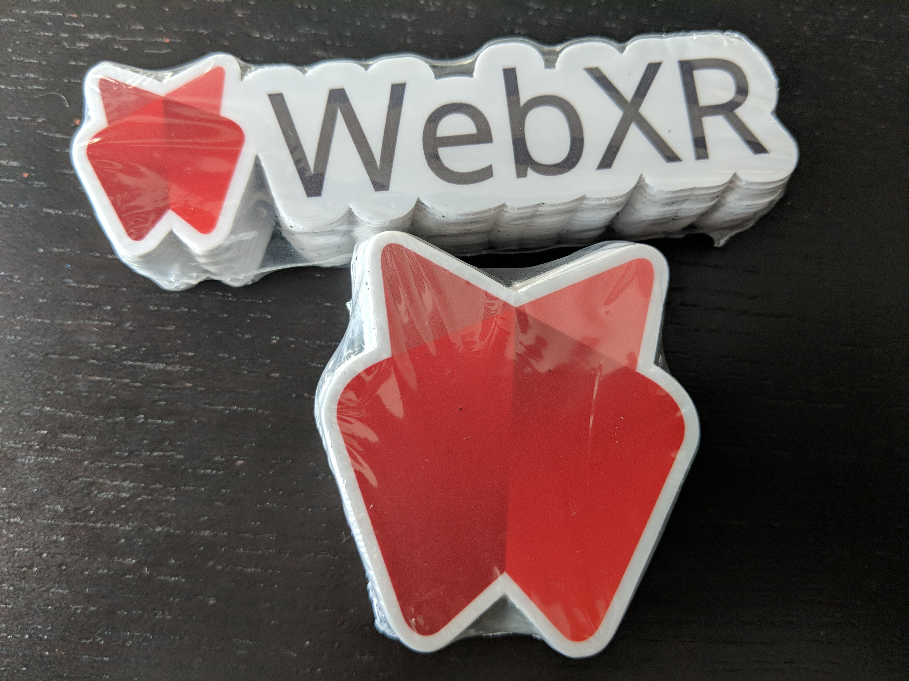

 [Sep 11 2019, 15:20:09 UTC](https://twitter.com/w3cdevs/status/1171805637539446785)

----

> Thanks to @stickermule \! \.\./2019/2019\-09\-tweets\.html\#x1171805637539446785

 [Sep 12 2019, 10:32:00 UTC](https://twitter.com/w3cdevs/status/1172095507822284801)

----

> MiniApps are Web\-technology\-based third\-party developed apps running inside a host app \(e\.g\. chat, social media\), very popular in China among others\. This white paper looks into the needs for standards in this space\. https://twitter\.com/w3c/status/1172043497957933056
> It will be at the core of a breakout session next week during the TPAC unconference on Wednesday \#w3cTPAC https://w3c\.github\.io/tpac\-breakouts/sessions\.html\#miniapp

 [Sep 12 2019, 12:43:57 UTC](https://twitter.com/w3cdevs/status/1172128716404789248)

----

> And yes, many of the questions that were raised by Widgets or Hosted Apps from SysApps will arise again… https://twitter\.com/marcosc/status/1172066844582141953

 [Sep 12 2019, 12:43:58 UTC](https://twitter.com/w3cdevs/status/1172128721026916355)

----

> Judy Zhu provided an introduction to the topic in her video we published a couple of weeks ago \.\./2019/2019\-09\-tweets\.html\#x1168823370869346304

 [Sep 12 2019, 12:43:58 UTC](https://twitter.com/w3cdevs/status/1172128719667892224)

----

> Coming up at \#w3cdevs2019 meetup on Monday in \#Fukuoka 🇯🇵… https://twitter\.com/codepo8/status/1172302272333635585

 [Sep 13 2019, 05:22:52 UTC](https://twitter.com/w3cdevs/status/1172380101226323968)

----

> Implementations are still experimental but worth a try if you're into 3D or parallel computing https://github\.com/gpuweb/gpuweb/wiki/Implementation\-Status

 [Sep 13 2019, 06:35:26 UTC](https://twitter.com/w3cdevs/status/1172398364882657282)

----

> As usual, the work on these techs happen on github https://github\.com/gpuweb/
> \#WebGPU is a set of APIs defined by the "GPU on the  Web" W3C Community Group to provide lower\-level access to GPU capabilities in a Web\-friendly and WASM\-compatible approach https://www\.w3\.org/community/gpu/ https://twitter\.com/webkit/status/1172207111645716480

 [Sep 13 2019, 06:35:26 UTC](https://twitter.com/w3cdevs/status/1172398363477598210)

----

> You can also listen to @deltakosh 's talk at our @w3cdevs/@seattlejs meetup back in June on his experience of adapting @babylonjs from \#WebGL to \#WebGPU https://www\.youtube\.com/watch?v\=A2FxeEl4nWw&list\=PLfCgUsc2B8DULnyLiN\_ThYKJBWiPNf\-tM&index\=4&t\=0s

 [Sep 13 2019, 06:35:27 UTC](https://twitter.com/w3cdevs/status/1172398366380064768)

----

> \.\.\. with big thanks to our \#w3cdevs2019 sponsors @Microsoft, @nttcom, @pepabo, @mozilla, @stickermule, @igalia, @Yubico, @saucelabs, @webcastors, @l\_withyou for making it possible to organize such an event\!  
> https://www\.w3\.org/2019/09/Meetup/sponsors\.html
> It's tonight, \#Fukuoka 🇯🇵 time\! Over 500 \#developers \#designers convene at @w3c \#DevMeetup \#w3cdevs2019  
> https://www\.w3\.org/2019/09/Meetup/

 [Sep 16 2019, 05:52:04 UTC](https://twitter.com/w3cdevs/status/1173474615047254019)

----

> Then, @sundress demonstrates how many important technological advances have been driven by the needs of people with \#disabilities \#accessibility \#a11y \#w3cdevs2019  
> https://www\.w3\.org/2019/09/Meetup/speaker\-alice\.html

 [Sep 16 2019, 05:52:05 UTC](https://twitter.com/w3cdevs/status/1173474618578853894)

----

> Our first speaker is @somelaniesaid on \#HighContrast theme to view digital interfaces in a limited color palette \- \#CSS \#accessibility \#a11y \#w3cdevs2019  
> https://www\.w3\.org/2019/09/Meetup/speaker\-melanie\.html

 [Sep 16 2019, 05:52:05 UTC](https://twitter.com/w3cdevs/status/1173474616976654337)

----

> Finally, @linclark explains why \#WASM \#WebAssembly is a game changer on the \#Web \#w3cdevs2019   
> https://www\.w3\.org/2019/09/Meetup/speaker\-lin\.html

 [Sep 16 2019, 05:52:06 UTC](https://twitter.com/w3cdevs/status/1173474623431725057)

----

> The \#WebXR device API is coming to browsers in the not too distant future, as shown by @Lady\_Ada\_King \#VirtualReality \#AugmentedReality @ImmersiveWebW3C \#w3cdevs2019  
> https://www\.w3\.org/2019/09/Meetup/speaker\-ada\.html

 [Sep 16 2019, 05:52:06 UTC](https://twitter.com/w3cdevs/status/1173474622005628929)

----

> VRM, a format for \#3D \#Avatars on the Web, is presented by @FMS\_Cat \#w3cdevs2019  
> https://www\.w3\.org/2019/09/Meetup/speaker\-yutaka\.html

 [Sep 16 2019, 05:52:06 UTC](https://twitter.com/w3cdevs/status/1173474620319494144)

----

> Yes\! We will https://twitter\.com/yatil/status/1173534493304598528

 [Sep 16 2019, 13:52:23 UTC](https://twitter.com/w3cdevs/status/1173595488555192321)

----

> You'll hear about some of the recent thinking about continuous standards development at @w3c \(how to make creating and updating Recommendations more efficient\)\. https://www\.w3\.org/2019/Talks/TPAC/continuous\-standards/
> Depending on your timezone and your sleep patterns, you may enjoy our experimental live stream from \#w3cTPAC plenary session https://www\.w3\.org/2019/09/TPAC/plenary\-video\.html \(starting some 9 hours from now, Sep 18 at 00:00 UTC, 9am Japan time\) \(thanks to @webcastors\!\)

 [Sep 17 2019, 15:32:16 UTC](https://twitter.com/w3cdevs/status/1173983014306533377)

----

> You'll also get some of the early insights and lessons from the @MozDevNet survey that ran over the summer \.\./2019/2019\-07\-tweets\.html\#x1151244163595296768

 [Sep 17 2019, 15:32:17 UTC](https://twitter.com/w3cdevs/status/1173983015761936384)

----

> Video to be available in a near future\! https://twitter\.com/fantasai/status/1174112222735241216

 [Sep 18 2019, 00:17:24 UTC](https://twitter.com/w3cdevs/status/1174115167996497920)

----

> thanks to @l\_withyou\! https://twitter\.com/krosylight/status/1173526129350545408

 [Sep 18 2019, 00:29:10 UTC](https://twitter.com/w3cdevs/status/1174118129389060096)

----

> Kicking of @viewsourceconf by @HenriHelvetica 
> 
> 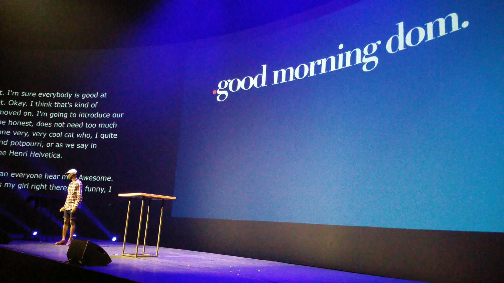

 [Sep 30 2019, 08:15:53 UTC](https://twitter.com/w3cdevs/status/1178584234438594560)

----

> Collective future for shaping the Web @HenriHelvetica \#viewsourceconf 
> 
> 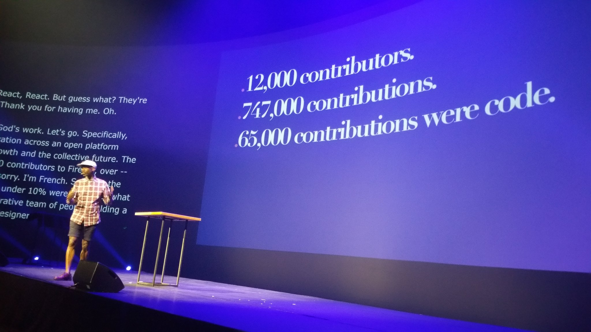

 [Sep 30 2019, 08:45:35 UTC](https://twitter.com/w3cdevs/status/1178591709661413376)

----

> Now at \#ViewSourceConf, the commitments to the \#WebPlatform panel moderated why @torgo w/ @somelaniesaid @KenjiBaheux @cyberdees @AhmadNassri @andreasbovens @hjrchung 
> 
> 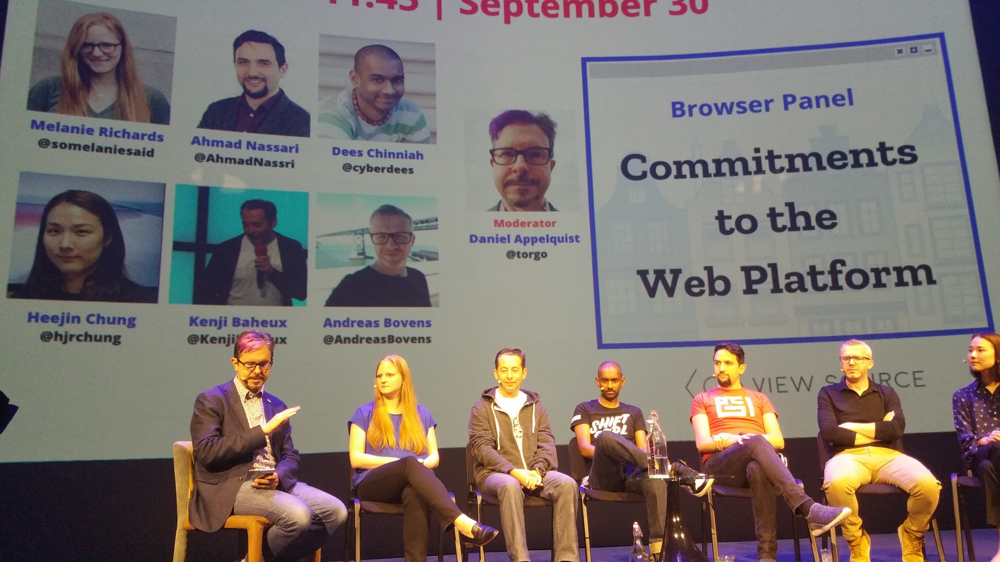

 [Sep 30 2019, 10:16:13 UTC](https://twitter.com/w3cdevs/status/1178614518181703683)

----

> Podcast live  recorded w/ @adactio \#ViewSourceConf 
> 
> 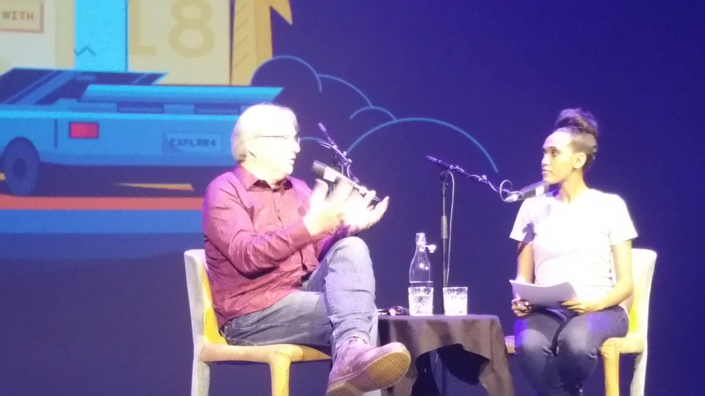
> 
> 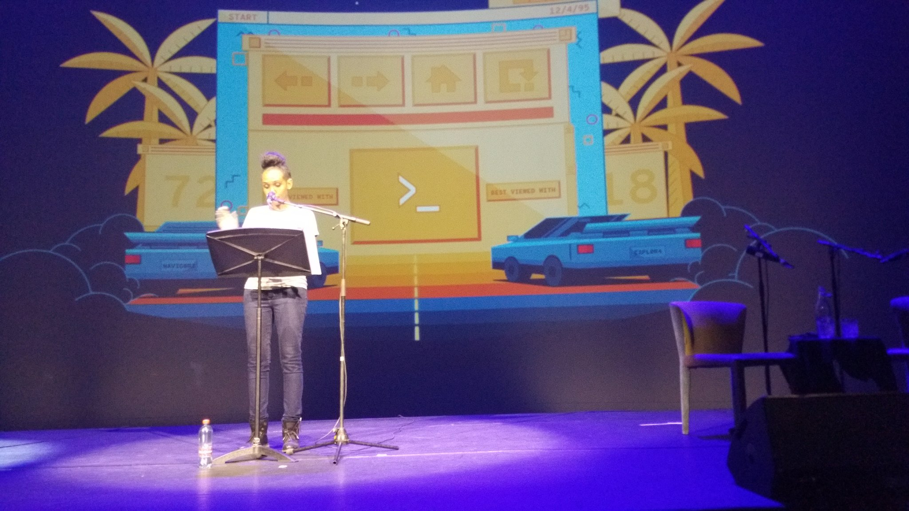
> It was awesome\! Congrats

 [Sep 30 2019, 11:51:56 UTC](https://twitter.com/w3cdevs/status/1178638606069620736)

----

> A closer look at the \#WebStandards community beehive\! From @jorydotcom's deep\-dive into the standards process, its history, economic and policy implications, etc\. at \#ViewSourceConf :\) Cool\! 
> 
> 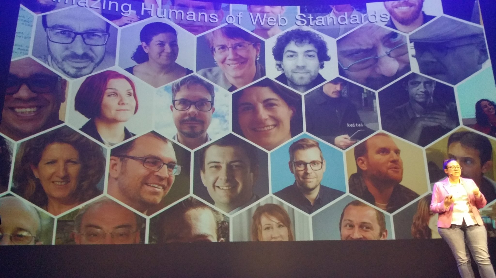

 [Sep 30 2019, 12:59:50 UTC](https://twitter.com/w3cdevs/status/1178655693034938369)