> Privacy for all user on the  Web\!  \#viewsourceconf @selenamarie 
> 
> 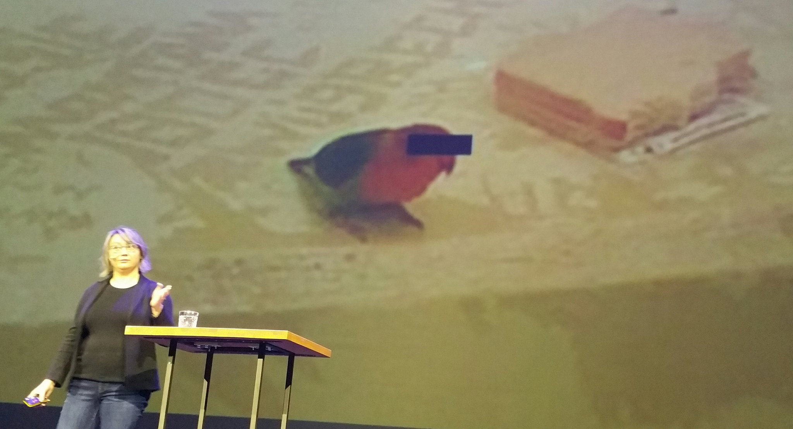

 [Oct 01 2019, 08:22:50 UTC](https://twitter.com/w3cdevs/status/1178948373375803394)

----

> Standards groups panel with @w3c's Strategy lead @wseltzer and @jorydotcom @ioctaptceb @aaronpk @thisNatasha \#viewsourceconf 
> 
> 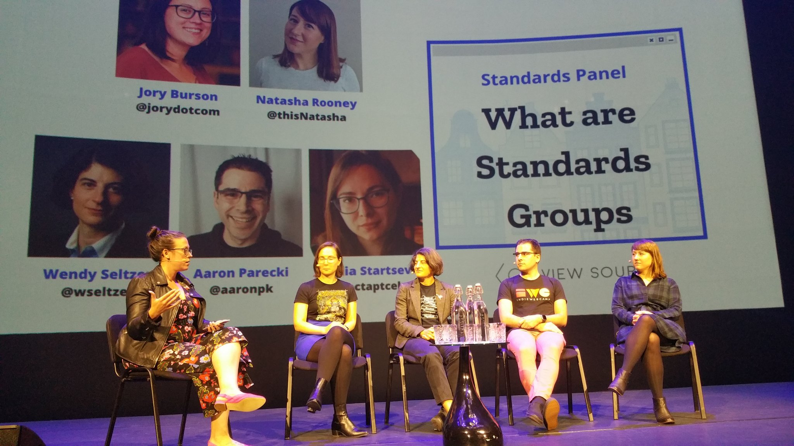

 [Oct 01 2019, 10:02:55 UTC](https://twitter.com/w3cdevs/status/1178973557726031872)

----

> Part of the 'Meet the @w3c' conversation corner team\! https://twitter\.com/viewsourceconf/status/1179022021323309057 
> 
> 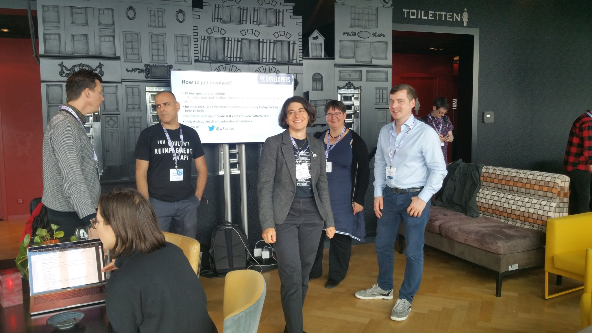

 [Oct 01 2019, 14:31:16 UTC](https://twitter.com/w3cdevs/status/1179041091078823937)

----

> October@w3c: talks, endorsed events, workshop deadline, etc\.  
> https://www\.w3\.org/participate/eventscal\.html 
> 
> 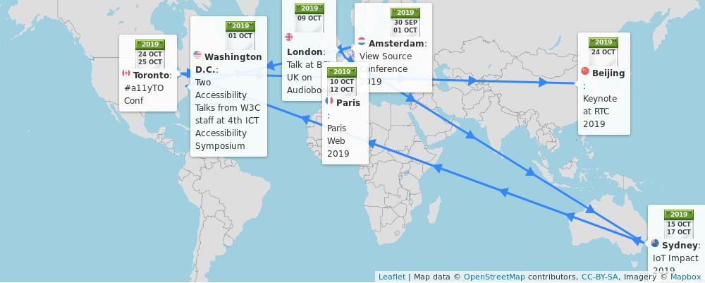
> 1 Oct\.: Day 2 of an awesome and inspiring @ViewSource conference and a chance to meet and discuss with @w3c staff and friends @wseltzer, @marieforgue, @hdv, @yoavweiss and Annette Kik during the afternoon coffee break, in \#Amsterdam 🇳🇱 \#ViewSourceConf 
> 
> 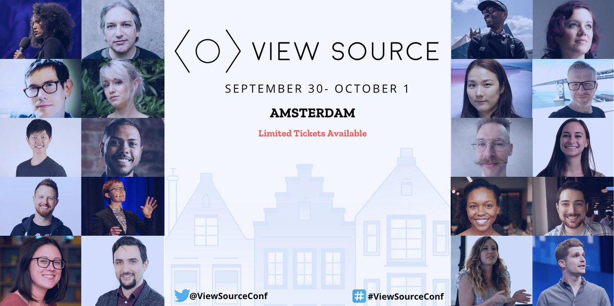

 [Oct 01 2019, 17:49:45 UTC](https://twitter.com/w3cdevs/status/1179091043695972353)

----

> 1 Oct\.: Also from the @w3c\_wai team, @sabouzah presents \#w3c \#Accessibility Conformance Testing \(ACT\) Rules for \#WCAG2 @A11yTesting19 in \#WashingtonDC 🇺🇸  
> https://twitter\.com/w3c/status/1176554648615997441

 [Oct 01 2019, 17:49:50 UTC](https://twitter.com/w3cdevs/status/1179091064319303680)

----

> 1 Oct\.: Keynote speaker @shawn\_slh presents "The Missing Link: \#Accessibility and \#Usability Working Together" at the 4th ICT Accessibility Symposium @A11yTesting19 in \#WashingtonDC 🇺🇸 https://twitter\.com/A11yTesting19/status/1170003019120951296

 [Oct 01 2019, 17:49:50 UTC](https://twitter.com/w3cdevs/status/1179091061706252288)

----

> 3 Oct\.: @hdv explains how Content Management Systems \#CMS can make a huge difference for Web \#accessibility @FronteersConf's Jam session, in \#Amsterdam 🇳🇱 https://fronteers\.nl/congres/2019/jam\-session 
> 
> 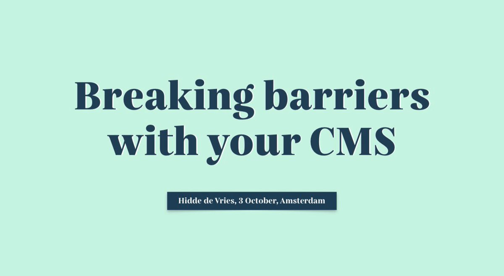

 [Oct 01 2019, 17:49:53 UTC](https://twitter.com/w3cdevs/status/1179091076780560387)

----

> 5 Oct\.: Deadline to submit expression of interest to the \#W3CWorkshop on Inclusive Design for Immersive Web Standards https://www\.w3\.org/2019/08/inclusive\-xr\-workshop/, 5\-6 November 2019 in \#Seattle 🇺🇸  
> \.\./2019/2019\-08\-tweets\.html\#x1167015355686019072

 [Oct 01 2019, 17:49:54 UTC](https://twitter.com/w3cdevs/status/1179091080261836800)

----

> 10 Oct\.: @id24conf celebrates Inclusive Design with 24h of \#free \#online talks for the global community 🌐\. All sessions are streamed live and publicly avail\. on the Inclusive Design 24 YouTube channel with live captioning\!  
> https://inclusivedesign24\.org/2019/

 [Oct 01 2019, 17:49:55 UTC](https://twitter.com/w3cdevs/status/1179091085236330496)

----

> 9 Oct\.: @JalanbirdW3C speaks @BIC1UK about "Understanding the Digital Audiobook Supply Chain", in \#London 🇬🇧   
> https://www\.bic\.org\.uk/97/Upcoming\-Breakfasts/

 [Oct 01 2019, 17:49:55 UTC](https://twitter.com/w3cdevs/status/1179091083076231168)

----

> 10\-12 Oct\.: The 14th @ParisWeb edition features 32 conferences and 15 workshops with topics about front\-end, back\-end, quality, accessibility, etc\. in \#Paris 🇫🇷 https://www\.paris\-web\.fr/

 [Oct 01 2019, 17:49:56 UTC](https://twitter.com/w3cdevs/status/1179091087463505925)

----

> 24 Oct: Philippe Le Hégaret @plhw3org gives a keynote on "The rise and future of real\-time communications on the Web" at RTC 2019, in Beijing 🇨🇳 \#WebRTC  
> http://2019\.rtcexpo\.org/en/

 [Oct 01 2019, 17:49:57 UTC](https://twitter.com/w3cdevs/status/1179091092245012480)

----

> 15\-16 Oct\.: All things \#IoT at the IoT Impact conference and exhibition @IoTAA1 \#iotimpact2019, in \#Sydney 🇦🇺  
> https://www\.iotimpact\.com\.au/

 [Oct 01 2019, 17:49:57 UTC](https://twitter.com/w3cdevs/status/1179091090168860674)

----

> 24\-25 Oct\.: Two full days of \#accessibility training from W3C community participants @a11yTO Conference in \#Toronto 🇨🇦   
> https://conf\.a11yto\.com/

 [Oct 01 2019, 17:49:58 UTC](https://twitter.com/w3cdevs/status/1179091094820331520)

----

> Magnificent venue \#oldmovietheatre and every piece of furniture is @FronteersConf branded\! Looking forward to a great conf\. \#fronteersConf 
> 
> 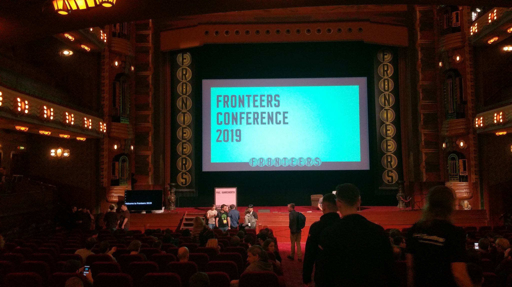
> 
> 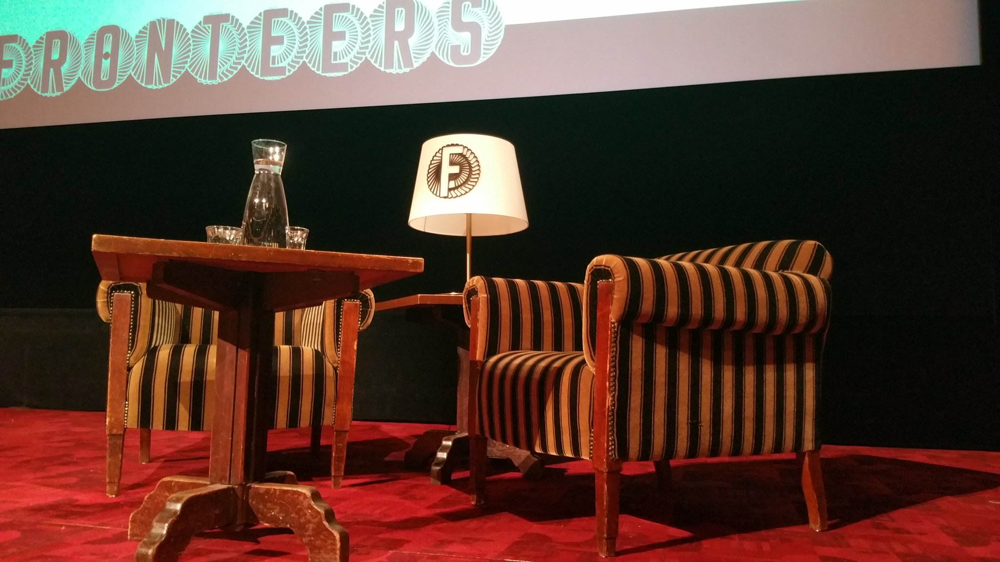

 [Oct 03 2019, 06:59:11 UTC](https://twitter.com/w3cdevs/status/1179652097266110464)

----

> What else?\!  
> @eva\_trostlos \#fronteersConf \#csslove 
> 
> 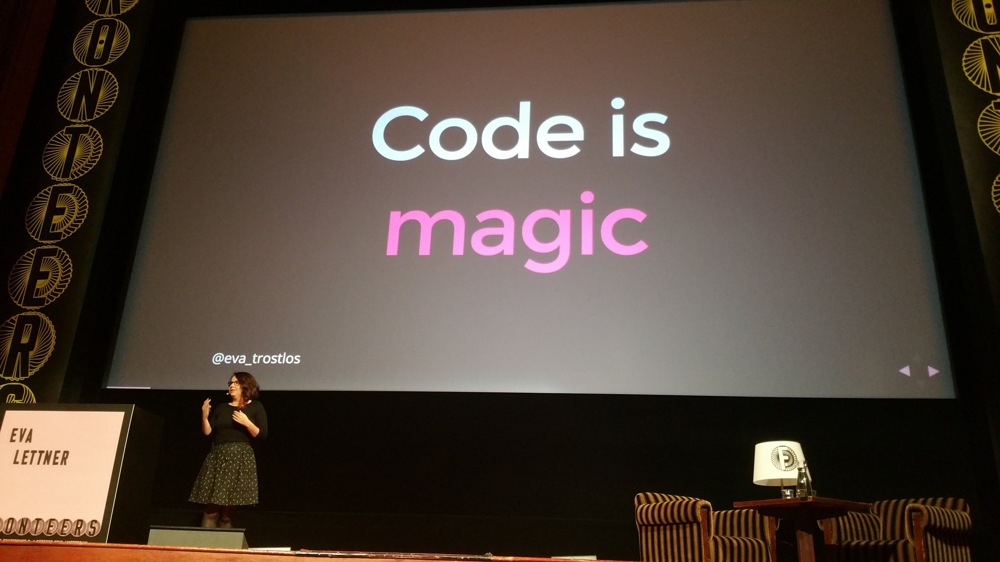

 [Oct 03 2019, 10:05:21 UTC](https://twitter.com/w3cdevs/status/1179698947092357120)

----

> Now awaiting for many many \(all?\) @fronteers' Web \#developers and \#designers to contribute/test for the \#WebPlatform\. Thank you Rachel ;\) https://twitter\.com/rachelandrew/status/1179732850213564419

 [Oct 03 2019, 12:52:44 UTC](https://twitter.com/w3cdevs/status/1179741070101483520)

----

> The deadline was extended until end of this week \- if you're interested, hurry up, there are only a few seats remaining\. \.\./2019/2019\-10\-tweets\.html\#x1179091080261836800

 [Oct 09 2019, 12:40:16 UTC](https://twitter.com/w3cdevs/status/1181912262694580224)

----

> The \#WebXR Device API has been split into 3 modules: a core module covering what WebVR used to provide, a gamepad module covering interactions with gamepads, and an AR module to cover the basic primitives for augmented reality https://twitter\.com/w3c/status/1182238893732777984
> The links to the github repositories and editors drafts are available from the @ImmersiveWebW3C github home page https://immersive\-web\.github\.io/ along with all the other \#ImmersiveWeb proposals under discussion

 [Oct 10 2019, 13:23:17 UTC](https://twitter.com/w3cdevs/status/1182285476012666883)

----

> During \#w3cTPAC last month, @atopal says a big thank you to the 76K\+ \#Web \#developers and \#designers from 173 countries who participated in the @MozDevNet Developer Needs Assessment survey\!   
> https://vimeo\.com/showcase/6372516/video/366244022
> Kadir Topal unveiled some interesting survey results about Web technologies' adoption, frustration and satisfaction \- see slides at https://www\.w3\.org/2019/Talks/TPAC/MDN\-WEB\-DNA\.pdf as well as notes from the \#w3cTPAC related breakout session:  
> https://w3c\.github\.io/tpac\-breakouts/sessions\.html\#mdn

 [Oct 14 2019, 15:31:48 UTC](https://twitter.com/w3cdevs/status/1183767368813686784)

----

> Final results and report out of the survey will be published at the end of the month \- stay tuned for more insights on what the community expects from the \#WebPlatform\!

 [Oct 14 2019, 15:31:50 UTC](https://twitter.com/w3cdevs/status/1183767374811541504)

----

> In this new video, @jorydotcom explains how the @openjsf \#JavaScript projects help make the lives of \#Web \#developers better by solving problems ranging from \#Node to \#a11y, \#i18n, and more\!  
> https://vimeo\.com/showcase/6372516/video/366243791
> Find out how easy it is to participate in the 32 @openjsf \#OpenSource projects that operate on \#github and other avenues \(slack, weekly meetings on YT, etc\.\):  
> https://openjsf\.org/collaboration/

 [Oct 15 2019, 08:33:28 UTC](https://twitter.com/w3cdevs/status/1184024479804067847)

----

> At last \#w3cTPAC, there were also discussions about opportunities to build and strengthen healthy collaborations between @openjsf projects and @w3c groups\. Read notes at https://w3c\.github\.io/tpac\-breakouts/sessions\.html\#openjs

 [Oct 15 2019, 08:33:29 UTC](https://twitter.com/w3cdevs/status/1184024484166225920)

----

> At last \#FronteersConf, @rachelandrew explains why and how you should engage with @w3c as a \#Web \#developer https://twitter\.com/rachelandrew/status/1184106921932054529
> Based on her participation as a \#developer in @csswg and more recently as a \#w3c representative for @fronteers, Rachel shares her experience and reminds that everyone is allowed/encouraged to create \#WebPlatform features \- you don't need permission\!

 [Oct 16 2019, 14:25:27 UTC](https://twitter.com/w3cdevs/status/1184475445267443712)

----

> As a long\-time participant in @csswg, she knows that @w3c \#WorkingGroups are very happy when \#developers and \#designers offer feedback on specifications\. It could be any spec\.\! 
> 
> 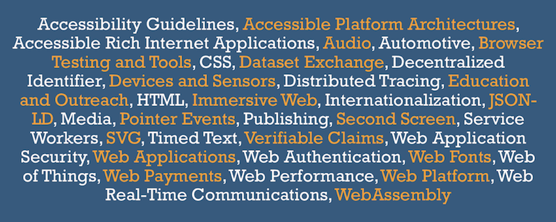

 [Oct 16 2019, 14:25:33 UTC](https://twitter.com/w3cdevs/status/1184475471309955072)

----

> and 6\) write Web platform tests\!  
> \.\./2018/2018\-04\-tweets\.html\#x986283413316472837

 [Oct 16 2019, 14:25:34 UTC](https://twitter.com/w3cdevs/status/1184475475818795011)

----

> So, don't think twice and get started: 1\) read and comment on specification issues 2\) show use cases 3\) contribute examples and diagrams 4\) raise browser bugs 5\) test and offer feedback on features behind flags \.\.\.

 [Oct 16 2019, 14:25:34 UTC](https://twitter.com/w3cdevs/status/1184475474279456769)

----

> After raising an issue, remember that patience is required for \#WebPlatform contributions\. As Rachel puts it: "It's not that people don't care, it's because they are few people editing specs, with priorities and because we are working on stuff that is very much in the future\."

 [Oct 16 2019, 14:25:35 UTC](https://twitter.com/w3cdevs/status/1184475478142410753)

----

> \.@rachelandrew is also sharing some of these advices in @smashingmag, along with a call for actions and contributions\!  
> https://twitter\.com/w3c/status/1183684928690708480

 [Oct 16 2019, 14:25:36 UTC](https://twitter.com/w3cdevs/status/1184475483217547264)

----

> If you want to learn more about the current status and next steps for \#WebXR, listen directly from the expert, with the just\-released video of @Lady\_Ada\_King presentation at our \#w3cdevs2019 meetup last month \#VirtualReality \#VR \#AR \#AugmentedReality  
> https://www\.w3\.org/2019/09/Meetup/speaker\-ada\.html
> \.@Lady\_Ada\_King covers among other things the evolution of \#WebXR in a more modular approach, as we described it last week:  
> \.\./2019/2019\-10\-tweets\.html\#x1182285476012666883

 [Oct 21 2019, 07:43:48 UTC](https://twitter.com/w3cdevs/status/1186186307149672449)

----

> This followed on the proposal made to incubate \#WebMonetization in the @wicg\_ back in August  
> https://discourse\.wicg\.io/t/proposal\-web\-monetization\-a\-new\-revenue\-model\-for\-the\-web/3785

 [Oct 22 2019, 09:07:04 UTC](https://twitter.com/w3cdevs/status/1186569651234443264)

----

> \#WebMonetization is a proposed \#API standard that allows \#websites to request a stream of very small \#payments from a user\. Getting \#WebMonetization on the @w3c standards track was discussed at a breakout session during the plenary day of \#w3cTPAC:  
> https://w3c\.github\.io/tpac\-breakouts/sessions\.html\#webmonetization
> During \#w3cTPAC last month, we recorded a quick interview of @justmoon on @Coil plans with \#WebMonetization  
> https://vimeo\.com/366243917

 [Oct 22 2019, 09:07:04 UTC](https://twitter.com/w3cdevs/status/1186569649225375750)

----

> You can read up a more in depth interview of @justmoon by @ibjacobs a few weeks ago:  
> https://www\.w3\.org/blog/2019/09/w3c\-interview\-coil\-on\-interledger\-protocol\-and\-web\-monetization/

 [Oct 22 2019, 09:07:05 UTC](https://twitter.com/w3cdevs/status/1186569654615052288)

----

> To learn more about the spec proposal for \#WebMonetization, check out their explainer  https://webmonetization\.org/docs/explainer\.html and their github repo: https://github\.com/interledger/webmonetization\.org/

 [Oct 22 2019, 09:07:05 UTC](https://twitter.com/w3cdevs/status/1186569652866076672)

----

> Check out the interesting agenda\! https://www\.w3\.org/2019/08/inclusive\-xr\-workshop/agenda\.html  
> \#XR standards gives the opportunity to innovate and explore topics ranging from \#XR \#accessibility user needs to \#XR \#accessibility \(on the Web and beyond\) on existing products and prototypes https://twitter\.com/w3c/status/1186995440115425280
> Thanks to host @PlutoVR and sponsors @Maveron @wemakerealities @VRWorldSociety and Seattle Immersive Technology Association for supporting this \#W3CWorkshop chaired by @LeonieWatson of @TetraLogical

 [Oct 23 2019, 14:26:49 UTC](https://twitter.com/w3cdevs/status/1187012506646208518)

----

> In this short video, @AmeliasBrain invites \#developers and \#designers' contributions for new \#SVG features and requirements:  
> https://vimeo\.com/366242912
> As \#w3c \#InvitedExpert, @AmeliasBrain is involved in three  
> \#WorkingGroups: @svgwg, @w3c\_wai and @csswg \#CSS \#a11y \#VectorGraphics  
> \. She also chairs the recently formed \#SVG \#CommunityGroup, working hand in hand with @svgwg: https://www\.w3\.org/community/svgcg/

 [Oct 28 2019, 08:54:26 UTC](https://twitter.com/w3cdevs/status/1188740796939411456)

----

> The main goal of this group is to make it easier for \#developers and content creators in the \#SVG community to engage with the standardization process\. 
> 
> 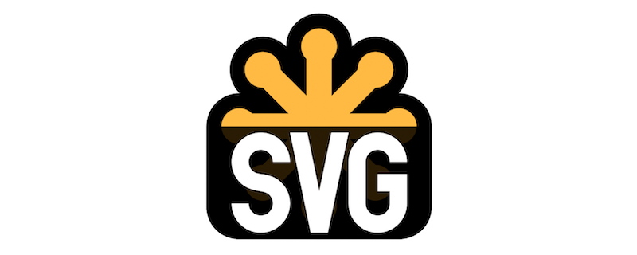

 [Oct 28 2019, 08:54:41 UTC](https://twitter.com/w3cdevs/status/1188740862135529473)

----

> So have your voice heard\! Explore new ideas related to \#SVG, test them out, get people excited about them, make proposals, etc\.   
> \.\./2019/2019\-03\-tweets\.html\#x1105118740818128897

 [Oct 28 2019, 08:54:42 UTC](https://twitter.com/w3cdevs/status/1188740864522227712)

----

> And, if you encounter browser implementation bugs or other concerns with current \#SVG2 features, please file bug reports \- it's very helpful too\!  
>   
> https://github\.com/w3c/svgwg/issues

 [Oct 28 2019, 08:54:43 UTC](https://twitter.com/w3cdevs/status/1188740868209020929)

----

> In this new short video, @wendy\_a\_reid of @kobo/@rakuten, reports on the current status and goals of the @w3c Publishing \#WorkingGroup @w3cpublishing  
> https://vimeo\.com/366243892
> The @w3cpublishing's main focus now is to bring \#accessibility to \#publishing, specifically for \#audiobooks to make them usable by users regardless of their ability\. This spec\. is a profile of the Publication Manifest\. Find out more in the \#github repo: https://github\.com/w3c/audiobooks/

 [Oct 28 2019, 09:52:42 UTC](https://twitter.com/w3cdevs/status/1188755462033944576)

----

> During our \#w3cdevs2019 \#meetup last month in \#Fukuoka 🇯🇵, Alice Boxhall @sundress makes the case that \#accessibility and \#innovation actually go very well together:  
> https://www\.w3\.org/2019/09/Meetup/speaker\-alice\.html
> Designing for accessibility leads to better solutions, and in her presentation, @sundress goes through a few examples from both recent and older history of technology where solving problems for people with \#disability created solutions for everybody\.

 [Oct 28 2019, 14:37:25 UTC](https://twitter.com/w3cdevs/status/1188827110070243331)

----

> As an intersection between \#accessibility and \#innovation, next week's \#W3CWorkshop on inclusive design for \#ImmersiveWeb standards is full of promises\! \#WebXR \#a11y  
> https://www\.w3\.org/2019/08/inclusive\-xr\-workshop/ 
> 
> 

 [Oct 28 2019, 14:37:28 UTC](https://twitter.com/w3cdevs/status/1188827126126010370)

----

> Find out about VRM, a format for \#3D \#Avatars on the Web, with this recorded presentation of @FMS\_Cat during our \#w3cdevs2019 meetup last month in \#Fukuoka  
> https://www\.w3\.org/2019/09/Meetup/speaker\-yutaka\.html
> In this talk, Yutaka Obuchi @FMS\_Cat focuses on the Web \#API that helps an implementation of 3D character viewer and how they could be improved to make the Web an even better platform for 3D avatars\.

 [Oct 30 2019, 05:29:30 UTC](https://twitter.com/w3cdevs/status/1189413999022088192)

----

> Congrats to editors Wilco Fiers, @moekraft, @1mjmueller and @sabouzah for the newly published @w3c \#WebStandard Accessibility Conformance Testing \(ACT\) Rules Format 1\.0, for writing shared \#accessibility test rules \- \#timetoadopt\! https://twitter\.com/w3c/status/1189818330565292032

 [Oct 31 2019, 13:27:11 UTC](https://twitter.com/w3cdevs/status/1189896600967094277)

----

> The global Web community and Japanese \#developers came to listen to this year's exceptional speakers showing that the Web is an exciting development platform\. See the videos of their presentations\. With many thanks again to the \#w3cdevs2019 sponsors who made it possible\! https://twitter\.com/w3c/status/1189894959756972033

 [Oct 31 2019, 13:37:06 UTC](https://twitter.com/w3cdevs/status/1189899096385114113)

----

> 🗓️November@w3c: workshop, f2f meeting, SymposiumX, etc\. https://www\.w3\.org/participate/eventscal\.html 
> 
> 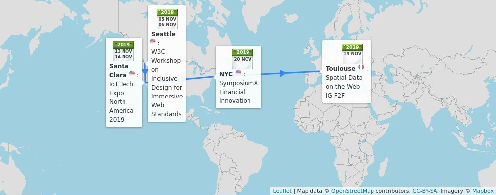
> 5\-6 Nov\.: A \#W3CWorkshop on inclusive design for \#ImmersiveWeb \#standards in \#Seattle 🇺🇸, hosted by @PlutoVR, @Maveron,@wemakerealities,@VRWorldSociety and Seattle Immersive Technology Association, and sponsored by @Google, @TwitchDev and @samsunginternet 
> 
> 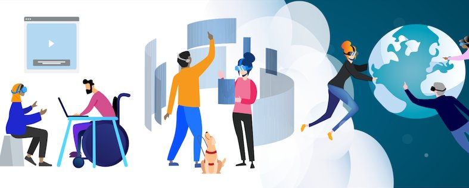

 [Oct 31 2019, 14:21:52 UTC](https://twitter.com/w3cdevs/status/1189910362948194304)

----

> 19 Nov\.: The 5th \#f2fmeeting of the @w3c Spatial Data on the Web \#InterestGroup, in \#Toulouse 🇫🇷, co\-located with the 113th @opengeospatial technical committee \#OGC19FR  
> https://www\.w3\.org/2017/sdwig/meetings/f2f\-5\.html

 [Oct 31 2019, 14:21:56 UTC](https://twitter.com/w3cdevs/status/1189910380807630852)

----

> 13\-14 Nov\.: @w3c team member @ConnectorKaren is at the IOT Tech Expo North America conference @iottechexpo, in \#SantaClara 🇺🇸 Topics: \#IoT, \#5G, \#security, \#blockchain, and more\.   
> https://twitter\.com/iottechexpo/status/1153617567442964480

 [Oct 31 2019, 14:21:56 UTC](https://twitter.com/w3cdevs/status/1189910378035240960)

----

> 20 Nov\.: @RachelYager of @FortuneTimesNYC and @w3c organize SYMPOSIUMX on new \#monetization models and emerging innovations in \#NYC, 🇺🇸\. Register now\! https://www\.eventbrite\.com/e/symposiumx\-financial\-innovation\-on\-the\-web\-and\-new\-monetization\-models\-tickets\-61762979735 \#WebMonetization \#Payments

 [Oct 31 2019, 14:21:57 UTC](https://twitter.com/w3cdevs/status/1189910383353565184)