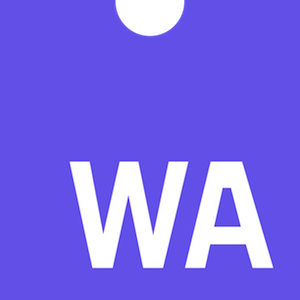
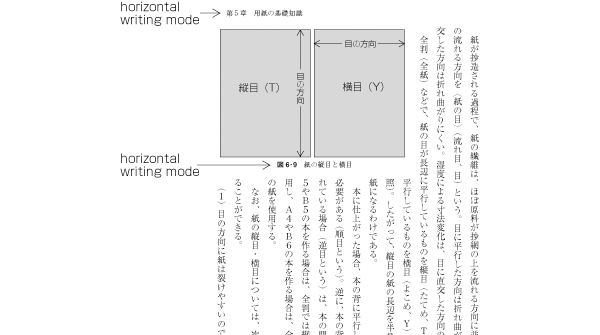

> Happy Cyber Monday\! Don’t miss out — save 20% on your purchase of programs and verified certificates\! Applies to @thew3c \#FrontEnd Web \#Developer \#CSS \#HTML5 \#JavaScript @edXOnline https://twitter\.com/edXOnline/status/1200414839950196737

 [Dec 02 2019, 07:04:45 UTC](https://twitter.com/w3cdevs/status/1201396772091891713)

----

> December@w3c: meeting, W3Cx course\.\.\. https://www\.w3\.org/participate/eventscal\.html
> 3\-5 Dec\.: The @w3ctag meets in \#Cupertino 🇺🇸 to discuss about current core design components of the \#Web  https://github\.com/w3ctag/meetings/tree/gh\-pages/2019/12\-cupertino

 [Dec 02 2019, 11:38:35 UTC](https://twitter.com/w3cdevs/status/1201465683374161920)

----

> 10 Dec\.: New session of @thew3cx \#JavaScript Introduction course @edXOnline @micbuffa Enroll soon\! https://www\.edx\.org/course/javascript\-introduction 
> 
> 

 [Dec 02 2019, 11:38:40 UTC](https://twitter.com/w3cdevs/status/1201465704509321217)

----

> For instance, it describes new work on \#WebCodecs to expose media encoders/decoders to \#WebApps https://www\.w3\.org/2019/11/web\-roadmaps/mobile/media\.html\#web\-codecs
> 🗣️New edition of the \#roadmap of \#WebApps on mobile is now published\! It adds new work started in @w3c over the past 6 months https://www\.w3\.org/2019/11/web\-roadmaps/mobile/ \#November2019 \- Thanks to @tidoust @XueFuqiao @W3CChina @Beihang1952  
> https://cards\.twitter\.com/cards/18ce53z7ril/790wx

 [Dec 02 2019, 15:49:53 UTC](https://twitter.com/w3cdevs/status/1201528925081473024)

----

> Ever struggled with performance because input events have to be processed on the main thread? The "isInputPending" proposal would help \#WebApps detect whether there are pending input events that await firing: https://www\.w3\.org/2019/11/web\-roadmaps/mobile/performance\.html\#is\-input\-pending

 [Dec 02 2019, 15:49:54 UTC](https://twitter.com/w3cdevs/status/1201528927069573121)

----

> Actually, why not offload input events processing to workers? Excellent idea💡\! Check out the "Inputs for workers and worklets" proposal: https://www\.w3\.org/2019/11/web\-roadmaps/mobile/userinput\.html\#input\-for\-workers

 [Dec 02 2019, 15:49:55 UTC](https://twitter.com/w3cdevs/status/1201528931993698306)

----

> Find out about more \#Web technologies developed in @w3c that increase the capabilities of \#Webapps, how they apply more specifically to the mobile context📱and what are their current implementations: https://w3\.org/Mobile/roadmap/

 [Dec 02 2019, 15:49:56 UTC](https://twitter.com/w3cdevs/status/1201528936351567873)

----

> The April 2019 version of the \#roadmap pointed out that the @csswg had adopted Resize Observer, an \#API for observing changes to an element's size\. On top of \#Chrome, the API has now shipped in \#Firefox and \#Safari https://www\.w3\.org/2019/11/web\-roadmaps/mobile/adaptation\.html\#resize\-observer

 [Dec 02 2019, 15:49:56 UTC](https://twitter.com/w3cdevs/status/1201528934690635781)

----

> The @w3ctag updated their ethical Web principles document yesterday:  
> https://twitter\.com/w3ctag/status/1202297407003750400
> During last \#w3cTPAC in September, we interviewed @torgo on the background and direction of these ethical principles for the \#Web architecture\.

 [Dec 05 2019, 11:26:16 UTC](https://twitter.com/w3cdevs/status/1202549747707461634)

----

> First, hear @torgo on the motivations behind this \- the \#Web was built and is developed not as a neutral computing platform, but as a platform for social good: https://vimeo\.com/377508039

 [Dec 05 2019, 11:26:17 UTC](https://twitter.com/w3cdevs/status/1202549752325427200)

----

> If you want to contribute to that effort, give input and feedback, go to their github repository\!  
> https://github\.com/w3ctag/ethical\-web\-principles

 [Dec 05 2019, 11:26:18 UTC](https://twitter.com/w3cdevs/status/1202549755710201867)

----

> Starting from that perspective, @torgo explains how the @w3ctag came to consensus on a set of basic ethical principles embodied \(or that needs embodiment\) in the architecture of the \#WebPlatform:  
> https://vimeo\.com/366243173

 [Dec 05 2019, 11:26:18 UTC](https://twitter.com/w3cdevs/status/1202549753936056320)

----

> The first wave of \#WebAssembly specs have now finished their path on the @w3c recommendation track \- congrats to Andreas Rossberg and @littledan who edited these 3 specs up to their \#WebStandard status\! \#wasm \#timetoadopt https://twitter\.com/w3c/status/1202583210250690560 
> 
> 
> This comes less than 2 years after the first public working drafts were released \- thanks to the great incubation work done in the @w3c Web Assembly \#CommunityGroup  
> https://www\.w3\.org/community/webassembly/  
> \.\./2018/2018\-02\-tweets\.html\#x964131886716112898

 [Dec 05 2019, 14:10:11 UTC](https://twitter.com/w3cdevs/status/1202590998137917440)

----

> This is hardly the end of the work on \#WebAssembly, which is set to continue to transform how client\-side AND server\-side code gets developed and deployed\. Hear from @luke\_wagner last year on the roadmap ahead:  
> \.\./2019/2019\-01\-tweets\.html\#x1085183150798516226

 [Dec 05 2019, 14:10:13 UTC](https://twitter.com/w3cdevs/status/1202591006115409922)

----

> Still from @luke\_wagner on the plan for greater integration of \#WebAssembly with other Web \#APIs: \.\./2019/2019\-08\-tweets\.html\#x1156923662479646728

 [Dec 05 2019, 14:10:14 UTC](https://twitter.com/w3cdevs/status/1202591008665550848)

----

> And a new release from our \#w3cdevs2019 meetup recordings, hear and watch @linclark explains with her @codecartoons how \#WebAssembly is set to redefine cross\-language interoperability well beyond browsers:   
> https://www\.w3\.org/2019/09/Meetup/speaker\-lin\.html

 [Dec 05 2019, 14:10:15 UTC](https://twitter.com/w3cdevs/status/1202591013753294849)

----

> The @w3cpublishing invites feedback on 2 documents in @w3c \#CandidateRecommendation status: "Publication Manifest and \#audiobooks" \#timetoimplement https://twitter\.com/reidmore\_online/status/1202590349438287873
> The group's main focus now is to bring \#accessibility to \#publishing, specifically for \#audiobooks to make them usable by users regardless of their ability\. This specification is a profile of the Publication Manifest\. Find out more in the \#github repo: https://github\.com/w3c/audiobooks/

 [Dec 06 2019, 12:35:11 UTC](https://twitter.com/w3cdevs/status/1202929479137542144)

----

> At last \#w3cTPAC, we interviewed @wendy\_a\_reid on the @w3cpublishing current and future work: https://vimeo\.com/366243892

 [Dec 06 2019, 12:35:13 UTC](https://twitter.com/w3cdevs/status/1202929487962398722)

----

> 🗳️ Election time for the @w3c Technical Architecture Group @w3ctag \! Three seats are up for election and four people have been nominated as candidates: @cssrossen from @microsoft, @davidbaron from @mozilla, @kennethrohde from @intel and @lukOlejnik as W3C \#InvitedExpert 
> 
> 
> Each of the four candidates have posted statements about their candidature: https://www\.w3\.org/2019/12/03\-tag\-nominations

 [Dec 09 2019, 12:43:22 UTC](https://twitter.com/w3cdevs/status/1204018699902038018)

----

> Rossen Atanassov @cssrossen is determined to guide \#API \#developers to deliver better \#a11y, \#interoperability and \#i18n, to help make the \#Web easier to collaborate, print and publish and to influence the direction of the Web for improved privacy  
> https://www\.w3\.org/2019/12/03\-tag\-nominations\#ra

 [Dec 09 2019, 12:43:24 UTC](https://twitter.com/w3cdevs/status/1204018710232682497)

----

> Kenneth Rhode Christiansen @kennethrohde, another current @w3ctag member, intends to continue the work on integrating \#PWAs and project Fugu and to pursue the collobaration between the @w3ctag and @tc39 to help review new \#JavaScript features   
> https://www\.w3\.org/2019/12/03\-tag\-nominations\#kc

 [Dec 09 2019, 12:43:25 UTC](https://twitter.com/w3cdevs/status/1204018714775080961)

----

> David Baron @davidbaron, a long time contributor to the @csswg and current @w3ctag member, is keen on moving the Web where it makes it better for both end users and developers by balancing the user agent need and lower level features developments\.  
> https://www\.w3\.org/2019/12/03\-tag\-nominations\#db

 [Dec 09 2019, 12:43:25 UTC](https://twitter.com/w3cdevs/status/1204018711889424385)

----

> The @w3c membership elects the @w3ctag members, and   the election is open until 10 January 2020\. Results will be announced on 14 \#Jan2020\. Stay tuned\!

 [Dec 09 2019, 12:43:26 UTC](https://twitter.com/w3cdevs/status/1204018718675746818)

----

> Lukasz Olejnik @lukOlejnik, also a current @w3ctag member, has interests in \#security and \#privacy, regulations and \#data protection\. He highlights the importance of a @w3ctag being a vigilant independent arbiter on future digital ethics challenges\.  
> https://www\.w3\.org/2019/12/03\-tag\-nominations\#lo

 [Dec 09 2019, 12:43:26 UTC](https://twitter.com/w3cdevs/status/1204018716985495552)

----

> Congrats to @fantasai and @kojiishi for this new \#W3CStandard that sets the ground of international writing modes: \#timetoadopt https://twitter\.com/w3c/status/1204388999953092608
> CSS Writing Modes Level 3 defines \#CSS support for various international writing modes, incl\. horizontal left\-to right text \(such as in \#English or \#Hindi\), horizontal right to\-left text \(such as \#Hebrew or \#Arabic\), and vertically set text \(such as for \#Japanese or \#Mongolian\)

 [Dec 10 2019, 13:44:25 UTC](https://twitter.com/w3cdevs/status/1204396450819522564)

----

> These new CSS features allow a mixture of horizontal and vertical text regions on the same page\. For example: 
> 
> 

 [Dec 10 2019, 13:44:31 UTC](https://twitter.com/w3cdevs/status/1204396476975202304)

----

> To capture an overview of where work is needed, see the language matrix maintained by @r12a, @webi18n activity lead:   
> http://w3c\.github\.io/typography/gap\-analysis/language\-matrix\.html \#i18n

 [Dec 10 2019, 13:44:34 UTC](https://twitter.com/w3cdevs/status/1204396491810516992)

----

> So that the World Wide Web is usable worldwide, @w3c is actively seeking feedback and support from communities around the world to meet local needs for language support\. 
> 
> 

 [Dec 10 2019, 13:44:34 UTC](https://twitter.com/w3cdevs/status/1204396488400482308)

----

> To find out more about all the work happening in @w3c's \#i18n, hear from @r12a who spoke at our \#w3cdevs2018 \#meetup last year in \#Lyon:   
> https://vimeo\.com/312910612

 [Dec 10 2019, 13:44:35 UTC](https://twitter.com/w3cdevs/status/1204396493903450113)

----

> Also from @somelaniesaid, please refer to this great resource "An adventurer’s guide to W3C specs", where she explains how @w3c \#WorkingGroups build mature standards, taking the ex\. of guidelines devlt for implementing and using accessible technologies  
> https://twitter\.com/24accessibility/status/1203868019237310464

 [Dec 11 2019, 11:57:09 UTC](https://twitter.com/w3cdevs/status/1204731846795370498)

----

> \#HighContrast experiences work by letting users select theme colors and for a scoped number of \#semantic elements\. It refers to standards developed this year in the @csswg\. Find a demo and other resources at https://github\.com/melanierichards/talks/tree/master/2019/tpac\-hc
> Hear from @somelaniesaid who spoke at our \#w3cdevs2019 \#meetup in \#Fukuoka and learn how  
> to apply \#HighContrast or a custom color scheme to enable users to use Web interfaces in a limited color palette \#CSS \#accessibility   
> https://www\.w3\.org/2019/09/Meetup/speaker\-melanie\.html

 [Dec 11 2019, 11:57:09 UTC](https://twitter.com/w3cdevs/status/1204731845407125504)

----

> To understand where the Second Screen Working Group is going and its expected work on the Open Screen Protocol, watch Mark Foltz' lightning talk at \#w3cTpac in September https://www\.w3\.org/2019/09/TPAC/ac\-2screen https://twitter\.com/w3c/status/1205049434612097024

 [Dec 12 2019, 09:16:14 UTC](https://twitter.com/w3cdevs/status/1205053738941140996)

----

> \#WCAG21 in Danish 🇩🇰\! See translations in other languages: https://www\.w3\.org/WAI/standards\-guidelines/wcag/translations/\#wcag\-21\-completed\-and\-planned\-translations \#a11y \#accessibility \#webdevelopment https://twitter\.com/w3c/status/1205013226347466752

 [Dec 12 2019, 09:22:20 UTC](https://twitter.com/w3cdevs/status/1205055273855078400)

----

> The recently published @w3c \#CSS Writing Modes Level 3 \#WebStandard has been translated into Japanese: https://triple\-underscore\.github\.io/css\-writing\-modes3\-ja\.html Thank you @strontium91\! \#html5j \#w3c\_keio \.\./2019/2019\-12\-tweets\.html\#x1204396450819522564
> 最近公開された @w3c \#CSS Writing Modes Level 3 \#WebStandard は日本語に翻訳されています：https://triple\-underscore\.github\.io/css\-writing\-modes3\-ja\.html どうもありがとう @strontium91\! ＃html5j \#w3c\_keio

 [Dec 16 2019, 07:36:02 UTC](https://twitter.com/w3cdevs/status/1206478073631322114)

----

> The \#WebNFC specification comes with an explainer \(https://github\.com/w3c/web\-nfc/blob/gh\-pages/EXPLAINER\.md\) and a Chromium implementation \(https://bugs\.chromium\.org/p/chromium/issues/detail?id\=520391\)\. @anssik and the @w3c WebNFC \#CommunityGroup are now looking for feedback\! https://twitter\.com/w3c/status/1206901889419362309

 [Dec 17 2019, 12:43:37 UTC](https://twitter.com/w3cdevs/status/1206917865460453377)

----

> \#timetoimplement https://twitter\.com/w3c/status/1207304261681455109

 [Dec 18 2019, 14:31:22 UTC](https://twitter.com/w3cdevs/status/1207307370042396672)

----

> Under this newly released charter, the @w3payments group, led by @mountainhippo and @ahopebailie, continues defining standards that allow for a \#payment to be initiated within a \#Website or \#application  
> https://www\.w3\.org/Payments/WG/charter\-201912\.html https://twitter\.com/w3c/status/1207511688800604160
> The \#WorkingGroup will continue to work on: Payment Request \#API, Payment method identifiers, Payment Handler \#API and Payment Method Manifest\. Priority is to get the Payment Request API adoption by coordinating with browser vendors, payment handler \#developers and merchants\.

 [Dec 19 2019, 13:50:26 UTC](https://twitter.com/w3cdevs/status/1207659458073178112)

----

> Read also @ibjacobs' post for details about the evolution of the Payment Request \#API: https://www\.w3\.org/blog/wpwg/2019/10/28/the\-evolution\-of\-payment\-request\-api/ \#payments

 [Dec 19 2019, 13:50:28 UTC](https://twitter.com/w3cdevs/status/1207659467430608900)

----

> For more info, hear from @mountainhippo who presented an update of the @w3payment work in \#September19 at \#w3cTPAC   
> https://www\.w3\.org/2019/09/TPAC/ac\-payment\.html  \(video with transcript\)

 [Dec 19 2019, 13:50:28 UTC](https://twitter.com/w3cdevs/status/1207659465773846528)

----

> The flexibility provided by Payment Handlers are a key element to that adoption\. See the related repo https://github\.com/w3c/payment\-handler/, and demo https://developers\.google\.com/web/updates/2018/06/payment\-handler\-api

 [Dec 19 2019, 13:50:28 UTC](https://twitter.com/w3cdevs/status/1207659464163254272)