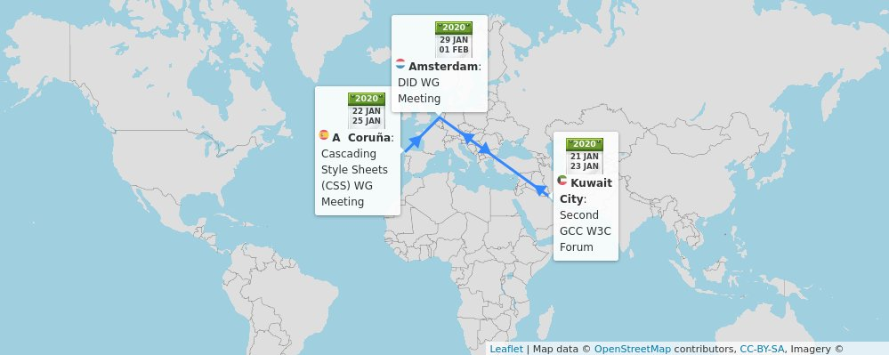

> 14 Jan: new @thew3cx course session on \#HTML5 Apps and Games\. Learn advanced HTML5 tips and techniques to create great content such as \#apps and \#games\! @edXOnline @micbuffa   
> Enroll now: https://cards\.twitter\.com/cards/18ce53z7ril/7anyh
> 🗓️ January@w3c: W3Cx courses, f2f meetings, and more: https://www\.w3\.org/participate/eventscal\.html, and Happy New Year\! 
> 
> 

 [Jan 06 2020, 13:50:01 UTC](https://twitter.com/w3cdevs/status/1214182334754414598)

----

> 22\-24 Jan\.: The @csswg meets f2f in \#Coruna 🇪🇸, hosted by @igalia\. See their agenda in https://wiki\.csswg\.org/planning/galicia\-2020

 [Jan 06 2020, 13:56:47 UTC](https://twitter.com/w3cdevs/status/1214184038233190401)

----

> 28 Jan\.: 🆒🆕 @thew3cx "Introduction to Web Accessibility \#MOOC" starts\! Enrollment is open on @edXOnline: https://www\.edx\.org/course/web\-accessibility\-introduction \#accessibility \#a11y

 [Jan 06 2020, 13:56:48 UTC](https://twitter.com/w3cdevs/status/1214184041035026432)

----

> 29\-31 Jan\.: The Decentralized Identifiers \(DID\) \#WorkingGroup meets @microsoft's \#Amsterdam offices 🇳🇱\. See the meeting agenda and more in their planning page: https://www\.w3\.org/2019/did\-wg/Meetings/F2F/2020\.01\.Amsterdam

 [Jan 06 2020, 13:56:49 UTC](https://twitter.com/w3cdevs/status/1214184043413213184)

----

> Congrats to @cssrossen \(@microsoft\), @davidbaron  \(@mozilla\) and @kennethrohde \(@intel\) for their election to the @w3ctag 👏👏👏  
> https://twitter\.com/w3c/status/1216676024563511296
> This is the result of an election started last month: \.\./2019/2019\-12\-tweets\.html\#x1204018699902038018

 [Jan 13 2020, 11:01:14 UTC](https://twitter.com/w3cdevs/status/1216676571492253700)

----

> As a reminder, the @w3ctag \(@w3c's Technical Architecture Group\) serves \#developers interests by driving consistent Web \#design principles\. Learn more: \.\./2018/2018\-01\-tweets\.html\#x957974903122219008

 [Jan 13 2020, 11:01:16 UTC](https://twitter.com/w3cdevs/status/1216676581684449283)

----

> Find out how these 2 methods \(canMakePayment and hasEnrolledInstrument\) work when using the Payment Request \#API by @ibjacobs @w3payments \#payments https://twitter\.com/w3c/status/1218202163807125505

 [Jan 20 2020, 16:46:49 UTC](https://twitter.com/w3cdevs/status/1219300256380223488)