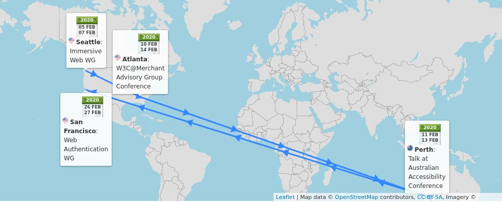
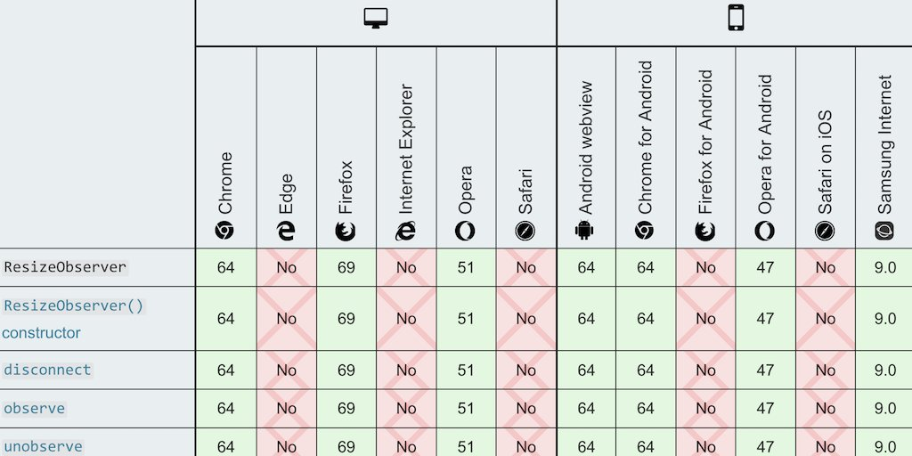

> The @w3c Media \#WorkingGroup published 3 first public working drafts to expand media support on the Web: Media Capabilities, Picture\-in\-Picture, and Media Session Standard\.  
> https://twitter\.com/w3c/status/1223170855771025409
> 1\) The Media Capabilities spec\. answers questions such as: "Can the user agent render High\-Dynamic Range \(\#HDR\) content?", allowing to choose the media content sent to the user accordingly: https://www\.w3\.org/TR/media\-capabilities/

 [Feb 03 2020, 16:52:46 UTC](https://twitter.com/w3cdevs/status/1224375186394357762)

----

> \.\.\. note it answers "Can" questions, not "Should" questions, addressed by other specs\. For instance, CSS Media Queries helps answer the question "Should I rather send content that uses the p3 or sRGB gamut?" when the user agent supports both  
> https://drafts\.csswg\.org/mediaqueries\-4/\#color\-gamut

 [Feb 03 2020, 16:52:49 UTC](https://twitter.com/w3cdevs/status/1224375195705716736)

----

> 2\) The Picture\-in\-Picture \(PiP\) mode is becoming increasingly popular to watch videos while continuing to interact with other content sites or applications\. The Picture\-in\-Picture specification creates an \#API surface for it: https://www\.w3\.org/TR/picture\-in\-picture/

 [Feb 03 2020, 16:52:50 UTC](https://twitter.com/w3cdevs/status/1224375203574226944)

----

> \.\.\. the Media Capabilities spec's editors are @mounirlamouri, Chris Cunningham and @vi\_dot\_cpp   
> The work happens in https://github\.com/w3c/media\-capabilities/issues/

 [Feb 03 2020, 16:52:50 UTC](https://twitter.com/w3cdevs/status/1224375199812014080)

----

> \.\.\. the Picture\-in\-Picture spec's editors are @mounirlamouri and François Beaufort\. Issue tracking is happening here: https://github\.com/w3c/picture\-in\-picture/issues/

 [Feb 03 2020, 16:52:51 UTC](https://twitter.com/w3cdevs/status/1224375206623481859)

----

> 3\) In the native world, a music \#app shares info about what's playing \(title, artist, album\.\.\.\), and provide media controls \(play/pause, back/forward\.\.\.\)\. The Media Session \#API allows web apps to integrate with the system as well: https://www\.w3\.org/TR/mediasession/

 [Feb 03 2020, 16:52:52 UTC](https://twitter.com/w3cdevs/status/1224375208406081536)

----

> \.\.\. More explanations about the MediaSession \#API are in https://github\.com/w3c/mediasession/blob/master/explainer\.md\. The spec's editors are @mounirlamouri  
>  and Rebecca Sterling Hughes

 [Feb 03 2020, 16:55:29 UTC](https://twitter.com/w3cdevs/status/1224375868035948550)

----

> 🗓️ February@w3c: f2fmeetings, conferences, etc\.  https://www\.w3\.org/participate/eventscal\.html 
> 
> 
> 5\-6 Feb\.: The @ImmersiveWebW3C \#WorkingGroup meets f2f in \#Seattle 🇺🇸 https://www\.w3\.org/immersive\-web/

 [Feb 03 2020, 17:30:14 UTC](https://twitter.com/w3cdevs/status/1224384615546224642)

----

> 11\-13 Feb\.: @ConnectorKaren speaks at the Australian Accessibility Conference in \#Perth 🇦🇺 \#Accessibility \#OZeWAI \#PWAC  
> http://ozewai\.org/conference/

 [Feb 03 2020, 17:30:16 UTC](https://twitter.com/w3cdevs/status/1224384622362009604)

----

> 10\-14 Feb\.: @JalanbirdW3C and @ibjacobs attend the Merchant Advisory Group \(MAG\) conference in \#Atlanta 🇺🇸 \#payments  
> https://10times\.com/mag\-mid\-year\-conference

 [Feb 03 2020, 17:30:16 UTC](https://twitter.com/w3cdevs/status/1224384620554334209)

----

> 21 Feb\.: This is the deadline to register for the Web&amp;Machine Learning \#W3CWorkshop where the roadmap for bringing Machine Learning capabilities to Web browsers will be discussed \(\#Berlin, 🇩🇪, March 24\-25\) \#AI  
> https://www\.w3\.org/2020/01/machine\-learning\-workshop/

 [Feb 03 2020, 17:30:17 UTC](https://twitter.com/w3cdevs/status/1224384624077484032)

----

> 26 Feb\.: The @w3c \#WebAuthn \#WorkingGroup meets in \#SanFrancisco 🇺🇸, hosted by @Cisco\. Find the meeting agenda at https://www\.w3\.org/Webauthn/

 [Feb 03 2020, 17:30:18 UTC](https://twitter.com/w3cdevs/status/1224384628879958017)

----

> The @w3c Web &amp; Machine Learning workshop, scheduled for March 24 &amp; 25 in \#Berlin 🇩🇪, aims to collaboratively build a roadmap for enrich the \#WebPlatform with the right foundations for \#MachineLearning  
> https://www\.w3\.org/2020/01/machine\-learning\-workshop/
> Chaired by @anssik and @KellyJayDavis, this new \#W3CWorkshop, hosted by @Microsoft, will help review existing work in this space, how it fits together and how well it fits the need of end\-users and industry

 [Feb 04 2020, 17:05:47 UTC](https://twitter.com/w3cdevs/status/1224740848144920576)

----

> Among notable existing work in this space, the \#MachineLearning for the Web \#CommunityGroup is evaluating what primitives Web browsers should provide as \#APIs to make Machine Learning inference fast, enabling one\-click deployment of ML\-based \#apps  
> https://www\.w3\.org/community/webmachinelearning/

 [Feb 04 2020, 17:06:05 UTC](https://twitter.com/w3cdevs/status/1224740924099563521)

----

> The expectation is that such an API would help with JS\-based frameworks already being used today to run \#MachineLearning inference in browsers: \#TensorFlowJS \(@nsthorat is on the workshop committee\), the \#javascript  
> version of \#ONNX, PaddlePaddle  
> https://twitter\.com/nsthorat/status/1222162958307987456

 [Feb 04 2020, 17:06:24 UTC](https://twitter.com/w3cdevs/status/1224741004529618945)

----

> The main deliverable the group is discussing at the moment is the Web Neural Network API \(WebNN\) https://webmachinelearning\.github\.io/webnn/

 [Feb 04 2020, 17:06:24 UTC](https://twitter.com/w3cdevs/status/1224741002621177857)

----

> Integration with cloud\-based inferencing, prospects of in\-browser training, intersections with \#privacy, \#security and \#a11y \- there is no shortage of topics that could use the building of a shared understanding\!

 [Feb 04 2020, 17:06:25 UTC](https://twitter.com/w3cdevs/status/1224741009357266945)

----

> The workshop will also discuss how other related technologies fit in that landscape: other computing APIs such as \#WebGPU, \#WebAssembly, but also ML\-based \#APIs such as the speech recognition API https://wicg\.github\.io/speech\-api/ or the shape  
> detection API https://wicg\.github\.io/shape\-detection\-api/

 [Feb 04 2020, 17:06:25 UTC](https://twitter.com/w3cdevs/status/1224741006672846849)

----

> If you think you have a useful perspective to contribute, please consider registering to the Web &amp; \#MachineLearning \#W3CWorkshop before Feb 21 https://www\.w3\.org/2020/01/machine\-learning\-workshop/

 [Feb 04 2020, 17:06:26 UTC](https://twitter.com/w3cdevs/status/1224741014046494722)

----

> Have you tried adopting \#WebAuthn as a \#developer but got stuck? There is an ongoing study from @Saar\_Uni on barriers to \#WebAuthn adoption who needs to hear from you \#webdevs\! https://userstudies\.cispa\.saarland/limesurvey/index\.php/989182?lang\=en
> \#WebAuthn has been developed to help solve the problem with passwords on the Web \- but it only does so where and when its gets adopted\. Make your voice heard to help make passwords become a problem of the past\!  
> https://twitter\.com/w3c/status/1102555604151947265

 [Feb 05 2020, 16:31:23 UTC](https://twitter.com/w3cdevs/status/1225094579680174081)

----

> See also their related poster on the topic https://dl\.acm\.org/doi/10\.1145/3319535\.3363283

 [Feb 05 2020, 16:31:24 UTC](https://twitter.com/w3cdevs/status/1225094584251953157)

----

> Congrats to editors @SergeyKanzhelev, Morgan McLean, @AloisReitbauer, @bogdandrutu, @nikmd23 and @YuriShkuro for the newly published @w3c \#WebStandard "Trace Context" \#timetoadopt https://twitter\.com/w3c/status/1225421980448501760

 [Feb 07 2020, 13:26:10 UTC](https://twitter.com/w3cdevs/status/1225772744941490176)

----

> Happy meeting\! https://twitter\.com/robertnyman/status/1227267987679404032

 [Feb 12 2020, 08:32:11 UTC](https://twitter.com/w3cdevs/status/1227510698869239809)

----

> The @csswg released the first @w3c public \#WorkingDraft of 'Resize Observer': https://www\.w3\.org/TR/2020/WD\-resize\-observer\-1\-20200211/  
> https://twitter\.com/w3c/status/1227159924880400384
> It's available in \#Chrome and \#Firefox \- see @MozDevNet's browser compat\. table: https://developer\.mozilla\.org/en\-US/docs/Web/API/ResizeObserver\#Browser\_compatibility 
> 
> 

 [Feb 17 2020, 10:21:22 UTC](https://twitter.com/w3cdevs/status/1229350117687332864)

----

> ResizeObserver opens up the way to \(part of\) container queries, a long\-wanted ask from \#developers; @briankardell gives a great overview of container queries status and future https://twitter\.com/briankardell/status/1227609391924490240

 [Feb 17 2020, 10:21:27 UTC](https://twitter.com/w3cdevs/status/1229350137757081601)

----

> It landed in @webkit and \#Safari Technology Preview \(TP\) a couple of weeks ago \- https://twitter\.com/webkit/status/1221853204477964291

 [Feb 17 2020, 10:21:27 UTC](https://twitter.com/w3cdevs/status/1229350135165046785)

----

> If you have comments and feedback, head to the @csswg's repo: https://github\.com/w3c/csswg\-drafts

 [Feb 17 2020, 10:21:28 UTC](https://twitter.com/w3cdevs/status/1229350139610959873)

----

> It summarizes the discussions around making visual, auditory and haptic interactions accessible to people with \#disabilities, as well as adapting \#AssistiveTech to the new challenges from \#XR
> The report from the Inclusive Design for Immersive Web Standards \#W3CWorkshop was published last week \#w3cInclusiveXR \#VR \#AR \#ImmersiveWeb  
> https://www\.w3\.org/2019/08/inclusive\-xr\-workshop/report\.html

 [Feb 18 2020, 12:40:09 UTC](https://twitter.com/w3cdevs/status/1229747430696026113)

----

> The @w3c\_wai APA \#WorkingGroup very timely released their first draft of the \#XR \#Accessibility User Requirements spec\. which details how immersive experiences need to be adapted to make them accessible: https://www\.w3\.org/TR/2020/WD\-xaur\-20200213/  
> https://twitter\.com/w3c/status/1227862777907359744

 [Feb 18 2020, 12:40:10 UTC](https://twitter.com/w3cdevs/status/1229747433019727873)

----

> Because making \#XR accessible \(on the Web and elsewhere\) requires many technologies to work well together, a new @w3c \#CommunityGroup has been created to help coordinate and track progress \- join if you're interested in helping\!  
> https://www\.w3\.org/community/idiw/

 [Feb 18 2020, 12:40:11 UTC](https://twitter.com/w3cdevs/status/1229747436559720455)

----

> This survey serves as a complement to the survey MDN ran last summer and will help derive more specific follow\-up actions \- please chime in\! https://twitter\.com/robertnyman/status/1232252516689154053

 [Feb 25 2020, 13:09:32 UTC](https://twitter.com/w3cdevs/status/1232291539050729473)