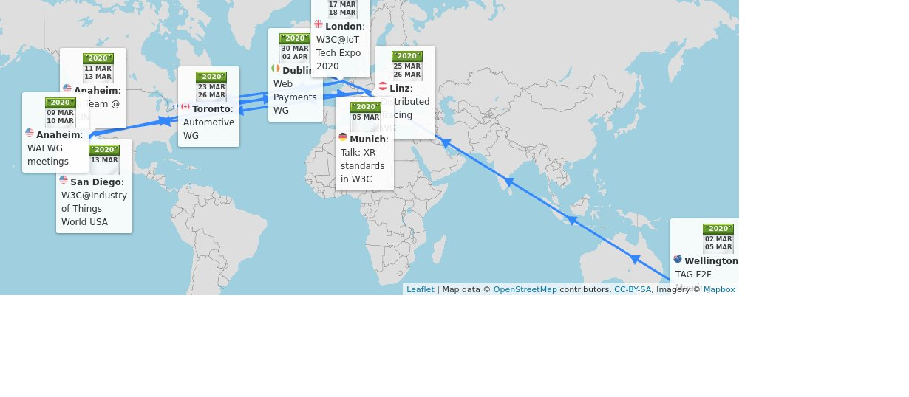
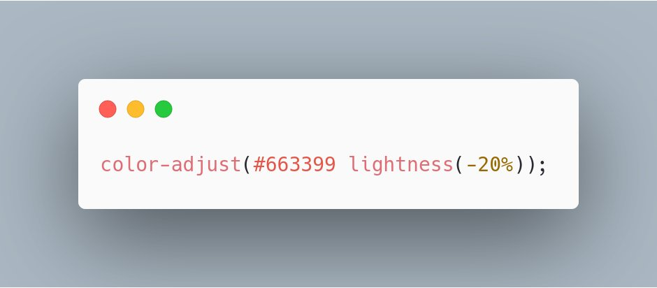
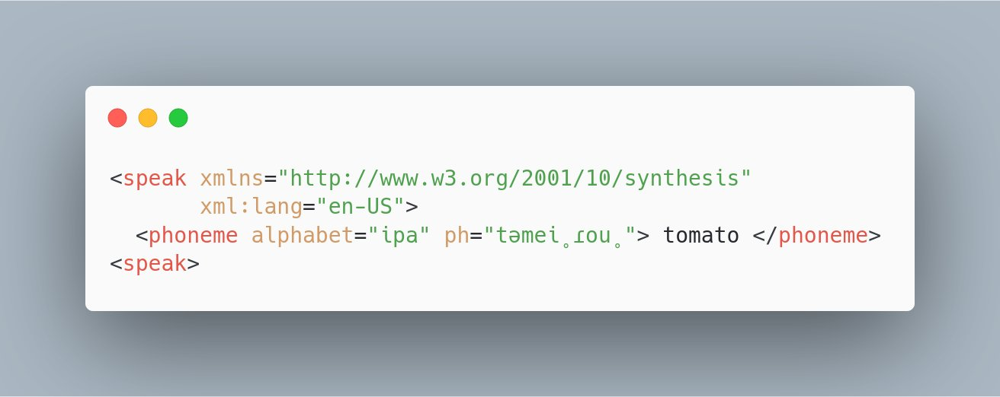

> 🗓️ March@w3c: f2f meetings, CSUN and IoT conferences, etc\. \.\.\. https://www\.w3\.org/participate/eventscal\.html 
> 
> 
> 2\-5 Mar\.: The @w3ctag holds its \#f2fmeeting in \#Wellington 🇳🇿 \(yes, New Zealand\!\) 
> 
> 

 [Mar 02 2020, 14:02:05 UTC](https://twitter.com/w3cdevs/status/1234479090603876352)

----

> 5 Mar: @dontcallmeDOM gives a talk on Immersive Web at the @XR4All event "Engineering \#XR for the Future" in \#Munich, 🇩🇪 \#ETSIARXR  
> https://www\.etsi\.org/events/1697\-engineering\-xr\-for\-the\-future\-frameworks\-requirements\-and\-future\-research

 [Mar 02 2020, 14:02:07 UTC](https://twitter.com/w3cdevs/status/1234479100246601729)

----

> 4 Mar\.: Hear, hear\! Register to the "Meet the TAG" @w3ctag meetup hosted by @InternetNZ, in "Welly \#Wellington" 🇳🇿  
> https://twitter\.com/InternetNZ/status/1233211481623289857

 [Mar 02 2020, 14:02:07 UTC](https://twitter.com/w3cdevs/status/1234479098233225219)

----

> 9\-10 Mar\.: Hosted by @pearson, the @w3c \#accessibility Education and Outreach \#WorkingGroup \(EOWG\) meets in \#Anaheim 🇺🇸\. See their agenda: https://www\.w3\.org/WAI/EO/wiki/EOWG\_F2F\_March\_2020\#Ideas\_for\_topics
> Due to travel restrictions related to COVID\-19, this meeting has been canceled\.

 [Mar 02 2020, 14:02:08 UTC](https://twitter.com/w3cdevs/status/1234479105200074757)

----

> 9\-10 Mar\.: Sponsored by @amazon and @pearson, the Accessibility Guidelines Silver \#TaskForce and \#CommunityGroup participants meet in \#Anaheim 🇺🇸  
> https://www\.w3\.org/WAI/GL/task\-forces/silver/wiki/2020\_March\_F2F\_Meeting\_at\_CSUN\#Agenda\_Topics

 [Mar 02 2020, 14:02:08 UTC](https://twitter.com/w3cdevs/status/1234479102456979456)

----

> 11\-13 Mar\.: The @w3c\_wai team is present at the 35th @CSUNCOD in \#Anaheim 🇺🇸 https://www\.csun\.edu/cod/conference/sessions/ \#accessibility \#a11y \#CSUNATC20 
> 
> 

 [Mar 02 2020, 14:02:09 UTC](https://twitter.com/w3cdevs/status/1234479109943832576)

----

> 13 Mar\.: @JalanbirdW3C participates in a World Café session at the \#IoT World \#SanDiego 🇺🇸 to demonstrate how standards help get along in the new playground of \#BigData @IoTClan  
> https://www\.industryofthingsworldusa\.com/peoples/alan\-bird/

 [Mar 02 2020, 14:02:10 UTC](https://twitter.com/w3cdevs/status/1234479113559248896)

----

> 17\-18 Mar\.: @JalanbirdW3C and @draggett are both panelists @iottechexpo in \#London 🇬🇧 \#IoT \#Automotive https://www\.iottechexpo\.com/global/ 
> 
> 

 [Mar 02 2020, 14:02:11 UTC](https://twitter.com/w3cdevs/status/1234479117330001921)

----

> 23\-26 Mar\.: Hosted by @GEOTAB, the @w3c Automotive \#WorkingGroup meets in \#Toronto 🇨🇦, \#Automotive \#ConnectedCar https://www\.w3\.org/auto/wg/wiki/Auto\-f2f\-mar\-2020\#Schedule

 [Mar 02 2020, 14:02:12 UTC](https://twitter.com/w3cdevs/status/1234479119964033024)

----

> 30 Mar\.\-2 Apr\.: @Airbnb hosts the @w3payments \#WorkingGroup meetings in Dublin, 🇮🇪  \#payments  
> https://github\.com/w3c/webpayments/wiki/FTF\-Mar2020

 [Mar 02 2020, 14:02:13 UTC](https://twitter.com/w3cdevs/status/1234479124665819137)

----

> 25\-26 Mar\.: The @w3c Distributed Tracing \#WorkingGroup holds its \#f2fmeeting in \#Linz 🇦🇹, hosted by @Dynatrace  
> https://docs\.google\.com/document/d/1fjIyoTCEtmwFbFZr2fBPCMDHWMYa4IctFCCYMfShrsE/edit

 [Mar 02 2020, 14:02:13 UTC](https://twitter.com/w3cdevs/status/1234479123038339075)

----

> Today, the first two \#CSS modules in level 5 were published as First Public \#WorkingDraft: "CSS Color Module Level 5" and "Media Queries Level 5"  
> https://twitter\.com/w3c/status/1234800012971868160
> CSS Color Module Level 5 adds color modification functions, e\.g\. color\-adjust allows to tweak a color lightness: https://www\.w3\.org/TR/2020/WD\-css\-color\-5\-20200303/\#coloradjust 
> 
> 

 [Mar 03 2020, 16:50:47 UTC](https://twitter.com/w3cdevs/status/1234883935169019907)

----

> \.@somelaniesaid spoke about how to apply different color scheme based on CSS media queries in her talk at our \#w3cdevs2019 meetup last September  
> \.\./2019/2019\-12\-tweets\.html\#x1204731843985235973

 [Mar 03 2020, 16:50:49 UTC](https://twitter.com/w3cdevs/status/1234883943045963776)

----

> Media Queries Level 5 adds new media features to customize style sheets based on ambient light, environment blending, \#JavaScript support and user preferences \(e\.g\. color contrast\); it also enables script\-based custom media queries: https://www\.w3\.org/TR/2020/WD\-mediaqueries\-5\-20200303/\#environment\-blending

 [Mar 03 2020, 16:50:49 UTC](https://twitter.com/w3cdevs/status/1234883940978176001)

----

> It's an opp\. to clarify the land of \#CSS levels\.\.\. Of all CSS levels, CSS Level 2 \(or CSS2\) is the last monolithic level of CSS published as a @w3c \#WebStandard, May 1998 \- note the vintage look\!: https://www\.w3\.org/TR/1998/REC\-CSS2\-19980512/

 [Mar 03 2020, 16:50:50 UTC](https://twitter.com/w3cdevs/status/1234883947705839622)

----

> These first CSS Level 5 modules come at a time of very active discussions on the value of numbered "versions" of \#CSS \- e\.g\. @ppk recently wrote "CSS4 is here\!" https://www\.quirksmode\.org/blog/archives/2020/01/css4\_is\_here\.html

 [Mar 03 2020, 16:50:50 UTC](https://twitter.com/w3cdevs/status/1234883944958525441)

----

> All current \#CSS specs have their own specific levels ranging from 1 to 5, but CSS as a whole does not have a version\. Two reasons: 1\) some features are easier to complete than others, 2\) CSS became so big that it is too much work for the editors to maintain as a monolithic spec\.

 [Mar 03 2020, 16:50:51 UTC](https://twitter.com/w3cdevs/status/1234883952588075008)

----

> This specification was eventually renamed CSS 2\.1 \(a revision was published in June 2011 \- Editors were Bert Bos, @viumlie, @Hixie and @t\)   
> https://www\.w3\.org/TR/CSS2/

 [Mar 03 2020, 16:50:51 UTC](https://twitter.com/w3cdevs/status/1234883950558007297)

----

> It is important to note that the @csswg decided not to try to describe \#CSS for users and \#developers\. The group works primarily for implementors and hopes others like MDN would create resources for devs\. For ex\., check the CSS reference on @MozDevNet: https://developer\.mozilla\.org/en\-US/docs/Web/CSS/Reference

 [Mar 03 2020, 16:50:53 UTC](https://twitter.com/w3cdevs/status/1234883960985001990)

----

> The @csswg occasionally publishes a list of stable modules to tell \#implementors the current state of CSS, that is the "CSS Snapshot": https://www\.w3\.org/TR/CSS/

 [Mar 03 2020, 16:50:53 UTC](https://twitter.com/w3cdevs/status/1234883958829125638)

----

> That's why, starting from 1999, \#CSS was decomposed into modules, each having its own life at its own pace\. Each module defines a part of CSS to allow more immediate, incremental improvement of the specification: https://www\.w3\.org/Style/2011/CSS\-process

 [Mar 03 2020, 16:50:53 UTC](https://twitter.com/w3cdevs/status/1234883956836794370)

----

> So, back to CSS4's marketing question: https://github\.com/w3c/csswg\-drafts/issues/4770  
> Last month, @chriscoyier wrote a CSS\-Tricks an article simply titled "CSS4" where he reminds what was and is on people's minds: https://css\-tricks\.com/css4/

 [Mar 03 2020, 16:50:54 UTC](https://twitter.com/w3cdevs/status/1234883963128287232)

----

> As always, all the \#CSS documents from the @csswg are developed on their github repo: https://github\.com/w3c/csswg\-drafts

 [Mar 03 2020, 16:50:55 UTC](https://twitter.com/w3cdevs/status/1234883968157310984)

----

> A @w3c CSS4 \#CommunityGroup was recently launched to give more space for the discussion of what would a CSS4 label encompass \- join if you want to help\! https://twitter\.com/w3c/status/1231957312757288961

 [Mar 03 2020, 16:50:55 UTC](https://twitter.com/w3cdevs/status/1234883965674237953)

----

> Due to travel restrictions related to COVID\-19, this meeting has been canceled\. \.\./2020/2020\-03\-tweets\.html\#x1234479105200074757

 [Mar 06 2020, 11:44:09 UTC](https://twitter.com/w3cdevs/status/1235893930333474816)

----

> The @w3c\_wai team is not longer participating in this event\. \.\./2020/2020\-03\-tweets\.html\#x1234479109943832576

 [Mar 06 2020, 11:46:53 UTC](https://twitter.com/w3cdevs/status/1235894619734528002)

----

> This meeting has been switched to a remote one\. \.\./2020/2020\-03\-tweets\.html\#x1234479119964033024

 [Mar 06 2020, 11:53:52 UTC](https://twitter.com/w3cdevs/status/1235896377311363073)

----

> Meeting postponed\. \.\./2020/2020\-03\-tweets\.html\#x1234479123038339075

 [Mar 06 2020, 11:55:35 UTC](https://twitter.com/w3cdevs/status/1235896807034703872)

----

> The @w3payments group resolved to transform this face\-to\-face agenda into a remote\-first meeting\. \.\./2020/2020\-03\-tweets\.html\#x1234479124665819137

 [Mar 06 2020, 11:56:49 UTC](https://twitter.com/w3cdevs/status/1235897118751145985)

----

> \.@w3c Data Catalog Vocabulary \(DCAT\) \- Version 2 \#WebStandard has been translated into Japanese: http://www\.asahi\-net\.or\.jp/\~ax2s\-kmtn/internet/rdf/REC\-vocab\-dcat\-2\-20200204\.html Thank you @omnidirect \! \#html5j \#dotHTML5 \#w3c\_keio \#translation https://twitter\.com/w3c/status/1236847208491868161

 [Mar 09 2020, 10:59:07 UTC](https://twitter.com/w3cdevs/status/1236969760656707586)

----

> The explainer “Improving Spoken Presentation on the Web” explores what mechanisms can be provided to give pronunciation guidance in \#HTML content \- this is helpful for \#accessibility and for voice assistants reading content off the Web  
> https://twitter\.com/w3c/status/1237266284460609536
> \.@w3c has an existing \#WebStandard to describe speech presentation: \#SSML, an XML\-based format broadly adopted by speech\-based systems, including voice assistants: https://www\.w3\.org/TR/speech\-synthesis/ 
> 
> 

 [Mar 10 2020, 13:15:29 UTC](https://twitter.com/w3cdevs/status/1237366465961119744)

----

> Two approaches are being explored: 1\) either in\-lining \#SSML markup the same way as \#SVG or \#MathML can be, or 2\) bringing the SSML model via attributes in HTML  
> https://www\.w3\.org/TR/2020/WD\-pronunciation\-explainer\-20200310/

 [Mar 10 2020, 13:15:30 UTC](https://twitter.com/w3cdevs/status/1237366473020125184)

----

> This work comes from the Pronunciation \#TaskForce of the @w3c Accessible Platform Architectures \(APA\) \#WorkingGroup \#a11y   
> \.\./2018/2018\-12\-tweets\.html\#x1070710412050612225

 [Mar 10 2020, 13:15:31 UTC](https://twitter.com/w3cdevs/status/1237366474890772480)

----

> The @w3c OWL 2 Document Overview \(2nd ed\.\) \#WebStandard has been translated into Japanese: http://www\.asahi\-net\.or\.jp/\~ax2s\-kmtn/internet/owl2/REC\-owl2\-overview\-20121211\.html Thank you @omnidirect \! \#html5j \#dotHTML5 \#w3c\_keio \#translation
> \.@w3c OWL 2ウェブ・オントロジー言語 \#WebStandard は日本語に翻訳されています：http://www\.asahi\-net\.or\.jp/\~ax2s\-kmtn/internet/owl2/REC\-owl2\-overview\-20121211\.html どうもありがとう @omnidirect \! \#html5j \#dotHTML5 \#w3c\_keio

 [Mar 10 2020, 14:03:21 UTC](https://twitter.com/w3cdevs/status/1237378514736812033)

----

> \*::pandemic \{  
>    position: fixed \!important;  
> \}

 [Mar 16 2020, 20:49:10 UTC](https://twitter.com/w3cdevs/status/1239654968992370693)

----

> See also our previous discussion on making XR accessible on the Web \.\./2020/2020\-02\-tweets\.html\#x1229747427672018944 \#w3cInclusiveXR \- if remote collaboration is to move to \#XR, it needs to be fully accessible https://twitter\.com/w3c\_wai/status/1239963260301922304

 [Mar 17 2020, 17:17:38 UTC](https://twitter.com/w3cdevs/status/1239964120725598208)

----

> Great blog post from Bert Bos, co\-inventor of \#CSS\! Read also our short history of CSS levels: \.\./2020/2020\-03\-tweets\.html\#x1234883935169019907 https://twitter\.com/w3c/status/1239519804308033536

 [Mar 23 2020, 14:28:22 UTC](https://twitter.com/w3cdevs/status/1242095849519419392)

----

> A number of us are enjoying the ease of accessing books in electronic formats when libraries and bookshops aren't available \- the main standard for this is \#ePub maintained by @w3c as part of its @w3cpublishing activity \#COVIDー19 \#ebooks   
> https://www\.w3\.org/publishing/ 
> 
> 
> The @w3cpublishing group ran a \#survey last month among to evaluate what the \#ePub community needed in terms of technology \#standards  
> https://lists\.w3\.org/Archives/Public/public\-publ\-wg/2020Feb/0005\.html

 [Mar 24 2020, 13:53:15 UTC](https://twitter.com/w3cdevs/status/1242449403077672961)

----

> If you have insights on the future of \#ePub, you can still answer the @w3cpublishing survey and/or comment on the charter https://github\.com/w3c/epub\-3\-wg\-charter

 [Mar 24 2020, 13:53:17 UTC](https://twitter.com/w3cdevs/status/1242449411596333056)

----

> This is leading to a proposed new EPUB 3 \#WorkingGroup dedicated to significantly increase the \#interoperability of \#ePub   
> https://twitter\.com/w3c/status/1240327947510321154

 [Mar 24 2020, 13:53:17 UTC](https://twitter.com/w3cdevs/status/1242449409943756805)

----

> \.@TzviyaSiegman reported on the first lessons from that survey, with a key request to maintain \#ePub 3  
> https://www\.w3\.org/blog/2020/03/listen\-to\-the\-people\-the\-future\-of\-epub\-and\-new\-directions\-for\-publishing\-w3c/

 [Mar 24 2020, 13:53:17 UTC](https://twitter.com/w3cdevs/status/1242449407938834433)

----

> The @w3c "PROV\-O: The PROV Ontology" \#WebStandard has been translated into Japanese: http://www\.asahi\-net\.or\.jp/\~ax2s\-kmtn/internet/owl2/REC\-prov\-o\-20130430\.html Thank you @omnidirect \! \#html5j \#dotHTML5 \#w3c\_keio \#translation https://twitter\.com/omnidirect/status/1242449542097690625

 [Mar 25 2020, 05:44:30 UTC](https://twitter.com/w3cdevs/status/1242688791346925568)

----

> W3llCome\! https://twitter\.com/nicj/status/1243208210955321347

 [Mar 27 2020, 22:42:28 UTC](https://twitter.com/w3cdevs/status/1243669745498456065)

----

> \.@w3c\_wai recently published their Real\-Time Communication Accessible User Requirements \(RAUR\) document as first draft to chart the path to make these  
> experiences accessible to all \#a11y   
> https://twitter\.com/w3c\_wai/status/1240672981225033728
> Many people around the world have shifted recently to online events and distributed meetings using audio/video teleconferences due to \#COVIDー19\. Making these experiences accessible to all gets even more critical\!  
> \#accessibility   
> https://twitter\.com/LeonieWatson/status/1235231606237016066

 [Mar 30 2020, 12:11:57 UTC](https://twitter.com/w3cdevs/status/1244598236834344960)

----

> This complements the work on XAUR which looked at the needs around Augmented and Virtual Reality \#AR \#VR  
> \.\./2020/2020\-03\-tweets\.html\#x1239964120725598208

 [Mar 30 2020, 12:11:58 UTC](https://twitter.com/w3cdevs/status/1244598240462417922)

----

> Some of these requirements apply to other @w3c technologies \(e\.g\. \#WebRTC\), other apply to applications making use of these technologies  
> https://www\.w3\.org/blog/2020/03/rtc\-accessibility\-user\-requirements\-call\-for\-review/

 [Mar 30 2020, 12:11:58 UTC](https://twitter.com/w3cdevs/status/1244598238637953028)