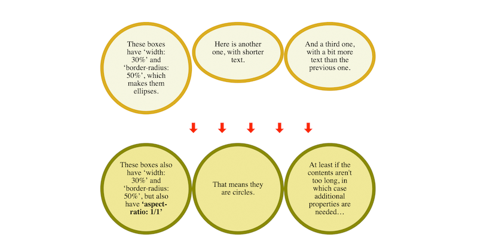

> Another @w3CAB election is starting, with 8 candidates for 5 seats\. https://twitter\.com/w3c/status/1257283714846949376
> The 8 candidates are: @t \(@mozilla\), Heejin Chung \(@Samsung\), @KHoeckner \(@hggezwitscher\), Tatsuya Igarashi \(@Sony\), @frivoal \(W3C Invited Expert\), @TzviyaSiegman \(@wileyglobal\), @daithesong \(@Apple\) and @alanstearns \(@Adobe\)\.

 [May 04 2020, 13:02:45 UTC](https://twitter.com/w3cdevs/status/1257294594846441472)

----

> They have published their nomination statements at: https://www\.w3\.org/2020/05/04\-ab\-nominations\.html

 [May 04 2020, 13:02:46 UTC](https://twitter.com/w3cdevs/status/1257294599724425221)

----

> Should you need it, a reminder of what the @w3CAB is: \.\./2018/2018\-05\-tweets\.html\#x991733862685437953

 [May 04 2020, 13:02:47 UTC](https://twitter.com/w3cdevs/status/1257294601829920768)

----

> 5\-7 May: @w3c supports the \#XR Immersive Enterprise online event @XR\_Intelligence \- unlocking the potential of VR &amp; AR/MR together \#XR2020 \#ReutersEvents \#XR\. Free registration: https://events\.vr\-intelligence\.com/enterprise/
> 🗓️ May@VirtualW3C: remote @w3c Member meeting and  @thew3cx courses \- https://www\.w3\.org/participate/eventscal\.html

 [May 04 2020, 14:15:35 UTC](https://twitter.com/w3cdevs/status/1257312925468876807)

----

> 18\-19 May: @w3c convenes its members representatives and staff to a 2\-day virtual meeting\. Live sessions are dedicated to discussion and Q&amp;A\.

 [May 04 2020, 14:15:36 UTC](https://twitter.com/w3cdevs/status/1257312929138896904)

----

> 20 May: @sabouzah opens the Siteimprove Accessibility Day webinar\. This online event is dedicated to digital \#accessibility \#a11y https://siteimprove\.com/de\-de/accessibility\-day/

 [May 04 2020, 14:15:37 UTC](https://twitter.com/w3cdevs/status/1257312932792119301)

----

> 19 May: Join a new run of @thew3cx "\#CSS Basics" course \#MOOC @edXOnline  
> https://www\.edx\.org/course/css\-basics

 [May 04 2020, 14:15:37 UTC](https://twitter.com/w3cdevs/status/1257312930934079496)

----

> The \#WebStandard WCAG 2\.1 가 한국어로 번역되었습니다 \#a11y \#WCAG21 http://www\.kwacc\.or\.kr/WAI/wcag21/ https://twitter\.com/w3c/status/1257938238326689793

 [May 06 2020, 08:44:45 UTC](https://twitter.com/w3cdevs/status/1257954443728953344)

----

> The @csswg has published "CSS Box Sizing Module \- Level 4" as first public working draft\. This module extends the \#CSS sizing properties\.   
> https://drafts\.csswg\.org/css\-sizing\-4/
> CSS has different ways to size boxes\. Paragraphs are as wide as their container, floats are as wide as their content\. To get a paragraph no wider than its content, you can make it a float or a table\. But that has side\-effects

 [May 25 2020, 10:04:10 UTC](https://twitter.com/w3cdevs/status/1264859799008751621)

----

> So, after \#CSS Sizing Level 3 which let a paragraph be sized as if it were a float, Level 4 will allow a float to be sized as a paragraph\. And it will solve another hard problem: link the height of a box to its width \(aspect ratio\)\. 
> 
> 

 [May 25 2020, 10:04:11 UTC](https://twitter.com/w3cdevs/status/1264859802917900291)

----

> The recently published @w3c "Web of Things \(WoT\) Architecture" \#WebStandard has been translated into Japanese: http://www\.asahi\-net\.or\.jp/\~ax2s\-kmtn/internet/wot/REC\-wot\-architecture\-20200409\.html \#html5j \#dotHTML5 \#w3c\_keio @W3C\_WoT \#Translation https://twitter\.com/omnidirect/status/1264881747625250816

 [May 26 2020, 03:30:38 UTC](https://twitter.com/w3cdevs/status/1265123150607548416)