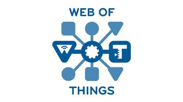
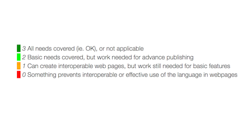

> The @w3c "Verifiable Credentials Data Model 1\.0" \#WebStandard has been translated into Korean: https://ssimeetupkorea\.github\.io/vc\-data\-model/ Thank you @jshim101\! \#decentralized \#identity \#translation https://twitter\.com/zikzo\_eth/status/1267757116627906563

 [Jun 02 2020, 10:10:13 UTC](https://twitter.com/w3cdevs/status/1267760425451560960)

----

> 🗓️ June@VirtualW3C: updated @thew3cx course and a series of WoT online events: live chat, plugfest, workshop, group meetings \- https://www\.w3\.org/participate/eventscal\.html
> 3 June: @JalanbirdW3C joins the @AseanCio 5th live chat on "What the future holds with @w3c's \#WoT?"   
> Book your seat\! https://us02web\.zoom\.us/meeting/register/tZIkcuuupzMvHtDTOpnKc1qXyTip\-B75cd34 
> 
> 

 [Jun 02 2020, 13:54:12 UTC](https://twitter.com/w3cdevs/status/1267816791226503176)

----

> 8 June: The @w3c \#WoT \#InterestGroup and Thing\-to thing research group \(T2TRG\) organize an online workshop on self\-description and discovery\. See agenda and candidate topics at https://github\.com/t2trg/2020\-06\-helsinki

 [Jun 02 2020, 13:54:13 UTC](https://twitter.com/w3cdevs/status/1267816796716822528)

----

> 15\-19 June: \#WoT plugfest open to all \#IoT developers interested in possible scenarii and demos of \#WoT\. More details are in https://www\.w3\.org/WoT/IG/wiki/F2F\_meeting\_2020\_2nd\#WoT\_Plugfest\_2

 [Jun 02 2020, 13:54:14 UTC](https://twitter.com/w3cdevs/status/1267816798486847492)

----

> 22\-26 June: the @W3C\_WoT groups are meeting online https://www\.w3\.org/WoT/IG/wiki/F2F\_meeting\_2020\_2nd\#WoT\_F2F 
> 
> 
> 18 June: @sabouzah talks about digital \#accessibility and how to include people with \#disabilities in the Web design process \#A11yAfrica2020 \#a11y Register to attend this @inABLEorg webinar\! https://twitter\.com/inABLEorg/status/1272046107934314496

 [Jun 02 2020, 13:54:15 UTC](https://twitter.com/w3cdevs/status/1267816801582211072)

----

> 30 June: Join the updated @thew3cx \#MOOC: "\#HTML5 Coding Essentials and Best Practices" https://www\.edx\.org/course/html5\-coding\-essentials\-and\-best\-practices w/ @micbuffa @edXOnline

 [Jun 02 2020, 13:54:15 UTC](https://twitter.com/w3cdevs/status/1267816803528437760)

----

> The @W3CAB's priorities in year 2020 are: \#Globalization, \#Strategy, \#Incubation, Legal entity, Process 2020, Tooling, etc\. Check them out: https://www\.w3\.org/wiki/AB/2020\_Priorities

 [Jun 03 2020, 11:12:03 UTC](https://twitter.com/w3cdevs/status/1268138374440853505)

----

> These elected @W3CAB participants join the continuing ones: @fantasai \(\#W3CInvitedExpert\), Avneesh Singh \(@DAISYConsortium\), Eric Siow \(@intel\), @LeonieWatson \(@TetraLogical\), @cwilso \(@Google\), and Judy Zhu \(@AlibabaGroup\)\.
> Congrats to @t \(@mozilla\), Tatsuya Igarashi \(@Sony\), @frivoal \(\#W3CInvitedExpert\), @TzviyaSiegman \(@wileyglobal\) and @daithesong \(@Apple\)\!\! 👏👏 https://www\.w3\.org/2020/05/04\-ab\-nominations\.html https://twitter\.com/w3c/status/1268121594276257792

 [Jun 03 2020, 11:12:03 UTC](https://twitter.com/w3cdevs/status/1268138372981239810)

----

> We discussed the context and goals of bringing better \#MachineLearning primitives to the Web when the original physical workshop was first announced  
> \.\./2020/2020\-02\-tweets\.html\#x1224740848144920576
> A new \#W3CWorkshop on the horizon: the Web and \#MachineLearning workshop, originally planned in March as a physical event, is becoming a virtual event built as a set of pre\-recorded talks and live discussions https://twitter\.com/w3c/status/1269931509089214464

 [Jun 09 2020, 15:46:27 UTC](https://twitter.com/w3cdevs/status/1270381755019800576)

----

> To bring your perspective on how Web \#browsers should evolve to accompany the deployment of \#MachineLearning \#services and \#applications, please consider applying to give a talk at the event https://www\.w3\.org/2020/06/machine\-learning\-workshop/speakers\.html

 [Jun 09 2020, 15:46:28 UTC](https://twitter.com/w3cdevs/status/1270381757058121733)

----

> \.@wseltzer, W3C Head of  Strategy, presents recent changes to the Strategy Funnel where @w3c records its new and upcoming work \(\#CommunityGroup, \#W3CWorkshop, \#WorkingGroup, etc\.\):  
> https://www\.w3\.org/2020/05/AC/talk/strategy\-funnel\#align  
> https://youtu\.be/SPGDlB89OMk
> The Strategy Funnel tracks exploration, investigation, incubation, evaluation and chartering of @w3c's work\. It is developed in \#github to help with early engagement: https://github\.com/w3c/strategy/projects/2   
> \.\./2018/2018\-04\-tweets\.html\#x982232776920334339

 [Jun 17 2020, 13:02:59 UTC](https://twitter.com/w3cdevs/status/1273239721603403777)

----

> Thx to the \#community shaping \#Webstandards, the Web helped people endure the challenges of social distancing and remote work\. Wrt \#Covid\_19, two \#CommunityGroups, were created: https://www\.w3\.org/community/web\-vs\-covid19/ \(data sharing\) and https://www\.w3\.org/community/covid\-19/ \(remote work practices and tools\)

 [Jun 17 2020, 13:03:00 UTC](https://twitter.com/w3cdevs/status/1273239725307047937)

----

> \.\.\. and the joint @w3c / @opengeospatial "Maps for the Web" workshop: https://twitter\.com/w3c/status/1268895102799396865

 [Jun 17 2020, 13:03:01 UTC](https://twitter.com/w3cdevs/status/1273239729203482625)

----

> As for \#W3CWorkshops, @wseltzer introduces the ones that are scheduled for \#2020: the "Web and \#MachineLearning" workshop: \.\./2020/2020\-06\-tweets\.html\#x1270381752893280257

 [Jun 17 2020, 13:03:01 UTC](https://twitter.com/w3cdevs/status/1273239727043469313)

----

> Other @w3c workshops under consideration are related to "User\-friendly Smart Agents on the Web \- Voice interaction": https://github\.com/w3c/strategy/issues/221 and to "Bundling Interactive Media Content on the Web": https://github\.com/w3c/strategy/issues/209

 [Jun 17 2020, 13:03:02 UTC](https://twitter.com/w3cdevs/status/1273239730776309760)

----

> As co\-chair of @w3ctag, @torgo gives an update of recent Technical Architecture Group \(TAG\) activities and how best to engage with the TAG going forward:  https://www\.w3\.org/2020/05/AC/talk/tag\-update\#align or directly on @w3c's new \#youtubechannel: https://youtu\.be/3Cp5ExEXkCg
> Dan Appelquist first explains the @w3ctag's mission and  deliverables \- see our summary: \.\./2018/2018\-01\-tweets\.html\#x957974903122219008

 [Jun 18 2020, 11:55:16 UTC](https://twitter.com/w3cdevs/status/1273585066501963777)

----

> The @w3ctag also works on the "Web Platform Design Principles" document, primarily designed for spec \#developers\. These principles have been collected during the TAG's discussions in the context of design reviews:  
> https://w3ctag\.github\.io/design\-principles/

 [Jun 18 2020, 11:55:17 UTC](https://twitter.com/w3cdevs/status/1273585071996506115)

----

> Design reviews are core to @w3ctag's work, along joint work with other groups and \#developer community engagement\. All requested reviews take place in the Design Review \#github repo in the issues registry:   
> https://github\.com/w3ctag/design\-reviews/issues

 [Jun 18 2020, 11:55:17 UTC](https://twitter.com/w3cdevs/status/1273585070230704136)

----

> The @w3ctag also updated its "Security and Privacy Self Review Questionnaire" \(by @lukOlejnik\) which helps spec\. authors to think about all the \#security and \#privacy issues that they might have, within any particular specification:  
> https://w3ctag\.github\.io/security\-questionnaire/

 [Jun 18 2020, 11:55:18 UTC](https://twitter.com/w3cdevs/status/1273585075427446784)

----

> It also refers to the TAG "Ethical Web Principles", where each principle is now individually linkable:  
> https://www\.w3\.org/2001/tag/doc/ethical\-web\-principles/ Hear @torgo explain the motivations behind this doc\. \(itw recorded during \#w3cTPAC2019\): https://youtu\.be/MeppC87Werg

 [Jun 18 2020, 11:55:18 UTC](https://twitter.com/w3cdevs/status/1273585073690984450)

----

> \#Translation The @w3c Web of Things \(\#WoT\) Thing Description \#WebStandard has been translated into  Japanese https://www\.w3\.org/TR/2020/REC\-wot\-thing\-description\-20200409/ \#dotHTML5 \#w3c\_keio @W3C\_WoT Thank you @omnidirect\! https://twitter\.com/omnidirect/status/1264881747625250816

 [Jun 22 2020, 07:59:02 UTC](https://twitter.com/w3cdevs/status/1274975168629276680)

----

> \#developers please share your overall experience, thoughts, frustrations and expectations in finding content on https://w3\.org Thanks\! https://twitter\.com/w3c/status/1275340945752502272

 [Jun 23 2020, 11:33:11 UTC](https://twitter.com/w3cdevs/status/1275391446242275330)

----

> To make the Web world\-ready, lots are happening in the @webi18n initiative, led by @r12a, as summarized in this presentation last month: https://www\.w3\.org/2020/05/AC/talk/i18n\#align \(with Chinese, Japanese and Korean captioning\) or on YouTube: https://youtu\.be/PKA\_6ABpBpg
> For \#developers and \#browsers implementers, @webi18n's language enablement framework is a set of tools and procedures to make sure that text layout and typographic needs of world scripts and languages are built into @w3c technologies \(\#HTML5, \#CSS, etc\.\):  
> https://w3c\.github\.io/typography/

 [Jun 24 2020, 13:08:32 UTC](https://twitter.com/w3cdevs/status/1275777833416212481)

----

> For \#users and content \#authors, the @webi18n Language Matrix tracks 79 languages and displays their support on the Web in the form of a 'heat map': https://w3c\.github\.io/typography/gap\-analysis/language\-matrix\.html 
> 
> 

 [Jun 24 2020, 13:08:34 UTC](https://twitter.com/w3cdevs/status/1275777838659108871)

----

> To explore gaps in language support on the Web, @webi18n is continuously looking for expert contributors to collaborate and help move this work forward by documenting gaps, and creating tests\. All the work and technical discussions are happening in \#github https://www\.w3\.org/International/layout

 [Jun 24 2020, 13:08:35 UTC](https://twitter.com/w3cdevs/status/1275777844392706049)

----

> The language matrix cells \(colored in dark green, light green, orange and red\) link to gap\-analysis sections that each describe the problem, the current level of support in specifications and browsers, and the severity of the problem for the user\. 
> 
> 

 [Jun 24 2020, 13:08:35 UTC](https://twitter.com/w3cdevs/status/1275777842291367938)

----

> See also this video where @r12a presents how W3C Internationalization makes a reality of the Web being World Wide, and introduces the Internationalization Initiative which is reinforcing that program: https://youtu\.be/mx2eDHujM4c

 [Jun 24 2020, 13:08:36 UTC](https://twitter.com/w3cdevs/status/1275777848100388864)

----

> \.@webi18n has recently published 21 documents that explore gaps in language support:  
> https://twitter\.com/webi18n/status/1273232132727623681

 [Jun 24 2020, 13:08:36 UTC](https://twitter.com/w3cdevs/status/1275777846372376576)

----

> Hear, hear\! The @w3c\_systeam released new pages presenting the @w3c groups\. This work consisted in structuring and organizing a wide range of somewhat scattered resources available on http://w3\.org, and making them easier to find and use: https://www\.w3\.org/groups/
> The work is not done yet as more info will be added in the future, such as groups' meeting calendars and \#github  
> references\.

 [Jun 24 2020, 14:22:36 UTC](https://twitter.com/w3cdevs/status/1275796472991305729)

----

> These public pages highlight a variety of groups which enable @w3c to pursue its mission through the creation of \#WebStandards, guidelines, and supporting materials: \#WorkingGroups \#CommunityGroups \#BusinessGroups and \#InterestGroups, \+ 2 permanent groups \(@w3ctag  
> and @W3CAB\)

 [Jun 24 2020, 14:22:37 UTC](https://twitter.com/w3cdevs/status/1275796476279631878)

----

> \#CommunityGroups and \#BusinessGroups give \#developers, \#designers, and anyone passionate about the Web a place to hold discussions and publish ideas\. These groups are proposed and run by the \#community:  
> https://www\.w3\.org/community/

 [Jun 24 2020, 14:22:38 UTC](https://twitter.com/w3cdevs/status/1275796481249816576)

----

> \#InterestGroups act as forum for the exchange of ideas\. They bring together people who wish to evaluate potential \#Web \#technologies and policies: https://www\.w3\.org/groups/ig/

 [Jun 24 2020, 14:22:38 UTC](https://twitter.com/w3cdevs/status/1275796479618289664)

----

> \#WorkingGroups typically produce deliverables \(e\.g\., \#WebStandards, technical reports, \#software, test suites, and reviews of the deliverables of other groups\): https://www\.w3\.org/groups/wg/

 [Jun 24 2020, 14:22:38 UTC](https://twitter.com/w3cdevs/status/1275796477894426627)

----

> This new set of pages will be integrated in the full site redesign W3C is conducting over the next few months\. Stay tuned\!

 [Jun 24 2020, 14:22:39 UTC](https://twitter.com/w3cdevs/status/1275796482839457792)

----

> \#browser engine \#developers, \#GPU \#hardware vendors, \#3D software engineers, etc\. are invited to read this proposed charter from the "\#GPU \(Graphics Processing Unit\) for the Web" \#w3c \#WorkingGroup:  
> https://www\.w3\.org/2020/06/gpuweb\-charter\.html https://twitter\.com/w3c/status/1273585590026592260
> See also \.\./2019/2019\-09\-tweets\.html\#x1172398360914907138

 [Jun 25 2020, 15:34:04 UTC](https://twitter.com/w3cdevs/status/1276176845038379020)

----

> Another proposed charter to deliver a \#WebTransport \#API enabling \#developers to make use of new network capabilities: https://www\.w3\.org/2020/06/proposed\-webtransport\-charter\.html https://twitter\.com/w3c/status/1272558779650002944
> See also \.\./2020/2020\-04\-tweets\.html\#x1247493707131162626

 [Jun 25 2020, 16:01:04 UTC](https://twitter.com/w3cdevs/status/1276183639064219648)

----

> This \#YouTube channel, called W3COfficial, is 'unsurprisingly' the official place where we intend to post @w3c videos we produce \(mostly interviews and talks\): https://www\.youtube\.com/W3COfficial
> You may have noticed in our tweets the past few weeks that we point to videos hosted on @YouTube e\.g\.  
> \.\./2020/2020\-06\-tweets\.html\#x1275777833416212481

 [Jun 29 2020, 12:31:42 UTC](https://twitter.com/w3cdevs/status/1277580502661238785)

----

> W3COfficial already hosts videos from past workshops, e\.g\. the Web &amp; Games \#W3CWorkshop  
> https://www\.youtube\.com/watch?v\=IjF\_f\-\-i13Y&list\=PLNhYw8KaLq2VudeCD36bbVAf\_F\_6sHyT7 \#w3cgames2019

 [Jun 29 2020, 12:31:43 UTC](https://twitter.com/w3cdevs/status/1277580507023360000)

----

> \.\.\. or our past \#developer \#meetups e\.g\. this one in 2019 \#w3cdevs2019  
> https://www\.youtube\.com/playlist?list\=PLNhYw8KaLq2Voakn\_PdQY2mrFoU2yAtPA

 [Jun 29 2020, 12:31:44 UTC](https://twitter.com/w3cdevs/status/1277580509804212224)

----

> We've created a few thematic playlists \- let us know if you have any feedback on how the channel is organized and what other materials you might like to find there\!  
> https://www\.youtube\.com/user/W3Conf/playlists

 [Jun 29 2020, 12:31:45 UTC](https://twitter.com/w3cdevs/status/1277580512392077312)