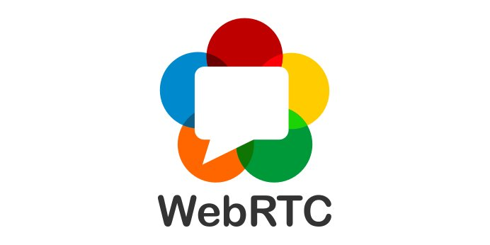

> 🗓️ July@VirtualW3C: @thew3cx online training, conference, etc\. https://www\.w3\.org/participate/eventscal\.html
> 1 July: we've just opened a session of @thew3cx \#HTML5 Coding Essentials and \#BestPractices \- updated content material for this intermediate level \#MOOC course\! @micbuffa @edXOnline   
> https://www\.edx\.org/course/html5\-coding\-essentials\-and\-best\-practices

 [Jul 02 2020, 06:02:16 UTC](https://twitter.com/w3cdevs/status/1278569662658293760)

----

> 6\-10 July: @w3c and @W3CUKI endorse the 12th ACM Web Science Conference 2020 "Making the \#Web human\-centric", organized by @unisouthampton @WebSciConf https://websci20\.webscience\.org/

 [Jul 02 2020, 06:02:17 UTC](https://twitter.com/w3cdevs/status/1278569665816662017)

----

> 7 July: start of a new session of @thew3cx \#MOOC \- "\#JavaScript Introduction"\. Learn and practice w/ @micbuffa @uca\_education @edXOnline  https://www\.edx\.org/course/javascript\-introduction

 [Jul 02 2020, 06:02:18 UTC](https://twitter.com/w3cdevs/status/1278569667427217410)

----

> \#WebRTC is used to power video\-conferences and collaboration systems on all platforms\. The usage of real\-time communications has skyrocketed in the fast few months \(\#COVID\_19\) with millions of new users, so it is critical that \#WebRTC works across all browsers and networks\. 
> 
> 
> Bernard Aboba, one of the co\-chairs of the @w3c Web Real Time Communications \(\#WebRTC\) \#WorkingGroup, gives a report on the group's status and roadmap:  
> https://www\.w3\.org/2020/05/AC/talk/webrtc\-update\#align  
> https://youtu\.be/3avWjtSqhPo

 [Jul 06 2020, 12:01:11 UTC](https://twitter.com/w3cdevs/status/1280109537886965760)

----

> The group is also working on supporting docs, such as WebRTC\-Stats \(telemetry for \#WebRTC apps\), specs for audio output and media recording and the acquisition of media from \#devices, screens, \#DOM elements, etc\. All the work happens in the open on \#GitHub https://github\.com/search?q\=org%3Aw3c\+topic%3Awebrtc

 [Jul 06 2020, 12:01:12 UTC](https://twitter.com/w3cdevs/status/1280109542760726533)

----

> The group is developing requirements on "WebRTC\-Next Version Use Cases" that require new \#APIs and protocols, thus paving the way for WebRTC's future: https://www\.w3\.org/TR/webrtc\-nv\-use\-cases/

 [Jul 06 2020, 12:01:12 UTC](https://twitter.com/w3cdevs/status/1280109541292728326)

----

> The \#WebRTC WG's highest priority is to finish the WebRTC 1\.0 specification, now in \#CandidateRecommendation status\. It covers peer\-to\-peer communications and video\-conferencing in \#HTML:  
> https://www\.w3\.org/TR/webrtc/

 [Jul 06 2020, 12:01:12 UTC](https://twitter.com/w3cdevs/status/1280109539715620865)

----

> Some of the work started in the context of \#WebRTC is proposed to take life of its own in other groups, e\.g\. the proposed work on \#WebTransport:  
> \.\./2020/2020\-04\-tweets\.html\#x1247493712361512960

 [Jul 06 2020, 12:01:13 UTC](https://twitter.com/w3cdevs/status/1280109544367161345)

----

> Last May, @W3CAB members' @fantasai and @frivoal explained the proposed changes for the 2020 edition of the @w3c Process document, the governing document of W3C standardization activity: https://www\.w3\.org/2020/05/AC/talk/Process2020\#align  
> https://youtu\.be/jpgwV8tKdV4 https://twitter\.com/fantasai/status/1278902221355094016
> This document guides the development of well thought\-out, implementable, and relevant specs\. Process 2020 represents some of the biggest changes in many years, while ensuring that @w3c values remain: wide review, implementation experience, consensus, and royalty\-free licensing\.

 [Jul 08 2020, 11:28:00 UTC](https://twitter.com/w3cdevs/status/1280825962385543168)

----

> The main motivations behind the adoption of this new process were to avoid out\-of\-date and unmaintained specifications and/or to have active versions published outside @w3c, and thus eliminate confusion among implementers and reviewers, as well as \#interoperability problems\.

 [Jul 08 2020, 11:28:01 UTC](https://twitter.com/w3cdevs/status/1280825967338979329)

----

> The W3C process has already gone through changes in 2018: \.\./2018/2018\-02\-tweets\.html\#x959076749291196416

 [Jul 08 2020, 11:28:02 UTC](https://twitter.com/w3cdevs/status/1280825969918558208)

----

> The mission of the AGWG is to develop specifications to support making implementations of web technologies accessible for people with disabilities, and to develop and maintain implementation support  
> materials: https://www\.w3\.org/WAI/GL/ \#a11y
> Rachael Montgomery, co\-chair of the @w3c \#Accessibility Guidelines \#WorkingGroup \(AGWG\) gives an update on the group's status and roadmap in this video:  
> https://www\.w3\.org/2020/05/AC/talk/AGWG\-update\#align  
> https://youtu\.be/rgMf6Uyyad4

 [Jul 09 2020, 13:54:44 UTC](https://twitter.com/w3cdevs/status/1281225277096505352)

----

> In parallel, one of the group's task forces, the Silver Task Force, is actively working towards WCAG 3\.0, improving usability and measurability of the \#a11y guidelines and providing harmonized guidance to help wider adoption:  
> https://www\.w3\.org/WAI/GL/task\-forces/silver/

 [Jul 09 2020, 13:54:45 UTC](https://twitter.com/w3cdevs/status/1281225281513160704)

----

> The group's main work has been to focus on WCAG 2\.2, with the addition of around 8 new success criteria which expand support for individuals with disabilities, particularly around cognitive and learning  
> \#disabilities: https://www\.w3\.org/blog/2020/02/wcag\-22\-in\-development/

 [Jul 09 2020, 13:54:45 UTC](https://twitter.com/w3cdevs/status/1281225279072018433)

----

> If you or your organization is new to the concept of \#accessibility, @w3c\_wai provides a variety of educational resources, as well documents in over 20 languages\! https://www\.w3\.org/WAI/translations/  
> Here's where to get started:  
> https://www\.w3\.org/WAI/fundamentals/accessibility\-intro/

 [Jul 09 2020, 13:54:46 UTC](https://twitter.com/w3cdevs/status/1281225283891273729)

----

> But as anyone who has tried patching browsers will know, being open source doesn't mean it's straightforward to contribute changes to browser engines, which are based on huge and complex code bases

 [Jul 13 2020, 13:06:19 UTC](https://twitter.com/w3cdevs/status/1282662645104087041)

----

> The Web platform is arguably already one of the most open platform for developers: its technologies are developed in the open, gathering input and feedback from anyone; and all the major browser rendering engines are developed as open source projects
> \.@w3c member @igalia is experimenting with a new way to give developers a voice in the roadmap of what ships in Web browsers https://twitter\.com/igalia/status/1282651980171804673

 [Jul 13 2020, 13:06:19 UTC](https://twitter.com/w3cdevs/status/1282662643510255620)

----

> \.@igalia is proposing a crowd\-funding program to bring their expertise in browser development across all the major engines to add well\-identified features based on developer's pledges \- we will be  
> watching the results of that experiment with high interest\!

 [Jul 13 2020, 13:06:20 UTC](https://twitter.com/w3cdevs/status/1282662646534361088)

----

> Congrats to @Gkellogg @pchampin and Dave Longley for the newly published three @w3c "JSON\-LD 1\.1" specifications \#timetoadopt \#WebStandard \#JSONLD https://twitter\.com/w3c/status/1283598575470096384

 [Jul 16 2020, 07:37:02 UTC](https://twitter.com/w3cdevs/status/1283666938850402304)

----

> 23 July: join the @w3c\_wai staff for an interactive update on guidelines, emerging technologies, and new resources \#a11y \#WCAG \#ATAG  
> https://twitter\.com/w3c\_wai/status/1281318299364732928

 [Jul 16 2020, 09:54:08 UTC](https://twitter.com/w3cdevs/status/1283701443040600065)

----

> 27\-29 July: register to the @w3cpublishing community webinars to hear from \#publishing industry experts @TzviyaSiegman Cristina Mussinelli @wendy\_a\_reid Avneesh Singh @teixmat Daihei Shiohama and @shiestyle   
> https://www\.w3\.org/2020/07/publ\-webinar/

 [Jul 16 2020, 09:54:09 UTC](https://twitter.com/w3cdevs/status/1283701445351612416)

----

> 30\-31 July: MiniApp virtual event with pre\-recorded talks and interactive sessions, organized by the @w3c MiniApps Ecosystem \#CommunityGroup https://www\.w3\.org/2020/07/miniapp\-virtual\-meeting/

 [Jul 16 2020, 10:14:35 UTC](https://twitter.com/w3cdevs/status/1283706589665464322)

----

> Two months ago, @TzviyaSiegman, one of the co\-chairs of the Positive Work Environment \#CommunityGroup, presented the proposed update to @w3c's \#CodeOfConduct, the Code of Ethics and Professional Conduct \(CEPC\): https://www\.w3\.org/2020/05/AC/talk/CEPC\#align  
> https://youtu\.be/Z2fC\-\_f8LjE https://twitter\.com/w3c/status/1284111997458616323
> This \#CodeOfConduct document attempts to help people understand when they may be offending another participant in the \#w3c \#community\. The language is now more specific so to give precise information about what it means to respect one another: https://www\.w3\.org/Consortium/cepc/

 [Jul 17 2020, 13:25:39 UTC](https://twitter.com/w3cdevs/status/1284117061300563971)

----

> CEPC's goals are to: define acceptable and expected standards of behavior, provide a benchmark, ensure transparency in community &amp; group management, ensure an environment where people can participate without fear of harassment, and contribute to the identity of the organization\.

 [Jul 17 2020, 13:25:40 UTC](https://twitter.com/w3cdevs/status/1284117065792618496)

----

> The CEPC is developed in the Positive Work Environment  \(PWE\) \#CommunityGroup https://www\.w3\.org/community/pwe/ in their \#github repository:  
> https://github\.com/w3c/PWETF

 [Jul 17 2020, 13:25:41 UTC](https://twitter.com/w3cdevs/status/1284117070427426817)

----

> The group is also looking at strengthening the Ombudsperson program by selecting several ombuds people to act as trusted confidants to work toward resolving complaints between any internal or external constituent: https://www\.w3\.org/Consortium/pwe/\#ombuds

 [Jul 17 2020, 13:25:41 UTC](https://twitter.com/w3cdevs/status/1284117068875530242)

----

> Next steps are to provide related training opportunities to all @w3c groups, starting with @jorydotcom's conflict deescalation work: https://gist\.github\.com/jorydotcom/a4773ba396655b2f7f094d5569f60f4d  
> More educational resources have been identified:  
> https://www\.w3\.org/Consortium/pwe/\#Education

 [Jul 17 2020, 13:25:41 UTC](https://twitter.com/w3cdevs/status/1284117067256430593)

----

> Happy Bday\! https://twitter\.com/MozDevNet/status/1286210718619099137

 [Jul 24 2020, 06:23:13 UTC](https://twitter.com/w3cdevs/status/1286547465366384640)

----

> 31 July: @draggett keynotes at the @MINES\_StEtienne's Summer School on \#AI for \#Industry40\. He introduces the Sentient \#Web and \#CognitiveAI https://ai4industry\.sciencesconf\.org/  \#RESTAPI \#WoT

 [Jul 27 2020, 13:02:09 UTC](https://twitter.com/w3cdevs/status/1287735023081328640)