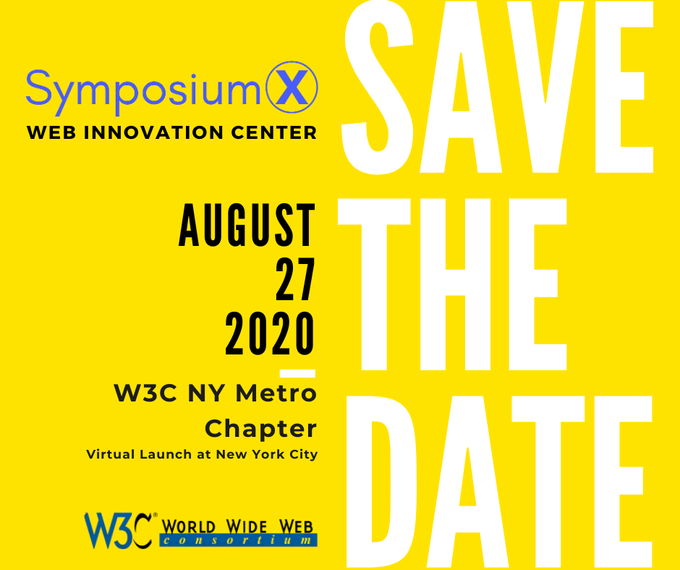

> This specification defines two profiles \#TTML 2: a text only profile and an image\-only profile\. Both profiles are intended for \#subtitles and \#captions delivery worldwide, including dialog language translation, content description, captions for deaf and hard of hearing, etc\.
> Congrats to @palemieux for the newly published @w3c \#WebStandard "\#TTML Profiles for Internet Media Subtitles and Captions 1\.2" https://www\.w3\.org/TR/2020/REC\-ttml\-imsc1\.2\-20200804/ \#timetoadopt https://twitter\.com/w3c/status/1290544394714652672

 [Aug 04 2020, 09:49:52 UTC](https://twitter.com/w3cdevs/status/1290585738426359813)

----

> 11 August: a deep dive virtual meeting on Silver, the  
> next generation of Accessibility Guidelines, organized by the @w3c \#Accessibility Guidelines \#WorkingGroup \#WCAG: https://www\.w3\.org/WAI/GL/wiki/Meetings/Silver\_Deep\_Dive\_2020\-08  
> Learn more about the group's status and the Silver work: \.\./2020/2020\-07\-tweets\.html\#x1281225274726760455 \#a11y
> 🗓️August@VirtualW3C: group meeting, W3C chapter launch, W3Cx MOOC \- https://www\.w3\.org/participate/eventscal\.html

 [Aug 10 2020, 14:42:43 UTC](https://twitter.com/w3cdevs/status/1292833764817743872)

----

> 22\-28 August: celebrating the \#WebInnovationWeek with the virtual launch of the first @w3c chapter in the USA: \#NYCMetro \#W3Chapter  
> https://www\.linkedin\.com/pulse/w3c\-ny\-metro\-chapter\-launch\-inaugural\-web\-innovation\-week\-yager/ @RachelYager \#W3CNYMetro \#SymposiumX  \#NewYorkCity 
> 
> 

 [Aug 10 2020, 14:42:44 UTC](https://twitter.com/w3cdevs/status/1292833768785563650)

----

> 25 August: opening a new session of @thew3cx \#HTML5 \#Apps and \#Games \#MOOC @micbuffa @edXOnline   
> https://www\.edx\.org/course/html5\-apps\-and\-games  
> Learn advanced HTML5 tips and techniques\!

 [Aug 10 2020, 14:42:45 UTC](https://twitter.com/w3cdevs/status/1292833771121790976)

----

> 29 Aug\.: Chinese Web @w3c \#InterestGroup meeting on \#WebAssembly: https://github\.com/w3c/chinese\-ig/blob/master/meetings/2020\-08\-29\.md \#W3CChina

 [Aug 17 2020, 12:02:52 UTC](https://twitter.com/w3cdevs/status/1295330249375350784)

----

> \#CSS Grid level 2 introduces the ‘subgrid’, a first step towards allowing nested elements of a document to align to a top\-level grid \#timetoadopt https://twitter\.com/w3c/status/1295632807495192576

 [Aug 18 2020, 08:09:40 UTC](https://twitter.com/w3cdevs/status/1295633951969730560)

----

> Now official\! https://twitter\.com/plhw3org/status/1296509369883004928 \.\./2020/2020\-07\-tweets\.html\#x1280825962385543168

 [Aug 24 2020, 14:18:42 UTC](https://twitter.com/w3cdevs/status/1297901148490346496)

----

> Meet the @w3c speakers: @JalanbirdW3C @ConnectorKaren @plhw3org @mountainhippo @dontcallmeDOM   
> \#W3Chapter \#WebInnovationX \#WebInnovationWeek2020 https://twitter\.com/RachelYager/status/1297899637655953408

 [Aug 24 2020, 14:22:57 UTC](https://twitter.com/w3cdevs/status/1297902220470620160)

----

> if you want to track or get involved in the discussions on how all this input should help draw the roadmap of work to be done in this space, head over to the github repo https://github\.com/w3c/machine\-learning\-workshop/issues
> There are now 28 presentations touching on very different perspectives of how \#MachineLearning intersect with Web browsers: hardware acceleration, integration with audio &amp; video, supporting existing frameworks, but also dealing with bias, impact on privacy, … https://twitter\.com/dontcallmeDOM/status/1296425915682103304

 [Aug 26 2020, 14:49:48 UTC](https://twitter.com/w3cdevs/status/1298633752919322630)