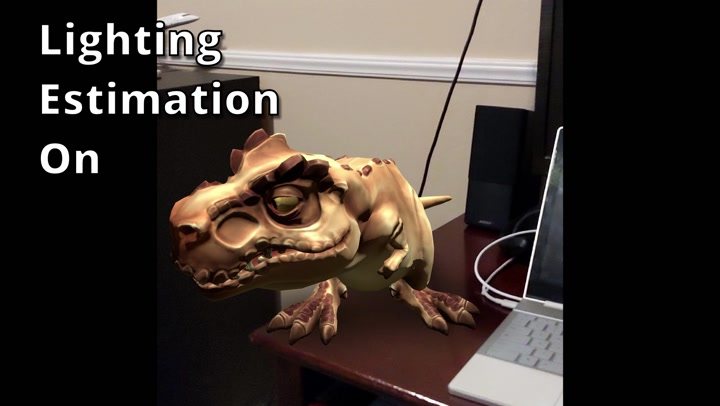
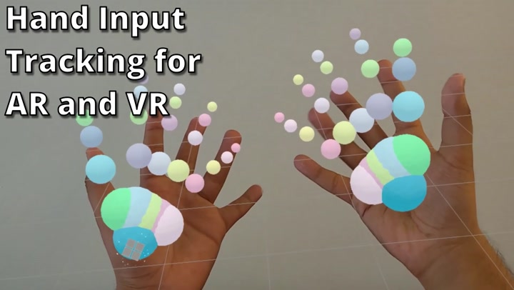
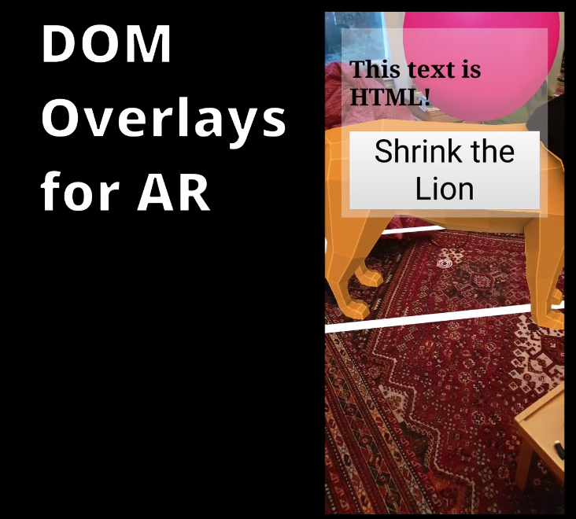
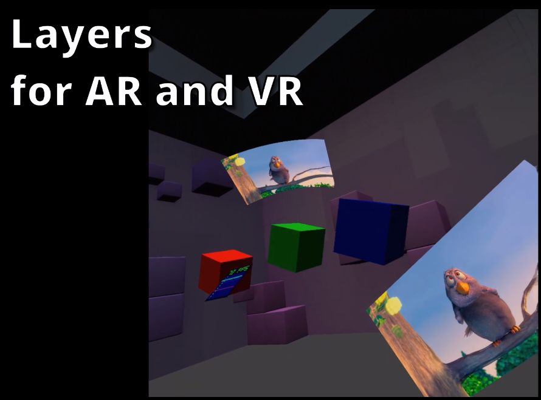

> New 🎬 from the \#WebMachineLearning \#W3CWorkshop: "Paddle\.js \- \#MachineLearning for the Web", by Ping Wu https://youtu\.be/\_I\_j\-J4gg1c \#PaddleJS \#WebAI

 [Oct 01 2020, 10:00:01 UTC](https://twitter.com/w3cdevs/status/1311606788660162565)

----

> TPAC \(aka Technical Plenary &amp; Advisory Committee \#w3cTPAC\) is @w3c's biggest annual series of events bringing together W3C groups, etc\. for exciting and coordinated work https://www\.w3\.org/2020/10/TPAC/
> 🗓️ October@VirtualW3C: TPAC month\! https://www\.w3\.org/participate/eventscal\.html

 [Oct 01 2020, 11:47:34 UTC](https://twitter.com/w3cdevs/status/1311633855930077186)

----

> 2 Oct\.: Last session for the distributed online @w3c/@opengeospatial \#W3CWorkshop series on \#Maps4HTML dedicated to Web \#developers priorities \- https://www\.w3\.org/2020/maps/ \- sponsored by @NRCan

 [Oct 01 2020, 11:47:35 UTC](https://twitter.com/w3cdevs/status/1311633860065714176)

----

> \.@w3c's first virtual \#w3cTPAC event helps Working, Interest, Business and Community Groups to schedule their online meetings anytime from September to December 2020\. See which group meets and when in this calendar view: https://www\.w3\.org/2020/10/TPAC/group\-schedule\.html\#calendar

 [Oct 01 2020, 11:47:35 UTC](https://twitter.com/w3cdevs/status/1311633858123751424)

----

> 12\-16 Oct\.: \#w3cTPAC Joint group meetings week, dedicated to discussions between groups sot to better coordinate the \#WebStandards work: https://www\.w3\.org/2020/10/TPAC/group\-schedule\.html\#schedule

 [Oct 01 2020, 11:47:36 UTC](https://twitter.com/w3cdevs/status/1311633863828025345)

----

> 2 Oct\.: @hdv shows how your CMS is an \#accessibility assistant at the \#WPAccessibilityDay \#WPAD2020 \#ATAG  
> https://wpaccessibilityday\.org/talks/your\-cms\-is\-an\-accessibility\-assistant/

 [Oct 01 2020, 11:47:36 UTC](https://twitter.com/w3cdevs/status/1311633861865078785)

----

> 26\-30 Oct\.: \#w3cTPAC \#BreakOutSessions week on a wide variety of topics relating to @w3c activities: https://www\.w3\.org/2020/10/TPAC/breakout\-schedule\.html Some of these breakouts are open to the public\. Check them out\! \.\./2020/2020\-09\-tweets\.html\#x1310575554240876544

 [Oct 01 2020, 11:47:37 UTC](https://twitter.com/w3cdevs/status/1311633867707686912)

----

> 20 Oct\.: @w3c member\-only live session \(Advisory Committee \- AC\) meeting that focus on strategic issues facing the Consortium and future directions envisioned by the membership and staff \#w3cTPAC

 [Oct 01 2020, 11:47:37 UTC](https://twitter.com/w3cdevs/status/1311633866000662528)

----

> New 🎬 from the \#WebMachineLearning \#W3CWorkshop: "ml5\.js: Friendly Machine Learning for the Web", by @yining\_shi https://youtu\.be/QOCb\_Yysg4M \#ml5js \#JavaScript \#TensorFlowJS \#MachineLearning

 [Oct 02 2020, 10:00:01 UTC](https://twitter.com/w3cdevs/status/1311969174692851714)

----

> New 🎬 from the \#WebMachineLearning \#W3CWorkshop: "Pipcook, a front\-end oriented \#DL DL framework", by Wenhe Eric Li https://youtu\.be/aAB541Ol7f8 \#DeepLearning \#AI \#TensorFlowJS \#MachineLearning

 [Oct 03 2020, 10:00:00 UTC](https://twitter.com/w3cdevs/status/1312331560297787392)

----

> New 🎬 from the \#WebMachineLearning \#W3CWorkshop: "\#MachineLearning on the Web for content filtering applications", by @shoniko https://youtu\.be/oP\-6Fgkz2\_0 \#DOM \#TensorFlowJS \#JavaScript \#AI \#GraphConvolutionalNetworks

 [Oct 03 2020, 22:00:01 UTC](https://twitter.com/w3cdevs/status/1312512756617302023)

----

> New 🎬 from the \#WebMachineLearning \#W3CWorkshop: "Exploring unsupervised image segmentation results", by @pmigdal &amp; Bartłomiej Olechno https://youtu\.be/ea4KKD2l9eI \#DeepLearning \#RMarkdown \#D3js  \#MachineLearning

 [Oct 05 2020, 12:44:09 UTC](https://twitter.com/w3cdevs/status/1313097644508680192)

----

> New 🎬 from the \#WebMachineLearning \#W3CWorkshop: "Mobile\-first web\-based \#MachineLearning", by @\_josh\_meyer\_ and @lindyrocky https://youtu\.be/gyjxCC6\_O40 \#AI

 [Oct 06 2020, 10:00:01 UTC](https://twitter.com/w3cdevs/status/1313418729196326912)

----

> New 🎬 from the \#WebMachineLearning \#W3CWorkshop: "We Count: Fair Treatment, \#Disability and \#MachineLearning", by @juttatrevira https://youtu\.be/3CjliYeqjrM \#AI \#privacy \#ethics

 [Oct 07 2020, 10:00:00 UTC](https://twitter.com/w3cdevs/status/1313781113341521920)

----

> New 🎬 from the \#WebMachineLearning \#W3CWorkshop: "\#AI \(\#MachineLearning\): Bias &amp; Garbage In, Bias &amp; Garbage Out", by @ClearHelper https://youtu\.be/DdUgRoTKiik \#Disability \#fairness

 [Oct 08 2020, 10:00:00 UTC](https://twitter.com/w3cdevs/status/1314143501119041536)

----

> New 🎬 from the \#WebMachineLearning \#W3CWorkshop: "\#Cognitive \#Accessibility and \#MachineLearning", by @SeemanLisa and Joshue O’Connor https://youtu\.be/\_EsXc5Afuv4 \#inclusion \#disability

 [Oct 09 2020, 10:00:01 UTC](https://twitter.com/w3cdevs/status/1314505891568181250)

----

> New 🎬 from the \#WebMachineLearning \#W3CWorkshop: "Interactive \#ML \- Powered Music \#applications on the Web", by @teropa https://youtu\.be/TmQl5s3lP9s \#MachineLearning \#TensorFlowJS \#MagentaJS  \#WebAudio

 [Oct 10 2020, 10:00:00 UTC](https://twitter.com/w3cdevs/status/1314868276627828737)

----

> New 🎬 from the \#WebMachineLearning \#W3CWorkshop: "Wreck a Nice Beach in the \#Browser: Getting the Browser to Recognize \#Speech", by @KellyJayDavis https://youtu\.be/OI2sHJ12Us0 \#WebSpeech \#API \#Privacy \#MachineLearning

 [Oct 11 2020, 10:00:00 UTC](https://twitter.com/w3cdevs/status/1315230663243685888)

----

> New 🎬 from the \#WebMachineLearning \#W3CWorkshop: "\#Privacy focused \#MachineTranslation in \#Firefox", by @XapaJIaMnu https://youtu\.be/nuiFXBS0CJo \#multilingual        \#MachineLearning

 [Oct 12 2020, 10:00:00 UTC](https://twitter.com/w3cdevs/status/1315593049632772097)

----

> Last year, @MozDevNet launched the 1st edition of this \#survey designed in collaboration with browser vendors and @w3c\. That 2019 edition collected data from nearly 30,000 developers from which @atopal presented early results during TPAC2019: \.\./2019/2019\-10\-tweets\.html\#x1183767368813686784
> The 2nd edition of the MDN Web Developer Needs Assessment is out\! It is is actively used to prioritize browser roadmaps\. We invite Web \#developers and \#designers to let browser vendors and the Web standardization community know what needs to change and what you are happy with https://twitter\.com/w3c/status/1315672322062381056

 [Oct 12 2020, 15:54:42 UTC](https://twitter.com/w3cdevs/status/1315682315759124481)

----

> The MDN browser compatibility report was issued last month, and it identifies specific issues and possible solutions \- Read the full 120\-page report: https://mdn\-web\-dna\.s3\-us\-west\-2\.amazonaws\.com/MDN\-Browser\-Compatibility\-Report\-2020\.pdf \(pdf, 1\.9MB\)

 [Oct 12 2020, 15:54:43 UTC](https://twitter.com/w3cdevs/status/1315682319747952640)

----

> The major identified pain points were related to browser compatibility: having to support specific browsers, making a design look/work testing across browsers, etc\. https://twitter\.com/MozDevNet/status/1308430517897957376

 [Oct 12 2020, 15:54:43 UTC](https://twitter.com/w3cdevs/status/1315682317772500992)

----

> First results of this new survey will be discussed at one of the \#w3cTPAC public breakout sessions in 2 weeks:  
> https://www\.w3\.org/wiki/TPAC/2020/SessionIdeas\#MDN\_Developer\_Need\_Assessments:\_results\_and\_next\_steps Join the discussion\!  
> \.\./2020/2020\-10\-tweets\.html\#x1311633867707686912

 [Oct 12 2020, 15:54:44 UTC](https://twitter.com/w3cdevs/status/1315682321450889216)

----

> New 🎬 from the \#WebMachineLearning \#W3CWorkshop: "A virtual character web meeting with expression enhance power by \#MachineLearning", by Zelun Chen https://youtu\.be/5TM1c1OaxCY

 [Oct 13 2020, 10:00:00 UTC](https://twitter.com/w3cdevs/status/1315955440598102016)

----

> New 🎬 from the \#WebMachineLearning \#W3CWorkshop: "RNNoise, Neural \#Speech Enhancement, and the \#browser, by Jean\-Marc Valin https://youtu\.be/nsscrYdrGRE \#SignalProcessing  \#MachineLearning

 [Oct 14 2020, 10:00:00 UTC](https://twitter.com/w3cdevs/status/1316317826701959168)

----

> New 🎬 from the \#WebMachineLearning \#W3CWorkshop: "\#RNNoise, Neural Speech Enhancement, and the \#Browser", by Jean\-Marc Valin https://youtu\.be/nsscrYdrGRE \#speech \#SignalProcessing \#MachineLearning

 [Oct 14 2020, 10:02:00 UTC](https://twitter.com/w3cdevs/status/1316318328944762883)

----

> In addition to the core capabilities provided by the \#WebXR Device API, the demo shows how the Hit Test API allows integrating virtual 3D objects in a real world environment https://immersive\-web\.github\.io/hit\-test/ 
> 
> 
> Among the demos provided by groups for \#w3cTPAC, this one from @Lady\_Ada\_King for @ImmersiveWebW3C explains in less than 5 minutes many of the the creative opportunities that new AR &amp; VR APIs are bringing to the Web https://www\.w3\.org/2020/10/TPAC/iw\-demos\.html\#talk \#ImmersiveWeb \#WebXR

 [Oct 14 2020, 14:22:01 UTC](https://twitter.com/w3cdevs/status/1316383767032934401)

----

> It puts the Lightning Estimation API under the spotlight to make these objects more credibly part of their surrounding https://immersive\-web\.github\.io/lighting\-estimation/ 
> 
> 

 [Oct 14 2020, 14:22:03 UTC](https://twitter.com/w3cdevs/status/1316383773836148738)

----

> It also gives a hands\-on view of how hand input can complete controller input in AR &amp; VR experiences https://immersive\-web\.github\.io/webxr\-hand\-input/ 
> 
> 

 [Oct 14 2020, 14:22:05 UTC](https://twitter.com/w3cdevs/status/1316383779913596928)

----

> It shows how to bring the full declarative power of the Web in building UI in AR with to DOM Overlays https://immersive\-web\.github\.io/dom\-overlays/ 
> 
> 

 [Oct 14 2020, 14:22:06 UTC](https://twitter.com/w3cdevs/status/1316383787203334144)

----

> And it ends with the Layers API to bring videos EVERYWHERE in your immersive experiences https://immersive\-web\.github\.io/layers/ 
> 
> 

 [Oct 14 2020, 14:22:08 UTC](https://twitter.com/w3cdevs/status/1316383795067617283)

----

> Learn from similar demos and updates groups have prepared for \#w3cTPAC https://twitter\.com/w3c/status/1316108160701263872

 [Oct 14 2020, 14:22:09 UTC](https://twitter.com/w3cdevs/status/1316383797710028802)

----

> New 🎬 from the \#WebMachineLearning \#W3CWorkshop: "Empowering Musicians and Artists using \#MachineLearning to Build Their Own Tools in the \#Browser", by @LouisMcCallum https://youtu\.be/1qmIm\_XvBqE \#WebGPU \#Audio \#AudioWorklets \#JavaScript

 [Oct 15 2020, 10:01:00 UTC](https://twitter.com/w3cdevs/status/1316680465294782464)

----

> \#w3cTPAC month: curious to know what @w3c groups are working on? Watch demos and lightning talks related to \#a11y \#w3ctag \#TimedText \#WebNetworks \#WoT \#XR \#media, as well as 2 educational videos taken from @thew3cx's Intro\. to Web Accessibility \#MOOC: https://www\.w3\.org/2020/10/TPAC/group\-updates\.html

 [Oct 15 2020, 12:56:17 UTC](https://twitter.com/w3cdevs/status/1316724575485427713)

----

> This 1\-hour meeting is a short introduction of what @w3c is and how the upcoming virtual “TPAC” \#unconference \(week of October 26\-30\) offers an opp\. for  Web \#developers and \#designers to discover the \#W3CCommunity\!
> For \#w3cTAC participants unfamiliar with how the breakouts work, @w3c is holding a briefing call on Monday \#19October2020 at 15:00 UTC: https://www\.w3\.org/2020/10/TPAC/intro\.html with @dontcallmeDOM @sheilamouss and @torgo \.\./2020/2020\-09\-tweets\.html\#x1310575554240876544

 [Oct 15 2020, 14:11:57 UTC](https://twitter.com/w3cdevs/status/1316743620351930368)

----

> \#w3cTPAC \.\./2020/2020\-10\-tweets\.html\#x1316743618124750849

 [Oct 15 2020, 14:19:33 UTC](https://twitter.com/w3cdevs/status/1316745531566235648)

----

> New 🎬: "Ideas for \#IoT \#MiniApp Standardization", by Ping Shen \(Alibaba\) https://youtu\.be/nvcBFGmBE90

 [Oct 16 2020, 11:02:00 UTC](https://twitter.com/w3cdevs/status/1317058204392673280)

----

> New 🎬: "\#MiniApp Manifest and Packaging", by Yongjing Zhang \(Huawei\) https://youtu\.be/8TERdAXo\-eQ

 [Oct 17 2020, 11:04:00 UTC](https://twitter.com/w3cdevs/status/1317421095469735937)

----

> New 🎬: "\#MiniApp Lifecycle", by Qing An \(Alibaba\) https://youtu\.be/En68A9PV8q4

 [Oct 18 2020, 11:02:00 UTC](https://twitter.com/w3cdevs/status/1317782980052406277)

----

> It's today at 15:00 UTC\! Sign up to this "intro to \#w3cTPAC" briefing call: https://www\.w3\.org/2020/10/TPAC/intro\.html\#briefing for Web \#developers \#designers\. https://twitter\.com/bocoup/status/1316841191225393155

 [Oct 19 2020, 10:40:30 UTC](https://twitter.com/w3cdevs/status/1318139957710671873)

----

> New 🎬: "\#MiniApp Overview", by Yinli Chen \(Xiaomi\) https://youtu\.be/MWjchL4np7I

 [Oct 19 2020, 11:02:00 UTC](https://twitter.com/w3cdevs/status/1318145367863480320)

----

> Join @w3c's \#CodeOfConduct live training session with @jeff\_jaffe @TzviyaSiegman @jorydotcom and Judy Brewer to learn more about the history, development, and implementation of the W3C CEPC: https://www\.w3\.org/Consortium/cepc/ https://twitter\.com/w3c/status/1318197258840625154
> To maintain a positive work environment, this CEPC document defines accepted and acceptable behaviors and promotes high standards of professional practice\. Read more: \.\./2020/2020\-07\-tweets\.html\#x1284117064148451329

 [Oct 19 2020, 16:20:19 UTC](https://twitter.com/w3cdevs/status/1318225477606264832)

----

> New 🎬: "\#MiniApp URI Scheme", by Zhou Dan \(Baidu\) https://youtu\.be/LMFqLDmM5To

 [Oct 20 2020, 11:01:00 UTC](https://twitter.com/w3cdevs/status/1318507504637235202)

----

> Reminder that we are looking for as much and as diverse an input as possible on how the Web needs to evolve to better fit the needs from developers and designers ✅ https://twitter\.com/w3c/status/1315672322062381056
> Please fill in this survey \- this is your chance to make yourself heard: https://www\.surveygizmo\.com/s3/5897636/W3C Thank you\!

 [Oct 21 2020, 11:30:57 UTC](https://twitter.com/w3cdevs/status/1318877428316594176)

----

> New initiative to help create smarter \#ecommerce experiences for consumers globally using Web \#technologies \- \#BusinessGroup \#Merchants \#WebPayments https://www\.w3\.org/community/merchantbg/ https://twitter\.com/w3c/status/1318900388549042177
> Sample of identified areas of work: good practices for reducing \#OnlineFraud, evolution of Web advertising, emerging \#regulatory requirements, transaction integrity and assurance, etc\. Contribute to their repo\! https://github\.com/w3c/merchantbg/

 [Oct 21 2020, 16:17:45 UTC](https://twitter.com/w3cdevs/status/1318949606277943296)

----

> @ImmersiveWebW3C \#XR https://twitter\.com/w3c/status/1319235132977516545

 [Oct 22 2020, 12:58:16 UTC](https://twitter.com/w3cdevs/status/1319261789889200129)

----

> Get group updates during \#w3cTPAC\! In this 🎬, @torgo goes over @w3ctag's current work, incl\.  principles for the Web: https://youtu\.be/Icv\-HqVBXSE

 [Oct 26 2020, 17:29:11 UTC](https://twitter.com/w3cdevs/status/1320779522069929985)

----

> Get group updates during \#w3cTPAC\! In this 🎬, @michaelmccool summarizes the standardization efforts happening in @W3C\_WoT: https://youtu\.be/i\_bNWV1CgeA \#WoT \#IoT

 [Oct 27 2020, 09:56:41 UTC](https://twitter.com/w3cdevs/status/1321028035844460547)

----

> One more week to fill in the @MozDevNet \#developers needs assessment survey\! Available in 8 languages, it takes approx 25 minutes to answer:  
> https://www\.surveygizmo\.com/s3/5897636/W3C
> Over 5,2k complete responses so far, 60% full stack developers, identified pain points in web \#accessibility, web testing, \#CSS and \#WebAssembly development are among the first results discussed at the \#w3cTPAC breakout: https://www\.w3\.org/2020/10/TPAC/breakout\-schedule\.html\#mdn\-dna

 [Oct 27 2020, 15:37:58 UTC](https://twitter.com/w3cdevs/status/1321113922070601729)

----

> Get group updates during \#w3cTPAC\! In this 🎬, Chuck Adams, summarizes ongoing work in @w3c\_wai's \#accessibility guidelines \#WorkingGroup and introduces goals for \#WCAG 3\.0: https://youtu\.be/NhY5o7ni\-6Q \#a11y

 [Oct 27 2020, 16:00:01 UTC](https://twitter.com/w3cdevs/status/1321119469612068865)

----

> Get group updates during \#w3cTPAC\! In this 🎬, @DanDruta, Sudeep Divakaran and Song Xu of the @w3c Web &amp; Networks \#InterestGroup share discussion topics related to network use cases: https://youtu\.be/Dh0qygPWbjU
> Additionally, a few of the group's members have prepared videos demonstrating these new ideas for which they encourage feedback and contributions\. Check them out\! https://www\.w3\.org/2020/10/TPAC/group\-updates\.html\#webnetworks

 [Oct 28 2020, 08:31:13 UTC](https://twitter.com/w3cdevs/status/1321368914975182848)

----

> Get group updates during \#w3cTPAC\! In this 🎬, @palemieux describes the @w3c's \#media and entertainment \#InterestGroup activities: https://youtu\.be/cYNO34vZyw4 \#WebTV

 [Oct 28 2020, 16:00:02 UTC](https://twitter.com/w3cdevs/status/1321481860220899330)

----

> \.\.\. and \#w3cTPAC week is not yet over ;\) Two more days of breakout sessions \- see calendar: https://www\.w3\.org/2020/10/TPAC/breakout\-schedule\.html\#calendar https://t\.co/OnqG6tevzc

 [Oct 29 2020, 09:47:54 UTC](https://twitter.com/w3cdevs/status/1321750600745443328)

----

> Watch group demos 🎬 during \#w3cTPAC\! @jsajka and @mhakkinen from the @w3c\_wai Accessible Platform Architecture \#WorkingGroup explain why \#prononciation matters on the Web: https://youtu\.be/L89by65Mr40 \#SSML \#voice \#alexa99 \#VoiceReader \#TextToSpeech \#a11y

 [Oct 29 2020, 10:27:37 UTC](https://twitter.com/w3cdevs/status/1321760595784441857)

----

> \#pronunciation\! \.\./2020/2020\-10\-tweets\.html\#x1321760595784441857

 [Oct 29 2020, 10:35:12 UTC](https://twitter.com/w3cdevs/status/1321762503190323205)

----

> Watch group demos 🎬 during \#w3cTPAC\! @meerfinder of the @w3c Timed Text \#WorkingGroup shows an implementation of the Internet Media \#Subtitles and \#Captions \(IMSC\) profile: https://youtu\.be/nycme5ijPbc \#TTML \#Unicode

 [Oct 29 2020, 14:00:01 UTC](https://twitter.com/w3cdevs/status/1321814046316793856)

----

> Watch group demos 🎬 during \#w3cTPAC\! Janina Sajka and @SeemanLisa from the @w3c\_wai Accessible Platform Architecture \#WorkingGroup show how to enable user driven personalization for people with \#cognitive and learning \#disabilities : https://youtu\.be/pNBqhTCLbys \#a11y \#UserAgent

 [Oct 30 2020, 14:04:30 UTC](https://twitter.com/w3cdevs/status/1322177562521554945)