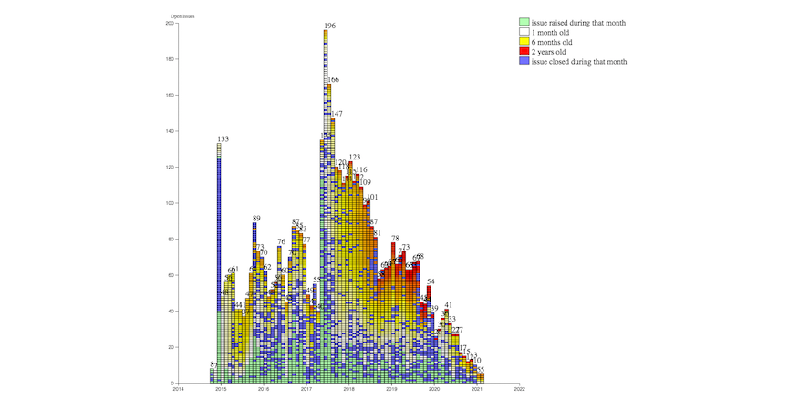

> 15 Jan\.: participation registration opens for the \#W3CWorkshop on Wide Color Gamut \(WCG\) and High Dynamic Range \(HDR\) for the Web   
> https://twitter\.com/w3c/status/1341743411871817728
> 🗓️ January@VirtualW3C: Happy new year 2021 🔆\! https://www\.w3\.org/participate/eventscal\.html

 [Jan 04 2021, 14:23:36 UTC](https://twitter.com/w3cdevs/status/1346099969682509832)

----

> 30 Jan\.: deadline to submit a proposal for a talk for the \#W3CWorkshop on WCG and HDR for the Web\. Do apply if you think you have a perspective worth sharing with the broader community\! See proposed topics: https://www\.w3\.org/Graphics/Color/Workshop/index\.html\#topics

 [Jan 04 2021, 14:23:37 UTC](https://twitter.com/w3cdevs/status/1346099973562257408)

----

> 28 Jan\.: @sabouzah keynotes at the 'Media for All 9' online conference on what \#accessibility means in the hybrid environment of Web and broadcast @UABBarcelona https://jornades\.uab\.cat/media4all9/content/keynote\-1

 [Jan 04 2021, 14:23:37 UTC](https://twitter.com/w3cdevs/status/1346099971431477248)

----

> Members of the @w3c Inclusion and Diversity Community Group \(IDCG\) are holding open office hours to chat with people from under\-represented groups who would like to know how to get involved in W3C, but do not know where to start \- see the volunteers list: https://w3c\.github\.io/idcg/office\-hours\.html https://twitter\.com/w3c/status/1346416032509030400

 [Jan 05 2021, 11:32:48 UTC](https://twitter.com/w3cdevs/status/1346419371799928834)

----

> The recently published @w3c AudioBooks \#WebStandard has been translated into Traditional Chinese: https://dpublishing\.github\.io/audiobooks\-specs\-tc/audiobooks\.html Thank you @taiwandigital\! https://twitter\.com/w3c/status/1346488241315311616
> Check also this translation into Traditional Chinese of a @w3cpublishing Note: https://dpublishing\.github\.io/audiobooks\-specs\-tc/lpf\.html  
> https://twitter\.com/w3c/status/1346654260151386116

 [Jan 05 2021, 16:32:13 UTC](https://twitter.com/w3cdevs/status/1346494724702662663)

----

> Congratulations to Amy Guy \(@digitalbazaar\), Sangwhan Moon @sangwhanmoon \(\#W3CInvitedExpert\), Theresa O'Connor @hober \(@Apple\), and Lea Verou @LeaVerou \(\#W3CInvitedExpert\) for their election to the @w3ctag\! https://twitter\.com/w3c/status/1347143773457969157
> This is the result of an election started last month: \.\./2020/2020\-12\-tweets\.html\#x1336266702548590593

 [Jan 07 2021, 11:38:55 UTC](https://twitter.com/w3cdevs/status/1347145688476487685)

----

> The recently started EPUB 3 \#WorkingGroup \(https://www\.w3\.org/groups/wg/epub\) is focusing on pushing \#ePub reading systems interoperability to the next level of robustness @w3cpublishing   
> https://twitter\.com/w3c/status/1294181314581725184 https://twitter\.com/w3c/status/1348910451413966849
> To learn more on the history of \#ePub and plans for the future, catch up with this presentation made during last \#w3cTPAC  
> https://youtu\.be/ILcY9DCs1i0

 [Jan 12 2021, 11:49:04 UTC](https://twitter.com/w3cdevs/status/1348960182739427328)

----

> Today's published \#FirstPublicWorkingDrafts are the first steps of EPUB 3\.3 towards standardization\. If you want to contribute to improving \#ePub interop, heads to the spec repo\! https://github\.com/w3c/epub\-specs/ \#timetogiveinput

 [Jan 12 2021, 11:49:06 UTC](https://twitter.com/w3cdevs/status/1348960189546962944)

----

> Since 1996, color on the Web has been locked into a narrow\-gamut, low dynamic\-range colorspace called sRGB\. A virtual \#W3CWorkshop is organized in April\-May 2021 to discuss the \#Web standardization: https://www\.w3\.org/Graphics/Color/Workshop/
> Content for the Web needs to be adaptable for different gamuts, different peak luminances, and a very wide range of viewing conditions\. @w3c invites browser vendors, content creators, color scientists, and other experts to submit a proposal for a talk   
> \.\./2021/2021\-01\-tweets\.html\#x1346099973562257408

 [Jan 12 2021, 15:42:52 UTC](https://twitter.com/w3cdevs/status/1349019020201230336)

----

> \.\.\. and CSS Color 5 which adds color mixing and color modification functions to \#CSS, using CIE LCH \(Luminance, Chroma, Hue\) as the primary model: https://drafts\.csswg\.org/css\-color\-5/

 [Jan 12 2021, 15:42:54 UTC](https://twitter.com/w3cdevs/status/1349019029088956424)

----

> Specifications are in the works @w3c such as \#CSS Color 4 which allows specifying colors in other colorspaces than sRGB: https://drafts\.csswg\.org/css\-color\-4/

 [Jan 12 2021, 15:42:54 UTC](https://twitter.com/w3cdevs/status/1349019026245242889)

----

> \.\.\. as explained by @LeaVerou in this nice article: https://lea\.verou\.me/2020/04/lch\-colors\-in\-css\-what\-why\-and\-how/

 [Jan 12 2021, 15:42:55 UTC](https://twitter.com/w3cdevs/status/1349019032364724224)

----

> To help understand what next steps are envisioned to enable Wide Color Gamut \#WCG and High Dynamic Range \#HDR on the \#OpenWebPlatform, read this note from the Color on the Web \#CommunityGroup: https://w3c\.github\.io/ColorWeb\-CG/

 [Jan 12 2021, 15:42:56 UTC](https://twitter.com/w3cdevs/status/1349019035510468613)

----

> \.\.\. and watch @svgeesus' presentation at last \#ICCDevCon 2020: "Color on the Web and Broadcast" \- https://youtu\.be/32LGlKwACfI

 [Jan 12 2021, 15:42:57 UTC](https://twitter.com/w3cdevs/status/1349019038899437572)

----

> \#Wikipedia20    
> Happy birthday\! https://twitter\.com/webfoundation/status/1350011964605415426

 [Jan 17 2021, 12:45:33 UTC](https://twitter.com/w3cdevs/status/1350786335867457542)

----

> The @w3c \#WebStandard "Publication Manifest" has been translated into Japanese: http://www\.asahi\-net\.or\.jp/\~ax2s\-kmtn/internet/publishing/REC\-pub\-manifest\-20201110\.html Thank you @omnidirect\! \#audiobooks \#html5j \#dotHTML5 \#w3c\_keio @w3cpublishing \#translation https://twitter\.com/omnidirect/status/1349683082262056961

 [Jan 18 2021, 09:06:15 UTC](https://twitter.com/w3cdevs/status/1351093534594576387)

----

> This new \#CSS \#FirstPublicWorkingDraft proposes new ways to manage style sheets: with cascade layers, authors can create layers to represent element defaults, 3rd\-party libraries, override styles, etc\. \#timetogiveinput https://twitter\.com/w3c/status/1351439536769933312

 [Jan 19 2021, 10:03:46 UTC](https://twitter.com/w3cdevs/status/1351470396147642368)

----

> \#MiniApps are small, install\-free, fast\-loading programs that run inside a larger native application or directly run in the operating system\. They leverage both Web technologies like \#CSS and \#JavaScript and the capabilities of native apps\. https://twitter\.com/w3c/status/1351539778857164801
> To enhance the interoperability between MiniApp platforms, the @w3c Chinese Web \#InterestGroup published a white paper that looks into the needs for standards in this space: https://w3c\.github\.io/miniapp/white\-paper/

 [Jan 19 2021, 15:07:35 UTC](https://twitter.com/w3cdevs/status/1351546856023724032)

----

> More details about the specifications that are going to be worked in this new MiniApps \#WorkingGroup can be found at https://www\.w3\.org/blog/2021/01/w3c\-launches\-the\-miniapps\-working\-group/

 [Jan 19 2021, 15:07:36 UTC](https://twitter.com/w3cdevs/status/1351546860935262213)

----

> Contributions, feedback, etc\. are welcome in the \#github repo https://github\.com/w3c/miniapp where one can find a FAQ https://github\.com/w3c/miniapp/blob/gh\-pages/docs/FAQ\.md

 [Jan 19 2021, 15:07:37 UTC](https://twitter.com/w3cdevs/status/1351546865817444356)

----

> \.\.\. along with a MiniApps standardization's presentation: https://youtu\.be/zNLCOPKou\_Y

 [Jan 19 2021, 15:07:37 UTC](https://twitter.com/w3cdevs/status/1351546864202559491)

----

> At last \#w3cTPAC, a session was dedicated to Web \#developers: "Learning from \#MiniApps": https://youtu\.be/6DT4yZL1GLQ

 [Jan 19 2021, 15:07:37 UTC](https://twitter.com/w3cdevs/status/1351546862537478144)

----

> Deadline is 30 Jan\.\! We invite browser vendors, content creators, color scientists, and experts in other relevant areas \(e\.g\. \#accessibility, \#scripting, \#security, \#web\) to submit a proposal for a talk\. https://www\.w3\.org/Graphics/Color/Workshop/  
> Learn more in thread ⤵️ \.\./2021/2021\-01\-tweets\.html\#x1349019020201230336

 [Jan 25 2021, 14:57:48 UTC](https://twitter.com/w3cdevs/status/1353718721081192448)

----

> More ♥ coming to Web documentation with @OpenWebDocs\! https://twitter\.com/OpenWebDocs/status/1353748877111918593
> \.@dontcallmeDOM will represent us there to contribute to how and where investments on Web Platform documentation is needed https://www\.w3\.org/blog/2021/01/welcome\-to\-open\-web\-docs/

 [Jan 25 2021, 17:03:06 UTC](https://twitter.com/w3cdevs/status/1353750253376331778)

----

> \.\.\. with thanks to former editors Adam Bergkvist, @standardsplay, @anantn, Bernard Aboba and Taylor Brandstetter, and the \#WebRTC \#WorkingGroup chairs: Stefan Håkansson, @alvestrand, Erik Lagerway, Bernard Aboba and @jibrewery
> Congrats to editors @cfluffy, Henrik Boström and @jibrewery for the newly published @w3c \#WebStandard "\#WebRTC 1\.0: Real\-Time Communication Between Browsers" https://www\.w3\.org/TR/webrtc/ \#timetoadopt https://twitter\.com/w3c/status/1354069347061399552 
> 
> 

 [Jan 26 2021, 14:23:47 UTC](https://twitter.com/w3cdevs/status/1354072548452036610)

----

> 1\) The \#WebRTC \#WorkingGroup has been chartered since 3554 days \(9 years 8 months 20 days\); 257 people participated in the group at one point or another\. The work happened over 57 teleconferences, 16 \#f2fmeetings, and 10114 emails\!   
> https://www\.w3\.org/groups/wg/webrtc

 [Jan 26 2021, 14:23:48 UTC](https://twitter.com/w3cdevs/status/1354072552063328256)

----

> A lot of efforts went into this major specification\. Here are a few figures to help understand the level of membership and community involvement:

 [Jan 26 2021, 14:23:48 UTC](https://twitter.com/w3cdevs/status/1354072550054232066)

----

> 3\) The spec itself is made of 55897 words, 622 lines of IDL, incl\. 20 interfaces, 37 dictionaries, 22 enums with 40 normative references to @ietf RFCs, each of which is a major achievement in terms of protocol standardization

 [Jan 26 2021, 14:23:49 UTC](https://twitter.com/w3cdevs/status/1354072557079683072)

----

> 2\) The \#GitHub repo was busy as well: with 44 contributors, there were 1282 merged pull requests, 4658 commits and 1320 resolved issues  
> https://github\.com/w3c/webrtc\-pc/    
> Check the evolution of spec issues for WebRTC 1\.0 at https://w3c\.github\.io/spec\-dashboard/issues\.html?groupdi\=47318&shortname\=webrtc 
> 
> 

 [Jan 26 2021, 14:23:49 UTC](https://twitter.com/w3cdevs/status/1354072554873479168)

----

> 4\) To ensure wide interop, the spec has also received lots of testing attention, with 149 test files covering 1789 test assertions developed by 61 contributors  
> https://github\.com/web\-platform\-tests/wpt/tree/master/webrtc/

 [Jan 26 2021, 14:23:50 UTC](https://twitter.com/w3cdevs/status/1354072558799360002)

----

> The @w3c \#WebStandard "\#RDFa Lite 1\.1 \- Second Edition" has been translated into Japanese:  http://www\.asahi\-net\.or\.jp/\~ax2s\-kmtn/internet/rdf/REC\-rdfa\-lite\-20150317\.html Thank you @omnidirect \! \#html5j \#dotHTML5 \#w3c\_keio \#translation https://twitter\.com/omnidirect/status/1354434178708692997

 [Jan 28 2021, 08:49:31 UTC](https://twitter.com/w3cdevs/status/1354713202823749638)

----

> 🆕 @dontcallmeDOM gives a \#WebRTC "tour" in this 🎬, introducing the spec's current impact on the \#Web &amp; the world, and future improvements: https://youtu\.be/PXhU4zvQDdM
> Find out how much effort went into the making of \#WebRTC \- impressive figures\!  
> \.\./2021/2021\-01\-tweets\.html\#x1354072552063328256

 [Jan 28 2021, 17:09:23 UTC](https://twitter.com/w3cdevs/status/1354838998540279811)