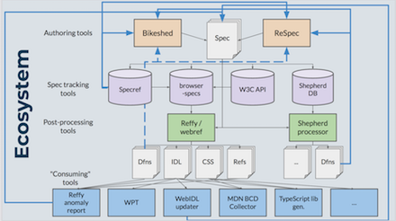
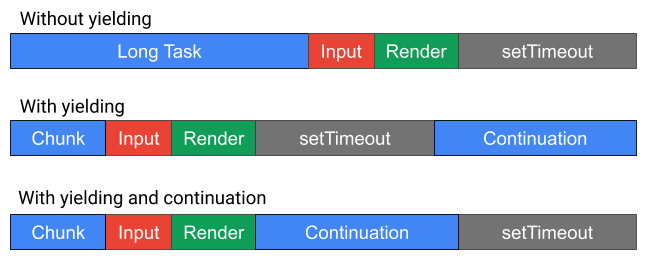
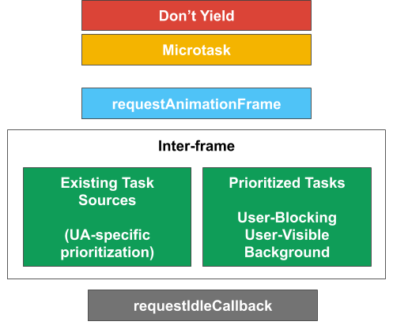

> One more week to propose a talk at the Wide Color Gamut \(WCG\) &amp; High Dynamic Range \(HDR\)  workshop https://www\.w3\.org/Graphics/Color/Workshop/ https://twitter\.com/svgeesus/status/1356261693240827907

 [Feb 01 2021, 15:39:51 UTC](https://twitter.com/w3cdevs/status/1356266019279556608)

----

> To learn more about our overall efforts toward bringing \#developers more into @w3c work at large, please watch:  
>  https://youtu\.be/sw\-j75MQtQU

 [Feb 03 2021, 08:14:08 UTC](https://twitter.com/w3cdevs/status/1356878623312084993)

----

> \#webdevs, @w3c needs your input and feedback\!   
> Find out why and how to get involved:  
> https://youtu\.be/sw\-j75MQtQU

 [Feb 03 2021, 15:50:05 UTC](https://twitter.com/w3cdevs/status/1356993369898176512)

----

> The @webi18n activity explores gaps in language support \(Adlam, Hebrew, German, French, N'Ko, Osage\) on the \#Web and in \#ebooks \#timetogiveinput \#i18n   
> These drafts complement the 21 Gap\-analysis docs published last June: https://www\.w3\.org/blog/International/2020/06/17/21\-gap\-analysis\-first\-public\-working\-drafts\-published/ https://twitter\.com/w3c/status/1357315734070841350
> We are looking for expert contributors to move this work forward by documenting gaps in support and creating tests\. For more info about the program: https://youtu\.be/mx2eDHujM4c

 [Feb 04 2021, 14:15:56 UTC](https://twitter.com/w3cdevs/status/1357332065042264064)

----

> \#WebRTC is “a great example of the power the Web has to make people’s lives better and of what we can do when we work together to do that” https://twitter\.com/mozhacks/status/1357653713981231106
> \.\./2021/2021\-01\-tweets\.html\#x1354838998540279811

 [Feb 08 2021, 13:37:31 UTC](https://twitter.com/w3cdevs/status/1358771947966971904)

----

> One of the workshop's outcomes is that a cross\-community \(@w3c, @opengeospatial, among others\) \#WorkingGroup will define a roadmap to make map viewers on the Web better: more usable, accessible, secure, private, global and performant \#i18n \#a11y \#security \#privacy \#data
> The report of the \#W3CWorkshop on "Maps for the Web" is out\! https://www\.w3\.org/2020/maps/report \#Maps4HTML https://twitter\.com/w3c/status/1358762893643243523

 [Feb 09 2021, 10:15:52 UTC](https://twitter.com/w3cdevs/status/1359083589103665152)

----

> Session videos, transcripts, and supporting material are available from: https://www\.w3\.org/2020/maps/agenda  
> With thanks to sponsor @NRCan\! \#MapML

 [Feb 09 2021, 10:15:53 UTC](https://twitter.com/w3cdevs/status/1359083592635277312)

----

> \#Maps for the Web enable the combination of \#geospatial information on the \#Web, across industries, devices, and new application areas such as virtual and augmented reality \#AR \#VR

 [Feb 09 2021, 10:15:53 UTC](https://twitter.com/w3cdevs/status/1359083590923993091)

----

> If you want to know more about the newly announced @OpenWebDocs read on the latest updated and mark your calendar for the Q&amp;A next Wednesday 📅 https://twitter\.com/robertnyman/status/1358702667153903618

 [Feb 10 2021, 14:36:55 UTC](https://twitter.com/w3cdevs/status/1359511670746472449)

----

> Congrats to editors @fantasai and @tabatkins for the newly published \#WebStandard "\#CSS Cascading and Inheritance Level 3" https://www\.w3\.org/TR/css\-cascade\-3/ \#timetoadopt https://twitter\.com/w3c/status/1359807190001942530
> Features such as 'all', 'initial' and 'unset' are now a proven standard and join the list of other specs incl\. "Selectors Level 3", "Fonts Level 3" and "Writing Modes Level 3" \- see the current state of \#CSS in the latest CSS Snapshot 2020 by the @csswg https://www\.w3\.org/TR/CSS/

 [Feb 11 2021, 10:58:51 UTC](https://twitter.com/w3cdevs/status/1359819182104272896)

----

> Specs defining browser \#APIs use a formal definition language \(\#WebIDL\) which helps with writing and implementing these APIs\. @tidoust, @dontcallmeDOM and @foolip are making it easier to re\-use these definitions through a newly released NPM package:  
> https://www\.npmjs\.com/package/@webref/idl 🎉🎇
> That NPM package collects \#WebIDL definitions from across all specifications identified as "\#browser specifications" in a \#github maintained registry: https://github\.com/w3c/browser\-specs

 [Feb 11 2021, 12:53:40 UTC](https://twitter.com/w3cdevs/status/1359848075444027398)

----

> Then, these specifications are crawled by reffy, a tool that ingest plenty of useful data: \#WebIDL definitions, but also \#CSS grammar definitions, list of terms defined in the specs, cross\-links, etc\. https://github\.com/w3c/reffy

 [Feb 11 2021, 12:53:41 UTC](https://twitter.com/w3cdevs/status/1359848079638355970)

----

> All of that data has been collected and made available in another \#github repo https://github\.com/w3c/webref/

 [Feb 11 2021, 12:53:42 UTC](https://twitter.com/w3cdevs/status/1359848081467006979)

----

> NPM packages the IDL pieces, with more packages \(e\.g\. for \#CSS definitions\) in the pipe 
> 
> 

 [Feb 11 2021, 12:53:43 UTC](https://twitter.com/w3cdevs/status/1359848088328941580)

----

> To learn more about these projects and how that data gets reused \(e\.g\. to document browser compat data in @MozDevNet\), watch the presentation given during \#w3cTPAC last October: https://youtu\.be/r9AXrFoFEg4 \(slides at https://www\.w3\.org/2020/Talks/TPAC/unconference/specmining\.pdf\)

 [Feb 11 2021, 12:53:44 UTC](https://twitter.com/w3cdevs/status/1359848090900004867)

----

> \#MathML is a markup format that enables mathematics to be served, received, and processed, on the Web and beyond\. https://developer\.mozilla\.org/en\-US/docs/Web/MathML
> This proposed charter would \(re\-\)create a Math Working Group to refresh the support of \#MathML in browsers https://w3c\.github\.io/charter\-drafts/math\-2020\.html https://twitter\.com/w3c/status/1359831321846153218

 [Feb 11 2021, 15:50:31 UTC](https://twitter.com/w3cdevs/status/1359892581723865088)

----

> Learn more on the motivation behind this work in the presentation @briankardell gave at \#w3cTPAC https://www\.youtube\.com/watch?v\=\-mBzpO5qXzU

 [Feb 11 2021, 15:50:32 UTC](https://twitter.com/w3cdevs/status/1359892585519730695)

----

> If approved, the group would build on the \#MathML core spec  https://mathml\-refresh\.github\.io/mathml\-core/  developed in the MathML Refresh Community Group https://www\.w3\.org/community/mathml4/ \- MathML Core focuses on the subset of MathML most suited for browser implementation

 [Feb 11 2021, 15:50:32 UTC](https://twitter.com/w3cdevs/status/1359892583460311040)

----

> 23 Feb\.: hybrid event in partnership with the Australia Western Region \#W3Chapter with \#w3c speakers @shawn\_slh @BillKasdorf and Joshue O’Connor \#a11y \#WCAG \#XR http://a11yperth\.com/events/pwac\-2021\.php https://twitter\.com/PerthA11yCamp/status/1361119214346461185

 [Feb 15 2021, 09:20:32 UTC](https://twitter.com/w3cdevs/status/1361243989547040768)

----

> Here comes our first \#WebPlatformEvolution sample: the @wicg\_ most recently took over 2 proposals initially started in the @webperfwg around improving support for more fine\-grained task scheduling to help with application responsiveness \#WebPerf: https://github\.com/WICG/scheduling\-apis

 [Feb 15 2021, 14:31:03 UTC](https://twitter.com/w3cdevs/status/1361322135860436992)

----

> To help keep track of this flurry of ideas, we're proposing to share info \_here\_ on these early proposals as they get adopted by these groups\.  
> Let us know with a ♥ if you think that's useful\!
> Prior to being taken up in @w3c formal standardization process, many future \#WebPlatform features start as ideas discussed in \#W3CCommunityGroups\. One of these, the Web Incubator @wicg\_ , is a notable hub for incubating  
> these proposals\. \#WebPlatformEvolution

 [Feb 15 2021, 14:31:03 UTC](https://twitter.com/w3cdevs/status/1361322133889114113)

----

> 1\) scheduler\.yield\(\) would allow to run higher\-priority tasks without yielding to same\-priority tasks, something not possible with current \#APIs and which tend to discourage script from yielding, leading to overall reduced responsiveness https://github\.com/WICG/scheduling\-apis/blob/master/YieldAndContinuation\.md 
> 
> 

 [Feb 15 2021, 14:31:04 UTC](https://twitter.com/w3cdevs/status/1361322139085864963)

----

> 2\) scheduler\.postTask\(\) would allow to classify tasks in the priority queue based on 3 levels: user\-blocking, user\-visible and background\. https://github\.com/WICG/scheduling\-apis/blob/master/PrioritizedPostTask\.md 
> 
> 

 [Feb 15 2021, 14:31:05 UTC](https://twitter.com/w3cdevs/status/1361322142483243009)

----

> Watch the presentation introducing these proposals to the @webperfwg back in June 2019 https://www\.youtube\.com/watch?v\=eyAW4FuSgyE&t\=14387

 [Feb 15 2021, 14:31:06 UTC](https://twitter.com/w3cdevs/status/1361322144676864002)

----

> \#ICYMI due to President's day, Family day, carnival day, … \.\./2021/2021\-02\-tweets\.html\#x1361322132077223936

 [Feb 16 2021, 17:39:50 UTC](https://twitter.com/w3cdevs/status/1361732029264576513)

----

> Today\! Live Q&amp;A webinar at 17:00 UTC\. More info at https://opencollective\.com/open\-web\-docs/updates/community\-q\-and\-a\-session\-join\-us \.\./2021/2021\-02\-tweets\.html\#x1359511670746472449

 [Feb 17 2021, 10:29:48 UTC](https://twitter.com/w3cdevs/status/1361986196872847360)

----

> Learn more on Living Standards à la @w3c in @plhw3org presentation from \#w3cTPAC https://www\.youtube\.com/watch?v\=RnnwbPm1ijo
> The Service Workers Working Group develops the … \#ServiceWorker specifications, the cornerstone of \#PWA \- this charter is also the first one where a group is set to use the eternal Candidate Recommendation mode of Living Standards à la W3C https://w3c\.github\.io/charter\-drafts/sw\-2020\.html https://twitter\.com/w3c/status/1362471283842310144

 [Feb 19 2021, 14:41:23 UTC](https://twitter.com/w3cdevs/status/1362774287418015747)