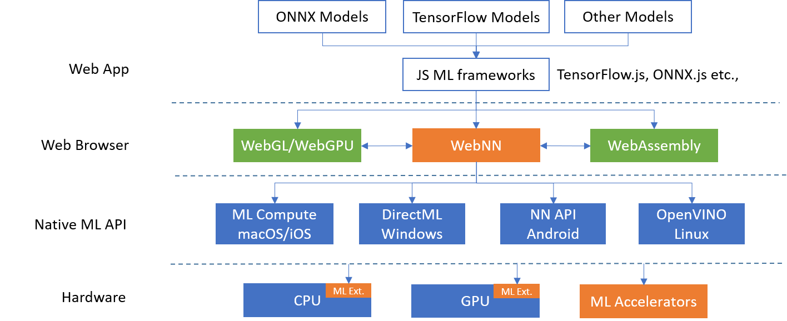

> 1\-5 Mar\.: the @W3C\_WoT groups organize a virtual \#plugfest where will be experimented new features of the "Thing Description", and more\. See agenda: https://github\.com/w3c/wot\-testing/blob/main/events/2021\.03\.Online/README\.md \#WoT \#IoT
> 🗓️ March@VirtualW3C: \#WoT group meetings and plugfest, \#a11y workshop, etc\. More at https://www\.w3\.org/participate/eventscal\.html

 [Mar 01 2021, 16:03:11 UTC](https://twitter.com/w3cdevs/status/1366418751143436290)

----

> 11 Mar\.: @dontcallmeDOM speaks about the role of \#w3c \#standardization and \#OpenSource: https://openforumeurope\.org/event/ofe\-lounge\-series\-standardisation\-and\-open\-source/ @OpenForumEurope

 [Mar 01 2021, 16:03:12 UTC](https://twitter.com/w3cdevs/status/1366418755169976324)

----

> 11 Mar\.: @sabouzah presents at an \#accessibility workshop @aaltouniversity: "Emerging Technologies: Opportunities and Challenges for People with Disabilities on the Web" https://www\.aalto\.fi/en/events/opportunities\-and\-challenges\-for\-people\-with\-disabilities\-on\-the\-web \#a11y

 [Mar 01 2021, 16:03:12 UTC](https://twitter.com/w3cdevs/status/1366418753089531906)

----

> 15\-25 Mar\.: online @W3C\_WoT meetings \- full agenda at: https://www\.w3\.org/WoT/IG/wiki/F2F\_meeting,\_March\_2021\#Agenda

 [Mar 01 2021, 16:03:13 UTC](https://twitter.com/w3cdevs/status/1366418756893872133)

----

> The charter for the Web \#MachineLearning Working Group is now officially under review by the @W3C Advisory Committee https://lists\.w3\.org/Archives/Public/public\-new\-work/2021Feb/0007\.html \.\./2020/2020\-11\-tweets\.html\#x1325817084161429504
> If the charter is approved, this new Working Group would focus on standardizing the Web Neural Network \(\#WebNN\) API, a set of low level computing primitives to run \#MachineLearning models efficiently in browsers \- https://github\.com/webmachinelearning/webnn/blob/master/explainer\.md 
> 
> 

 [Mar 03 2021, 15:03:39 UTC](https://twitter.com/w3cdevs/status/1367128543180783618)

----

> See also @NingxinHu's talk at the workshop last Summer introducing \#WebNN https://www\.youtube\.com/watch?v\=8vnQYOQSIMq

 [Mar 03 2021, 15:05:45 UTC](https://twitter.com/w3cdevs/status/1367129070144790536)

----

> 29 Mar\. \- 1 April: the \#w3c Web \#Payments \#WorkingGroup holds a series of meetings: https://github\.com/w3c/webpayments/wiki/Agenda\-FTF2021
> 24 Mar\.: @sabouzah presents global \#a11y standards for products and services @ITU's event "Accessible Europe" https://www\.itu\.int/en/ITU\-D/Regional\-Presence/Europe/Pages/Events/2020/AE21/

 [Mar 08 2021, 11:49:39 UTC](https://twitter.com/w3cdevs/status/1368891662706032641)

----

> Joining the existing packaged \#WebIDL extracted from web specs, please meet the just\-released packaged definitions of \#CSS properties and values https://www\.npmjs\.com/package/@webref/css \.\./2021/2021\-02\-tweets\.html\#x1359848075444027398

 [Mar 10 2021, 13:54:16 UTC](https://twitter.com/w3cdevs/status/1369647796035481601)

----

> The Web Payment Security Interest Group helps coordinate \#payment &amp; \#authentication related activities across @w3c @FIDOAlliance &amp; @emvco https://www\.w3\.org/securepay/charter\-202103\.html https://twitter\.com/w3c/status/1369498759374245892
> They developed the white paper on how the various technologies in this space from these 3 organizations relate one with another https://twitter\.com/w3c/status/1326529870206296064

 [Mar 11 2021, 14:50:27 UTC](https://twitter.com/w3cdevs/status/1370024325156204560)

----

> Watch @ibjacobs status updates on the W3C \#payments work https://youtu\.be/G2x12lmZ8aM

 [Mar 11 2021, 14:50:29 UTC](https://twitter.com/w3cdevs/status/1370024334245294093)

----

> And if you'd rather read than watch a video, the full transcript of the presentation with slides is also available https://www\.w3\.org/2020/Talks/ij\_payments\_202012/

 [Mar 11 2021, 14:50:30 UTC](https://twitter.com/w3cdevs/status/1370024336254410771)

----

> Recent status update \(\#December2020\!\) of \#w3c's Web \#Payments Activity in this nice 🎬:   
> https://youtu\.be/G2x12lmZ8aM

 [Mar 11 2021, 15:25:15 UTC](https://twitter.com/w3cdevs/status/1370033083123171328)

----

> 🆕 A calendaring tool is now available for the \#W3Community\. As work continues to move online, it is all the more important to help @w3c's international groups work well across \#TimeZones:  
> https://www\.w3\.org/blog/2021/03/group\-calendaring\-service\-enters\-beta\-test https://twitter\.com/w3c/status/1371783118009610241
> From now on, W3C public groups, chairs and team contacts can easily create, schedule and share their events/meetings via a \#calendar tab\. This was discussed at last \#w3cTPAC:  https://youtu\.be/LEYQ5UbEQj0

 [Mar 16 2021, 12:01:27 UTC](https://twitter.com/w3cdevs/status/1371793735550373888)

----

> The calendaring \#WebApp is expected to evolve with upcoming features listed at https://github\.com/w3c/calendar/issues?q\=is%3Aissue\+is%3Aopen\+label%3Afeature\-request

 [Mar 16 2021, 12:01:28 UTC](https://twitter.com/w3cdevs/status/1371793739354636288)

----

> This new service is in \#BetaTest for now\. Please use it and report feedback and/or issues in the \#GitHub repo:  https://github\.com/w3c/calendar 🙏

 [Mar 16 2021, 12:01:29 UTC](https://twitter.com/w3cdevs/status/1371793740910768128)

----

> The DIDs specifications have reached \#CandidateRecommendation \#timetoimplement https://twitter\.com/w3c/status/1372478182545317888
> DIDs are a key part of the self\-sovereign identity \#SSI vision as we described when the W3C Working Group started \.\./2018/2018\-11\-tweets\.html\#x1061972983831556097

 [Mar 18 2021, 10:00:32 UTC](https://twitter.com/w3cdevs/status/1372488080939233283)

----

> Watch Ivan Herman explain DIDs in a talk he gave in December https://www\.youtube\.com/watch?v\=t8lMCmjPKq4

 [Mar 18 2021, 10:00:34 UTC](https://twitter.com/w3cdevs/status/1372488086521778177)

----

> There is a wide list of identified topics, and many of them intersect with @w3c's agenda: \#accessibility, \#privacy, \#WebMachineLearning, \#i18n, \#OpenData, etc\. Read more: https://www\.standict\.eu/standicteu\-2023\-3rd\-open\-call\#
> Are you based in \#Europe and actively involved in @w3c \#WebStandards development? Do apply for funding this work before \#18May2021\! @DigitalEU \#standardization https://twitter\.com/Stand\_ICT/status/1372503982736875523

 [Mar 18 2021, 15:06:40 UTC](https://twitter.com/w3cdevs/status/1372565122774929409)

----

> Great news\! 🙏👏  
> \#webdevs, if you haven't done so, check what pain points and possible solutions were identified in the 2020 MDN browser compatibility report: https://mdn\-web\-dna\.s3\-us\-west\-2\.amazonaws\.com/MDN\-Browser\-Compatibility\-Report\-2020\.pdf https://twitter\.com/robertnyman/status/1374030991996682240

 [Mar 24 2021, 16:49:06 UTC](https://twitter.com/w3cdevs/status/1374765225547759616)

----

> See also how this fits in the general picture of \#WebPayments work in W3C \.\./2021/2021\-03\-tweets\.html\#x1370024334245294093
> Secure Payment Confirmation is a proposal to prevent fraud in on\-line payments while keeping as smooth a user experience as possible using authenticators \(e\.g\. on\-device fingerprint confirmation\) via \#WebAuthN \- and the experiment run by @stripe is showing impressive results\! https://twitter\.com/w3c/status/1375452083307024387

 [Mar 26 2021, 14:30:33 UTC](https://twitter.com/w3cdevs/status/1375455136227729417)