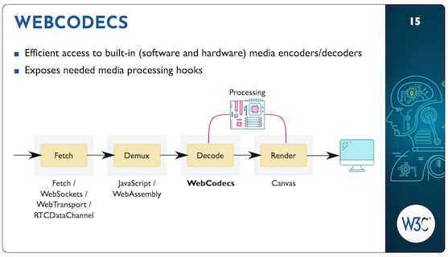

> April@VirtualW3C: group meetings, @thew3cx \#MOOC, upcoming workshops, etc\. More at https://www\.w3\.org/participate/eventscal\.html
> 8 Apr\.: first @w3c CJK \(Chinese/Japanese/Korean\) online meeting dedicated to the future of standardization effort on \#MiniApps\. Agenda incl\. timezones: https://www\.w3\.org/2021/03/miniapp\-cjk/agenda\.html

 [Apr 01 2021, 13:23:40 UTC](https://twitter.com/w3cdevs/status/1377612631943548929)

----

> 13 Apr\.: join a new session of @thew3cx \#HTML5 &amp; \#CSS Fundamentals \#MOOC to learn basics of front\-end Web development https://www\.edx\.org/course/html5\-and\-css\-fundamentals @edXOnline

 [Apr 01 2021, 13:23:42 UTC](https://twitter.com/w3cdevs/status/1377612638658699268)

----

> 26\-27 Apr\.: @w3c member\-only AC \(Advisory Committee\) meeting  that focus on plans to re\-create W3C and the relevance and vitality of W3C's work\.
> New dates for the Web &amp; Color workshop \= late May\-mid\-June\! https://www\.w3\.org/Graphics/Color/Workshop/

 [Apr 01 2021, 13:23:43 UTC](https://twitter.com/w3cdevs/status/1377612644635578371)

----

> 15 Apr\.\-15 May: W3C Workshop on Wide Color Gamut \#WCG and High Dynamic Range \#HDR  for the Web: https://www\.w3\.org/Graphics/Color/Workshop/ \-\- Read also the workshop's goals: \.\./2021/2021\-01\-tweets\.html\#x1349019020201230336

 [Apr 01 2021, 13:23:43 UTC](https://twitter.com/w3cdevs/status/1377612641468878854)

----

> 30 Apr\.: deadline to submit a proposal for a talk during the \#W3CWorkshop on Smart Cities: https://w3c\.github\.io/smartcities\-workshop/

 [Apr 01 2021, 13:23:44 UTC](https://twitter.com/w3cdevs/status/1377612647236001800)

----

> Speakers' presentations \(slides and videos\) are now available for the \#8April2021 \#MiniApps meeting: https://www\.w3\.org/2021/03/miniapp\-cjk/material\.html  
> \.\./2021/2021\-04\-tweets\.html\#x1377612634888007684
> Topics of discussion include \#MiniApps ecosystem, technical architecture, frameworks and new scenarios\.   
> Attendees are invited to ask questions in advance of the meeting: https://github\.com/w3c/miniapp/wiki/The\-1st\-CJK\-Meeting\-on\-MiniApps,\-2021\-04\-08

 [Apr 06 2021, 13:39:24 UTC](https://twitter.com/w3cdevs/status/1379428529872330755)

----

> For more background on the \#MiniApps, please read: \.\./2021/2021\-01\-tweets\.html\#x1351546856023724032
> See also the meeting agenda: https://www\.w3\.org/2021/03/miniapp\-cjk/agenda\.html

 [Apr 06 2021, 13:39:26 UTC](https://twitter.com/w3cdevs/status/1379428537153691651)

----

> \.\.\. and watch their latest videos: https://www\.youtube\.com/c/W3COfficial/search?query\=miniapps

 [Apr 06 2021, 13:39:27 UTC](https://twitter.com/w3cdevs/status/1379428541016633347)

----

> One of these enhancements has led to propose \#secure \#payment confirmation, as shown with this @stripe experiment: \.\./2021/2021\-03\-tweets\.html\#x1375455133828575233

 [Apr 08 2021, 11:18:12 UTC](https://twitter.com/w3cdevs/status/1380117772215185408)

----

> \#WebAuthn Level 2 is a series of fixes and improvements to the original Level 1 spec\. Discover features and enhancement brought in \#WebAuthn Level 2: https://developers\.yubico\.com/WebAuthn/Concepts/WebAuthn\_Level\_2\_Features\_and\_Enhancements\.html
> Congrats to editors Jeff Hodges \(@Google\), J\.C\. Jones \(@mozilla\), Michael B\. Jones \(@microsoft\), Akshay Kumar \(@microsoft\), Emil Lundberg \(@Yubico\) for the release of @w3c \#WebStandard "\#WebAuthn Level 2": https://www\.w3\.org/TR/webauthn\-2/ \#timetoadopt https://twitter\.com/w3c/status/1380068315146678272

 [Apr 08 2021, 11:18:12 UTC](https://twitter.com/w3cdevs/status/1380117770554253313)

----

> First draft of \#WebCodecs published\! Aimed at providing access to built\-in media encoders and decoders, it gives \#WebApps full control over the encoding and decoding of \#audio/\#video frames \#timetogiveinput https://twitter\.com/w3c/status/1380068318229508097
> This \#API lets \#WebDevelopers use media components already present in the \#browser\. Combined with streaming technologies \(\#RTCDataChannel, \#WebTransport\), \#WebCodecs could create a new paradigm for low\-latency media \#streaming 
> 
> 

 [Apr 08 2021, 12:02:12 UTC](https://twitter.com/w3cdevs/status/1380128843088998400)

----

> WebCodecs gives access to decoded media frame bytes before they are rendered, allowing for more efficient media processing workflows\! Find out more in this handy \#WebCodecs explainer: https://github\.com/w3c/webcodecs/blob/main/explainer\.md

 [Apr 08 2021, 12:02:15 UTC](https://twitter.com/w3cdevs/status/1380128856473006081)

----

> Web \#games is an application domain example for \#WebCodecs combined with \#WebTransport, as presented in this 🎬: https://youtu\.be/VD5GBLBiSxo

 [Apr 08 2021, 12:02:15 UTC](https://twitter.com/w3cdevs/status/1380128854266744838)

----

> Feedback and comments on this specification are welcome\. Please use \#GitHub issues: https://github\.com/w3c/webcodecs/issues

 [Apr 08 2021, 12:02:16 UTC](https://twitter.com/w3cdevs/status/1380128858482094087)

----

> 15 Apr\. \(today\!\): interesting \#Games \#CommunityGroup discussion and presentations about the \#WebCodecs specification and its possible use in \#GameEngine https://www\.w3\.org/events/meetings/16ed2257\-66e1\-459e\-afe5\-fb1eb3a9c474

 [Apr 15 2021, 09:15:29 UTC](https://twitter.com/w3cdevs/status/1382623604651790336)

----

> Identified use cases include better \#VideoConferencing to \#accessibility\-improving features, and early implementations demonstrate tremendous power and \#performance improvements taking advantage of hardware acceleration\.
> As an outcome of last year's \#W3CWorkshop \(https://www\.w3\.org/2020/06/machine\-learning\-workshop/report\.html\), this new \#WorkingGroup aims to standardize the Web Neural Network \#API for \#MachineLearning inference in the \#browser https://twitter\.com/w3c/status/1384506482599899136

 [Apr 20 2021, 14:08:42 UTC](https://twitter.com/w3cdevs/status/1384509334164414466)

----

> Read the history, motivations, inspirations, etc\. that led to the group's creation:  https://www\.w3\.org/blog/2021/04/w3c\-launches\-the\-web\-machine\-learning\-working\-group/ cc @anssik, @NingxinHu, Chai Chaoweeraprasit, Ping Yu and @dontcallmeDOM

 [Apr 20 2021, 14:08:43 UTC](https://twitter.com/w3cdevs/status/1384509337758932998)

----

> The @w3c Web \#MachineLearning group welcomes new participants to help identify new use cases, document ethical risks and their mitigations, contribute to technical work, conduct wide reviews in \#privacy, \#security, \#accessibility, etc\.

 [Apr 20 2021, 14:08:43 UTC](https://twitter.com/w3cdevs/status/1384509335955394570)

----

> The recorded 🎬 presentations \(5\) are now available, with subtitles in Chinese, English, Korean and Japanese\. The \#MiniApps meeting covered these topics: ecosystem, technical architecture, frameworks and new scenarios\. https://twitter\.com/w3c/status/1384065485231198216
> "Evolution of Quickapp" by Yongqing Dong \(Xiaomi\) \- \(slides: https://www\.w3\.org/2021/03/miniapp\-cjk/slides/quickapp\-xiaomi\.pdf\) \- https://youtu\.be/Apy9C7\_req4

 [Apr 21 2021, 12:37:26 UTC](https://twitter.com/w3cdevs/status/1384848754193453063)

----

> "\#MiniApp Runtime Architecture and Alliance Development Experience" by Tengyuan Zhang \(Baidu\) \- \(slides: https://www\.w3\.org/2021/03/miniapp\-cjk/slides/tengyuan\.pdf\) \- https://youtu\.be/9i4d2x\-cdi8

 [Apr 21 2021, 12:37:27 UTC](https://twitter.com/w3cdevs/status/1384848758387662848)

----

> "Design of the \#MiniApp Cross\-Platform Technical Standards", by Xiongwei Hu \(JD\) \- \(slides: https://www\.w3\.org/2021/03/miniapp\-cjk/slides/standard\-design\-jd\.pdf\) \- https://youtu\.be/xbFfqBSvqug

 [Apr 21 2021, 12:37:28 UTC](https://twitter.com/w3cdevs/status/1384848762179399681)

----

> "Looking at the \#MiniApps Specifications from the Perspective of the Taro Cross\-Platform Framework", by Jiajian Chen \(JD Aotu Lab\) \- \(slides: https://www\.w3\.org/2021/03/miniapp\-cjk/slides/taro\.pdf\) \- https://youtu\.be/KiQEuTosysI

 [Apr 21 2021, 12:37:28 UTC](https://twitter.com/w3cdevs/status/1384848760279273473)

----

> "\#MiniApps for Vehicle", by Qing An \(Alibaba\) \- \(slides: https://www\.w3\.org/2021/03/miniapp\-cjk/slides/MiniApps\-for\-Vehicle\.pptx\) \- https://youtu\.be/kryuTc7CD\-Q

 [Apr 21 2021, 12:37:29 UTC](https://twitter.com/w3cdevs/status/1384848764121276418)

----

> “The web has become a key technical infrastructure for the global society\.  If there was ever a question about the mission of @w3c to build a web that works for all of humanity – the last 14 months have brought our calling into absolute clarity\.” https://twitter\.com/w3c/status/1388047776987107328

 [Apr 30 2021, 12:23:59 UTC](https://twitter.com/w3cdevs/status/1388106860121710592)