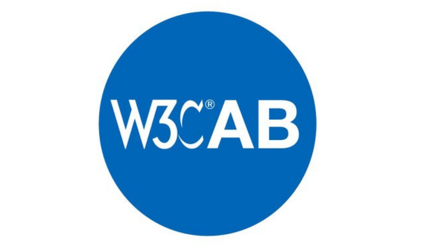
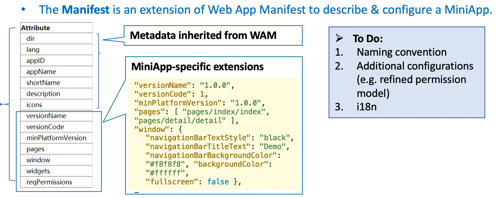
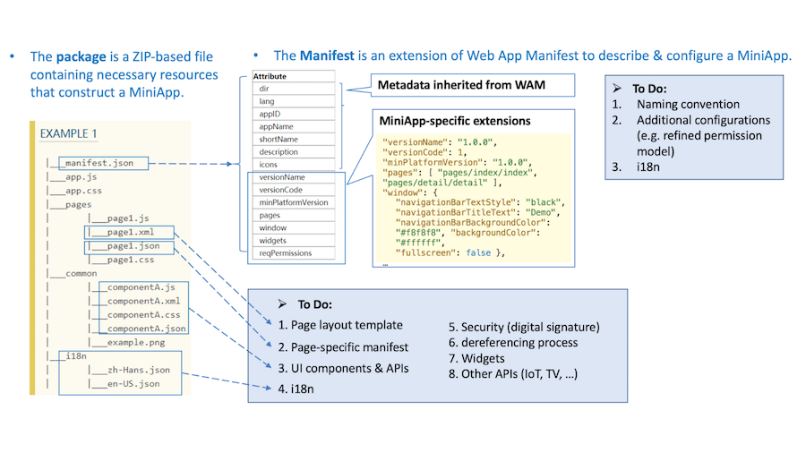

> May@VirtualW3C: @thew3cx \#MOOC, \#W3CWorkshop, etc\. More at https://www\.w3\.org/participate/eventscal\.html
> 18 May: opening of a new \#MOOC session of @thew3cx "CSS Basics"\! Learn how to style your Web site for a professional look and feel with \#CSS\.   
> https://www\.edx\.org/course/css\-basics @edXonline

 [May 03 2021, 12:06:10 UTC](https://twitter.com/w3cdevs/status/1389189539131011078)

----

> 18 May: @sabouzah co\-presents "\#WCAG 2\.2’s new test rules" at \#AccessU2021: https://knowbility\.org/programs/accessu\-2021/a\-deep\-dive\-into\-wcag\-2\-2\-s\-new\-test\-rules \#a11y \#accessibility

 [May 03 2021, 12:06:11 UTC](https://twitter.com/w3cdevs/status/1389189543065161728)

----

> Late May\-10 June: @w3c workshop on Wide Color Gamut \#WCG and High Dynamic Range \#HDR for the Web: https://www\.w3\.org/Graphics/Color/Workshop/

 [May 03 2021, 12:06:12 UTC](https://twitter.com/w3cdevs/status/1389189545032290305)

----

> The WebTransport Working Group delivers its first public working draft of its under\-development API for low\-latency data streams https://twitter\.com/w3c/status/1389549428147638273
> The group was launched in September 2020, following discussions emerging in the \#WebRTC Working Group \.\./2020/2020\-09\-tweets\.html\#x1303726542271508483

 [May 04 2021, 12:33:52 UTC](https://twitter.com/w3cdevs/status/1389558898525343745)

----

> As usual, the API is being developed in the open in a dedicated github repository https://github\.com/w3c/webtransport/

 [May 04 2021, 12:33:53 UTC](https://twitter.com/w3cdevs/status/1389558902623178753)

----

> The 7 candidates are: Heejin Chung \(@Samsung\), @JoelMarcey \(@Facebook\), Avneesh Singh \(@accessibledaisy\), Eric Siow \(@intel\), @LeonieWatson \(@TetraLogical\), @cwilso \(@Google\) and Hongru \(Judy\) Zhu \(@AlibabaGroup\)\.
> This year's @W3CAB election is starting, with 7 candidates for 6 seats\. https://twitter\.com/w3c/status/1389564689936486403

 [May 04 2021, 16:02:51 UTC](https://twitter.com/w3cdevs/status/1389611491511488519)

----

> They all have published their nomination statements at: https://www\.w3\.org/2021/05/04\-ab\-nominations\.html 
> 
> 

 [May 04 2021, 16:02:52 UTC](https://twitter.com/w3cdevs/status/1389611494090977283)

----

> 6 May: @sabouzah presents "A common ground for \#accessibility interpretation – Certification as award criteria or obligation?" @IAAPOrg https://www\.accessibilityassociation\.org/content\.asp?admin\=Y&contentid\=788

 [May 04 2021, 16:14:48 UTC](https://twitter.com/w3cdevs/status/1389614495367061510)

----

> The 🎬 that were recorded during the @w3c \#Games \#CommunityGroup meeting are now available along with transcripts\! https://www\.w3\.org/events/meetings/16ed2257\-66e1\-459e\-afe5\-fb1eb3a9c474 cc @tidoust
> Anthony Bowker \(@unity3d\) on "Unity for the Web": https://www\.w3\.org/2021/05/gamescg/unity\.html  
> https://youtu\.be/D5Wy3Nea4D4

 [May 05 2021, 12:05:38 UTC](https://twitter.com/w3cdevs/status/1389914181932048385)

----

> Chris Cunningham \(@Google\), Bernard Aboba \(@Microsoft\), and @padenot \(@mozilla\) on "\#WebCodecs": https://www\.w3\.org/2021/05/gamescg/webcodecs\.html  
> https://youtu\.be/rlIvv62sVqg

 [May 05 2021, 12:05:39 UTC](https://twitter.com/w3cdevs/status/1389914185266614273)

----

> 12 May: @dontcallmeDOM presents \#WebRTC @TADSummit \#Asia: https://blog\.tadsummit\.com/2021/02/16/tadsummit\-asia\-2021\-agenda/\#DH  
> https://twitter\.com/Alan\_Quayle/status/1387860489036865541

 [May 05 2021, 14:48:26 UTC](https://twitter.com/w3cdevs/status/1389955151864160259)

----

> A \#MiniApp manifest defines a \#JSON\-based profile that includes configuration info necessary for application development, release, installation, running, etc\. https://www\.w3\.org/TR/miniapp\-manifest/ \#timetogiveinput https://twitter\.com/w3c/status/1391999335198609409 
> 
> 
> Read the spec\.'s explainer  
> https://github\.com/w3c/miniapp\-manifest/blob/main/docs/explainer\.md and  
> listen to last Summer's presentation "\#MiniApp manifest and packaging":  
> https://youtu\.be/8TERdAXo\-eQ

 [May 11 2021, 11:24:59 UTC](https://twitter.com/w3cdevs/status/1392078278542954499)

----

> \#MiniApps are small, install\-free, fast\-loading programs that run inside a larger native application or directly run in the operating system\. They leverage both Web technologies like \#CSS and \#JavaScript and the capabilities of native apps\.

 [May 11 2021, 11:25:00 UTC](https://twitter.com/w3cdevs/status/1392078283425071114)

----

> This is the first publication from the recently launched MiniApps Working Group \.\./2021/2021\-01\-tweets\.html\#x1351546860935262213

 [May 11 2021, 11:25:01 UTC](https://twitter.com/w3cdevs/status/1392078286583472131)

----

> Feedback and comments are welcome on the related \#GitHub repo:  
> https://github\.com/w3c/miniapp\-manifest/

 [May 11 2021, 11:25:01 UTC](https://twitter.com/w3cdevs/status/1392078284876304385)

----

> Hear from @dontcallmeDOM  on how \#WebRTC evolution is shaping the future of \#ProgrammableCommunications as part of the @TADSummit talks https://twitter\.com/Alan\_Quayle/status/1392278456076021760

 [May 12 2021, 11:55:11 UTC](https://twitter.com/w3cdevs/status/1392448264436387842)

----

> A \#MiniApp manifest defines a \#JSON\-based profile that includes configuration info necessary for miniapp development, release, installation, running, etc\. https://www\.w3\.org/TR/miniapp\-manifest/ \#timetogiveinput https://twitter\.com/w3c/status/1391999335198609409 
> 
> 
> This is the first publication from the recently launched @w3c \#MiniApps \#WorkingGroup \.\./2021/2021\-01\-tweets\.html\#x1351546860935262213

 [May 14 2021, 08:37:31 UTC](https://twitter.com/w3cdevs/status/1393123298150649860)

----

> Feedback and comments are welcome on the related \#GitHub repo: https://github\.com/w3c/miniapp\-manifest/

 [May 14 2021, 08:37:33 UTC](https://twitter.com/w3cdevs/status/1393123306237218824)

----

> \#MiniApps are small, install\-free, fast\-loading programs that run inside a larger native application or directly run in the operating system\. They leverage both Web technologies like \#CSS and \#JavaScript and the capabilities of native apps\.

 [May 14 2021, 08:37:33 UTC](https://twitter.com/w3cdevs/status/1393123304618266631)

----

> Read the spec\.'s explainer https://github\.com/w3c/miniapp\-manifest/blob/main/docs/explainer\.md and listen to last year's presentation "\#MiniApps manifest and packaging": https://youtu\.be/8TERdAXo\-eQ

 [May 14 2021, 08:37:33 UTC](https://twitter.com/w3cdevs/status/1393123303037018113)

----

> Better and faster\! \#WebGPU takes \#WebGL to the next level, providing a common abstraction over Vulkan, Metal and DirectX to leverage modern GPUs capabilities\. 2D/3D rendering, general computing using the GPU \(AI/ML, media processing, …\) Soon in a nearby browser\! \#timetogiveinput https://twitter\.com/w3c/status/1394554930703253505
> \#WGSL \(WebGPU Shading Language\) lets developers write shaders for draw commands in the render pipeline and dispatch commands in the compute pipeline exposed by WebGPU\. This textual shading language is web\-friendly &amp; directly mappable to @thekhronosgroup 's SPIR\-V binary language\.

 [May 18 2021, 12:45:10 UTC](https://twitter.com/w3cdevs/status/1394635172247703552)

----

> The work on these specs is happening \- as usual \- on github https://github\.com/gpuweb

 [May 18 2021, 12:45:11 UTC](https://twitter.com/w3cdevs/status/1394635175930257411)