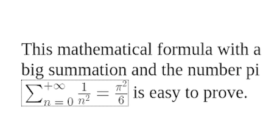
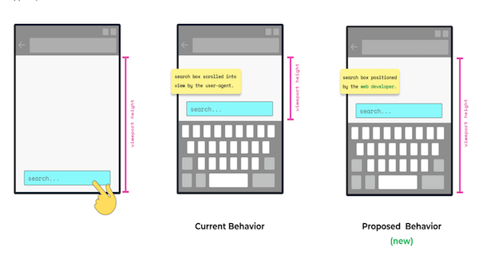
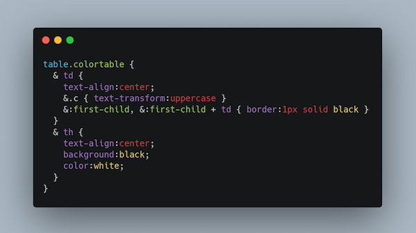

> The @w3c \#WebStandard \#MathML \(v3, 2nd edition\) has been translated into \#Japanese: http://takamu\.sakura\.ne\.jp/mathml3\-ja/index\.html Thank you @y\_takamu\! \#html5j \#dotHTML5 \#w3c\_keio \#translation https://twitter\.com/y\_takamu/status/1412064534093721607

 [Aug 10 2021, 08:11:11 UTC](https://twitter.com/w3cdevs/status/1425006801733435393)

----

> The @w3c \#WebStandard "\#JSON\_LD 1\.1 Framing" has been translated into \#Japanese: https://www\.asahi\-net\.or\.jp/\~ax2s\-kmtn/internet/lod/REC\-json\-ld11\-framing\-20200716\.html Thank you @omnidirect \! \#html5j \#dotHTML5 \#w3c\_keio \#translation

 [Aug 10 2021, 08:20:44 UTC](https://twitter.com/w3cdevs/status/1425009204595679261)

----

> The @w3c \#WebStandards "\#WAI\_ARIA Graphics Module" has been translated into \#Japanese: https://momdo\.github\.io/graphics\-aria\-1\.0/ Thank you @momdo\_\! \#html5j \#dotHTML5 \#w3c\_keio \#translation https://twitter\.com/w3c/status/1425668597561573376

 [Aug 12 2021, 11:38:14 UTC](https://twitter.com/w3cdevs/status/1425783685161406471)

----

> The @w3c \#WebStandard "Accessible Name and Description Computation 1\.1" has been translated into \#Japanese: https://momdo\.github\.io/accname\-1\.1/ Thank you @momdo\_\! \#html5j \#dotHTML5 \#w3c\_keio \#a11y \#translation https://twitter\.com/w3c/status/1425668599910387715

 [Aug 12 2021, 11:40:46 UTC](https://twitter.com/w3cdevs/status/1425784318849396738)

----

> Another \#translation into \#Japanese: the @w3c  
>  \#WebStandard "Accessibility Conformance Testing \(ACT\) Rules Format 1\.0": https://momdo\.github\.io/act\-rules\-format\-1\.0/ Thank you again @momdo\_ \! \#a11y \#html5j \#dotHTML5 \#w3c\_keio \#translation https://twitter\.com/w3c/status/1425668593916776449

 [Aug 12 2021, 11:43:25 UTC](https://twitter.com/w3cdevs/status/1425784989447331844)

----

> 🆕\! @w3c and @smpteconnect organize a joint workshop on professional \#media production on the \#Web, 9\-18 Nov\. 2021 https://www\.w3\.org/2021/03/media\-production\-workshop/ https://twitter\.com/w3c/status/1429722134629306372
> This workshop is scoped to the professional media production communities using the \#WebPlatform, incl\. \#editing, quality control, grading/color correction, \#dailies, \#VisualEffects, \#sound, \#mastering, translation and servicing: https://www\.w3\.org/2021/03/media\-production\-workshop/

 [Aug 23 2021, 14:42:06 UTC](https://twitter.com/w3cdevs/status/1429816222892318726)

----

> Other media\-related specifications include Media Session to integrate web \#playback experiences with notification areas, or \#WebCodecs to expose low\-level knobs to audio/video encoding/decoding

 [Aug 23 2021, 14:42:08 UTC](https://twitter.com/w3cdevs/status/1429816231515861000)

----

> Existing standardized Web technologies for media streaming are MS/EM extensions, \#WebRTC for live streaming, \#WebAudio \#API for processing and synthesizing audio, and also \#WebAssembly used to ship efficient processing code in situations where \#browsers don't offer native support

 [Aug 23 2021, 14:42:08 UTC](https://twitter.com/w3cdevs/status/1429816229188063246)

----

> Interested parties are invited to submit a talk before 15 October 2021: https://www\.w3\.org/2021/03/media\-production\-workshop/speakers\.html

 [Aug 23 2021, 14:42:09 UTC](https://twitter.com/w3cdevs/status/1429816233768144902)

----

> The workshop's attendance is free for all invited participants, and is open to the public, whether or not @W3C/@smpteconnect members

 [Aug 23 2021, 14:42:10 UTC](https://twitter.com/w3cdevs/status/1429816236163096578)

----

> \#MathML is a markup language for mathematical and scientific content on the Web and beyond\. The Math \#WorkingGroup charter was approved last April \.\./2021/2021\-02\-tweets\.html\#x1359892579148513280
> This document defines a core subset of \#MathML that can be reliably displayed in Web \#browsers\. It provides efficient, native and interoperable rendering of mathematical notations for authors and users \#timetogiveinput https://www\.w3\.org/TR/2021/WD\-mathml\-core\-20210816/ https://twitter\.com/w3c/status/1425014028674424864

 [Aug 23 2021, 16:13:21 UTC](https://twitter.com/w3cdevs/status/1429839186278981647)

----

> \#MathML Core builds on MathML3 and focuses on visual rendering\. It defines its integration in the modern Web Platform wrt \#HTML and \#SVG, \#CSS styling, DOM, \#JavaScript, etc\. Read more in the explainer: https://github\.com/w3c/mathml\-core/blob/main/docs/explainer\.md

 [Aug 23 2021, 16:13:22 UTC](https://twitter.com/w3cdevs/status/1429839188627759106)

----

> The \#MathML \#WorkingGroup is one of the oldest @w3c Working Groups\. The need for mathematical rendering on the Web was evident from the earliest days of the Web at \#CERN \(1989\) 
> 
> 

 [Aug 23 2021, 16:13:23 UTC](https://twitter.com/w3cdevs/status/1429839193992310789)

----

> For \#MathML Core, feedback is welcome on \#GitHub\! Please file your issue\(s\) there: https://github\.com/w3c/mathml\-core/issues/

 [Aug 23 2021, 16:13:24 UTC](https://twitter.com/w3cdevs/status/1429839195950944256)

----

> Virtual keyboards are used when hardware keyboards aren't an option \(e\.g\. on smartphones\) \- a critical aspect of making them usable is to ensure the editable area remains visible when the keyboard scrolls the active view
> This is the first document published by the Web Editing \#WorkingGroup https://www\.w3\.org/TR/2021/WD\-virtual\-keyboard\-20210824/ \#timetogiveinput https://twitter\.com/w3c/status/1430101104646369283

 [Aug 30 2021, 14:23:16 UTC](https://twitter.com/w3cdevs/status/1432348198245392385)

----

> Current and proposed behaviors are shown below for virtual keyboard on single\-touch screen device: 
> 
> 

 [Aug 30 2021, 14:23:17 UTC](https://twitter.com/w3cdevs/status/1432348202666168321)

----

> This VirtualKeyboard \#API helps \#developers enable better customization of their Web page's content and experiences via \#CSS and \#JavaScript when a virtual keyboard is in use

 [Aug 30 2021, 14:23:17 UTC](https://twitter.com/w3cdevs/status/1432348199956647936)

----

> Learn more about the @w3c Web Editing \#WorkingGroup, one of the most recent additions to our roster \.\./2021/2021\-06\-tweets\.html\#x1407671176416174082

 [Aug 30 2021, 14:23:18 UTC](https://twitter.com/w3cdevs/status/1432348206462029830)

----

> Find more details in the explainer https://github\.com/MicrosoftEdge/MSEdgeExplainers/blob/main/VirtualKeyboardAPI/explainer\.md  
> and file issues and/or comments on \#GitHub at https://github\.com/w3c/virtual\-keyboard/issues/

 [Aug 30 2021, 14:23:18 UTC](https://twitter.com/w3cdevs/status/1432348204687839233)

----

> And if you want to understand more of the history behind this work, watch some of the early discussions on this proposal shared last year during \#w3cTPAC \.\./2020/2020\-11\-tweets\.html\#x1331278157589188608

 [Aug 30 2021, 14:23:19 UTC](https://twitter.com/w3cdevs/status/1432348208496357380)

----

> \#CSS Nesting aims to give advanced users new ways to group and shorten style rules\. It implements natively some of the features provided by preprocessors like \#SASS or LESS \#timetogiveinput https://twitter\.com/w3c/status/1432624166205857793
> Besides removing duplication, the grouping of related rules improves the readability and maintainability of the resulting \#CSS\. The specification defines a new selector, the "nesting selector", written as an ASCII ampersand "&amp;" 
> 
> 

 [Aug 31 2021, 09:06:26 UTC](https://twitter.com/w3cdevs/status/1432630850768801797)

----

> Please send feedback by filing \#GitHub issues, incl\. \[css nesting\] in the title: https://github\.com/w3c/csswg\-drafts/issues

 [Aug 31 2021, 09:06:28 UTC](https://twitter.com/w3cdevs/status/1432630858209447941)

----

> The @ImmersiveWebW3C is releasing 3 first public Working Drafts today to enrich the augmented reality \#AR capabilities of \#WebXR \#timetogiveinput https://twitter\.com/w3c/status/1432624172384100359
> 1️⃣ Depth Sensing provides a depth \#map from the camera feed to integrate realistically \#virtual objects into the real\-world environment, e\.g\. to manage their collisions\. Watch @AdaRoseCannon demo and explanation of the Depth Sensing https://youtu\.be/Vxp\_qDyrj3k

 [Aug 31 2021, 13:07:49 UTC](https://twitter.com/w3cdevs/status/1432691596659675137)

----

> \.\.\. bring feedback and monitor progress on the Depth Sensing spec\. in its \#GitHub repo: https://github\.com/immersive\-web/depth\-sensing/

 [Aug 31 2021, 13:07:50 UTC](https://twitter.com/w3cdevs/status/1432691601818718208)

----

> Bring feedback and monitor progress on the DOM Overlays spec in its \#GitHub repo: https://github\.com/immersive\-web/dom\-overlays

 [Aug 31 2021, 13:07:51 UTC](https://twitter.com/w3cdevs/status/1432691606491209735)

----

> 2️⃣ DOM Overlays allows to reuse \#HTML &amp; \#CSS to overlay interactive content on top an \#AR view, e\.g\. to build a user interface\. Watch @AdaRoseCannon demo and explanation of the DOM Overlays \#API https://youtu\.be/iQDDa549TN8

 [Aug 31 2021, 13:07:51 UTC](https://twitter.com/w3cdevs/status/1432691604146593792)

----

> \.\.\. and bring feedback and monitor progress on the \#WebXR Hit Test spec in its \#GitHub repo:  https://github\.com/immersive\-web/hit\-test

 [Aug 31 2021, 13:07:52 UTC](https://twitter.com/w3cdevs/status/1432691611142705153)

----

> 3️⃣ \#WebXR Hit Test allows to use \#raycasting in \#AR to determine where and how to position virtual objects in the real world\. Watch @AdaRoseCannon demo and explanation of the \#WebXR Hit Test: https://youtu\.be/Zz6\_b2PNtTI

 [Aug 31 2021, 13:07:52 UTC](https://twitter.com/w3cdevs/status/1432691608768679938)

----

> To discover more of the many features @ImmersiveWebW3C is bringing to \#WebXR, watch @AdaRoseCannon's full talk "WebXR: What you can do today &amp; what's coming tomorrow"   
> https://youtu\.be/t\-uk8InHte4

 [Aug 31 2021, 13:07:53 UTC](https://twitter.com/w3cdevs/status/1432691613982248962)

----

> Secure Payment Confirmation combines built\-in browser payment primitives with Web Authentication \#WebAuthn  to enable 2\-factor confirmation of on\-line payments, as an alternative to e\.g\. SMS\-based validation https://twitter\.com/w3c/status/1432626596490383364
> This builds on a successful experiment run earlier this year showing good results in terms of improved UX \.\./2021/2021\-03\-tweets\.html\#x1375455133828575233

 [Aug 31 2021, 17:28:40 UTC](https://twitter.com/w3cdevs/status/1432757243863252994)

----

> The Secure Payment Confirmation work happens on github \- bring your input and feedback there \#timetogiveinput https://github\.com/w3c/secure\-payment\-confirmation/

 [Aug 31 2021, 17:28:42 UTC](https://twitter.com/w3cdevs/status/1432757250226012162)