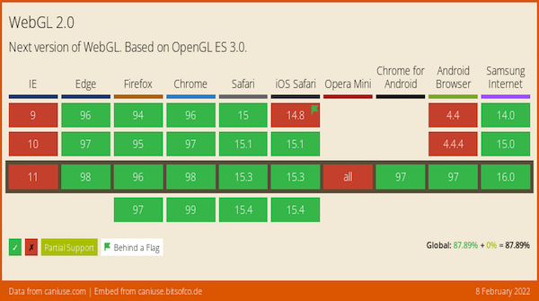
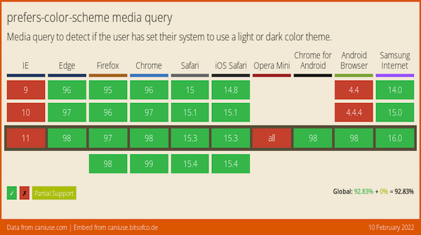
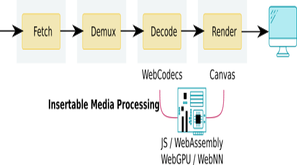

> February@w3c: W3C Chapter events \#a11y, W3C\+Dev Track@WebConf, etc\. https://www\.w3\.org/participate/eventscal\.html
> 10 Feb\.: New deadline to submit your work to the Web \#developer and \#W3C track @TheWebConf\. Read the \#CfP: https://www2022\.thewebconf\.org/cfp/web\-dev\-w3c/

 [Feb 02 2022, 16:07:18 UTC](https://twitter.com/w3cdevs/status/1488906884987957251)

----

> 22 Feb\.: In conjunction with @PerthA11yCamp, the Australia Western Region \#W3Chapter organizes the \#Perth Web \#Accessibility Camp \[in person and virtual\] w/ speakers @jspellman, Judy Brewer and @BluesChick5 \#PWAC2022 \#a11y 🇦🇺  
> https://chapters\.w3\.org/australia\-western/event/perth\-web\-accessibility\-camp/

 [Feb 02 2022, 16:07:19 UTC](https://twitter.com/w3cdevs/status/1488906889459023873)

----

> Hear the story and what the future holds for \#AudioBooks\! @wendy\_a\_reid, co\-chair of @w3cpublishing, presents "W3C AudioBooks: building the new iteration of audiobooks"   
> https://youtu\.be/wqnSLnYfiXg
> This presentation was given at the 1st edition of @AUDIOLIVEMTP: https://audio\-live\.fr/intervention\-wendy\-reid/

 [Feb 04 2022, 13:08:44 UTC](https://twitter.com/w3cdevs/status/1489586722379907077)

----

> The story begins in 1877 with the invention of the phonograph, and continues through the computer age of the 1990s, with devices getting smaller and smaller, storage sizes increasing dramatically, and data connections becoming more readily available\.

 [Feb 04 2022, 13:08:46 UTC](https://twitter.com/w3cdevs/status/1489586731909328897)

----

> With constant technological developments, new trends are arising: computer\-generated narration, \#AI, integrated supplemental content, \#MachineLearning, increased \#accessibility, etc\.

 [Feb 04 2022, 13:08:47 UTC](https://twitter.com/w3cdevs/status/1489586735445127179)

----

> Chartered until end of 2022, @w3cpublishing maintains the @w3c \#AudioBooks specification: https://www\.w3\.org/TR/audiobooks/

 [Feb 04 2022, 13:08:48 UTC](https://twitter.com/w3cdevs/status/1489586738171367433)

----

> 📢The Design Tokens \#CommunityGroup editors request the community’s feedback on the specifics of the \#color and \#animation modules\.   
> Please reply to their short survey by 21st Feb\.\! https://docs\.google\.com/forms/d/e/1FAIpQLScEJlynVtWAHmnU6uNND9SS2IE\-7cgxAkwUh0SYhenV\_uYCSg/closedform https://twitter\.com/w3c/status/1489757815241588741
> Learn more about the @w3c Design Tokens \#CommunityGroup: \.\./2021/2021\-09\-tweets\.html\#x1441345167881998338

 [Feb 07 2022, 10:42:57 UTC](https://twitter.com/w3cdevs/status/1490637198777012229)

----

> 22 Feb\.: DID conference Korea 2022 \- online \#decentralized \#identity https://www\.eventbrite\.com/e/did\-conference\-korea\-2022\-tickets\-262517044547

 [Feb 09 2022, 07:56:50 UTC](https://twitter.com/w3cdevs/status/1491320169012297731)

----

> Congratulations to @thekhronosgroup in reaching this broad cross\-browser support for \#WebGL2\! https://twitter\.com/WebGL/status/1491411568189394946
> With WebGL2 available on all major modern \#browsers, Web \#developers can rely with confidence on access to its improved feature set for \#3D graphics: https://caniuse\.com/webgl2 
> 
> 

 [Feb 09 2022, 14:28:34 UTC](https://twitter.com/w3cdevs/status/1491418754512998400)

----

> Meanwhile, the @w3c \#WebGPU \#WorkingGroup is building the next generation of GPU primitives on top of @thekhronosgroup work \(esp\. \#SPIRV\) to make GPU even more useful \(for graphics and many new computing capabilities that rely on GPU for \#parallelization\) \.\./2021/2021\-05\-tweets\.html\#x1394635172247703552

 [Feb 09 2022, 14:28:36 UTC](https://twitter.com/w3cdevs/status/1491418761513304080)

----

> \#CSS Color Adjustment Module Level 1 has reached the @w3c \#CandidateRecommendation status: \#timetoimplement\!  
> https://www\.w3\.org/TR/2022/CR\-css\-color\-adjust\-1\-20220210/ https://twitter\.com/w3c/status/1491780071668994053
> With the "prefers\-color\-scheme", "prefers\-contrast", and "forced\-colors" features for media queries, this \#CSS module allows color scheme negotiation between the author and the user

 [Feb 10 2022, 15:11:44 UTC](https://twitter.com/w3cdevs/status/1491792005659201544)

----

> Typically, "prefers\-color\-scheme" is used to detect if the user has requested a light or dark color theme\.   
> Watch how it works by watching @soMelanieSaid's 🎬talk at the \#W3CDevMeetup in 2019  
> https://www\.w3\.org/2019/09/Meetup/speaker\-melanie\.html

 [Feb 10 2022, 15:11:46 UTC](https://twitter.com/w3cdevs/status/1491792011707383828)

----

> Today's published module improves \#accessibility and \#developers can find out if \#a11y features, such as high\-contrast mode, are in force and cooperate by adjusting the style

 [Feb 10 2022, 15:11:47 UTC](https://twitter.com/w3cdevs/status/1491792018162393094)

----

> Note that the "prefers\-color\-scheme" media query is well supported in modern Web browsers 
> 
> 

 [Feb 10 2022, 15:11:47 UTC](https://twitter.com/w3cdevs/status/1491792015486451714)

----

> The @csswg invites implementers to track open issues at https://github\.com/w3c/csswg\-drafts/labels/css\-color\-adjust\-1

 [Feb 10 2022, 15:11:48 UTC](https://twitter.com/w3cdevs/status/1491792020649611270)

----

> The \#WebRTC \#WorkingGroup published the "MediaStreamTrack Insertable Media Processing using Streams" \#timetogiveinput and 🧵👇  
> https://www\.w3\.org/TR/2022/WD\-mediacapture\-transform\-20220210/ https://twitter\.com/w3c/status/1491780073002872832
> This \#JavaScript \#API allows to process raw video, either before it gets encoded or after it gets decoded, e\.g\. to add \#effects such as background blur to real\-time \#video\. 
> 
> 

 [Feb 10 2022, 17:03:08 UTC](https://twitter.com/w3cdevs/status/1491820039871291392)

----

> It uses the notion of video frames developed in \#WebCodecs to expose the bytes that a video processing program would operate on\.  
> \.\./2021/2021\-10\-tweets\.html\#x1453737951578312713

 [Feb 10 2022, 17:03:10 UTC](https://twitter.com/w3cdevs/status/1491820047114948611)

----

> \#MachineLearning models are often used in this context, so special efforts are being put in figuring out what is needed to integrate \#WebNN in this pipeline with maximal \#performance\.  
> https://github\.com/webmachinelearning/webnn/issues/226\#issuecomment\-1004606825  
> \.\./2021/2021\-06\-tweets\.html\#x1407401080837840900

 [Feb 10 2022, 17:03:11 UTC](https://twitter.com/w3cdevs/status/1491820053016322055)

----

> An earlier version of the \#API is available in \#Chromium https://chromestatus\.com/feature/5499415634640896 with a demo at https://webrtc\.github\.io/samples/src/content/insertable\-streams/video\-processing/

 [Feb 10 2022, 17:03:11 UTC](https://twitter.com/w3cdevs/status/1491820050508038144)

----

> This also ties to the conversation about minimizing memory copies \(in general, and for media processing in particular\)\.  
> \.\./2020/2020\-12\-tweets\.html\#x1333798094228520972

 [Feb 10 2022, 17:03:12 UTC](https://twitter.com/w3cdevs/status/1491820055826415616)

----

> So, still quite a bit of work to make this all fit together, but this is an important step to enable \#RealTime video processing capabilities on the Web Platform\.   
> Head to the \#GitHub repo if you want to contribute\!   
> https://github\.com/w3c/mediacapture\-transform

 [Feb 10 2022, 17:03:13 UTC](https://twitter.com/w3cdevs/status/1491820060930981898)

----

> Insertable Streams uses the \#WHATWG @streamsstandard as a way to process video frames sequentially, while allowing potentially for optimized memory and processing semantics\.   
> See this proposal to amend Streams to make them fit the need of raw video: https://github\.com/whatwg/streams/blob/main/streams\-for\-raw\-video\-explainer\.md

 [Feb 10 2022, 17:03:13 UTC](https://twitter.com/w3cdevs/status/1491820058561105922)

----

> We are seeking prior art related to digital \#audio, digital \#imaging, and \#multimedia networking technology from the mid\-2000s\. More details in: https://www\.w3\.org/2021/08/secondscreen\-pag/cfpa\-update\.html Deadline is 31 March 2022\. https://twitter\.com/w3c/status/1493550559747522565

 [Feb 15 2022, 12:37:23 UTC](https://twitter.com/w3cdevs/status/1493565100019617799)

----

> Please provide feedback and raise issues before 17 April 2022 https://github\.com/w3c/csswg\-drafts/issues?q\=label%3Acss\-conditional\-4
> Compared to \#CSS level 3, this level 4 adds extensions to the '@supports' rule to allow testing for supported selectors https://www\.w3\.org/TR/2022/CR\-css\-conditional\-4\-20220217/ \#timetoimplement https://twitter\.com/w3c/status/1494231299111931904

 [Feb 17 2022, 10:56:14 UTC](https://twitter.com/w3cdevs/status/1494264420951855106)