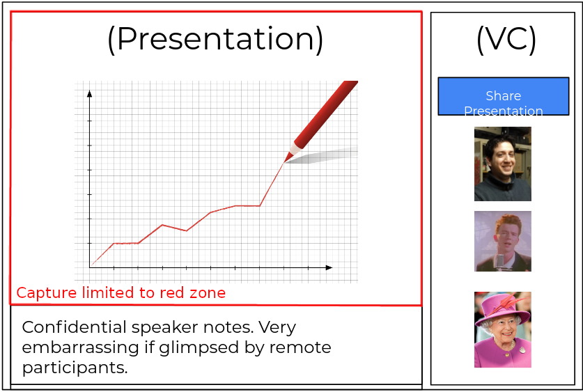
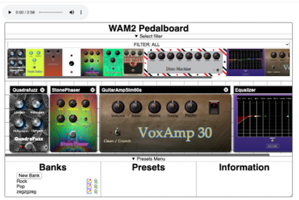

> 🗓️ April@w3c: @thew3cx \#MOOC, group meetings, @TheWebConf , etc\. More at https://www\.w3\.org/participate/eventscal\.html
> 4\-5 April: the Web \#MachineLearning Working Group runs 2 on\-line brainstorming sessions on \#ethics as applied to running Machine Learning in browsers \- see background by @radiojay in https://www\.w3\.org/2022/03/ml\-ethics/

 [Apr 01 2022, 09:51:46 UTC](https://twitter.com/w3cdevs/status/1509830876150087708)

----

> 21\-22 April: @ImmersiveWebW3C \#WorkingGroup and \#CommunityGroup \#face2face meeting @MSFTReactor in \#SanFrancisco 🇺🇸🌁 \#WebXR https://github\.com/immersive\-web/administrivia/blob/main/F2F\-April\-2022/schedule\.md

 [Apr 01 2022, 09:51:48 UTC](https://twitter.com/w3cdevs/status/1509830883813081119)

----

> 15 April: join a new session of @thew3cx \#HTML5 &amp; \#CSS Fundamentals \#MOOC to learn basics of front\-end Web development https://edx\.org/course/html5\-and\-css\-fundamentals @edXOnline

 [Apr 01 2022, 09:51:48 UTC](https://twitter.com/w3cdevs/status/1509830881518796811)

----

> 28 April: @TheWebConf Web Developer and W3C track, chaired and hosted on\-line by @dontcallmeDOM and @tomayac \- https://www2022\.thewebconf\.org/cfp/web\-dev\-w3c/

 [Apr 01 2022, 09:51:49 UTC](https://twitter.com/w3cdevs/status/1509830888015773701)

----

> 25 April: the @w3c's 3rd Emmy award 🏆 recognizing the work of the Web Fonts \#WorkingGroup \! @TheEmmys' ceremony happens in \#LasVegas 🇺🇸

 [Apr 01 2022, 09:51:49 UTC](https://twitter.com/w3cdevs/status/1509830886124142639)

----

> The core \#WebXR device API has reached Candidate Recommendation, a signal that it is now considered stable and fulfills its known requirements, including those identified through accessibility, security, privacy and internationalization reviews \#timetoimplement https://twitter\.com/w3c/status/1509479562480136194 
> 
> 
> \#WebXR is the core component of the \#ImmersiveWeb vision made possible by the @ImmersiveWebW3C groups \- one where Web browsers become a natural entry point to Virtual and Augmented Reality, positioning the Web as an anchor for any \#metaverse project

 [Apr 01 2022, 14:04:48 UTC](https://twitter.com/w3cdevs/status/1509894550927650838)

----

> \#WebXR is already supported on a wide range of browsers and hardware combinations, as well as through a polyfill https://immersiveweb\.dev/\#supporttable

 [Apr 01 2022, 14:04:49 UTC](https://twitter.com/w3cdevs/status/1509894558238314498)

----

> And thanks to recent work by @OpenWebDocs the documentation on \#WebXR on @MozDevNet is amazing https://developer\.mozilla\.org/en\-US/docs/Web/API/WebXR\_Device\_API/Fundamentals

 [Apr 01 2022, 14:04:50 UTC](https://twitter.com/w3cdevs/status/1509894561077809154)

----

> And to bring feedback on the API, as usual, head to the spec github repo https://github\.com/immersive\-web/webx/

 [Apr 01 2022, 14:04:51 UTC](https://twitter.com/w3cdevs/status/1509894566085857281)

----

> You can learn more about \#WebXR and its capabilities on our dedicated YouTube playlist https://www\.youtube\.com/watch?v\=dssQSeTrqPI&list\=PLNhYw8KaLq2UgIz02fSX\-rZRg7pCgxv0R

 [Apr 01 2022, 14:04:51 UTC](https://twitter.com/w3cdevs/status/1509894563577618432)

----

> The \#WebRTC Working Group releases a new API: Region Capture allows a Web app to capture a DOM\-encapsulated portion of their content https://www\.w3\.org/TR/2022/WD\-mediacapture\-region\-20220405/ \#timetoreview https://twitter\.com/w3c/status/1511232031195340804
> A typical use case of Region Capture would be a web app that brings together a video conference component and a content component \(e\.g\. slides\), and offer the user the possibility to show only a subset of the content \(e\.g\. not including speaker notes\)\. 
> 
> 

 [Apr 05 2022, 12:56:31 UTC](https://twitter.com/w3cdevs/status/1511326918909509638)

----

> Watch @eladalon1983 introducing the use case and the early Region capture API proposal in the \#WebRTC Working Group meeting back in November  
> https://youtu\.be/NHErekrFlSE?t\=1520

 [Apr 05 2022, 12:56:33 UTC](https://twitter.com/w3cdevs/status/1511326928581578752)

----

> This early implementation allows to test the associated demo of Region Capture https://w3c\.github\.io/mediacapture\-region/demo/

 [Apr 05 2022, 12:56:34 UTC](https://twitter.com/w3cdevs/status/1511326933136588802)

----

> An early implementation of the Region Capture API is available under origin trial in \#chromium https://chromestatus\.com/feature/5712447794053120

 [Apr 05 2022, 12:56:34 UTC](https://twitter.com/w3cdevs/status/1511326930972426242)

----

> As usual, head to the github repository to provide input on the API and whether it fulfills the need for your applications  
> https://github\.com/w3c/mediacapture\-region

 [Apr 05 2022, 12:56:35 UTC](https://twitter.com/w3cdevs/status/1511326935212830720)

----

> This \#TechEmmy award @TheEmmys recognizes the work done for: "Standardization of Font Technology for Custom Downloadable Fonts and Typography for Web and TV Devices" \- congrats\! 👏👏 https://twitter\.com/w3c/status/1518572049588969473
> Representatives from W3C staff and the @w3c \#WebFonts \#WorkingGroup  will attend the awards ceremony tonight 25 April 2022 in Las Vegas, 🇺🇸 https://mobile\.twitter\.com/w3cdevs/status/1486691065541316608

 [Apr 25 2022, 13:50:29 UTC](https://twitter.com/w3cdevs/status/1518588259944878081)

----

> Today at 3pm CET \(\#Lyon's time 🇫🇷\), first session of the "Developer and W3C track" @TheWebConf, chaired by @dontcallmeDOM \(@w3c\)\. Listen to the following speakers, online: 👇 
> 
> 

 [Apr 28 2022, 09:23:47 UTC](https://twitter.com/w3cdevs/status/1519608303847976966)

----

> @TailhardatL, @yoan\_chabot \(@orange\) and @rtroncy \(@EURECOM\) explore the strengths and weaknesses of standard data collection methods such as mining web \#browser history and network traffic dumps  \- see code: https://github\.com/Orange\-OpenSource/dynagraph and paper: https://www2022\.thewebconf\.org/PaperFiles/44\.pdf

 [Apr 28 2022, 09:23:48 UTC](https://twitter.com/w3cdevs/status/1519608308985909249)

----

> Shachaf Poran, Gil Amsalem, Amit Beka and Dmitri Goldenberg \(@bookingcom\) explain the trade\-offs they considered when building a voice assistant from repurposed models \#MachineLearning \- see paper: https://www2022\.thewebconf\.org/PaperFiles/42\.pdf

 [Apr 28 2022, 09:23:49 UTC](https://twitter.com/w3cdevs/status/1519608311766736901)

----

> Today at 4:45pm CET \(\#Lyon's time 🇫🇷\), second and last session of the "Developer and W3C track" @TheWebConf, chaired by @tomayac \(@Google\)\. All happens online, and the row of speakers is: 👇 
> 
> 

 [Apr 28 2022, 14:36:02 UTC](https://twitter.com/w3cdevs/status/1519686884947075073)

----

> Romain Fouquet, Pierre Laperdrix and Romain Rouvoy \(@inria, @univ\_lille, @cnrs\) introduce a new server\-side \#plugin that automatically rewrites framework\-provided \#WebUI components by alternatives that do not require any \#JavaScript \- their paper: https://www2022\.thewebconf\.org/PaperFiles/41\.pdf

 [Apr 28 2022, 14:36:04 UTC](https://twitter.com/w3cdevs/status/1519686895306948614)

----

> A group of \#researchers and \#developers from the computer music industry, incl\. @micbuffa \(@univ\_cotedazur\), present an open \#WebAudio \#plugin standard, i\.e\. the infrastructure to support high level \#audio plugins for \#browser based audio apps \- see paper: https://www2022\.thewebconf\.org/PaperFiles/40\.pdf 
> 
> 

 [Apr 28 2022, 14:36:04 UTC](https://twitter.com/w3cdevs/status/1519686892840755201)