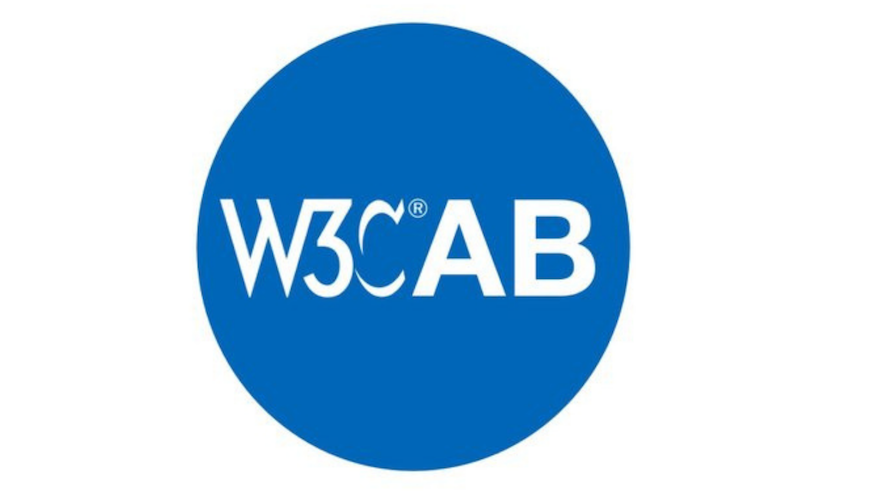

> 🗳️ This year's @W3CAB election is starting, with 6 candidates for 5 seats\. W3C Members have until June 2, 2022 to choose their Advisory Board representatives https://twitter\.com/w3c/status/1521390411964592128 
> 
> 
> The 6 candidates are @t \(@mozilla\), Wei Ding \(@Huawei\), Tatsuya Igarashi \(@Sony\), @frivoal \(W3C \#InvitedExpert\), @TzviyaSiegman \(@WileyGlobal\) and @daithesong \(@Apple\)\.   
> Read their nomination statements: https://www\.w3\.org/2022/05/03\-ab\-nominations\.html

 [May 03 2022, 08:34:35 UTC](https://twitter.com/w3cdevs/status/1521407862911770624)

----

> The W3C Advisory Board \(AB\) provides ongoing guidance to the @w3c team on issues of strategy, management, legal matters, process, and conflict resolution\. Their work priorities for 2022 are documented in https://www\.w3\.org/wiki/AB/2022\_Priorities

 [May 03 2022, 08:34:36 UTC](https://twitter.com/w3cdevs/status/1521407867953336321)

----

> Last month, @robinberjon \(@nytimes\) explained how the @w3c Process is used to identify and apply values to W3C's technical work\. It guides the work of groups to make sure that the Web works for everyone\! https://youtu\.be/NTLm42rfbxo
> Because it involves horizontal review for \#accessibility, \#security, \#privacy, and \#internationalization, the review process brings quality and consistency to W3C's work making each specification better\. 
> 
> 
> \.\.\. see also slides at https://www\.w3\.org/2022/Talks/ac\-slides/intro\-robin/

 [May 04 2022, 12:10:58 UTC](https://twitter.com/w3cdevs/status/1521824703542931456)

----

> An update of the ClearSpec project is given by @plhw3org and @marcosc 🎬👇\. ClearSpec aims to help differentiate between the different types of Web specifications that are manipulated within or around @w3c https://youtu\.be/T9ABbii2Alc
> This project also aims to help Web communities to document and inform about the level of adoptions of specs @MozDevNet @caniuse, as well as more detailed implementation information from 'Web Platform Tests', surfacing these both in the header and the body of specifications 
> 
> 
> \.\.\. with corresponding slides at https://www\.w3\.org/2022/Talks/ac\-clearspec/index\.html

 [May 04 2022, 14:22:49 UTC](https://twitter.com/w3cdevs/status/1521857884371443714)

----

> This work is conducted by the W3C Spec Editors \#CommunityGroup whose goal is to provide support for writing technical specifications across the Web ecosystem\. Please send feedback and/or raise issues on their \#github repo: https://github\.com/w3c/clearspec/issues

 [May 04 2022, 14:22:51 UTC](https://twitter.com/w3cdevs/status/1521857893972250627)

----

> W3C's Project Management Function lead, @plhw3org, presents historical data regarding Formal Objections \(FOs\) received in the past few years at W3C: https://youtu\.be/68aUMcIor6s
> In the @w3c process, "a Formal Objection to a group decision is one that the reviewer requests that the Director considers as part of evaluating the related decision"\. It allows to ensure that dissenting voices get a fair hearing when consensus cannot be otherwise reached\.

 [May 05 2022, 14:55:44 UTC](https://twitter.com/w3cdevs/status/1522228557065375744)

----

> Looking to the future, the @w3cAB proposes to modify the way FOs are handled\. In the🎬below, @frivoal explains step by step how the proposed 'W3C Council' would serve to replace the Director in handling Formal Objections: https://youtu\.be/Ax9MzKDXlSw

 [May 05 2022, 14:55:45 UTC](https://twitter.com/w3cdevs/status/1522228563033927683)

----

> As the usage of the \#Web intensifies, the needs for web technologies and \#WebStandards become greater\. This report summarizes recent @w3c work to enhance the web and innovate for its growth and strength\. https://twitter\.com/w3c/status/1523582138523791360

 [May 09 2022, 10:16:51 UTC](https://twitter.com/w3cdevs/status/1523607927315365889)

----

> The @w3ctag published 2 documents providing a set of privacy definitions and principles that should guide the development of the Web as a trustworthy platform \#privacy \#ethical \#timetogiveinput https://twitter\.com/w3c/status/1524715615071649792
> Privacy and Ethical Web principles embrace the same goal: to ensure that the web provides a net positive social benefit to humanity https://www\.w3\.org/2001/tag/

 [May 12 2022, 12:19:01 UTC](https://twitter.com/w3cdevs/status/1524725834715734017)

----

> The group welcomes feedback in the dedicated \#github repos: https://github\.com/w3ctag/privacy\-principles/ and https://github\.com/w3ctag/ethical\-web\-principles

 [May 12 2022, 12:19:02 UTC](https://twitter.com/w3cdevs/status/1524725839732133890)

----

> Widely adopted by publishers, EPUB® 3 is the \#ebooks format\. It defines a distribution and interchange format for digital publications and documents\.   
> Three new EPUB 3 specifications have reached the \#CandidateRecommendation status \#timetoimplement\! @w3cpublishing https://twitter\.com/w3c/status/1524719049955028992
> Read @wendy\_a\_reid's blog post explaining the changes made to the specifications to introduce new content types and recommendations around areas previously under specified: https://www\.w3\.org/blog/2022/05/epub\-3\-3\-is\-now\-in\-cr/

 [May 23 2022, 13:30:16 UTC](https://twitter.com/w3cdevs/status/1528730032851525632)

----

> The EPUB 3 Working Group encourages implementers to review the specifications and give feedback\! Check also the test suite, try the tests out, and please report any errors or issues the tests might have: https://w3c\.github\.io/epub\-tests/contributing

 [May 23 2022, 13:30:19 UTC](https://twitter.com/w3cdevs/status/1528730044734087168)

----

> For content authors and \#developers wishing to understand the EPUB® 3 specifications, an overview document describes the features available in \#EPUB 3: https://www\.w3\.org/TR/epub\-overview\-33/

 [May 23 2022, 13:30:19 UTC](https://twitter.com/w3cdevs/status/1528730041902845952)