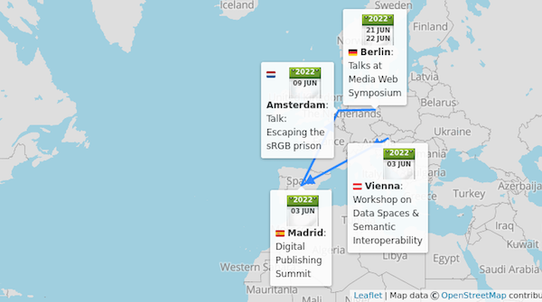

> 🗓️ June@w3c: live events are back\! \+ new MOOC sessions @thew3cx\. See also https://www\.w3\.org/participate/eventscal\.html 
> 
> 
> 3 June: Ivan Herman gives an overview of the current \#EPUB 3\.3 work at the Digital Publishing Summit in \#Madrid 🇪🇸 @EDRLab\_org   
> https://www\.edrlab\.org/events/digital\-publishing\-summit\-2022/ 
> 
> 

 [Jun 01 2022, 11:34:55 UTC](https://twitter.com/w3cdevs/status/1531962491978272770)

----

> 3 June: @pchampin is a panelist at the @TrustsData Workshop on "\#DataSpaces and Semantic \#Interoperability" in \#Vienna 🇦🇹 This event is co\-organized by @wu\_vienna and @w3c   
> \#DataManagement \#semantics \#DataMarkets  
> https://www\.trusts\-data\.eu/data\-spaces\-semantic\-interoperability/

 [Jun 01 2022, 11:34:56 UTC](https://twitter.com/w3cdevs/status/1531962498622046208)

----

> 7 June: opening of a new session of @thew3cx "CSS Basics" course\. Learn how to style your Web site for a professional look and feel with \#CSS https://www\.edx\.org/course/css\-basics @edXOnline

 [Jun 01 2022, 11:34:57 UTC](https://twitter.com/w3cdevs/status/1531962501268754432)

----

> 9 June: @svgeesus gives you the keys to escape the sRGB prison @cssdayconf, in \#Amsterdam🇳🇱  
> https://cssday\.nl/2022 @csswg

 [Jun 01 2022, 11:34:58 UTC](https://twitter.com/w3cdevs/status/1531962504024399872)

----

> 21 June: @tidoust talks at the 9th Media Web Symposium @fraunhoferfokus in \#Berlin 🇩🇪  
> https://www\.fokus\.fraunhofer\.de/go/mws/program

 [Jun 01 2022, 11:34:59 UTC](https://twitter.com/w3cdevs/status/1531962510684917760)

----

> 21 June: new session of the \#HTML5 Coding Essentials and Best Practices @thew3cx \#MOOC with Prof\. @micbuffa on @edXOnline https://www\.edx\.org/course/html5\-coding\-essentials\-and\-best\-practices

 [Jun 01 2022, 11:34:59 UTC](https://twitter.com/w3cdevs/status/1531962508038311937)

----

> Over the last weeks, the @w3c \#WebRTC Working Group released two first public working drafts of new \#APIs to help with improved screen\-sharing capabilities in Web apps \#timetogiveinput
> The first API, Capture Handle Identity, provides a mechanism for a Web \#app \(e\.g\. videoconf\) capturing the content of another one \(e\.g\. slide deck\) to collaborate \=&gt; the users sharing their screen can navigate slides from within the videoconf tool https://www\.w3\.org/TR/capture\-handle\-identity/

 [Jun 01 2022, 12:18:58 UTC](https://twitter.com/w3cdevs/status/1531973578392055816)

----

> This is done by letting the captured Web \#app expose info to the capturing one to allow the two apps to collaborate\. Read this explainer that lists more use cases as well as sample code: https://github\.com/w3c/mediacapture\-handle/blob/main/identity/explainer\.md

 [Jun 01 2022, 12:18:59 UTC](https://twitter.com/w3cdevs/status/1531973583945322497)

----

> This \#API is shipping in \#Chrome 102, which allows running the following demos: https://w3c\.github\.io/mediacapture\-handle/identity/demos/

 [Jun 01 2022, 12:19:00 UTC](https://twitter.com/w3cdevs/status/1531973586759589889)

----

> As always, the work is happening in a \#github repo, where a complementary work to describe generically affordances a captured app may expose to its capturer is also investigated:  
> https://github\.com/w3c/mediacapture\-handle/

 [Jun 01 2022, 12:19:01 UTC](https://twitter.com/w3cdevs/status/1531973589238431744)

----

> By default, sharing the content of a browser tab \(as already allowed via the generic screen sharing capabilities provided by 'getDisplayMedia'\) can be risky\.\.\.
> In the same spirit of improving how a Web \#app can share the content of another, the \#WebRTC Working Groups recently released the Viewport Capture \#API\. It provides a secured approach to sharing the content of a browser tab \#timetogiveinput https://twitter\.com/w3c/status/1529033087023206400

 [Jun 01 2022, 12:48:09 UTC](https://twitter.com/w3cdevs/status/1531980924920942595)

----

> \.\.\. since it potentially weakens the cross\-origin protections that prevent a \#Website to read the user\-customized version of another Web site \(think evil\.example reading bank\.example\) https://w3c\.github\.io/mediacapture\-screen\-share/\#elevated\-permissions

 [Jun 01 2022, 12:48:10 UTC](https://twitter.com/w3cdevs/status/1531980927458582529)

----

> The work is happening in its own \#github repo\. Check it out\! https://github\.com/w3c/mediacapture\-viewport

 [Jun 01 2022, 12:48:11 UTC](https://twitter.com/w3cdevs/status/1531980932395241474)

----

> This can be mitigated by browsers discouraging tab capture \(but that goes against the goal of making the Web as widely useful as possible\)\. Viewport Capture proposes an alt approach where a browser tab can only be captured if it respects well\-defined cross\-origin characteristics

 [Jun 01 2022, 12:48:11 UTC](https://twitter.com/w3cdevs/status/1531980930063245314)

----

> WebDriver BiDi is a proposed bidirectional protocol for browser automation, building on and extending \#WebDriver: https://w3c\.github\.io/webdriver\-bidi/ https://twitter\.com/bromann/status/1531981053858029568
> Want to know more about WebDriver BiDi? There is an explainer\! https://github\.com/w3c/webdriver\-bidi/blob/master/explainer\.md

 [Jun 01 2022, 12:58:40 UTC](https://twitter.com/w3cdevs/status/1531983570637578243)

----

> Want to contribute to WebDriver BiDi? Head up to the \#github repo\! https://github\.com/w3c/webdriver\-bidi/

 [Jun 01 2022, 12:58:42 UTC](https://twitter.com/w3cdevs/status/1531983576161460229)

----

> Congrats to Wei Ding \(@Huawei\), Tatsuya Igarashi \(@Sony\), @frivoal \(W3C \#InvitedExpert\), @TzviyaSiegman \(@WileyGlobal\), @daithesong \(@Apple\)\! 👏👏👏 https://twitter\.com/w3c/status/1532653072782172160
> These elected participants join the continuing ones: Heejin Chung \(@Samsung\), Avneesh Singh \(@accessibledaisy\), Eric Siow \(@intel\), @LeonieWatson \(@TetraLogical\), @cwilso \(@Google\) and Hongru \(Judy\) Zhu \(@AlibabaGroup\)

 [Jun 03 2022, 10:46:32 UTC](https://twitter.com/w3cdevs/status/1532675094551617536)

----

> The @W3CAB's priorities in 2022 are listed in https://www\.w3\.org/wiki/AB/2022\_Priorities

 [Jun 03 2022, 10:46:34 UTC](https://twitter.com/w3cdevs/status/1532675099832291328)

----

> The \#VerifiableCredentials Working Group is back under a new charter to work on a new version of the Verifiable Credentials Data Model and how to express and associate proofs of integrity for Verifiable Credentials https://www\.w3\.org/2022/06/verifiable\-credentials\-wg\-charter\.html https://twitter\.com/w3c/status/1536245468031754241
> The latter may use the output of another group under review, the \#RDF Dataset Canonicalization and Hash Working Group https://twitter\.com/w3c/status/1526123770146086913

 [Jun 13 2022, 12:59:22 UTC](https://twitter.com/w3cdevs/status/1536332401642717185)

----

> 21 June: @dontcallmeDOM presents "Weaving Client, Edge and Cloud computing for the Web" @fraunhoferfokus in \#Berlin 🇩🇪 \#FOKUSmws https://www\.fokus\.fraunhofer\.de/en/fame/mws22/detailed\-program

 [Jun 15 2022, 09:01:06 UTC](https://twitter.com/w3cdevs/status/1536997213997568005)

----

> W3C immersive web strategist @dontcallmeDOM declares: “@w3c is joining the Metaverse Standards Forum to accelerate the coordination in building an interoperable platform for the \#metaverse, in which @ImmersiveWebW3C's vision is set to play a critical role\.” \#WebStandards https://twitter\.com/w3c/status/1539562476613894145

 [Jun 22 2022, 11:09:51 UTC](https://twitter.com/w3cdevs/status/1539566330331947016)

----

> Apply now before 6 July if you are based in 🇪🇺 and looking for \#funds to support your work on @w3c  
>  \#WebStandards\. Do not miss this opp as \#w3cTPAC is approaching\! Many topics such as \#AI, \#a11y, \#privacy, \#media, etc\. More in https://www\.standict\.eu/index\.php/standicteu\-2023\-7th\-open\-call https://twitter\.com/Stand\_ICT/status/1539904950200946695

 [Jun 27 2022, 11:47:33 UTC](https://twitter.com/w3cdevs/status/1541387756181528584)