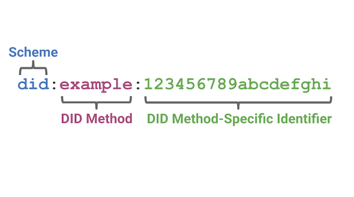

> 🗓️July@w3c: \#JavaScript course, Web \#audio conference, etc\. See more in https://www\.w3\.org/participate/eventscal\.html
> 5 July: opening a new session of the @thew3cx "\#JavaScript Introduction" \#MOOC w/ Prof\. @micbuffa via @edxOnline   
> Enroll now\! https://www\.edx\.org/course/javascript\-introduction

 [Jul 01 2022, 14:04:41 UTC](https://twitter.com/w3cdevs/status/1542871820709371905)

----

> 8 July: At \#wac2022 in Cannes 🇫🇷, the @w3c Web Audio \#WorkingGroup, via @padenot, will give an update of recent work and what new features to expect https://wac2022\.i3s\.univ\-cotedazur\.fr/node/27 @WebAudioConf 
> 
> 

 [Jul 01 2022, 14:04:43 UTC](https://twitter.com/w3cdevs/status/1542871825738338308)

----

> An opp\. you can't miss\! https://twitter\.com/Stand\_ICT/status/1544263974090317824

 [Jul 05 2022, 12:33:51 UTC](https://twitter.com/w3cdevs/status/1544298510354350082)

----

> \#CSS Color 4 describes properties which allow authors to specify the foreground color and opacity of the text content of an element \#timetoimplement  
> https://www\.w3\.org/TR/css\-color\-4/ https://twitter\.com/w3c/status/1544214340303216640
> This module allows specifying colors in other color spaces than sRGB\. It has been discussed during last year's \#W3CWorkshop: https://www\.w3\.org/Graphics/Color/Workshop/

 [Jul 05 2022, 13:14:39 UTC](https://twitter.com/w3cdevs/status/1544308779965190149)

----

> To learn more, check also the workshop's 🎬 talks that are avail\. on our \#YouTube channel: https://www\.youtube\.com/playlist?list\=PLNhYw8KaLq2UP\_XETn9k\_bh2338EWGbSd

 [Jul 05 2022, 13:14:40 UTC](https://twitter.com/w3cdevs/status/1544308784495038465)

----

> We invite public comments \(through 2 August 2022\) on the proposed charter for a 🆕 RDF\-star \#WorkingGroup: https://www\.w3\.org/2022/06/proposed\-rdf\-star\-wg\-charter\.html \#RDFstar   
> Why is it important?  🧵👇 https://twitter\.com/w3c/status/1543855611045109760
> RDF\-star \(née RDF\*\) was first introduced in 2014 by @olafhartig and Bryan Thompson as a more concise and usable alternative to reification \("statements about statements"\): https://arxiv\.org/abs/1406\.3399

 [Jul 05 2022, 14:33:38 UTC](https://twitter.com/w3cdevs/status/1544328655639306240)

----

> Since then, it has been adopted by an ever increasing number of \#RDF implementations, both open\-source and commercial: https://w3c\.github\.io/rdf\-star/implementations\.html

 [Jul 05 2022, 14:33:39 UTC](https://twitter.com/w3cdevs/status/1544328661263843333)

----

> The ability of RDF\-star to attach information to the \*edges\* of an RDF graph makes it a good candidate for bridging the gap between popular \#PropertyGraph databases and the RDF world\. In the age of \#KnowledgeGraph, this increased interoperability will play a crucial role

 [Jul 05 2022, 14:33:40 UTC](https://twitter.com/w3cdevs/status/1544328665802104832)

----

> For a year and half, the RDF\-DEV \#CommunityGroup worked on a report to explore how RDF\-star could be integrated in the \#RDF and \#SPARQL @w3c \#WebStandards: https://www\.w3\.org/2021/12/rdf\-star\.html   
> The proposed Working Group is the next step in this evolution\.

 [Jul 05 2022, 14:33:40 UTC](https://twitter.com/w3cdevs/status/1544328663583399937)

----

> Join the \#WebXR \#WorkingGroup\! Its scope is to  develop standardized \#APIs to provide access to input and output capabilities commonly associated with XR hardware\. Read more: https://www\.w3\.org/2022/07/immersive\-web\-wg\-charter\.html https://twitter\.com/w3c/status/1545334026189283329

 [Jul 13 2022, 06:07:26 UTC](https://twitter.com/w3cdevs/status/1547100370287136770)

----

> What are color gamuts❓ Read @svgeesus' blog post: https://svgees\.us/blog/whatGamuts\.html❗️ https://twitter\.com/svgeesus/status/1548401193407246336

 [Jul 17 2022, 14:39:38 UTC](https://twitter.com/w3cdevs/status/1548678820739399682)

----

> Web apps cannot easily leverage  such an extended workspace though\. The Multi\-Screen Window Placement \#API aims to fix this\!
> Operating systems let users extend their visual workspace through additional screens\. Various platform \#applications \(slideshow apps, financial apps, conference room apps\.\.\.\) leverage this extended workplace to create better experiences:  https://www\.w3\.org/TR/2022/WD\-window\-placement\-20220630/ \#timetogiveinput https://twitter\.com/w3c/status/1542421407279218690

 [Jul 19 2022, 08:59:29 UTC](https://twitter.com/w3cdevs/status/1549317995662557185)

----

> The API will allow \#web applications to initiate a multi\-\#screen experience from a single transient user activation\. This includes the ability to place content on specific screens and show an element fullscreen on a specific screen\.

 [Jul 19 2022, 08:59:30 UTC](https://twitter.com/w3cdevs/status/1549317997327794177)

----

> Congrats to editors @manusporny, @rhiaro, @peacekeeper and @drummondreed for the newly published @w3c \#WebStandard "Decentralized Identifiers \(DIDs\) v1\.0": https://www\.w3\.org/TR/2022/REC\-did\-core\-20220719/  \#timetoadopt\!\! https://twitter\.com/w3c/status/1549368259878723585
> DIDs are a new type of identifier that do not require a centralized registry\. It empowers everyone on the Web to generate their own identifiers and take control of their own \#identity and relationships while also providing greater \#security and \#privacy 
> 
> 

 [Jul 19 2022, 17:58:09 UTC](https://twitter.com/w3cdevs/status/1549453553584029696)

----

> Coupled with \#w3c Verifiable Credentials, DIDs are being used across a number of markets \(such as governments, retailers, etc\.\) where \#identification and \#data authenticity is a concern\. Read the numerous testimonials from W3C members and the industry: https://www\.w3\.org/2022/07/pressrelease\-did\-rec\.html\.en\#testimonials

 [Jul 19 2022, 17:58:12 UTC](https://twitter.com/w3cdevs/status/1549453565306994689)

----

> DIDs and DID documents can be adapted to any modern blockchain, distributed ledger, or other decentralized network capable of resolving a unique key into a unique value\. Check the DID method registry for a list of known DID method specifications: https://w3c\.github\.io/did\-spec\-registries/\#did\-methods

 [Jul 19 2022, 17:58:13 UTC](https://twitter.com/w3cdevs/status/1549453572571537408)

----

> DIDs are \#URIs that associate a DID subject with a DID document allowing trustable interactions associated with that subject 
> 
> 

 [Jul 19 2022, 17:58:13 UTC](https://twitter.com/w3cdevs/status/1549453569304285186)

----

> Find more details and info in the DID primer https://w3c\-ccg\.github\.io/did\-primer/

 [Jul 19 2022, 17:58:14 UTC](https://twitter.com/w3cdevs/status/1549453576220672000)