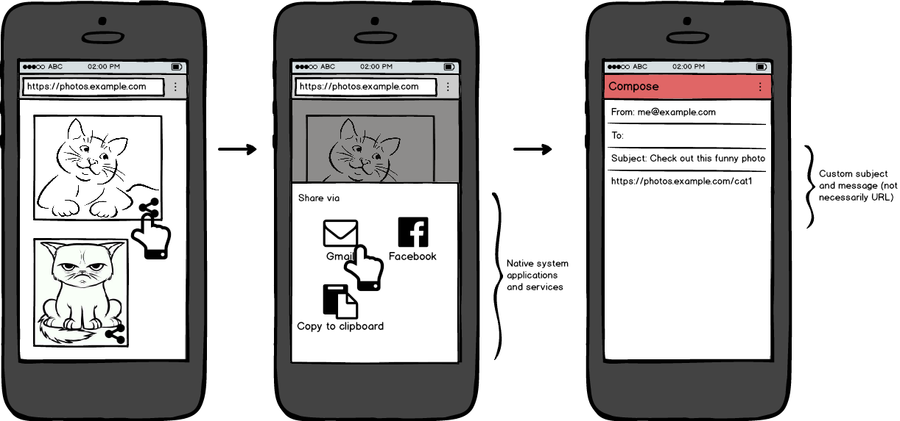

> The spec\. "Payment Request 1\.1" describes an \#API that allows user agents \(e\.g\., \#browsers\) to facilitate the payment flow between merchant and user\. This API also enables websites to take advantage of more secure payment schemes \#timetogiveinput\! https://twitter\.com/w3c/status/1551774266605068289
> The work is happening in its own \#github repo\. Feel free to contribute\! https://github\.com/w3c/payment\-request/

 [Aug 01 2022, 14:26:13 UTC](https://twitter.com/w3cdevs/status/1554111260811300865)

----

> 📣Registration is OPEN\!\! We invite \#designers, \#developers, product/project \#managers, and the public to share, learn and connect with the global Web \#community at our free @w3c \#meetup in \#Vancouver 🇨🇦on Tuesday 13 Sept\. 2022\! \#w3cdevs2022 https://www\.w3\.org/2022/09/meetup/
> This \#meetup is open to everyone at no cost, but please register and agree to the event's health rules\! https://ti\.to/w3c/w3c\-developer\-meetup\-vancouver\-2022

 [Aug 18 2022, 16:04:09 UTC](https://twitter.com/w3cdevs/status/1560296500940374016)

----

> With special thanks to our sponsors @Yubico @samsunginternet @igalia @FortuneTimesNYC @Legible\_Inc @WithyouAgence\!  
> https://www\.w3\.org/2022/09/meetup/sponsors\.html

 [Aug 18 2022, 16:04:11 UTC](https://twitter.com/w3cdevs/status/1560296510528622593)

----

> Dear \#developers \#designers in \#Vancouver 🇨🇦: plan to network with the Web \#community crowd at the @w3c developer \#meetup on Tue\. 13 Sept\. 2022\!  
> https://www\.w3\.org/2022/09/meetup/
> Meet this year's speakers: @rachelandrew, @TerribleMia, @Chronotope and @gregwhitworth, on topics related to \#CSS container queries, private \#advertising, \#OpenUI and \#interop2022 \#w3cdevs2022  
> https://www\.w3\.org/2022/09/meetup/speakers\.html

 [Aug 23 2022, 11:57:15 UTC](https://twitter.com/w3cdevs/status/1562046304510943232)

----

> The \#w3cdevs2022 meetup is free to attend, so do not hesitate and sign up\! ;\) https://ti\.to/w3c/w3c\-developer\-meetup\-vancouver\-2022

 [Aug 23 2022, 12:16:57 UTC](https://twitter.com/w3cdevs/status/1562051264132915202)

----

> Typically, some of these libraries when validating XML data bound to an XML Schema will try and download these schemas from http://w3\.org, and will not follow any redirect or without support for HTTPs, leading to inscrutable error messages or performance degradation\.
> ⚠️PSA: Your software may have a dependency on the W3C Web site being available over http without you knowing \- e\.g\. if using default settings in some of the popular XML validation libraries, even several levels down your stack\. https://twitter\.com/w3c/status/1561790458728161280

 [Aug 23 2022, 13:15:19 UTC](https://twitter.com/w3cdevs/status/1562065954250661890)

----

> But no matter how good @w3c\_systeam is at keeping our systems running \(and good they are\!\) and at mitigating these negative impacts, it's probably best for everyone not to rely on http://w3\.org being available for their production systems\.

 [Aug 23 2022, 13:15:20 UTC](https://twitter.com/w3cdevs/status/1562065958344310785)

----

> The @w3c\_systeam is evaluating redirecting http://www\.w3\.org to https\-only and in that process, trying to assess what exceptions or timeline may be required to minimize negative impact\.

 [Aug 23 2022, 13:15:20 UTC](https://twitter.com/w3cdevs/status/1562065956280606720)

----

> So if you see anything going amiss in the upcoming https\-only test periods, this may be a good time to inspect your apps for that unwanted dependency…

 [Aug 23 2022, 13:15:21 UTC](https://twitter.com/w3cdevs/status/1562065960214855680)

----

> This is proposed charter for a new Private \#Advertising Technology Working Group, set to specify web features and APIs that support advertising while acting in the interests of users, in particular providing strong privacy assurances\. https://www\.w3\.org/2022/08/PROPOSED\-PATWG\-charter\.html https://twitter\.com/w3c/status/1562361252986654721
> This charter follows the incubation work done in the existing Private Advertising Technology Community Group  
> https://www\.w3\.org/community/patcg/

 [Aug 24 2022, 12:06:36 UTC](https://twitter.com/w3cdevs/status/1562411047943913472)

----

> The group will develop a specification for Private Attribution Measurement, which would enable to privately measure advertisement attribution/conversion rates without revealing whether any individual user converts or not\. https://github\.com/patcg/private\-measurement/issues

 [Aug 24 2022, 12:06:38 UTC](https://twitter.com/w3cdevs/status/1562411056143761409)

----

> \.@Chronotope who has been co\-chairing the Community Group will present this ongoing work at our \#w3cdevs2022 meetup \.\./2022/2022\-08\-tweets\.html\#x1562051260303527937

 [Aug 24 2022, 12:06:38 UTC](https://twitter.com/w3cdevs/status/1562411053505548288)

----

> That work itself has been inspired by previous proposals in this space, the Attribution report API https://github\.com/WICG/attribution\-reporting\-api/blob/main/AGGREGATE\.md and Private Click Measurement https://webkit\.org/blog/11529/introducing\-private\-click\-measurement\-pcm/

 [Aug 24 2022, 12:06:39 UTC](https://twitter.com/w3cdevs/status/1562411060652609536)

----

> One proposal for such a specification is Interoperable Private Attribution \(IPA\) https://github\.com/patcg\-individual\-drafts/ipa/blob/main/IPA\-End\-to\-End\.md

 [Aug 24 2022, 12:06:39 UTC](https://twitter.com/w3cdevs/status/1562411058475704320)

----

> For those interested in \#standardization training, register to the 27th Sept\. 2022 online workshop organized by @HSboosterEU\!   
> https://hsbooster\.eu/events/building\-hsboostereu\-standardisation\-training\-academy   
> https://twitter\.com/HSboosterEU/status/1561656515710304257

 [Aug 29 2022, 11:49:31 UTC](https://twitter.com/w3cdevs/status/1564218685409075202)

----

> The @EU\_H2020 @TrustsData workshop on "Data Spaces &amp; Semantic Interoperability" has been 🎬 recorded\. Watch panel discussions and lighting talks at:   
> https://www\.youtube\.com/playlist?list\=PLNhYw8KaLq2W5I0gtbL\_vprO7IxaEOwh7
> This one\-day workshop, held beg\. of June 2022, brought together researchers, decision makers and practitioners to discuss requirements, standards, tools, licenses and more regarding interoperability in data spaces\.  
> https://www\.trusts\-data\.eu/data\-spaces\-semantic\-interoperability/

 [Aug 29 2022, 12:05:03 UTC](https://twitter.com/w3cdevs/status/1564222597243486208)

----

> The \#RDFstar Working Group has now been approved and launched\! https://lists\.w3\.org/Archives/Public/public\-rdf\-star\-wg/2022Aug/0000\.html \.\./2022/2022\-07\-tweets\.html\#x1544328655639306240

 [Aug 29 2022, 12:51:17 UTC](https://twitter.com/w3cdevs/status/1564234231315939333)

----

> The Web Share API has reached Candidate Recommendation status \#timetoimplement\! That API allows to integrate sharing of content from a Web page with sharing targets, such a social networks and messaging apps \(as typically provided by mobile OSes\) https://twitter\.com/w3c/status/1564502606814199808 
> 
> 
> The Web Share API is already widely available across browsers on mobile, and on some desktop OSes\.  
> https://caniuse\.com/web\-share

 [Aug 30 2022, 12:55:11 UTC](https://twitter.com/w3cdevs/status/1564597601407746049)

----

> And watch a demo of Web Share as part of the set of Web Apps improvements @marcosc included in his update at the 2021 \#w3cTPAC https://www\.youtube\.com/watch?v\=qmgmW2YwH70

 [Aug 30 2022, 12:55:13 UTC](https://twitter.com/w3cdevs/status/1564597610098327552)

----

> Learn more about the Web Share API on @mozdevnet  
> https://developer\.mozilla\.org/en\-US/docs/Web/API/Web\_Share\_API

 [Aug 30 2022, 12:55:13 UTC](https://twitter.com/w3cdevs/status/1564597607724290049)

----

> To get involved or provide feedback on the Web Share specification, as usual, head to its  github repo  
> https://github\.com/w3c/web\-share/

 [Aug 30 2022, 12:55:14 UTC](https://twitter.com/w3cdevs/status/1564597612359163905)

----

> Register now to our 🆓 @w3c \#developer \#meetup in \#Vancouver 🇨🇦 on Tue\. 13 Sept\. 2022: https://ti\.to/w3c/w3c\-developer\-meetup\-vancouver\-2022  
> Discover and learn about Web \#standards under development, as well new initiatives put forward to shape the future of an even better \#Web\! \#w3cdevs2022 https://twitter\.com/w3c/status/1564639158315925510
> Come listen and discuss with speakers @rachelandrew @Chronotope @TerribleMia and @gregwhitworth   
> https://www\.w3\.org/2022/09/meetup/speakers\.html

 [Aug 30 2022, 16:11:15 UTC](https://twitter.com/w3cdevs/status/1564646942403174400)

----

> With special thanks to our sponsors @Yubico @samsunginternet @igalia @FortuneTimesNYC @Legible\_Inc and @WithyouAgence\! https://www\.w3\.org/2022/09/meetup/sponsors\.html

 [Aug 30 2022, 16:11:16 UTC](https://twitter.com/w3cdevs/status/1564646947931262977)

----

> Meet the @igalia team at the event \- they will present @WolvicXr, the new secure, open source and accessible web \#browser that opens a portal to the Web, including immersive games, videos, and environments built for \#XR https://www\.igalia\.com/2022/07/08/Wolvic\-1\.0\.html  
> https://youtu\.be/A56dmlQx2Zs
> Thank you to @igalia for supporting the @w3c \#developer meetup in \#Vancouver, 🇨🇦\! https://www\.w3\.org/2022/09/meetup/ \#w3cdevs2022

 [Aug 31 2022, 14:20:20 UTC](https://twitter.com/w3cdevs/status/1564981418278719490)

----

> Discover what is happening in @w3c\! For \#w3cTPAC, several \#WorkingGroups have prepared videos with presentations and demos:   
> https://www\.w3\.org/2022/09/TPAC/group\-updates\.html
> Today, watch @XueFuqiao present an update of the @webi18n work: language enablement, \#developer support, education and outreach \- https://www\.w3\.org/International/ \#i18n  
> https://www\.w3\.org/2022/09/TPAC/demos/i18n\.html \(video, transcript and slides\)

 [Aug 31 2022, 14:52:32 UTC](https://twitter.com/w3cdevs/status/1564989521380384772)