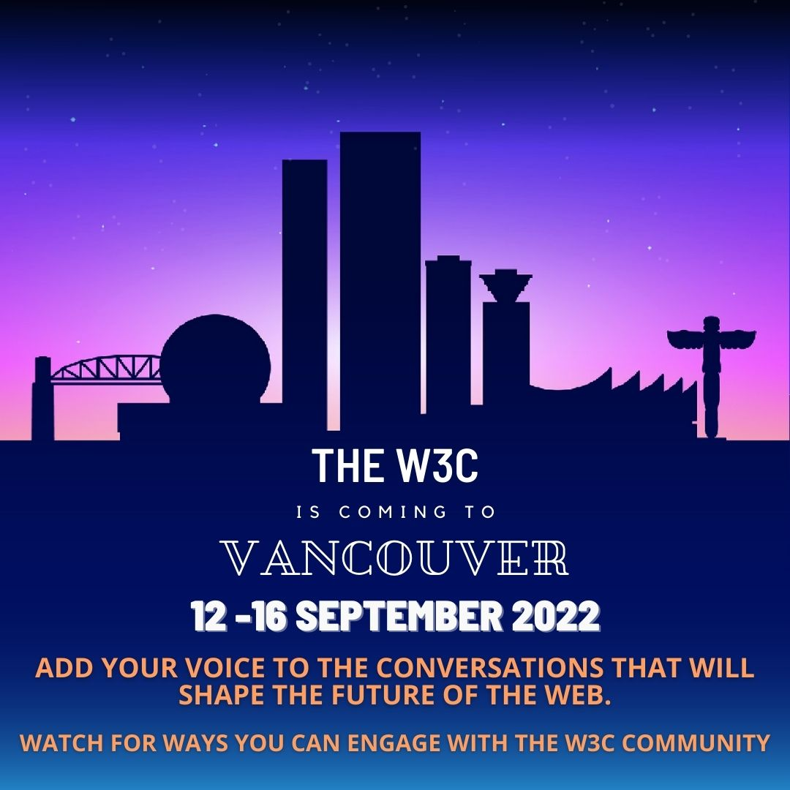
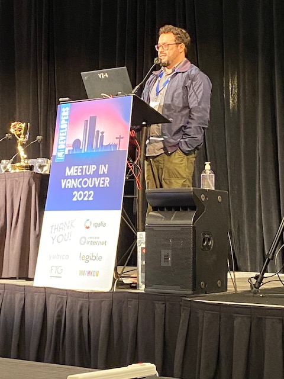
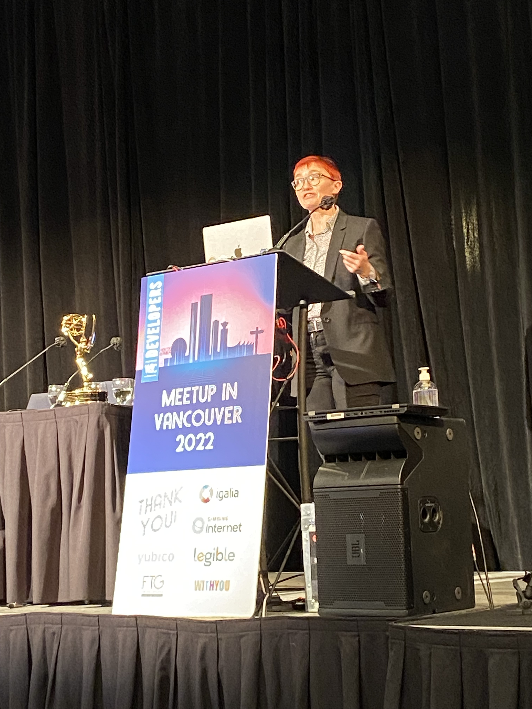

> Congrats to editors @marcosc and @reillyeon for the republished @w3c \#WebStandard "Geolocation API": https://www\.w3\.org/TR/geolocation/ https://twitter\.com/w3c/status/1565222782723670018
> The \#Geolocation API is one of the oldest sensor \#API in Web \#browsers, enabling to obtain information on the device location either as one\-shot or continuously\. 
> 
> 

 [Sep 01 2022, 13:41:36 UTC](https://twitter.com/w3cdevs/status/1565334056820039680)

----

> Work on the Geolocation \#API started in 2008 and led to a first @w3c standard in 2013\. But the Web platform is always evolving, and specifications need to be updated to reflect changes\.

 [Sep 01 2022, 13:41:37 UTC](https://twitter.com/w3cdevs/status/1565334062855622656)

----

> This may not be as glamorous as creating new specs, but it's a critical job to keep the platform consistent, safe and interoperable\.

 [Sep 01 2022, 13:41:38 UTC](https://twitter.com/w3cdevs/status/1565334064860577792)

----

> \#w3cTPAC: discover what is happening in @w3c's \#Math \#WorkingGroup \(https://www\.w3\.org/Math/\) with these 4 demos 🎬:
> 1⃣ \#MathML\-Core by @briankardell: this new specification carefully defines a subset of MathML 3 which is implemented in browsers and describes its platform integration with \#HTML, \#CSS, \#JavaScript and \#SVG\.  
> https://www\.w3\.org/2022/09/TPAC/demos/mathontheweb\.html

 [Sep 01 2022, 14:47:47 UTC](https://twitter.com/w3cdevs/status/1565350715228188673)

----

> 3⃣ @ways2read demonstrates \#math \#accessibility and also shows some configuration options that can tailor the experience to a user's needs\.   
> https://www\.w3\.org/2022/09/TPAC/demos/mathml\-a11y\-demo\.html

 [Sep 01 2022, 14:47:49 UTC](https://twitter.com/w3cdevs/status/1565350723532951554)

----

> 2⃣ In "That's now what I mean\!", Neil Soiffer gives a brief introduction to a new feature in MathML 4 that improves \#accessibility by allowing authors to communicate their intent to their assistive technology\.  
> https://www\.w3\.org/2022/09/TPAC/demos/math\-a11y\.html

 [Sep 01 2022, 14:47:49 UTC](https://twitter.com/w3cdevs/status/1565350720907317248)

----

> 4⃣ Paul Libbretch illustrates interoperability challenges when exchanging mathematical \#formulae through the clipboard\.  
> https://www\.w3\.org/2022/09/TPAC/demos/mathml\-formulae\.html

 [Sep 01 2022, 14:47:50 UTC](https://twitter.com/w3cdevs/status/1565350726527696896)

----

> In a bit less than one hour will start another test of redirecting http://w3\.org to https, this time excluding XML Schema resources that have proved the most challenging at this time https://status\.w3\.org/incidents/j1gjbnnd4rkk \.\./2022/2022\-08\-tweets\.html\#x1562065956280606720

 [Sep 01 2022, 16:04:22 UTC](https://twitter.com/w3cdevs/status/1565369984284516355)

----

> 🗓️ September@w3c: the W3C is coming to \#Vancouver 🇨🇦 \! \#w3cTPAC \#w3cdevs2022 \#digipub 
> 
> 
> 13 Sept\., 8:00\-12:00 PT: organized by the \#EPUB3 \#WorkingGroup, the @w3c digital publishing salon is an online event, bringing together key stakeholders to discuss the future of digital \#publications w/ the goal of creating a 5\-year roadmap \#w3cpublishing  
> https://www\.w3\.org/2022/09/digpubsalon

 [Sep 01 2022, 16:13:31 UTC](https://twitter.com/w3cdevs/status/1565372288459067392)

----

> 13 Sept\., 18:00\-21:00 PT: the first ever @w3c developer \#meetup in Vancouver\! Come learn from and meet with the top notch engineers building the Web\. Please register for this FREE in\-person event \#w3cdevs2022  
> https://www\.w3\.org/2022/09/meetup/

 [Sep 01 2022, 16:13:32 UTC](https://twitter.com/w3cdevs/status/1565372294008131587)

----

> 14 Sept\., 11:15\-17:30 PT: want to hear about some of the new ideas cooking in @w3c and get a glimpse on how to get involved in pushing them forward? Register to the \#w3cTPAC public breakouts\! https://ti\.to/w3c/tpac\-2022\-public\-breakouts 
> 
> 

 [Sep 01 2022, 16:13:33 UTC](https://twitter.com/w3cdevs/status/1565372297959145473)

----

> 28 Sept\.: @ibjacobs, W3C \#WebPayments lead, takes part in the webinar organized by @emvco, @FIDOAlliance  and @w3c to discuss the work to advance web payment \#security with EMV® 3\-D Secure and Secure Payment Confirmation \(SPC\) https://www\.emvco\.com/get\-involved/industry\-events/

 [Sep 01 2022, 16:13:34 UTC](https://twitter.com/w3cdevs/status/1565372301008408576)

----

> Meet the @Yubico team at the event \- they will demo an adaptive Multiple Factor Authentication \(\#MFA\) approach to help users migrate towards \#WebAuthn   
> https://www\.w3\.org/2022/09/meetup/demos\.html\#yubico
> Thank you to @Yubico for supporting the @w3c \#developer meetup in \#Vancouver, 🇨🇦\!  \#w3cdevs2022  
> https://w3\.org/2022/09/meetup/

 [Sep 01 2022, 17:03:07 UTC](https://twitter.com/w3cdevs/status/1565384772976779264)

----

> Register to this FREE meetup \- 13 September 2022 from 6pm to 8:45pm PT, on site at the Sheraton Vancouver Wall Centre\! https://ti\.to/w3c/w3c\-developer\-meetup\-vancouver\-2022

 [Sep 01 2022, 17:03:08 UTC](https://twitter.com/w3cdevs/status/1565384775745028096)

----

> \#CSS container queries and units have a lot to offer\! Join us at @w3c's free \#developer \#meetup next week in Vancouver 🇨🇦 where @TerribleMia will show how the feature works, how to start using it in production, etc\.   \#w3cdevs2022  
> https://www\.w3\.org/2022/09/meetup/speaker\-miriam\.html
> The \#meetup starts at 6pm\. Register and come hear all speakers\!  
> https://www\.w3\.org/2022/09/meetup/speakers\.html

 [Sep 05 2022, 17:03:38 UTC](https://twitter.com/w3cdevs/status/1566834452759777280)

----

> \.\.\. with thanks to our sponsors @Yubico, @Igalia, @samsunginternet, @FortuneTimesNYC, @Legible\_Inc and @WithyouAgence   
> https://www\.w3\.org/2022/09/meetup/sponsors\.html

 [Sep 05 2022, 17:03:39 UTC](https://twitter.com/w3cdevs/status/1566834458451378185)

----

> Thank you to @samsunginternet for supporting the @w3c \#developer meetup in \#Vancouver, 🇨🇦\!  
> https://w3\.org/2022/09/meetup/ \#w3cdevs2022  
> Great line\-up of speakers \- registration is open ;\)

 [Sep 06 2022, 08:23:26 UTC](https://twitter.com/w3cdevs/status/1567065926335451136)

----

> Discover what is happening in @w3c\! For \#w3cTPAC, Garret Rieger and the web fonts \#WorkingGroup give an in\-browser 🎬 demo of Incremental \#Font transfer  
> https://www\.w3\.org/2022/09/TPAC/demos/webfonts\.html \(video w/ transcript\)
> Incremental font transfer is a new technology that allows browsers to partially load fonts\. Find out more in the spec\.: https://w3c\.github\.io/IFT/Overview\.html

 [Sep 06 2022, 08:40:27 UTC](https://twitter.com/w3cdevs/status/1567070209705377801)

----

> At next week's @w3c developer \#meetup  in Vancouver 🇨🇦, @Chronotope will make you understand important \#privacy principles you can incorporate into your own development process: "Where Goes \#Advertising, There Goes the \#Web"\! \#w3cdevs2022  
> https://www\.w3\.org/2022/09/meetup/speaker\-aram\.html
> The \#meetup starts at 6pm on Tuesday 13 September in Vancouver 🇨🇦\. Time to register and know more\! https://www\.w3\.org/2022/09/meetup/registration\.html

 [Sep 06 2022, 18:03:55 UTC](https://twitter.com/w3cdevs/status/1567212012681183232)

----

> Discover what's happening in @w3c with this new demo🎬 \! For \#w3cTPAC, @christiaanbrand, @timcappalli and @MegTechPR show how the \#WebAuthn API serves as a critical enabler to \#passkeys \- cc @FIDOAlliance   
> https://www\.w3\.org/2022/09/TPAC/demos/passkeys\.html \(w/ transcript\)
> Want to watch more? Check the list of all demos and \#WorkingGroup updates at https://www\.w3\.org/2022/09/TPAC/group\-updates\.html

 [Sep 07 2022, 10:58:47 UTC](https://twitter.com/w3cdevs/status/1567467411166691328)

----

> \#w3cdevs2022 Come hear @rachelandrew present "Interop 2022", a benchmark focusing on 15 key areas identified by \#developers as being troublesome when they are missing or have \#compatibility issues across \#browsers  
> https://www\.w3\.org/2022/09/meetup/speaker\-rachel\.html
> Register at next week's \#meetup in Vancouver 🇨🇦 \(13 Sept\. 18:00\-20:45pm PT\) \- https://ti\.to/w3c/w3c\-developer\-meetup\-vancouver\-2022   
> See you there\!  
> https://www\.w3\.org/2022/09/meetup/

 [Sep 07 2022, 16:49:41 UTC](https://twitter.com/w3cdevs/status/1567555717963386881)

----

> Thank you to @Legible\_Inc for supporting the @w3c \#developer meetup in \#Vancouver, 🇨🇦\!  \#w3cdevs2022  
> https://www\.w3\.org/2022/09/meetup/demos\.html\#legible
> Meet the @Legible\_Inc team at the event \- they will demo what happens to \#books when built for a browser based system\. Legible's Living Books are filled with creative, multimedia, dynamic content, while maintaining all the integrity and versatility of an \#EPUB

 [Sep 07 2022, 19:21:26 UTC](https://twitter.com/w3cdevs/status/1567593906405089282)

----

> Register to this 🆓 meetup \- 13 September 2022 from 6pm to 8:45pm PT, on site at the Sheraton Vancouver Wall Centre\! https://www\.w3\.org/2022/09/meetup/

 [Sep 07 2022, 19:21:27 UTC](https://twitter.com/w3cdevs/status/1567593912830758915)

----

> A last 🎬 to discover what's happening now in @w3c\! Qing An gives an overview of the WebView \#CommunityGroup and lists some of the use cases that will be discussed during \#w3cTPAC   
> https://www\.w3\.org/2022/09/TPAC/demos/webview\.html \(w/ slides and transcript\)
> Webviews are software components used in native apps to render content based on Web technologies\. Read more at https://www\.w3\.org/community/webview/

 [Sep 08 2022, 11:38:41 UTC](https://twitter.com/w3cdevs/status/1567839841261424738)

----

> Next Tue\. in \#Vancouver 🇨🇦 at the @w3c developer meetup, @gregwhitworth will present the \#OpenUI initiative to allow web \#developers to style and extend built\-in web \#UI controls \- unlock your creativity\! \#w3cdevs2022  
> https://www\.w3\.org/2022/09/meetup/speaker\-greg\.html
> Come hear and discuss with @gregwhitworth and all other speakers\. The \#meetup starts at 6pm PT\. Register soon \(https://ti\.to/w3c/w3c\-developer\-meetup\-vancouver\-2022\) \- it's free\!  
> https://www\.w3\.org/2022/09/meetup/speakers\.html

 [Sep 08 2022, 14:47:28 UTC](https://twitter.com/w3cdevs/status/1567887348095909905)

----

> \.\.\. with thanks to our sponsors @Yubico, @Igalia, @samsunginternet, @FortuneTimesNYC, @Legible\_Inc and @WithyouAgence   
> https://www\.w3\.org/2022/09/meetup/sponsors\.html

 [Sep 08 2022, 14:47:29 UTC](https://twitter.com/w3cdevs/status/1567887354068697089)

----

> Two newly published @w3c \#WebStandards in \#WebPayments land\!   
> \#timetoadopt https://twitter\.com/w3c/status/1567888013543219201
> 1⃣ Congrats to editors @marcosc, @rsolomakhin and @ibjacobs for "Payment Request API"\. This spec\. describes an \#API that allows \#browsers to streamline the payment flow between merchant and user https://www\.w3\.org/TR/payment\-request/

 [Sep 08 2022, 16:01:51 UTC](https://twitter.com/w3cdevs/status/1567906069128552451)

----

> 2⃣ And congrats to editors Adrian Bateman, @domenic, Zach Koch and Roy McElmurry for "Payment Method Identifiers"\. Other specs, such as the Payment Request API, make use of these identifiers to facilitate monetary transactions on the \#WebPlatform  
> https://www\.w3\.org/TR/payment\-method\-id/

 [Sep 08 2022, 16:01:53 UTC](https://twitter.com/w3cdevs/status/1567906076766486528)

----

> Note that "Payment Request API 1\.1" is under development: https://twitter\.com/w3c/status/1554456733082390528

 [Sep 08 2022, 16:01:53 UTC](https://twitter.com/w3cdevs/status/1567906074296205313)

----

> \.\.\. and read his recent article featuring the work around Secure Payment Confirmation \(SPC\): https://www\.standict\.eu/success\-stories/making\-online\-payments\-easier\-and\-more\-secure\-through\-standards

 [Sep 08 2022, 16:01:54 UTC](https://twitter.com/w3cdevs/status/1567906081644417026)

----

> Watch @ibjacobs give an overview of @w3c's Web \#payments work: https://youtu\.be/G2x12lmZ8aM

 [Sep 08 2022, 16:01:54 UTC](https://twitter.com/w3cdevs/status/1567906079627161600)

----

> Thank you to @FortuneTimesNYC for supporting the @w3c \#developer meetup in \#Vancouver, 🇨🇦\!  
> https://w3\.org/2022/09/meetup/ \#w3cdevs2022
> Meet @RachelYager at the event \- she will explain what GPS Application Development with AI Decision Science is about\! https://www\.w3\.org/2022/09/meetup/demos\.html\#ftg

 [Sep 08 2022, 16:16:55 UTC](https://twitter.com/w3cdevs/status/1567909861018505217)

----

> Register to our free event: https://ti\.to/w3c/w3c\-developer\-meetup\-vancouver\-2022

 [Sep 08 2022, 16:16:57 UTC](https://twitter.com/w3cdevs/status/1567909866856914947)

----

> A first version of the schedule for \#w3cTPAC public breakouts has been released \- mark your calendars\! https://www\.w3\.org/2022/09/TPAC/breakouts\.html \.\./2022/2022\-09\-tweets\.html\#x1565372297959145473

 [Sep 09 2022, 16:23:46 UTC](https://twitter.com/w3cdevs/status/1568273972420042753)

----

> Hi \#vancouverbc\! @w3c is in town and organizes a \#developer meetup downtown @WallCentre\. Date is tomorrow \(13 Sept\. from 6pm\)\!\!   
> Talks are about \#CSS container queries, Interop 2022, Private \#advertising technology, and \#OpenUI\.  
> Still time to register\! 👇  
> https://www\.w3\.org/2022/09/meetup/speakers\.html
> We're looking forward to welcoming you\. Sign up at https://ti\.to/w3c/w3c\-developer\-meetup\-vancouver\-2022

 [Sep 12 2022, 23:44:04 UTC](https://twitter.com/w3cdevs/status/1569471940292919296)

----

> The @w3c developer \#meetup starts now and is live streamed\!  Listen to our great line\-up of speakers\! \#w3cdevs2022   
> https://www\.w3\.org/2022/09/meetup/\#stream

 [Sep 14 2022, 01:31:22 UTC](https://twitter.com/w3cdevs/status/1569861329753899008)

----

> \#w3cdevs2022 Incubation work @w3c with the \#OpenUI initiative presented by @gregwhitworth\. Developers, unlock your creativity\! 
> 
> 

 [Sep 14 2022, 01:52:09 UTC](https://twitter.com/w3cdevs/status/1569866559807705089)

----

> \#w3cdevs2022 @Chronotope demonstrates important \#privacy principles \#developers can incorporate into their own development process: "Where Goes \#Advertising, There Goes the \#Web\!"   
> Follow the live stream on https://www\.w3\.org/2022/09/meetup/\#stream 
> 
> 

 [Sep 14 2022, 01:58:34 UTC](https://twitter.com/w3cdevs/status/1569868174895763456)

----

> \#w3cdevs2022 @TerribleMia shows that \#CSS container queries and units have a lot to offer\!   
> The \#meetup is live streamed \- listen to the talk now\! https://www\.w3\.org/2022/09/meetup/\#stream 
> 
> 

 [Sep 14 2022, 02:20:28 UTC](https://twitter.com/w3cdevs/status/1569873685611433984)

----

> \#w3cdevs2022 @rachelandrew presents "Interop 2022", an initiative where all major browser vendors, and other stakeholders, have come together to solve the top browsers \#compatibility issues identified by web \#developers\.  
> The live stream is still on https://www\.w3\.org/2022/09/meetup/\#stream\! 
> 
> 

 [Sep 14 2022, 02:47:12 UTC](https://twitter.com/w3cdevs/status/1569880415368007680)

----

> 最近公開された @w3c 分散型識別子\(DID\)v1\.0 \#WebStandard は日本語に翻訳されています：https://www\.asahi\-net\.or\.jp/\~ax2s\-kmtn/internet/did/REC\-did\-core\-20220719\.html どうもありがとう @omnidirect \! \#w3c\_keio https://twitter\.com/w3c/status/1572879872988696577

 [Sep 22 2022, 16:22:30 UTC](https://twitter.com/w3cdevs/status/1572984692890292224)

----

> Today\! ⏲️at 4pm BST / 5pm CEST / 8am PT / 10am CT / 11am ET\.   
> Join this roundtable webinar to hear from @emvco, @FIDOAlliance  and @w3c: how do EMV® 3\-D Secure and Secure \#Payment Confirmation \(SPC\) work together? \#WebPayment @ibjacobs https://twitter\.com/emvco/status/1574670678116257792

 [Sep 28 2022, 09:02:49 UTC](https://twitter.com/w3cdevs/status/1575048373698105345)