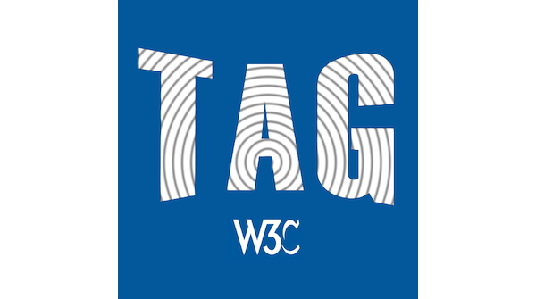
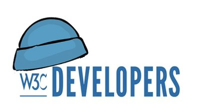

> Read the main outcomes of the \#color \#W3CWorkshop at https://www\.w3\.org/Graphics/Color/Workshop/report\.html\#summary and watch all the talks' 🎬 on @w3c's YT channel: https://www\.youtube\.com/playlist?list\=PLNhYw8KaLq2UP\_XETn9k\_bh2338EWGbSd https://twitter\.com/w3c/status/1587106638854594562

 [Nov 02 2022, 09:24:53 UTC](https://twitter.com/w3cdevs/status/1587737500327575553)

----

> The \#WebXR Augmented Reality module was released as a \#CandidateRecommendation last week, a signal the spec is now considered mostly stable @ImmersiveWebW3C \#AR \#timetoimplement https://twitter\.com/w3c/status/1587362513636786179
> This module of \#WebXR adds augmented\-reality hardware\-specific functionalities to WebXR \- making it possible to use it not just in fully virtual spaces, but also in spaces overlaid with the real world  
> https://www\.w3\.org/TR/webxr\-ar\-module\-1/

 [Nov 07 2022, 16:13:13 UTC](https://twitter.com/w3cdevs/status/1589652200527396864)

----

> Find more about browser support for these \#AR features https://immersiveweb\.dev/\#supporttable \- this already works both on mobile "magic window" mode and with full\-fledged AR headsets

 [Nov 07 2022, 16:13:14 UTC](https://twitter.com/w3cdevs/status/1589652205959008257)

----

> This completes the core \#WebXR spec which was released as a \#CandidateRecommendation earlier this year \.\./2022/2022\-04\-tweets\.html\#x1509894550927650838

 [Nov 07 2022, 16:13:15 UTC](https://twitter.com/w3cdevs/status/1589652208370724864)

----

> Watch the Augmented Reality\-related 🎬 on the WebXR YouTube channel https://www\.youtube\.com/watch?v\=RaB\_Uyqx6Q4&list\=PLW2iP2Rz9wsKmxAoOBSW35w0pABnssdKI

 [Nov 07 2022, 16:13:16 UTC](https://twitter.com/w3cdevs/status/1589652213659766784)

----

> Discover and follow some of the people behind the spec https://twitter\.com/AysSomething/status/1587861216508231681

 [Nov 07 2022, 16:13:16 UTC](https://twitter.com/w3cdevs/status/1589652211012800513)

----

> And if you have any feedback on the specification, head to the \#GitHub repo\! https://github\.com/immersive\-web/webxr\-ar\-module

 [Nov 07 2022, 16:13:17 UTC](https://twitter.com/w3cdevs/status/1589652215895306241)

----

> The recently launched @w3c WebDX \#CommunityGroup is looking at coordinated approaches to improve the overall developer experience of the \#WebPlatform \- which a number surveys have shown to be lacking in several aspects\. https://twitter\.com/w3c/status/1589988726922510336
> What needs fixing? A first pillar of the work of the group is to facilitate shared research on developer needs, to improve the shared understanding of the gaps to maximize impact\.  
> https://github\.com/web\-platform\-dx/admin/blob/main/charter\.md

 [Nov 08 2022, 14:41:30 UTC](https://twitter.com/w3cdevs/status/1589991508203036673)

----

> A key theme of the results of these surveys is how painful it is for developers to deal with fragmentation among browsers\. This led to the launch of the Interop project, focused on reducing that fragmentation\. https://mobile\.twitter\.com/foolip/status/1574390465113325568

 [Nov 08 2022, 14:41:32 UTC](https://twitter.com/w3cdevs/status/1589991516231323648)

----

> This builds on the cross\-vendor collaboration &gt; that was at the source of the @mozdevnet Developer Needs Assessment surveys in 2019 and 2020  
> https://mobile\.twitter\.com/MozDevNet/status/1339308367463002112

 [Nov 08 2022, 14:41:32 UTC](https://twitter.com/w3cdevs/status/1589991513496637441)

----

> This work on feature mapping constitutes the second focus of the group, where we expect to work with @mozdevnet, @caniuse and others to make it easier to navigate the non\-stop evolution of the \#WebPlatform\.

 [Nov 08 2022, 14:41:33 UTC](https://twitter.com/w3cdevs/status/1589991521176424448)

----

> The WebDX Community Group is helping with providing additional data on fragmentation, with additional surveys running on @mozdevnet, but also by improving how we map and track progress on features deployment \- see @tidoust's initial research the topic  
> https://github\.com/web\-platform\-dx/feature\-set/blob/main/towards\-features\.md

 [Nov 08 2022, 14:41:33 UTC](https://twitter.com/w3cdevs/status/1589991518814994434)

----

> If you want to help, the WebDX \#CommunityGroup as all Community Groups is open for all to join\! https://www\.w3\.org/community/webdx/

 [Nov 08 2022, 14:41:34 UTC](https://twitter.com/w3cdevs/status/1589991523462320129)

----

> 🗳️ Election time for @w3ctag\! There are seven nominees for three seats: Brandon Baraban \(@koodos\), @sundress \(@igalia\), @rhiaro \(@digitalbazaar\), @hober \(@Apple\), Martin Thomson \(@mozilla\), @LeaVerou \(W3C \#InvitedExpert nominated by @openjs\) and Song Xu \(@ChinaMobile7\)\.
> Read all TAG nominees statements, describing their aspirations on the role of the @w3ctag and their impact on it: https://www\.w3\.org/2022/11/15\-tag\-nominations\.html 
> 
> 

 [Nov 28 2022, 14:17:40 UTC](https://twitter.com/w3cdevs/status/1597233265718747136)

----

> The @w3c membership elects the TAG members\. This election is open until 14 December 2022\.   
> The @w3ctag serves as an advocate for developer interests and consistent design principles\. Learn more: \.\./2018/2018\-01\-tweets\.html\#x957974903122219008

 [Nov 28 2022, 14:17:42 UTC](https://twitter.com/w3cdevs/status/1597233272698044419)

----

> Happy Blue Beanie Day\! @bluebeanieday   
> Thank you for supporting and adopting \#WebStandards \#a11y 
> 
> 

 [Nov 30 2022, 11:33:59 UTC](https://twitter.com/w3cdevs/status/1597916851224604673)