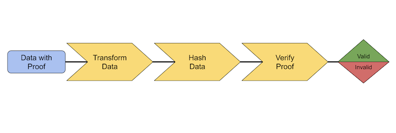

> 1 Dec\.: the @w3c \#WoT \#CommunityGroup organizes a meetup focused on \#SmartHomes  
> https://www\.w3\.org/events/meetings/07d67134\-f9d0\-4c8a\-ba1e\-24f25babef8c
> 🗓️ December@w3c: \#WoT meetup, W3C workshop\. More at https://www\.w3\.org/participate/eventscal\.html

 [Dec 01 2022, 12:59:25 UTC](https://twitter.com/w3cdevs/status/1598300739579023365)

----

> 5\-6 Dec\.: the \#W3CWorkshop on \#permissions takes place in \#Munich 🇩🇪\. Check out the workshop's agenda: https://www\.w3\.org/Privacy/permissions\-ws\-2022/schedule

 [Dec 01 2022, 12:59:26 UTC](https://twitter.com/w3cdevs/status/1598300742095458306)

----

> 🗓️ The @w3c membership is invited to vote until 14 January 2023 in the special election for the W3C Advisory Board \(@W3CAB\) to fill four vacated seats as of January 2023\. https://twitter\.com/w3c/status/1598615366367940608
> The 11 candidates are Qing An, Marcos Cáceres, @t, @npdoty, @fantasai, @annettegreiner, @tobie, @chaals, Michael Prorock, @wendy\_a\_reid and Jennifer Strickland   
> Read their nomination statements: https://www\.w3\.org/2022/11/ab\-nominations

 [Dec 02 2022, 10:54:29 UTC](https://twitter.com/w3cdevs/status/1598631685507121152)

----

> The W3C Advisory Board \(AB\) provides ongoing guidance to the @w3c team on issues of strategy, management, legal matters, process, and conflict resolution\. Check out their current projects at https://www\.w3\.org/wiki/AB

 [Dec 02 2022, 10:54:30 UTC](https://twitter.com/w3cdevs/status/1598631690456268800)

----

> The @w3c Verifiable Credentials \#WorkingGroup publishes a \#JSON Web Signature Suite created in 2020 for the Verifiable Credentials Data Integrity Proof specification \#security \#privacy \#verifiablecredential  \#FPWD \#timetogiveinput https://twitter\.com/w3c/status/1600779507832688641
> A data integrity proof provides information about the proof mechanism, parameters required to verify that proof, and the proof value itself\.   
> The Verifiable Credential Data Integrity 1\.0 document has been recently published as \#FPWD: https://twitter\.com/w3c/status/1595059278150254598

 [Dec 08 2022, 12:17:10 UTC](https://twitter.com/w3cdevs/status/1600826819313545217)

----

> To verify a cryptographic proof, data is transformed, hashed, and checked for correctness\. 
> 
> 

 [Dec 08 2022, 12:17:11 UTC](https://twitter.com/w3cdevs/status/1600826825965375489)

----

> Feedback and comments are welcome in the related \#GitHub repo: https://github\.com/w3c/vc\-jws\-2020/

 [Dec 08 2022, 12:17:12 UTC](https://twitter.com/w3cdevs/status/1600826829576687616)

----

> Web Platform design principles have been collected during the @w3cTAG discussions in reviewing developing specifications, and build upon the Ethical Web Principles\. Find out more in @hober's presentation at last \#w3cTPAC: https://tess\.oconnor\.cx/2022/09/ethical\-web\-principles
> The @w3cTAG opens a design review discussion on \#GitHub \- https://github\.com/w3ctag/design\-reviews/discussions/793\#discussion\-4636585, and encourages the community to come and ask questions relating to the "Web Platform Design Principles" or other aspects of the \#WebPlatform architecture https://w3ctag\.github\.io/design\-principles/ cc @torgo

 [Dec 09 2022, 14:06:09 UTC](https://twitter.com/w3cdevs/status/1601216635289079808)

----

> This document by @emvco, @FIDOAlliance and @w3c, describes how the technologies in scope may be used together to address a specific use case: secure card \#payment during an \#ecommerce guest checkout on the Web \(i\.e\., browser\-based scenarios\) \#security \#privacy \#usability https://twitter\.com/w3c/status/1602587215284027393

 [Dec 13 2022, 09:52:37 UTC](https://twitter.com/w3cdevs/status/1602602383766437888)

----

> 15\-16 Dec\.: @svgeesus gives tips on how to escape the sRGB prison @WeyWeyWeb, in \#Malaga🇪🇸 https://weyweyweb\.com

 [Dec 15 2022, 10:45:11 UTC](https://twitter.com/w3cdevs/status/1603340385820049408)

----

> 🇪🇺 Apply now before 15 Feb\. 23 if you are based in \#Europe and looking for \#funds to support your work on @w3c \#WebStandards\. The main topic for this 9th Open Call is "\#IoT, Cloud and Edge", but also \#a11y, \#security, \#privacy, \#ontologies, etc\. Read more https://www\.standict\.eu/index\.php/standicteu\-2023\-9th\-open\-call https://twitter\.com/Stand\_ICT/status/1603654921387212803

 [Dec 16 2022, 08:42:03 UTC](https://twitter.com/w3cdevs/status/1603671786834595840)

----

> 👏👏👏 Congratulations to @rhiaro \(@digitalbazaar\), @hober \(@Apple\) and @LeaVerou \(\#W3CInvitedExpert\) for their election to the @w3ctag\! https://twitter\.com/w3c/status/1603684268382851072
> In addition to @w3ctag's co\-chairs @timberners\_lee, @plinss and @torgo, they join @cssrossen \(@Microsoft\), @hadleybeeman \(\#W3CInvitedExpert\), Dapeng \(Max\) Liu \(@AlibabaGroup\) and @sangwhanmoon \(@Google\)\. @wz43rtx remains the staff contact\. See https://www\.w3\.org/2001/tag/

 [Dec 16 2022, 09:49:49 UTC](https://twitter.com/w3cdevs/status/1603688843135385600)

----

> The @w3ctag provides feedback on nearly any Web related specification, including work happening outside @w3c\. Find out how to work with the @w3c TAG:   
> https://tag\.w3\.org/workmode/

 [Dec 16 2022, 09:49:51 UTC](https://twitter.com/w3cdevs/status/1603688849040969729)

----

> This specification defines 3 concepts: processing units \(such as the CPU\), supported sources \(such as \#GPU\), sampling and reporting rates\. Read more at https://www\.w3\.org/TR/2022/WD\-compute\-pressure\-20221220/\#concepts
> The Compute Pressure \#API defines a set of pressure states \(e\.g\. high CPU load\) delivered to a \#Web \#application to signal when adaptation of the workload is appropriate to ensure consistent quality of service\. \#timetogiveinput \! \#FPWD   
> https://www\.w3\.org/TR/2022/WD\-compute\-pressure\-20221220/ https://twitter\.com/w3c/status/1605104958839349248

 [Dec 20 2022, 13:18:35 UTC](https://twitter.com/w3cdevs/status/1605190931912790018)

----

> Feedback is welcome in the \#GitHub repo\! https://github\.com/wicg/compute\-pressure/

 [Dec 20 2022, 13:18:36 UTC](https://twitter.com/w3cdevs/status/1605190936081874944)

----

> How to properly calculate pressure and key usage scenarios are described in this explainer: https://github\.com/wicg/compute\-pressure/\#readme

 [Dec 20 2022, 13:18:36 UTC](https://twitter.com/w3cdevs/status/1605190934114828288)