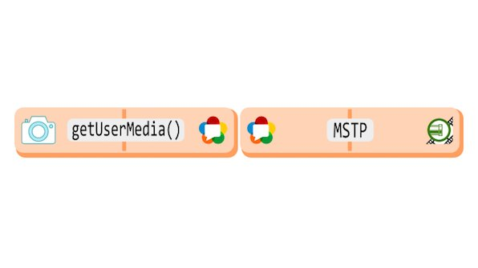
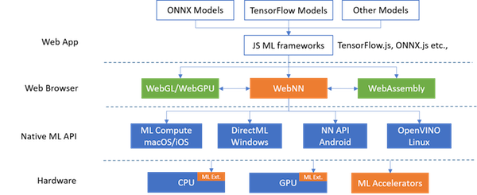

> 🗓️ March@w3c: CSUN, Web payments, Web of data and @thew3cx courses\. See also https://www\.w3\.org/participate/eventscal\.html
> 1 Mar\.: @ibjacobs participates in the "State of the \#Payments Industry" panel at the 2023 \#PaymentsSummit event in \#SaltLakeCity 🇺🇸\#WebPayments https://www\.stapayments\.com/2023\-agenda/

 [Mar 02 2023, 09:59:17 UTC](https://twitter.com/w3cdevs/status/1631232701838630912)

----

> 14 Mar\.: the @w3c\_wai team is present at the 38th edition of @CSUN conference at \#Anaheim 🇺🇸 and @charadani gives a talk on the WAI curricula as a "Framework to Build Your Own Courses" https://www\.csun\.edu/cod/conference/sessions/index\.php/public/presentations/view/1388 \#CSUNATC23 \#a11y
> 9 Mar\.: seminar organized by the W3C chapter for Spanish\-speaking countries, with a focus on "Web technologies for \#mobile apps development" at the Escuela de Comercio, in Gijón, Asturias 🇪🇸 https://chapters\.w3\.org/hispano/event/tecnologias\-web\-para\-desarrollar\-aplicaciones\-moviles/

 [Mar 02 2023, 09:59:18 UTC](https://twitter.com/w3cdevs/status/1631232706829770753)

----

> \.\.\. and register to @thew3cx "Introduction to Web Accessibility" online course on @edXOnline that provides the foundation in digital \#accessibility to make your websites and apps work well for people with disabilities https://www\.edx\.org/course/web\-accessibility\-introduction

 [Mar 02 2023, 09:59:19 UTC](https://twitter.com/w3cdevs/status/1631232709707087872)

----

> Learn Front\-End Web development with @thew3cx \#MOOCs: \#HTML5 \#JavaScript \#CSS on @edXOnline  https://www\.edx\.org/professional\-certificate/w3cx\-front\-end\-web\-developer

 [Mar 02 2023, 09:59:20 UTC](https://twitter.com/w3cdevs/status/1631232715071561728)

----

> 16 Mar\.: @pchampin gives a keynote speech on "Semantic interoperability at W3C" at the online European Data Conference on Reference Data and Semantics \#ENDORSE2023 by @EULawDataPubs \#OpenData https://op\.europa\.eu/en/web/endorse\-2023/programme

 [Mar 02 2023, 09:59:20 UTC](https://twitter.com/w3cdevs/status/1631232712269869056)

----

> We invite public feedback on a beta release of the @w3c website redesign\. Take a look at https://beta\.w3\.org and give us your comments via this \#GitHub repo: https://github\.com/w3c/w3c\-website https://twitter\.com/studio24/status/1630579325593436160
> From your \#developers POV, how can our new website make it easier for you to get involved in W3C? This is an opp to let us know\! Our DMs are open\.

 [Mar 08 2023, 09:52:35 UTC](https://twitter.com/w3cdevs/status/1633405343194664960)

----

> We invite public comments through 5 April 2023 for the proposed draft charter for the Web \#MachineLearning \#WorkingGroup https://twitter\.com/w3c/status/1633039444663054336
> The mission of this group, created in April 2021, is to develop \#APIs for enabling efficient machine learning inference in the \#browser  
> \.\./2021/2021\-04\-tweets\.html\#x1384509330792222727

 [Mar 08 2023, 12:36:06 UTC](https://twitter.com/w3cdevs/status/1633446492743561218)

----

> 🆒 Interested in \#WebRTC, \#WebCodecs and Streams? @w3c staff, @dontcallmeDOM and @tidoust, explore how \#WebApps can build processing media pipelines in this @webrtcHacks article: https://webrtchacks\.com/real\-time\-video\-processing\-with\-webcodecs\-and\-streams\-processing\-pipelines\-part\-1/
> They developed a demo illustrating different \#video processing technologies: https://github\.com/tidoust/media\-tests/ \- check it out and contribute\!

 [Mar 14 2023, 15:42:34 UTC](https://twitter.com/w3cdevs/status/1635667745772544000)

----

> To help visualize how to compose processing pipelines, they use the metaphor of a game of dominoes \(left side\=input ; right side\=output\)\. Three types of dominoes: generators, transformers and consumers\. For ex\., generating a stream from a \#WebRTC track or camera looks like this: 
> 
> 

 [Mar 14 2023, 15:42:35 UTC](https://twitter.com/w3cdevs/status/1635667750960918528)

----

> This is the first of a two\-part series and it  provides a review of the steps and pitfalls in a multi\-step video processing pipeline using existing and the newest web \#APIs like \#WebCodecs and @streamsstandard\. Stay tuned for Part 2\!

 [Mar 14 2023, 15:42:36 UTC](https://twitter.com/w3cdevs/status/1635667753334980611)

----

> It addresses key authoring differences to be aware of when migrating or when using both attributes together\. The document also provides a table that maps the semantics to the corresponding roles: https://www\.w3\.org/TR/2023/NOTE\-epub\-aria\-authoring\-11\-20230314/\#sec\-mappings
> Edited by the \#EPUB3 \#WorkingGroup, this guide is for \#publishers looking to move from the use of the 'epub:type' attribute to \#WAI\_ARIA roles for \#accessibility, and thus ensuring that they are properly applied for their intended purposes and audiences https://www\.w3\.org/TR/epub\-aria\-authoring\-11/ https://twitter\.com/w3c/status/1635566410872020993

 [Mar 15 2023, 12:59:43 UTC](https://twitter.com/w3cdevs/status/1635989153144872961)

----

> Feedback is welcome in this \#GiHub repo: https://github\.com/w3c/epub\-specs/

 [Mar 15 2023, 12:59:44 UTC](https://twitter.com/w3cdevs/status/1635989154944241664)

----

> 23 Mar\.: The @W3C\_WoT \#CommunityGroup organizes a meetup on Empowering Industrial Automation with \#WoT \#DigitalTwin \#IoT https://www\.w3\.org/events/meetings/e72912b5\-3087\-440e\-950e\-886acbab645d

 [Mar 20 2023, 09:27:15 UTC](https://twitter.com/w3cdevs/status/1637747619509280769)

----

> Anyone can apply to participate to this \#W3CWorkshop \- we want to hear from web app security experts and practitioners, as well as developers with experience in deploying Web \#security standards and practices\. Read the CfP to know more\! https://www\.w3\.org/2023/03/secure\-the\-web\-forward/cfp\.html
> 🆕 Call for Participation\! With \#WebApps deployed seamlessly at scale, they're under significant risk of exposing exploitable vulnerabilities\. @w3c organizes a "Secure the Web Forward" workshop on June 7\-8, \#London💂🇬🇧, @MSFTReactor \#security \#developers https://www\.w3\.org/2023/03/secure\-the\-web\-forward/

 [Mar 20 2023, 12:24:40 UTC](https://twitter.com/w3cdevs/status/1637792271125946368)

----

> The workshop is presented jointly by @w3c, @theopenssf @owasp, and @openjsf\. The event's agenda is built by a PC constituted of @torgo, @hadleybeeman @OWASPDirPrjTech @jorydotcom @rginn206 @dontcallmeDOM @lehors @mikewest and Christopher 'CRob' Robinson https://www\.w3\.org/2023/03/secure\-the\-web\-forward/index\.html\#pc

 [Mar 20 2023, 12:24:41 UTC](https://twitter.com/w3cdevs/status/1637792276012212224)

----

> Also, if you're interested to speak at the event, please submit a position paper before April 24 with the perspective you would like to bring on the topic: https://www\.w3\.org/2023/03/secure\-the\-web\-forward/cfp\.html\#submit

 [Mar 20 2023, 12:24:41 UTC](https://twitter.com/w3cdevs/status/1637792273567031298)

----

> \#i18n https://twitter\.com/r12a/status/1638602819107188736

 [Mar 23 2023, 06:41:49 UTC](https://twitter.com/w3cdevs/status/1638793154102018049)

----

> As part of @w3c's ongoing efforts to promote and protect \#privacy on the web, the Privacy Principles document provides definitions for privacy as well as a set of principles that should ensure that the web is a trustworthy platform https://www\.w3\.org/TR/privacy\-principles/ https://twitter\.com/w3c/status/1638619234488950801
> This document elaborates on the privacy principle "Security and privacy are essential" as documented in  the @w3ctag's Ethical Web Principles: https://www\.w3\.org/TR/ethical\-web\-principles/\#privacy

 [Mar 23 2023, 13:00:08 UTC](https://twitter.com/w3cdevs/status/1638888359002095618)

----

> This builds on previous work by the @w3c’s Privacy \#InterestGroup and the @w3ctag’s "\#security &amp; \#privacy \#questionnaire and \#ethical Web principles", which underscore the importance of respecting users’ privacy in web design and development: https://w3ctag\.github\.io/security\-questionnaire/

 [Mar 23 2023, 13:00:09 UTC](https://twitter.com/w3cdevs/status/1638888363162828802)

----

> Feedback is welcome in the \#GitHub repo: https://github\.com/w3ctag/privacy\-principles/

 [Mar 23 2023, 13:00:10 UTC](https://twitter.com/w3cdevs/status/1638888368489521153)

----

> This Privacy Principles document intends to become a "W3C Statement", a new way for the W3C \#community to endorse non\-technical specifications as a @w3c position: https://www\.w3\.org/2021/Process\-20211102/\#memo

 [Mar 23 2023, 13:00:10 UTC](https://twitter.com/w3cdevs/status/1638888366010937345)

----

> Yesterday's @thekhronosgroup meetup demonstrated that \#WebGL and \#WebGPU APIs are supported by vibrant online communities\! Watch an update of the WebGPU work by Kelsey Gilbert \(co\-chair of the @w3c WebGPU \#WorkingGroup\): https://www\.youtube\.com/watch?v\=oWwtCDv3Pgg&t\=2407s https://twitter\.com/WebGL/status/1638710905037783040
> \#WebGPU exposes an \#API for performing operations, such as rendering and computation, on a GPU\. Read more about the @w3c WebGPU group: https://www\.w3\.org/groups/wg/gpu 
> 
> 

 [Mar 23 2023, 15:13:11 UTC](https://twitter.com/w3cdevs/status/1638921842609246208)

----

> At this meetup, it was also announced that @unity is working on \#WebGPU support\!   
> https://www\.youtube\.com/watch?v\=oWwtCDv3Pgg&t\=6419s

 [Mar 23 2023, 15:13:12 UTC](https://twitter.com/w3cdevs/status/1638921848246206464)

----

> \#WebStandard @w3c "Geolocation API" は日本語に翻訳されています: https://www\.asahi\-net\.or\.jp/\~ax2s\-kmtn/internet/geo/REC\-geolocation\-20220901\.html どうもありがとう @omnidirect \! \#w3c\_keio \#Translation 🇯🇵 https://twitter\.com/w3c/status/1640294005500944385

 [Mar 27 2023, 11:50:22 UTC](https://twitter.com/w3cdevs/status/1640320353053409280)

----

> 🆕You've enjoyed reading the creation of a multi\-step video processing pipeline? This second article by @tidoust explores the actual processing of \#video frames\! ➡️ https://webrtchacks\.com/video\-frame\-processing\-on\-the\-web\-webassembly\-webgpu\-webgl\-webcodecs\-webnn\-and\-webtransport/ \.\./2023/2023\-03\-tweets\.html\#x1635667745772544000
> Technologies involved are \#JavaScript \#WebAssembly \#WebGPU \#WebCodecs \#WebGL \#WebTransport \#WebNN  
> Do not hesitate to give feedback and contribute to an experimental code for creating video processing pipelines using these web technologies: https://github\.com/tidoust/media\-tests/

 [Mar 28 2023, 12:17:30 UTC](https://twitter.com/w3cdevs/status/1640689570650914818)

----

> Continued collaboration to enhance the \#security and \#interoperability of web \#payments to support seamless \#ecommerce checkout experiences and promote consumer \#privacy by @EMVCo, @FIDOAlliance and @w3c in the Web Payments Security \#InterestGroup \(WPSIG\) https://twitter\.com/w3c/status/1640701063606018048

 [Mar 28 2023, 13:17:25 UTC](https://twitter.com/w3cdevs/status/1640704648289058817)

----

> The \#WebNN \#API is a specification for constructing and executing computational graphs of \#NeuralNetworks\. It provides \#WebApps with the ability to create, compile, and run machine learning models in web browsers \#timetoimplement https://www\.w3\.org/TR/webnn/ https://twitter\.com/w3c/status/1641349326742986752
> \#MachineLearning frameworks will be key consumers of the \#WebNN API \- most \#developers will benefit from the performance boost enabled by WebNN through frameworks such as \#TensorFlowJS \#ONNX Web or @ml5js 
> 
> 

 [Mar 30 2023, 08:36:30 UTC](https://twitter.com/w3cdevs/status/1641358727910420481)

----

> Read the explainer that lists some common use cases applying to a wide range of \#WebApps: https://github\.com/webmachinelearning/webnn/blob/main/explainer\.md \#MachineLearning

 [Mar 30 2023, 08:36:31 UTC](https://twitter.com/w3cdevs/status/1641358734113873920)

----

> Please give feedback via their \#GitHub repo: https://github\.com/webmachinelearning/webnn

 [Mar 30 2023, 08:36:32 UTC](https://twitter.com/w3cdevs/status/1641358736148115457)

----

> The mission of the Decentralized Identifier \#WorkingGroup is to standardize the DID URI scheme, the data model and syntax of DID Documents and the requirements for DID Method specifications https://www\.w3\.org/groups/wg/did https://twitter\.com/w3c/status/1641340427256094720

 [Mar 30 2023, 08:50:25 UTC](https://twitter.com/w3cdevs/status/1641362231999844352)