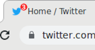
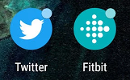
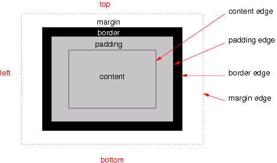

> 🗓️ April@w3c: \#WoT meetup, @thew3cx \#MOOC, \#W3CWorkshop, etc\. More at https://www\.w3\.org/participate/eventscal\.html
> 4 Apr\.: The @W3C\_WoT \#CommunityGroup organizes a         meetup \(online\) on "Automated Industrial Asset Onboarding Using Open Standards" \#WoT \#IoT \#interoperability https://www\.w3\.org/events/meetings/322db7e4\-1a9f\-44c6\-8ddf\-af601043dfb9

 [Apr 03 2023, 07:54:35 UTC](https://twitter.com/w3cdevs/status/1642797731037970433)

----

> 11 Apr\.: Join a new session of @thew3cx \#HTML5 and \#CSS Fundamentals online course to learn basics of           front\-end Web development: https://www\.edx\.org/course/html5\-and\-css\-fundamentals @edXOnline

 [Apr 03 2023, 07:54:36 UTC](https://twitter.com/w3cdevs/status/1642797736519954432)

----

> 24 Apr\.: Deadline to submit a position paper or a statement of  interest to the "Secure the Web Forward" \#W3CWorkshop jointly organized by @w3c, @owasp @theopenssf and @openjsf https://www\.w3\.org/2023/03/secure\-the\-web\-forward/cfp\.html \#security \#developers

 [Apr 03 2023, 07:54:37 UTC](https://twitter.com/w3cdevs/status/1642797739560804353)

----

> \#Translation \#i18n \#French https://twitter\.com/webi18n/status/1643538438749052928

 [Apr 05 2023, 10:09:31 UTC](https://twitter.com/w3cdevs/status/1643556466006032384)

----

> The Badging \#API allows web \#developers to set an application badge for installed  \#WebApps \#PWA \#timetogiveinput https://w3c\.github\.io/badging/ https://twitter\.com/w3c/status/1643950234647535616
> A badge is meant to notify the user that there is new activity such as showing the number of unread items\. A badge can have one of these  values: nothing, flag, a number\. Examples of badges: 
> 
> 
> 
> 
> 
> 
> 
> 

 [Apr 06 2023, 12:40:27 UTC](https://twitter.com/w3cdevs/status/1643956834141712385)

----

> Check also the browser support for this feature on @MozDevnet: https://developer\.mozilla\.org/en\-US/docs/Web/API/Badging\_API\#browser\_compatibility

 [Apr 06 2023, 12:40:29 UTC](https://twitter.com/w3cdevs/status/1643956844841320449)

----

> Read more in the \#explainer: https://github\.com/w3c/badging/blob/main/explainer\.md

 [Apr 06 2023, 12:40:29 UTC](https://twitter.com/w3cdevs/status/1643956842064748544)

----

> Time to join the @w3c Web \#MachineLearning group of participants\!  https://www\.w3\.org/groups/wg/webmachinelearning/participants https://twitter\.com/w3c/status/1643892599617384448

 [Apr 06 2023, 13:20:42 UTC](https://twitter.com/w3cdevs/status/1643966966669901824)

----

> Layout in \#CSS starts with boxes\. The basic box is a rectangle with margins on all sides \(to offset it from other boxes\), a border, some padding \(to separate the content from the border\), and content \(text, an image, other boxes\)\. 
> 
> 
> Congrats to editor @fantasai and the @csswg for the newly published @w3c \#WebStandard "CSS Box Model Module Level 3" \#timetoadopt \#CSS https://www\.w3\.org/TR/css\-box\-3/ https://twitter\.com/w3c/status/1643902329555386369

 [Apr 06 2023, 16:13:17 UTC](https://twitter.com/w3cdevs/status/1644010398277074945)

----

> CSS Box Level 3 is listed in the \#CSS Snapshot 2023 document as a stable  specification with enough implementation: https://www\.w3\.org/TR/css/

 [Apr 06 2023, 16:13:18 UTC](https://twitter.com/w3cdevs/status/1644010400827035648)

----

> Back in May 2011, @w3c create Community Groups to enable \#developers, \#designers and anyone else to socialize their ideas for the \#Web for possible future standardization\. The program started with 6 groups, and by March 2023, this number reached 386\! 
> 
> 
> But not all ideas manage to build momentum\. In order to improve the visibility of active \#CommunityGroups, we have just closed 208 of them that had been dormant for a while and that no\-one stepped up to revive \- https://www\.w3\.org/community/

 [Apr 13 2023, 13:17:02 UTC](https://twitter.com/w3cdevs/status/1646502756847431685)

----

> Community Groups are a critical piece in @w3c of how new Web technologies emerge and how Web standards get incubated\.

 [Apr 13 2023, 13:17:03 UTC](https://twitter.com/w3cdevs/status/1646502762039918595)

----

> You are welcome to start a \#CommunityGroup \(or more\!\): pick a topic, write a short scope  statement and get support from four other parties for the creation of the group\. W3C provides the tools and infrastructure\. Read more: https://www\.w3\.org/community/about/faq/

 [Apr 13 2023, 13:17:04 UTC](https://twitter.com/w3cdevs/status/1646502764044771330)

----

> Have you come up with one or more discussion topics to drive \#developer awareness and adoption of  web \#security standards and practices? The submission deadline is in a few days\! \#W3CWorkshop \.\./2023/2023\-04\-tweets\.html\#x1642797739560804353

 [Apr 19 2023, 09:32:17 UTC](https://twitter.com/w3cdevs/status/1648620524715556866)

----

> Detailed program of the "\#developer and \#w3c track" is at https://whova\.com/embedded/session/CoG3ZDaLVhS5fsXbJbIaNsrmRyKC8FXDou\-fJSOCPz0%3D/3012598/ \#TheWebConf2023
> Interested in \#PWA, \#EPUB, Invisible markup, \#WebSpeech, \#WebAudio, and Solid? Join the Developer and W3C track @TheWebConf on 2 May 2023, in \#Austin 🇺🇸  
> https://www2023\.thewebconf\.org/

 [Apr 26 2023, 07:14:43 UTC](https://twitter.com/w3cdevs/status/1651122620480339970)

----

> And do not miss the keynote on \#DIDs by Clare Nelson \(@Safe\_SaaS\), executive director of the Decentralized Identity Foundation \(@DecentralizedID\) \#TheWebConf2023   
> https://whova\.com/embedded/session/CoG3ZDaLVhS5fsXbJbIaNsrmRyKC8FXDou\-fJSOCPz0%3D/3023960/

 [Apr 26 2023, 07:14:44 UTC](https://twitter.com/w3cdevs/status/1651122623013691393)