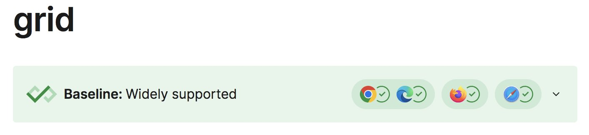
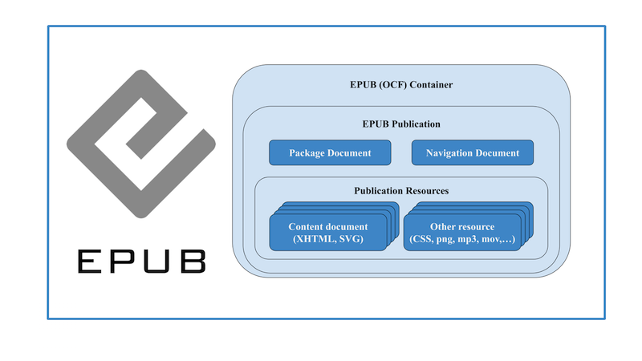

> Contribute to the \#GitHub repos for these 2 \#VerifiableCredentials specs, resp\.: https://github\.com/w3c/vc\-status\-list\-2021/ and https://github\.com/w3c/vc\-jwt/ \#timetogiveinput https://twitter\.com/w3c/status/1653388623096475650

 [May 03 2023, 09:13:47 UTC](https://twitter.com/w3cdevs/status/1653689297029955588)

----

> 9\-10 May: @w3c member\-only AC \(Advisory Committee\) meeting \(hybrid\) that focus structure of the New W3C, its vision and the challenges ahead
> 🗓️ May@w3c: member meeting, WAI training, etc\. More at https://www\.w3\.org/participate/eventscal\.html

 [May 03 2023, 15:16:47 UTC](https://twitter.com/w3cdevs/status/1653780652162949124)

----

> 9\-12 May: during the hybrid \#AccessU training conference, @shawna\_slh leads an interactive plenary "Working Together to Advance Digital \#Accessibility" \#a11y  
> https://knowbility\.org/programs/john\-slatin\-accessu\-2023/wai\-and\-you\-working\-together\-to\-advance\-digital\-accessibility

 [May 03 2023, 15:16:48 UTC](https://twitter.com/w3cdevs/status/1653780654369251412)

----

> \.\.\. btw, don’t miss this unique @thew3cx course designed to give the foundation in \#accessibility: "Introduction to Web Accessibility" on @edXonline https://www\.edx\.org/course/web\-accessibility\-introduction

 [May 03 2023, 15:16:49 UTC](https://twitter.com/w3cdevs/status/1653780658118877189)

----

> \.\.\. Find the 📽️ recordings of previous meetups on the group's \#YouTube channel: https://www\.youtube\.com/@WoTCG

 [May 04 2023, 11:50:09 UTC](https://twitter.com/w3cdevs/status/1654091037726449665)

----

> 11 May: the @W3C\_WoT \#CommunityGroup organizes a         meetup \(online\) on "Advantages and Challenges of Web of Things for \#DigitalTwins" \#WoT \#IoT https://beta\.w3\.org/events/meetings/c51bb82c\-70ae\-4b77\-bc58\-40bd80f73fed/

 [May 04 2023, 11:50:09 UTC](https://twitter.com/w3cdevs/status/1654091035423719424)

----

> The workshop runs from 9am to 2pm CET and speakers, incl\. @dontcallmeDOM, will look at the intersection of web innovation, emerging standards for light app technologies, and mobile devices https://my\.weezevent\.com/web\-technologies\-for\-applications\-workshop\-coding\-contest
> 🆕and 🆓\! Register now for the "Web Technologies for   Applications" event, on 13 June 2023, in Paris 🇫🇷, by @Pole\_Systematic @w3c and @OW2\.   
> It consists of of a workshop and a coding contest:  
> https://systematic\-paris\-region\.org/evenement/web\-technologies\-for\-applications\-workshop\-and\-coding\-contest

 [May 10 2023, 07:42:46 UTC](https://twitter.com/w3cdevs/status/1656203109759168512)

----

> This 1\-day event is held just before the open source         conference \#OW2con'23, 14\-15 June 2023\. Make the most of your time in Paris 😃  
> https://twitter\.com/ow2/status/1653319452480487425

 [May 10 2023, 07:42:47 UTC](https://twitter.com/w3cdevs/status/1656203114708336641)

----

> In the afternoon, from 2pm to 6pm CET, groups of students are invited to a coding contest where they'll develop and test a light app for the promotion of the resources of a city \- \#PWA \#MiniApp \#QuickApp \#AppClips   
> https://my\.weezevent\.com/coding\-contest\-1306

 [May 10 2023, 07:42:47 UTC](https://twitter.com/w3cdevs/status/1656203112217030656)

----

> 🗳️ The @W3CAB election is starting, with 9 candidates for 6 seats\. The @w3c membership has until June 1, 2023 to choose their Advisory Board representatives https://twitter\.com/w3c/status/1655925335869751297
> 9 candidates: @wendy\_a\_reid \(@Rakuten\), Heejin Chung \(@Samsung\), @fantasai \(@Apple\), Song XU \(@ChinaMobile\), @t \(@mozilla\), Jennifer Strickland \(@MITREcorp\), @cwilso \(@Google\), @MaxGendler \(@newscorp\), Avneesh Singh \(@accessibledaisy\)\.  
> Read the statements\! https://www\.w3\.org/2023/04/ab\-nominations\.html

 [May 10 2023, 08:58:25 UTC](https://twitter.com/w3cdevs/status/1656222146190798849)

----

> The W3C Advisory Board \(AB\) @W3CAB provides ongoing guidance to the @w3c team\. Their work priorities for 2022 are documented in https://www\.w3\.org/wiki/AB/2023\_Priorities 
> 
> 

 [May 10 2023, 08:58:26 UTC](https://twitter.com/w3cdevs/status/1656222151962230787)

----

> We welcome your feedback on the proposed Solid Working Group charter: https://solid\.github\.io/solid\-wg\-charter/charter/  
> Please use \#github issues: https://github\.com/solid/solid\-wg\-charter/issues https://twitter\.com/w3c/status/1656286564714967040

 [May 10 2023, 13:41:47 UTC](https://twitter.com/w3cdevs/status/1656293458166919175)

----

> The agenda is now avail\.\! https://systematic\-paris\-region\.org/evenement/web\-technologies\-for\-applications\-workshop\-and\-coding\-contest/ \.\./2023/2023\-05\-tweets\.html\#x1656203106965766145

 [May 15 2023, 08:41:36 UTC](https://twitter.com/w3cdevs/status/1658029852019109890)

----

> The @w3c WebDX \#CommunityGroup has been working on a cartography of the  Web Platform as a set of features, with focus on surfacing the interoperable ones based on their implementation  status across browsers\. This work is at the core of this @MozDevNet baseline concept https://twitter\.com/MozDevNet/status/1656391302030712836
> The Baseline badge provides a quick and convenient way to determine the reliability of using a particular feature or \#API in your website or \#WebApps\. This proposed approach at identifying a baseline aims to provide clear guidance for \#developers

 [May 16 2023, 15:08:43 UTC](https://twitter.com/w3cdevs/status/1658489662758092804)

----

> At the moment, only a few of  the many features described on @MozDevNet expose this Baseline badge, as  a way to solicit initial feedback from developers\. For example, check the grid CSS property documentation: https://developer\.mozilla\.org/en\-US/docs/Web/CSS/grid 
> 
> 

 [May 16 2023, 15:08:45 UTC](https://twitter.com/w3cdevs/status/1658489670165233666)

----

> Find out more about the WebDX CG \(and join\!\) \-  https://www\.w3\.org/community/webdx/\.   
> Co\-chairs @dontcallmeDOM and @tidoust gave context and next steps in this Nov\. 2022 article: https://www\.w3\.org/blog/2022/11/webdx\-improving\-the\-experience\-for\-web\-developers/

 [May 16 2023, 15:08:46 UTC](https://twitter.com/w3cdevs/status/1658489676280504320)

----

> To ensure that the feature\-set represents a useful signal for developers, we invite feedback and contributions in the related \#GitHub repo:  https://github\.com/web\-platform\-dx/feature\-set/issues

 [May 16 2023, 15:08:46 UTC](https://twitter.com/w3cdevs/status/1658489673327714311)

----

> The RDF\-star \#WorkingGroup released a significant milestone in the \#SemanticWeb and \#LinkedData technology stack: 16 new specifications \#FPWD \#timetogiveinput   
> https://www\.w3\.org/groups/wg/rdf\-star/publications  
> Let's dive into the details and understand why this is important 🧵👇 https://twitter\.com/w3c/status/1658499893537693696
> These 16 specs are new versions of previously existing recommendations from the former \#RDF Working Group and \#SPARQL, dating back to 2013\-2014\. The mission is to consider feedback from implementers and users to enhance these specifications\. Improvement is a key focus\!

 [May 17 2023, 12:01:50 UTC](https://twitter.com/w3cdevs/status/1658805019318136840)

----

> With the inclusion of RDF\-star, these specifications bring new features that allow making statements about statements\. This capability bridges the gap between RDF and Labeled Property Graph models, opening up exciting possibilities for data representation and integration\.

 [May 17 2023, 12:01:51 UTC](https://twitter.com/w3cdevs/status/1658805025102020610)

----

> Note that two recommendations are not yet included in the list of working drafts: RDF 1\.2 Semantics and SPARQL 1\.2 Entailment Regimes\. However, don't worry\! They will follow soon, ensuring a comprehensive and up\-to\-date suite of specifications

 [May 17 2023, 12:01:52 UTC](https://twitter.com/w3cdevs/status/1658805029493415943)

----

> RDF\-star has gained in popularity and several implementations already support it, with variations in adoption\. The RDF\-star WG, building upon the work of the RDF\-dev CG, aims to make RDF\-star fully interoperable by integrating it into RDF 1\.2 and SPARQL 1\.2 \#DataIntegration

 [May 17 2023, 12:01:52 UTC](https://twitter.com/w3cdevs/status/1658805027262066688)

----

> 📢 Congrats to editors Matt Garrish, Ivan Herman and @dauwhe for the newly published @w3c \#WebStandard EPUB3\.3, revolutionizing digital publishing \#timetoadopt https://www\.w3\.org/TR/epub\-33/ https://twitter\.com/reidmore\_online/status/1661722901169463297
> 📘 EPUB 3\.3 is a distribution and interchange format for digital publications and documents\. It enables the representation, packaging, and encoding of structured and semantically enhanced web content, including \#HTML, \#CSS, \#SVG, and more, in a single\-file container 
> 
> 

 [May 25 2023, 14:13:41 UTC](https://twitter.com/w3cdevs/status/1661737301968580612)

----

> 👥 The @w3cpublishing collaboration with EPUBCheck \#developers led to the creation of a comprehensive test suite\. Get ready to use epubcheck version 5\.0\.1 with EPUB 3\.3\!  
> https://www\.w3\.org/publishing/epubcheck/

 [May 25 2023, 14:13:43 UTC](https://twitter.com/w3cdevs/status/1661737313498701826)

----

> EPUB 3\.3 maintains backward compatibility with EPUB 3\.2\. No need to make changes to your current publication workflows when moving from 3\.2 to 3\.3\. \#EPUB3

 [May 25 2023, 14:13:43 UTC](https://twitter.com/w3cdevs/status/1661737310298456066)

----

> 🌐 In an effort to enhance \#accessibility, the EPUB Accessibility specification has been updated and it has become an integral part of the \#EPUB standard\. This aligns with the \#EUAccessibilityAct, shaping the future of Digital Publishing  
> https://www\.w3\.org/TR/epub\-a11y\-11/

 [May 25 2023, 14:13:44 UTC](https://twitter.com/w3cdevs/status/1661737316434726912)

----

> Join the digital publishing revolution with EPUB 3\.3\! \#EPUB \#DigitalPublishing  
> https://www\.w3\.org/publishing/groups/epub\-wg/

 [May 25 2023, 14:13:45 UTC](https://twitter.com/w3cdevs/status/1661737319253303296)