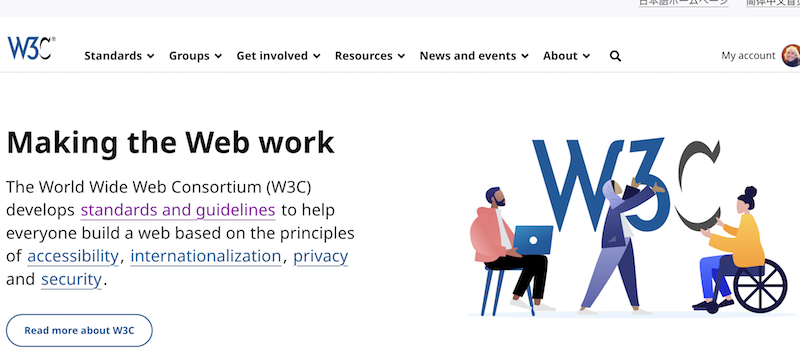

> 🗓️ June@w3c: @thew3cx MOOCs on \#CSS, \#HTML5 and \#JavaScript, workshop,  coding contest, meetup, forum, symposium, etc\. More at  https://www\.w3\.org/participate/eventscal\.html
> 1 June: the @W3C\_WoT \#CommunityGroup organizes a meetup \(online\) on "What is \#WoT" https://www\.w3\.org/events/meetings/177c3161\-bd01\-436b\-a2ae\-bf59412ead8f

 [Jun 01 2023, 14:57:25 UTC](https://twitter.com/w3cdevs/status/1664285025121230852)

----

> 13 June \- morning: register for 🆓 to the "Web technologies for  applications" event in Paris, 🇫🇷\!  Check out the great speakers: @dontcallmeDOM, @espinr, @alexbourlier, @webmink, @utopiah,  @rvailleux and @CPaterson2015 \#WebTechForApps @w3c  
> https://systematic\-paris\-region\.org/evenement/web\-technologies\-for\-applications\-workshop\-and\-coding\-contest/
> 9 June at 11am ET: @webrtcHacks organizes a livestream interview on \#WebTransport, \#WebCodecs and the future of \#WebRTC w/ @tidoust \(@w3c\), @bernard\_aboba \(@microsoft\) and @jordicenzano \(@meta\) \=&gt; https://webrtchacks\.com/livestream/  
> Following a series of 2 articles: \.\./2023/2023\-03\-tweets\.html\#x1635667745772544000

 [Jun 01 2023, 14:57:27 UTC](https://twitter.com/w3cdevs/status/1664285034348707842)

----

> 6 June: opening of a new session of @thew3cx "CSS Basics" course\. Learn how to style your Web site for a professional look and feel with \#CSS on @edXOnline  
> https://edx\.org/course/css\-basics

 [Jun 01 2023, 14:57:27 UTC](https://twitter.com/w3cdevs/status/1664285031442046976)

----

> 13 June \- afternoon: 🏆PRIZES to WIN\! Students are invited to a coding contest in \#Paris where they'll develop and test a light app for the promotion of the resources of a city \- \#PWA \#MiniApp \#QuickApp \#AppClips   
> Register\! https://my\.weezevent\.com/coding\-contest\-1306

 [Jun 01 2023, 14:57:28 UTC](https://twitter.com/w3cdevs/status/1664285038090010628)

----

> 13\-14 June: @tidoust explores the future of real\-time video processing with \#WebCodecs and \#Streams at the 10th "Media Web Symposium" event @fraunhoferfokus in \#Berlin, 🇩🇪  
> https://www\.fokus\.fraunhofer\.de/go/mws/detailed\-program 
> 
> 

 [Jun 01 2023, 14:57:29 UTC](https://twitter.com/w3cdevs/status/1664285042078810121)

----

> 19\-20 June: The @W3CChina staff organizes a Web Technology Forum: "Infinite Intelligence and Secure  Connection" in Beijing, 🇨🇳  
> https://www\.w3\.org/china\-web\-forum\-in\-beijing\-202306/index\.html

 [Jun 01 2023, 14:57:30 UTC](https://twitter.com/w3cdevs/status/1664285045417476099)

----

> 27 June: opening a new session of the @thew3cx "\#JavaScript Introduction" \#MOOC w/ Prof\. @micbuffa via @edxOnline \- Enroll now\!  https://www\.edx\.org/course/javascript\-introduction

 [Jun 01 2023, 14:57:31 UTC](https://twitter.com/w3cdevs/status/1664285051503415301)

----

> 27 June: new session of the \#HTML5 Coding Essentials and Best Practices @thew3cx \#MOOC with Prof\. @micbuffa on @edXOnline   
> https://www\.edx\.org/course/html5\-coding\-essentials\-and\-best\-practices

 [Jun 01 2023, 14:57:31 UTC](https://twitter.com/w3cdevs/status/1664285048546422784)

----

> Congrats to @t \(@mozilla\), @fantasai \(@Apple\), @wendy\_a\_reid \(@RakutenGroup\),  Avneesh Singh \(@accessibledaisy\), @cwilso \(@Google\) and Song XU  \(@ChinaMobile7\) 👏👏👏 https://twitter\.com/w3c/status/1665671132681306113
> The @W3CAB's priorities for 2023 are listed in: https://www\.w3\.org/wiki/AB/2023\_Priorities 
> 
> 

 [Jun 05 2023, 11:30:31 UTC](https://twitter.com/w3cdevs/status/1665682508204187651)

----

> Congrats to editors Joanmarie Diggs, James Nurthen, Michael Cooper and Carolyn MacLeod for the newly published @w3c \#WebStandard "WAI ARIA 1\.2" \#accessibility \#a11y \#timetoadopt  
> https://www\.w3\.org/TR/wai\-aria\-1\.2/ https://twitter\.com/w3c/status/1665964035492249601

 [Jun 06 2023, 12:01:13 UTC](https://twitter.com/w3cdevs/status/1666052621461860352)

----

> Share anything\!   
> The Web Share \#API allows to share texts, links, files, etc\. by way of sharing targets, such as social networks and messaging apps \(as typically provided by mobile OSes\)\. Browser support is excellent on mobile devices https://caniuse\.com/web\-share
> Congrats to editors @mgiuca, @eric\_willigers and Marcos Cáceres for the newly published @w3c \#WebStandard "Web Share API" https://www\.w3\.org/TR/web\-share/ \#timetoadopt https://twitter\.com/w3c/status/1663436274215026688

 [Jun 06 2023, 15:26:49 UTC](https://twitter.com/w3cdevs/status/1666104364702867457)

----

> 今週のリリース @w3c "Accessible Rich Internet Applications \(WAI\-ARIA\) 1\.2" \#WebStandard は日本語に翻訳されています https://momdo\.github\.io/wai\-aria\-1\.2/ どうもありがとう @momdo\_\! \#w3c\_keio \#translation 🇯🇵 https://twitter\.com/w3c/status/1666763585958170625

 [Jun 08 2023, 12:25:11 UTC](https://twitter.com/w3cdevs/status/1666783428493078531)

----

> 🛒 E\-commerce has witnessed significant growth in the past 15 years, with online payment fraud increasing in parallel\. To combat this, multifactor authentication has been mandated in some jurisdictions\. However, it often adds checkout friction, leading to cart abandonment
> A new browser capability, Secure Payment Confirmation \(SPC\), has reached a standardization       milestone, revolutionizing web checkout by harmonizing user authentication and streamlining payment security \#payments \#timetoimplement https://www\.w3\.org/TR/2023/CR\-secure\-payment\-confirmation\-20230615/ https://twitter\.com/w3c/status/1669325320405540866

 [Jun 15 2023, 12:56:10 UTC](https://twitter.com/w3cdevs/status/1669327941866606594)

----

> 🔒 SPC enhances user confidence in online transactions\. It reduces friction for strong customer authentication \(SCA\) and provides cryptographic evidence of user consent, meeting regulatory requirements like the Payment Services Directive \(PSD2\) in Europe https://www\.ecb\.europa\.eu/paym/intro/mip\-online/2018/html/1803\_revisedpsd\.en\.html

 [Jun 15 2023, 12:56:11 UTC](https://twitter.com/w3cdevs/status/1669327945679216640)

----

> Pilots were conducted and compared to one\-time passcodes \(OTP\), SPC authentication led to an 8% increase in conversions with a 3 times faster checkout\! https://www\.w3\.org/blog/2021/03/secure\-payment\-confirmation\-stripe\-experiment\-and\-next\-steps/

 [Jun 15 2023, 12:56:11 UTC](https://twitter.com/w3cdevs/status/1669327943804284929)

----

> 👥 @w3c, @FIDOAlliance and @emvco work together in the Web Payment Security \#InterestGroup to develop interoperable specifications\. SPC is built on \#WebAuthn and integrated into EMV® 3\-D Secure and EMV® Secure Remote Commerce\. \#Collaboration

 [Jun 15 2023, 12:56:12 UTC](https://twitter.com/w3cdevs/status/1669327951232393218)

----

> 💳  SPC is not limited to card payments\. The Web Payments \#WorkingGroup explores its integration into other ecosystems, including Open Banking, PIX \(Brazil\) and other payment flows, to offer a common authentication method across platforms https://www\.w3\.org/groups/wg/payments/publications

 [Jun 15 2023, 12:56:12 UTC](https://twitter.com/w3cdevs/status/1669327947990171651)

----

> We invite feedback in the related \#GitHub repo: https://github\.com/w3c/secure\-payment\-confirmation/issues/

 [Jun 15 2023, 12:56:13 UTC](https://twitter.com/w3cdevs/status/1669327955980427264)

----

> Currently available in Chrome and Edge on MacOS, Windows and Android, SPC will seek implementation in other browsers and environments\. Check the test suite out: https://wpt\.fyi/results/secure\-payment\-confirmation?label\=experimental&label\=master&aligned 
> 
> 

 [Jun 15 2023, 12:56:13 UTC](https://twitter.com/w3cdevs/status/1669327953862225920)

----

> Do you need to render complex \#subtitles and \#captions along a \#video on possibly constrained devices such a \#TV sets? https://www\.w3\.org/TR/imsc\-hrm/ \#timetoimplement https://twitter\.com/w3c/status/1671800182172708865
> The IMSC\-HRM spec defines a complexity model and a quality check for authors to validate that IMSC captions will render smoothly on targeted devices, and for implementers to ensure that their playback system can render the captions at the appropriate time\. 
> 
> 

 [Jun 27 2023, 13:38:51 UTC](https://twitter.com/w3cdevs/status/1673687336897372161)

----

> Feedback is welcome in \#GitHub at https://github\.com/w3c/imsc\-hrm/

 [Jun 27 2023, 13:38:53 UTC](https://twitter.com/w3cdevs/status/1673687344270934017)

----

> 📢 The redesigned @w3c website is now live\! 🎉             https://www\.w3\.org/ 
> 
> 
> After months of preparation and a beta version, we're excited to launch a modern and inclusive site with a cleaner design and improved user\-friendliness, implementing current web best practices\. Behind the scenes, the entire infrastructure was revamped \#W3CWebsiteRedesign

 [Jun 27 2023, 16:41:50 UTC](https://twitter.com/w3cdevs/status/1673733388359041027)

----

> While there's more to come, we're grateful to @studio24 and @w3c\_systeam for their invaluable contributions\. We invite feedback via this \#GitHub repo: https://github\.com/w3c/w3c\-website 🙏

 [Jun 27 2023, 16:41:52 UTC](https://twitter.com/w3cdevs/status/1673733396315488272)

----

> Redesigning one of the oldest websites was a monumental task\. It involved user research, selecting a CMS platform, designing a robust technical architecture, ensuring \#accessibility, crafting engaging content, \#internationalization efforts, UX design, and much more\.

 [Jun 27 2023, 16:41:52 UTC](https://twitter.com/w3cdevs/status/1673733394381848576)